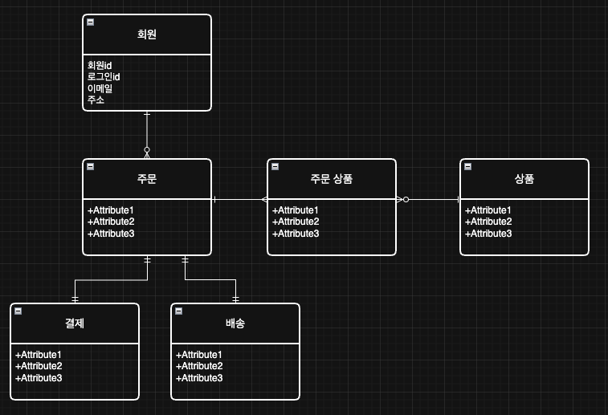

# 3장. 개념적모델링 실습

- **1단계: 핵심 요구 사항 다시 정의하기**
  - 회원: 고객이 가입하고 자신의 정보를 관리할 수 있어야 한다.
  - 상품: 우리가 판매할 상품을 등록하고 관리할 수 있어야 한다.
  - 주문: 회원이 상품을 구매할 수 있어야 한다.
  - 결제: 주문에 대한 결제 정보를 기록하고 관리할 수 있어야 한다.
  - 배송: 결제가 완료된 주문의 배송 상태를 관리할 수 있어야 한다.

- **2단계: 핵심 엔티티 도출**
  - 회원, 상품, 주문, 결제, 배송
  - 여기서 주문과 배송을 별도의 엔티티로 분리한 것에 주목하자.
    - 주문은 결제까지 포함하는 비즈니스 트랜잭션의 단위이고, 배송은 물류라는 별개의 프로세스로 분리했다.
    - 이렇게 역할을 분리하면 주문은 완료되었지만 배송은 시작 전과 같은 다양한 상태를 명확하게 관리할 수 있다.
    - 각자의 책임이 분명해저 시스템을 유지보수하기 쉬워진다.

- **3단계: 속성 정의 및 관계 설정**
  - 회원: 회원id, 로그인id, 비밀번호, 회원명, 이메일, 주소
  - 상품: 상품id, 상품명, 상품 가격, 재고 수량
  - 주문: 주문id, 주문 상태, 배송지 주소, 주문 일시
  - 결제: 결제id, 결제 수단, 결제 금액, 결제 상태, 결제 일시
  - 배송: 배송id, 배송 상태, 운송장 번호

이제 관계를 살펴보자.

- 회원과 주문의 관계:
  - 한 명의 회원은 여러번 주문할 수 있다. (1:N 관계)
- 주문과 결제의 관계:
  - 하나의 주문에 대해 하나의 결제가 이루어진다 (1:1 관계)
- 주문과 배송의 관계:
  - 하나의 주문에 대해 하나의 배송이 이루어진다 (1:1 관계)
- 주문과 상품의 관계:
  - 하나의 주문에는 여러 상품이 포함될 수 있다.
  - 반대로 하나의 상품도 여러 주문에 포함될 수 있다.
  - M:N 관계

- **4단계: M:N 관계 해소와 '연관 엔티티'**
  - 주문과 상품 관계에서 M:N 관계를 찾았다.
  - 위 문제를 해결하기 위해 연관 엔티티를 도입해야 한다.
  - 이런 다대다 관계를 만나면 반드시 다음 질문을 해보자.
    - **두 엔티티의 관계 속에서만 의미를 가지는 속성이 있는가?**
  - 주문 수량과, 주문 당시 가격은 주문과 상품의 **관계 속에서만** 의미를 갖는 데이터다
  - 이 추가적인 데이터를 담을 테이블, 즉 **연관 엔티티**가 필요함을 알게되었다. 이것을 `주문항목(order_item)` 이라고 부르자.

- **참고: 연관 엔티티 추천 이름 및 특징**
  - **1. 연결 강조**
  - 주문 상품 (order_product)
    - 직접절으로 연결 관계를 이름에 명시적으로 표현한다.
    - 직관적이고 단순하여 관계를 파악하기 쉽다.
  - **2. 의미있는 이름**
  - 주문 항목 (order_item)
    - 주문에 포함된 항목이라는 의미를 명확하게 전달한다.
    - 실제 쇼핑몰 비즈니스 로직과 용어가 일치하여 이해하기 쉽다.
  - 주문 상세 (order_detail)
    - 주문에 속한 각 상품 정보를 상세히 나타낸다는 점을 강조한다.

## 2. ERD 작성

- 개념적 모델링 단계에서는 ERD라는 형식에 너무 얽매이기 보다는 모두의 입장에서 쉽게 비즈니스를 이해할 수 있도록 ERD를 만들자.

### 개념적 모델링에서 외래키를 생략한 이유

개념적 모델링에서는 외래 키를 표시하지 않는 것이 원칙이다. 이 단계에서는 어떤 데이터베이스 기술을 사용할지 아직 결정하지 않았다고 가정하고 작성한다.

현실: 실용성을 고려한 접근

- 예상된 기술: 대부분의 프로젝트는 청므부터 관계형 데이터베이스 사용을 염두에 두고 모델링을 시작한다.
- 효율성: 어차피 나중에 추가할 것이므로, 설계 초기 단계부터 포함하면 더 효율적일 수 있다.

## 3. 용어 사전 작성

실제 개발에서 사용할 용어를 명확하게 정의하는 **용어 사전**을 작성할 차례다.  
이는 프로젝트의 일관성을 유지하고 팀원들끼리 같은 언어로 소통하기 위한 중요한 과정이다.

### 쇼핑몰 MVP 프로젝트 용어 사전

| 분류      | 명칭   | 전체 영문명 | 축약어 | 설명                            | 관련 시스템 요소          |
| --------- | ------ | ----------- | ------ | ------------------------------- | ------------------------- |
| 엔티티    | 회원   | `member`    |        | 서비스를 이용하는 고객          | `member` 테이블           |
|           | 상품   | `product`   |        | 판매하는 물건 또는 서비스       | `product` 테이블          |
| ...       | ...    | ...         | ...    | ...                             | ...                       |
| 주요 속성 | 식별자 | identifier  | id     | 데이터를 고유하게 식별하는 번호 | `member_id`, `product_id` |

> 실무 팁 - 용어 사전은 살아있는 문서다
>
> 프로젝트가 진행되면서 새로운 용어가 추가되고 새로운 비즈니스 용어가 생겨날 때마다 **지속적으로 업데이트 되어야 한다.**
> 반드시 용어 사전은 모두가 쉽게 접근 가능하고, 실시간으로 편하게 편집할 수 있는 툴을 사용하도록 하자.
