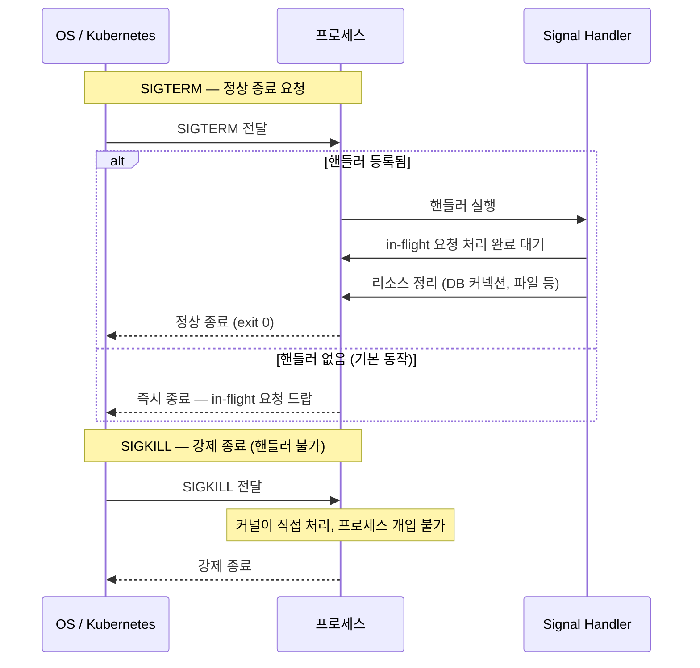
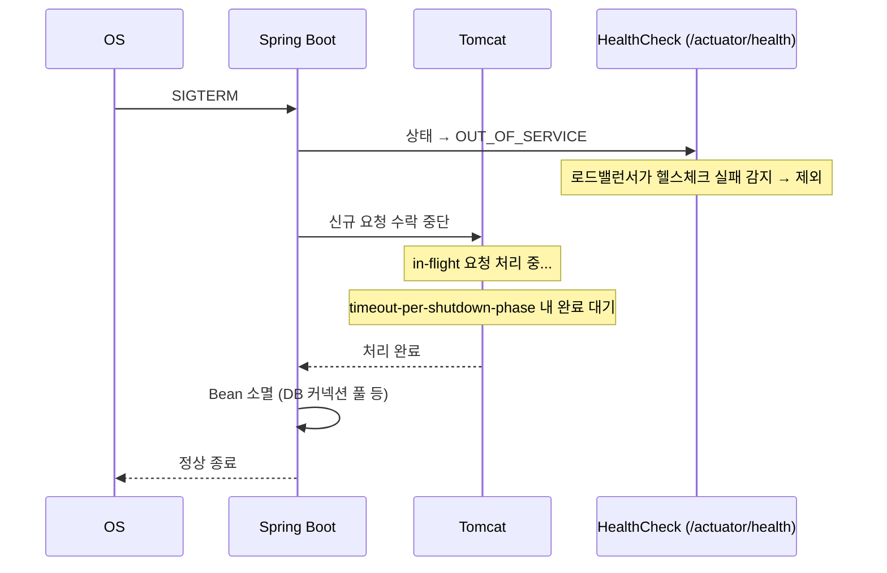
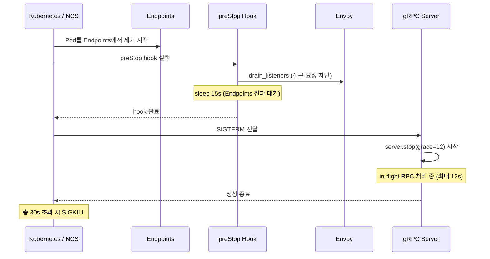

# Graceful Shutdown

서버를 그냥 끄면 안 되는 이유는 단순하다. 처리 중인 요청이 있다. DB 트랜잭션이 열려 있다. 커넥션 풀이 열려 있다. 이것들을 제대로 정리하지 않고 죽으면 클라이언트는 에러를 받고, 데이터는 일관성을 잃을 수 있다.

Graceful shutdown은 "받은 요청은 다 처리하고 나서 죽겠다"는 약속이다.

---

## Linux Signal 기초

프로세스 종료는 OS가 시그널을 보내는 것으로 시작된다. 핵심은 SIGTERM과 SIGKILL의 차이다.

| 시그널 | 번호 | 의미 | 핸들러 등록 |
|--------|------|------|-------------|
| SIGTERM | 15 | 정상 종료 요청 | 가능 |
| SIGKILL | 9 | 강제 종료 | 불가 (커널이 직접 처리) |
| SIGINT | 2 | 인터럽트 (Ctrl+C) | 가능 |

SIGTERM은 "이제 종료해도 된다"는 신호다. 프로세스가 핸들러를 등록해두면 받고 나서 정리 작업을 할 수 있다. SIGKILL은 다르다. 핸들러 자체가 불가능하고 커널이 즉시 프로세스를 죽인다. 그래서 graceful shutdown의 핵심은 SIGTERM을 받았을 때 무엇을 할지 정의하는 것이다.



---

## 일반 API 서버에서 신경 써야 할 것

### 1. 로드밸런서 / 서비스 디스커버리에서 먼저 빠지기

새 요청이 들어오지 않도록 먼저 제거되어야 한다. Kubernetes라면 Pod가 Terminating 상태가 되면 Endpoints에서 제거되기 시작하지만, 이 전파에 시간이 걸린다. preStop hook에서 sleep을 주는 이유가 이것이다.

### 2. in-flight 요청 처리 완료 대기

이미 들어온 요청은 끝까지 처리해야 한다. 타임아웃을 설정해서 무한정 기다리지는 않도록 한다.

### 3. 커넥션 드레인

HTTP Keep-Alive 커넥션, DB 커넥션 풀, gRPC 채널 등 열려 있는 커넥션을 닫아야 한다.

### 4. 리소스 정리

파일 핸들, 캐시 플러시, 메시지 큐 커밋 등 데이터 일관성에 영향을 주는 것들.

---

## Spring Boot Graceful Shutdown

Spring Boot 2.3부터 내장 웹서버 수준의 graceful shutdown이 지원된다.

```yaml
# application.yml
server:
  shutdown: graceful

spring:
  lifecycle:
    timeout-per-shutdown-phase: 30s  # 기본값 30s
```

`server.shutdown=graceful`을 설정하면 SIGTERM 수신 시 Tomcat(또는 Netty, Undertow)이 신규 요청 수락을 중단하고 처리 중인 요청이 완료될 때까지 대기한다. `timeout-per-shutdown-phase`는 최대 대기 시간이다.



`/actuator/health`가 `OUT_OF_SERVICE`로 바뀌는 걸 이용해 로드밸런서에서 먼저 제외되도록 하는 흐름도 중요하다. 헬스체크 간격이 있으니 preStop hook으로 sleep을 주는 것과 조합하면 더 안전하다.

### Spring Boot + Kubernetes 조합 시 시간 예산

```
preStop sleep (10~15s)          → Endpoints 전파 완료 대기
+ timeout-per-shutdown-phase    → in-flight 요청 처리
= terminationGracePeriodSeconds 이내여야 함
```

---

## Python 모델 서버 (gRPC)

일반 REST API 서버와 달리 모델 서버는 몇 가지 추가 고려사항이 있다.

- 추론(inference) 시간이 길다 — 수백 ms ~ 수 초
- GPU 메모리를 점유하고 있다 — 갑자기 죽으면 GPU 메모리 누수 가능
- 프로세스 매니저(supervisord 등)가 중간에 있는 경우가 많다

### Python signal 핸들러 등록

```python
import signal

def serve():
    server = grpc.server(...)
    server.start()

    def handle_sigterm(signum, frame):
        print("SIGTERM received, graceful shutdown (grace=12s)...")
        server.stop(grace=12)  # 12초 내 in-flight RPC 완료 대기, 신규 요청 거부

    signal.signal(signal.SIGTERM, handle_sigterm)
    server.wait_for_termination()
```

`server.stop(grace=N)`은 두 가지를 한다:
- 신규 RPC 요청 거부
- 이미 처리 중인 RPC는 N초까지 완료 대기

핸들러는 `server.start()` 이후에 등록한다. 클로저로 `server`를 캡처하기 때문에 `server`가 이미 초기화된 이후여야 하고, Python 클로저는 호출 시점에 변수를 조회하므로 문제없다.

### supervisord가 있는 경우

supervisord가 PID 1이면 SIGTERM이 supervisord에게 먼저 간다. supervisord는 `stopwaitsecs` 이내에 자식 프로세스가 종료되지 않으면 SIGKILL을 보낸다. 기본값이 10초라 grace period보다 짧으면 graceful stop이 완료되기 전에 강제 종료된다.

```ini
[program:grpc-server]
stopsignal=TERM
stopwaitsecs=17    # grace(12s) + 여유(5s)
```

### Kubernetes + NCS 환경에서의 시간 예산

NHN Cloud Container Service(NCS)는 `terminationGracePeriodSeconds`를 30초로 고정한다. API 스펙에 해당 필드가 없어 변경할 방법이 없다.

```
[NCS 30초 고정 예산]
preStop sleep 15s
+ SIGTERM → server.stop(grace=12s)
= 27s  ← 30s 이내
```



---

## 정리

| 환경 | 핵심 설정 |
|------|-----------|
| Spring Boot | `server.shutdown=graceful` + `timeout-per-shutdown-phase` |
| Python gRPC | `signal.signal(SIGTERM, handler)` + `server.stop(grace=N)` |
| supervisord | `stopwaitsecs` > grace 값 |
| Kubernetes | preStop sleep + grace ≤ terminationGracePeriodSeconds |

결국 같은 원칙이다. SIGTERM을 받으면 신규 요청을 막고, 하던 것은 끝내고, 그리고 죽는다. 어떤 스택이든 이 흐름을 명시적으로 구현해야 한다.
