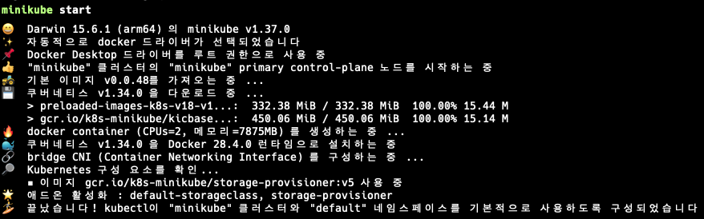
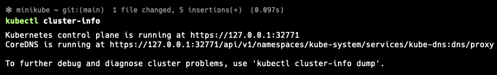
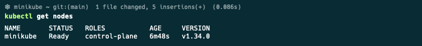
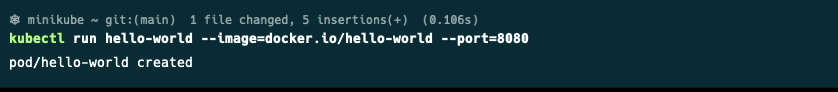

# MiniKube

- 완전하게 동작하는 쿠버네티스를 가장 간단하고 빠르게 접근하는 방법
- 로컬에서 쿠버네티스를 테스트하고 애플리케이션을 개발하는 목적으로 단일 노드 클러스터를 설치하는 도구

## 설치 (macos)

- Homebrew를 활용하여 설치

```bash
brew install minikube
```



- 설치 확인 및 kubenetes-cli를 활용하여 상태 조회

```bash
kubectl cluster-info
```



- 클러스터 노드를 조회해 클러스터 동작 상태 확인

```bash
kubectl get nodes
```



- 이와 같이 kubectl 명령어로 모든 종류의 쿠버네티스 오브젝트를 조회할 수 있음

## 쿠버네티스에 첫 번째 애플리케이션 실행하기

```bash
kubectl run hello-workld --image=docker.io/hello-world --port=8080
```


