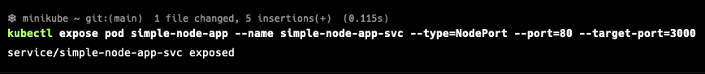
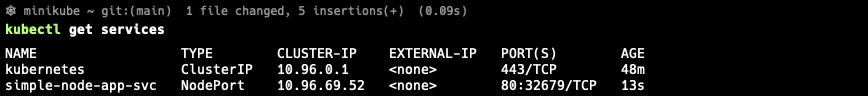

# Pods (파드)

- 쿠버네티스는 개별 컨테이너들을 직접 다루지 않는다.
- 대신 함께 배치된 다수의 컨테이너라는 개념을 사용한다.
- 이 컨테이너의 그룹을 파드(Pod)라고 한다.
- 파드는 하나 이상의 밀접하게 연관된 컨테이너의 그룹으로 같은 워커 노드에서 같은 리눅스 네임스페이스로 함께 실행된다.
- 파드에서 실행 중인 모든 컨테이너는 동일한 논리적인 머신에서 실행하는 것처럼 보인다.
- 반면, 다른 파드에 실행 중인 컨테이너는 같은 워커 노드에서 실행 중이라 할지라도 다른 머신에서 실행 중인 것으로 나타난다

## kubectl run의 흐름

- **1. kubectl run [pod_name] --image=[image_name] --port=[port]**
  - kubectl은 마스터 노드에 REST 호출로 요청한다
- **2. 마스터 노드는 요청을 받아 파드를 생성하고, 워커 노드에 스케줄링 된다**
- **3. 워커 노드의 Kubelet은 통지를 받는다**
- **4. Kubelet은 도커에 이미지를 실행하라고 지시한다\***
- **5. 도커는 이미지를 풀하고 컨테이너를 실행한다**

## 웹 애플리케이션에 접근하기

- 실행 중인 파드에 어떻게 접근할 수 있을까?
- 각 파드는 자체 IP 주소를 갖고 있지만, 이 주소는 클러스터 내부에 있으며 외부에서 접근이 불가능하다
- 서비스 오브젝트를 통해 노출해야 함
- LoadBalancer 유형의 서비스를 생성하면 외부 로드 밸런서가 생성되므로 로드 밸런서의 퍼블릭 IP를 통해 파드에 연결할 수 있음

</br>

- 서비스 오브젝트 생성

```bash
kubectl expose rc [pod_name] --type=LoadBalancer --name [LB_name]
```



- 서비스 조회하기

```bash
kubectl get services
```



## 레플리케이션 컨트롤러의 역할 이해

- 항상 정확히 하나의 파드 인스턴스를 실행하도록 지정
- 보통 레플리케이션 컨트롤러는 파드를 복제하고 항상 실행 상태로 만듬
- 여기에서는 파드의 레플리카를 지정하지 않았기 때문에 파드를 1개만 생성
- 어떤 이유로 파드가 사라진다면 사라진 파드를 대체하기 위해 새로운 파드를 생성할 것임

## 서비스가 필요한 이유

- 서비스가 필요한 이유를 이해하기 위해 먼저 파드의 주요한 특성을 알아야 함
  - 파드는 일시적임
  - 파드는 언제 사라질 수 있음
  - 파드가 실행 중인 노드가 실패할 수 도 있고, 누군가 파드를 삭제할 수도 있고, 비정상 노드에서 파드가 제거될 수도 있음
- 새롭게 파드가 생성되면 다른 IP 주소를 할당 받음, 이 것이 바로 서비스가 필요한 이유
  - 항상 변경되는 파드의 IP 주소 문제와 여러 개의 파드를 단일 IP와 포트의 쌍으로 노출시키는 문제를 해결함
- 서비스가 생성되면 정적 IP를 할당받고 서비스가 존속하는 동안 변경되지 않음
- 파드에 직접 연결하는 대신 클라이언트는 서비스의 IP 주소를 통해 연결해야 함
