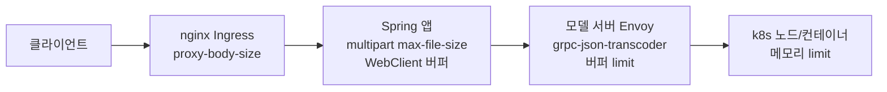
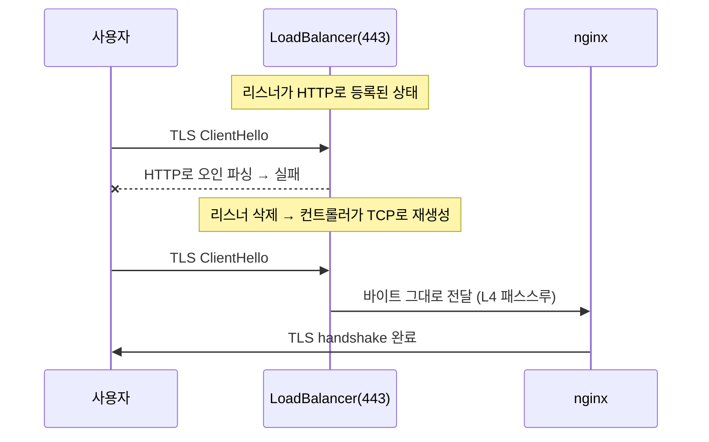

# API Gateway를 제거한 자리 채우기 — path rewrite, 요청 크기 병목 4개, 그리고 HTTPS

> [관리형 클러스터는 누구의 권한으로 클라우드를 만지는가](./managed-cluster-identity-trust.md)의 후속 편이다. 그 글에서 클러스터 신원 문제를 해결하고 나서야, 원래 하려던 일 — API Gateway를 제거하고 공인 LoadBalancer를 그 자리에 앉히는 작업 — 을 이어갈 수 있었다. 이 글은 LB가 뜬 다음부터의 이야기다.

API Gateway를 제거하기로 한 이유는 단순했다. 5MB 요청 크기 제한이 OCR 서비스에는 너무 작았다. 이미지 하나가 10MB를 넘는 경우가 흔한데 Gateway 단에서 먼저 잘려서 413이 났다. Gateway를 빼고 nginx Ingress Controller를 공인 LB 뒤에 직접 두는 방향으로 정했는데, 막상 옮겨보니 Gateway가 조용히 해주던 일이 생각보다 많았다. path rewrite가 그랬고, 요청 크기 제한은 한 겹이 아니라 네 겹이었다.

## path rewrite 23개를 nginx 정규식 4개로 접기

API Gateway는 프론트엔드가 부르는 짧은 경로(`/v1.0/appkeys/{key}/general`)를 백엔드 서비스의 실제 경로(내부 서비스 이름이 붙은 경로)로 바꿔주는 rewrite 규칙을 23개 갖고 있었다. Gateway를 빼면 이 매핑을 어디선가 대신해야 했다.

23개를 하나씩 옮기는 대신 패턴으로 묶었다. 실제 경로들을 나열해보니 뒤에 붙는 백엔드 prefix 기준으로 4개 그룹 + catch-all로 수렴됐다.

```yaml
# ingress-nginx use-regex + rewrite-target 조합. $1, $2 는 캡처 그룹.
# target 의 내부 서비스 이름은 예시로 대체했다.
externalRewrites:
  - name: general
    path: /v(1\.[01])/appkeys/([^/]+)/(general.*)$
    target: /api/svc-general/api/v$1/appkeys/$2/$3
  - name: document
    path: /v([12]\.[01])/appkeys/([^/]+)/((?:business|credit-card|id-card).*)$
    target: /api/svc-document/api/v$1/appkeys/$2/document/$3
  - name: public-keys
    path: /v(2\.[01])/appkeys/([^/]+)/(public-keys/.*)$
    target: /api/svc-document/api/v$1/appkeys/$2/$3
  - name: catch-all
    path: /(v.*)$
    target: /api/$1
```

catch-all을 넣은 이유가 있다. 매칭이 안 된 `/v*` 요청을 그냥 nginx 기본 404 HTML로 떨어뜨리면 이 API의 표준 응답 형식(성공/실패를 본문 안 코드로 표현하는 공통 응답 포맷)과 어긋난다. catch-all이 `/api/`로라도 넘겨서 최소한 애플리케이션이 표준 에러 응답을 만들게 했다. ingress-nginx는 정규식 location을 경로 문자열 길이 내림차순으로 만들기 때문에, 가장 짧은 catch-all이 자연스럽게 맨 마지막 후보가 된다는 점도 이 구조를 믿고 갈 수 있었던 이유다.

## 요청 크기를 5MB에서 20MB로 올리다가 찾은 병목 4개

크기 제한을 올리는 작업은 "설정 하나 바꾸면 끝"일 줄 알았다. 실제로는 요청이 클라이언트에서 애플리케이션까지 가는 동안 거치는 지점마다 각자 다른 제한이 걸려 있었고, 하나를 풀면 다음 지점에서 막히는 걸 반복하며 찾아냈다.



### 1번 병목 — nginx proxy-body-size

가장 바깥쪽이라 가장 먼저 걸렸다. `nginx.ingress.kubernetes.io/proxy-body-size`가 기본값 그대로면 nginx가 애플리케이션보다 먼저 요청을 자르고 413을 내려준다. 여기서 잘리면 표준 응답 형식이 아니라 nginx 기본 에러 HTML이 나가므로, 이 값은 애플리케이션 쪽 제한보다 항상 넉넉하게 잡아야 한다는 걸 배웠다 — 판정은 애플리케이션이 먼저 하게 하고 nginx는 그보다 위쪽 여유값만 갖는 순서다.

### 2번 병목 — 애플리케이션 multipart 설정과 WebClient 버퍼 ([WebClient가 큰 응답을 받으면 왜 죽는가](../../java/spring/webclient-max-in-memory-size.md))

Spring의 `multipart.max-file-size` / `max-request-size`를 20MB대로 올리는 건 예상한 절차였다. 그런데 이 API는 내부적으로 모델 서버를 리액티브 WebClient로 호출하는데, `WebClient`의 인메모리 버퍼 기본값(`maxInMemorySize`)도 별개로 존재했다. multipart 설정만 올리고 이건 그대로 뒀더니 버퍼 초과 에러가 났다. 요청이 애플리케이션 경계를 한 번 더 넘을 때마다 그 경계의 버퍼 설정을 따로 확인해야 한다는 게 이 지점에서 확실해졌다.

### 3번 병목 — 모델 서버 Envoy의 숨은 버퍼 제한 (제일 오래 걸린 지점)

이 병목이 가장 찾기 어려웠다. nginx와 앱 레이어를 다 풀었는데도 특정 모델(사업자등록증 인식)만 6MB 이상에서 계속 실패했다. 1MB부터 크기를 올려가며 이진 탐색으로 재현했더니 5MB까지는 통과, 6MB부터 실패하는 경계가 뚜렷하게 나왔다.

로그를 추적해보니 애플리케이션도 nginx도 아니고, 모델 서버 앞단의 Envoy가 붙인 grpc-json-transcoder라는 컴포넌트가 원인이었다. 이 컴포넌트가 gRPC 요청을 JSON으로 바꿔주는데, 자체 `per_connection_buffer_limit_bytes`를 갖고 있었고 기본값이 5MB였다. nginx나 애플리케이션 설정과는 완전히 독립된 값이라, 그 두 곳을 아무리 넉넉하게 올려도 이 지점에서 계속 잘렸다.

```yaml
# envoy 설정 — grpc-json-transcoder 앞단의 connection buffer
per_connection_buffer_limit_bytes: 31457280  # 30MB, 기존 5MB/10MB에서 상향
```

이 지점에서 얻은 교훈은 하나다. 요청 경로에 있는 모든 프록시·게이트웨이 계층은 **각자 자기만의 버퍼 제한을 갖고 있을 수 있다**는 전제로 접근해야 한다. 앞단 설정을 다 확인했다고 끝난 게 아니라, 실패 지점의 로그에서 어떤 컴포넌트가 응답했는지부터 봐야 한다.

### 4번 병목 — k8s 노드 용량과 컨테이너 메모리 limit (서로 다른 두 문제)

네 곳을 다 풀고 단일 20MB 요청은 성공했다. 그런데 6~10MB 이미지 여러 개를 동시에 보내면 여전히 불안했다. 컨테이너가 OOMKilled로 죽는 걸 보고 처음엔 "노드 사양이 낮아서"라고 생각했는데, 실제로는 서로 다른 두 문제가 겹쳐 있었다.

- 노드 자체의 CPU/메모리 여유가 부족한 문제 — `m2.c2m4`를 `m2.c4m8`로 올려서 해결
- 컨테이너 `resources.limits.memory`가 500M로 낮게 잡혀 있던 문제 — 노드를 늘려도 이 값이 낮으면 파드 개별로 OOMKilled가 난다. `1536Mi`로 올리고 request와 limit을 동일하게 맞춰(Guaranteed QoS) 해결

두 값을 하나만 고치고 "됐다"고 판단했다가 나중에 5개 동시 요청 테스트에서 다시 OOMKilled가 재현된 적이 있다. 노드 용량과 컨테이너 limit은 완전히 다른 레이어의 자원이라, 한쪽만 넉넉해도 다른 쪽이 좁으면 그대로 죽는다는 걸 직접 겪고 나서야 체감했다.

## k6로 지속 부하를 걸어 확인하다

단발성 curl 테스트로는 "한 번은 성공했다"까지만 확인된다. 실제로 궁금했던 건 이 설정으로 트래픽이 계속 들어와도 버티는지였다. k6로 VU(가상 사용자)를 단계적으로 올리는 시나리오를 짜서 돌렸다 — 5 VU로 2분 30초, 이어서 10 VU로 3분 30초.

사실 이 안정된 수치를 보기 전에 한 번 잘못 짚었다. 컨테이너 메모리 limit을 올린 직후, 별다른 요청 없이 몇 분 지났을 뿐인데 idle 메모리가 393Mi에서 470Mi로 올라가는 걸 보고 누수를 의심했다. 그런데 이 관측 시점이 노드 flavor 교체 직후 파드가 새 노드로 막 재배치된 시점과 겹쳐 있었다. flavor 교체와 재스케줄이 끝나고 완전히 자리를 잡은 뒤 k6로 다시 지속 부하를 걸어보니, 부하 종료 후에도 메모리가 994Mi/963Mi 수준에서 더 오르지 않고 고정됐다. 재현되지 않은 걸 보면 앞서 본 상승은 재배치 직후의 일시적인 값이었지 누수가 아니었다는 게 최종 판단이다. 겉보기 증상만 보고 "누수다"라고 먼저 결론 내렸다가 나중에 정정한 지점이라, 이 프로젝트에서 스스로 배운 것 중 하나는 **관측 시점이 다른 인프라 변경 직후와 겹치면, 그 변경의 여파부터 먼저 의심해야 한다**는 것이었다.

이 k6 스크립트는 일회성으로 쓰고 버리지 않고 리포지토리에 남겨뒀다. 다음 환경으로 같은 작업을 확장할 때 그대로 다시 돌려볼 수 있게 하기 위해서다.

## 도메인 이름을 사내 정책에 맞춰 고른 이야기

공인 LB에 IP가 붙고 나니 다음은 도메인이었다. 처음엔 프로덕션에서 쓰는 패턴과 똑같은 이름을 가져다 쓰려고 했는데, 사내 도메인 명명 정책 문서를 찾아보니 그 패턴은 API Gateway를 거치는 서비스용이었다. 지금 이 서비스는 API Gateway를 뺀 상태라, 정책에서 정한 "API Gateway를 쓸 수 없는 경우"의 별도 패턴 — 스테이지 이름을 도메인에 직접 포함하는 형태 — 을 따르는 게 맞았다.

작은 차이지만 여기서 얻은 인사이트는, 회사 규모의 서비스에서는 이름 하나도 "그냥 짓는" 게 아니라 그 이름이 나중에 어떤 라우팅/운영 가정을 전제하는지 정책으로 이미 정해져 있다는 점이었다. 정책을 안 찾아보고 프로덕션 패턴을 그대로 썼다면, 나중에 이 서비스가 API Gateway 없이 운영된다는 사실과 도메인 이름이 암시하는 바가 어긋났을 것이다.

도메인 등록 자체는 사내 결재 시스템으로 신청하는 절차였다. 반복해서 쓸 일이라 신청 흐름을 정리해뒀다.

## HTTPS를 놓다가 443 리스너가 잘못 서 있는 걸 발견하다

마지막으로 HTTPS였다. 새로 인증서 발급 체계(cert-manager나 ACME)를 만들 수도 있었지만, 사내에 이미 상용 wildcard 인증서를 파일로 관리하며 쓰고 있는 다른 서비스가 있다는 걸 알게 됐다. 그 팀의 방식을 그대로 참고했다 — 인증서 파일을 저장소에 커밋해두고, Helm 템플릿이 그 파일을 읽어 k8s Secret으로 만들고, Ingress Controller가 그 Secret을 기본 인증서로 물게 하는 구조다.

```yaml
# k8s Secret을 저장소에 커밋된 인증서 파일로부터 렌더링
{{- if .Values.tls.certPath }}
apiVersion: v1
kind: Secret
metadata:
  name: {{ .Values.tls.secretName }}
type: kubernetes.io/tls
data:
  tls.crt: {{ .Files.Get (printf "certs/%s/cert.pem" .Values.tls.certPath) | b64enc }}
  tls.key: {{ .Files.Get (printf "certs/%s/key.pem" .Values.tls.certPath) | b64enc }}
{{- end }}
```

한 가지 결정이 더 필요했다. 인증서를 Ingress 리소스별로 지정하는 방식(`spec.tls`, SNI 기반)이 일반적이지만, 지금 만든 rewrite Ingress들은 전부 `host` 없이 경로만으로 매칭하는 catch-all 형태였다. SNI는 요청의 `host`를 보고 인증서를 고르는 방식이라 host가 없는 Ingress에는 맞지 않았다. 그래서 Ingress Controller 자체의 `default-ssl-certificate` 옵션으로 컨트롤러 레벨 기본 인증서를 지정하는 쪽으로 바꿨다.

인증서를 연결하고 테스트했는데 TLS handshake가 실패했다. 원인을 추적하다 LB의 443 리스너 자체가 `HTTP` 프로토콜로 떠 있는 걸 발견했다. HTTPS 트래픽이 이 리스너로 들어오면 LB가 TLS handshake 바이트를 HTTP 텍스트로 해석하려다 실패하는 구조였다 — LB 레이어까지 확인해야 하는 문제라고는 생각을 못 했던 지점이다.

Service 어노테이션으로 443 포트 리스너 프로토콜을 TCP로 바꾸려 했지만, LB를 관리하는 컨트롤러(cloud-controller-manager)는 이미 떠 있는 리스너의 프로토콜을 그 자리에서 바꾸는 기능이 없었다. 새 리스너를 만들려다 같은 포트에서 충돌만 났다. 결국 기존 HTTP 리스너를 API로 직접 지우고, 컨트롤러가 그 자리에 TCP 리스너를 새로 만들도록 유도했다. LB 자체나 VIP, 공인 IP는 그대로 유지되고 리스너 하나만 지웠다 재생성되는 것이라 서비스 단절 시간은 짧았다.



TCP 리스너는 L4(전송 계층)에서 바이트를 그대로 전달만 하고, 실제 TLS 종료는 뒤쪽 nginx가 담당한다. HTTPS는 이 패스스루 구조가 전제라는 걸, 리스너 프로토콜 하나 때문에 handshake가 깨지고 나서야 명확히 이해했다. ([TLS termination 위치는 여기서 더 다룬다](../../http/https-tls-basics.md))

## 지금 보면

이 작업 전체에서 반복된 패턴이 하나 있다. 문제가 생기면 "지금 보고 있는 레이어"보다 한 단계 위나 아래를 의심하는 습관이 이번에 확실히 붙었다. rewrite는 nginx 문제인 줄 알았고, 요청 크기는 애플리케이션 설정인 줄 알았고, HTTPS는 인증서 파일 문제인 줄 알았다. 실제 원인은 각각 정규식 경로 우선순위, 모델 서버 앞단의 Envoy 버퍼, LB 리스너 프로토콜이었다. 표면 증상과 원인이 다른 레이어에 있다는 전제를 깔고 접근해야, 곁가지 설정을 계속 만지다 시간을 버리는 걸 피할 수 있다는 걸 이번에 다시 확인했다.

또 하나는 판단을 되돌리는 데 인색하지 않아야 한다는 것이다. k6 테스트에서 메모리 누수라고 먼저 판단했다가, 노드 교체 타이밍과 겹친 걸 확인하고 그 판단을 접었다. 틀린 결론을 먼저 내렸다는 사실보다, 그걸 붙잡고 있지 않는 게 더 중요했다.
