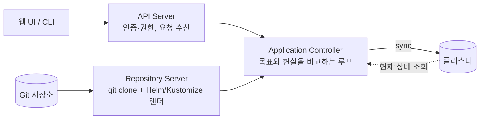

# Argo CD — git 을 정답으로 삼는 배포 컨트롤러

> [Helm](./helm.md)이 "어떤 YAML 을 만들까"를 맡았다면, ArgoCD 는 "그 YAML 을 언제 어떻게 클러스터에 반영할까"를 맡는다.

ArgoCD 는 웹 UI 가 있어서 배포 도구처럼 보인다. 그런데 구조를 열어보니 그게 아니었다. **ArgoCD 는 [2편에서 본 reconcile loop](./declarative-api-reconcile-loop.md) 를 git 까지 확장한 컨트롤러다.** 목표 상태의 출처가 etcd 대신 git 일 뿐, 원리가 같다.

이 한 문장을 먼저 잡고 들어가면 나머지는 익숙한 패턴의 반복이라 배울 게 적다.

| | 쿠버네티스 기본 컨트롤러 | ArgoCD |
|---|---|---|
| 목표 상태 | etcd 의 `spec` | **git 저장소의 매니페스트** |
| 실제 상태 | etcd 의 `status` | 클러스터에 실제로 떠 있는 리소스 |
| 차이를 발견하면 | 리소스를 만들거나 지움 | **sync** 로 클러스터를 git 에 맞춤 |

## GitOps 가 실제로 바꾸는 것

ArgoCD 가 내세우는 사상은 GitOps 다. **git 에 적힌 상태 = 클러스터가 있어야 할 상태.**

말로만 보면 당연해 보이는데, 실제로 바뀌는 건 **클러스터를 고치는 경로가 하나로 좁혀진다**는 점이다.

- 기존: `kubectl edit` 으로 클러스터를 직접 고칠 수 있다. 급할 때 편하지만 **아무 기록도 남지 않는다.** 누가 언제 왜 바꿨는지 알 수 없고, 다음 배포 때 조용히 되돌아간다.
- GitOps: 클러스터를 직접 고치지 않고 **git 을 고치고 sync 한다.** 모든 변경이 커밋과 PR 로 남아서 코드 변경과 똑같이 리뷰·추적·롤백된다.

여기에 `selfHeal` 을 켜면 한 발 더 나간다. 누가 `kubectl` 로 클러스터를 손대도 ArgoCD 가 git 기준으로 되돌린다. 손으로 고치는 길이 사실상 막히는 셈인데, 이게 불편이 아니라 목적이다.

## 내부 구조

ArgoCD 는 몇 개의 컴포넌트로 나뉘어 있다. 장애 원인을 찾을 때 어느 컴포넌트 문제인지 가르려면 알아둘 필요가 있다.



- **API Server** — UI 와 CLI 의 입구. 로그인(SSO)과 권한(RBAC)을 담당한다.
- **Repository Server** — git 을 clone 해 두고 Helm·Kustomize 를 **순수 YAML 로 렌더**하는 전담 서비스다. 값이 의도대로 안 들어갔다면 여기 로그를 본다.
- **Application Controller** — 핵심. 렌더된 목표 상태와 클러스터의 현재 상태를 비교하고 차이가 있으면 sync 한다.

여기서 짚고 갈 게 하나 있다. **ArgoCD 가 이해하는 것은 최종 YAML 뿐이다.** Helm 차트든 Kustomize 든 Repository Server 에서 렌더를 거쳐 평범한 매니페스트가 된 다음에야 컨트롤러로 넘어간다. `helm install` 이 클러스터에서 실행되는 게 아니다.

## Application — 배포하라는 선언

ArgoCD 를 설치하면 `Application` 이라는 새 리소스 타입이 생긴다. 쿠버네티스에 없던 타입을 추가하는 이 방식을 **CRD**(Custom Resource Definition) 라고 하고, 이게 ArgoCD 가 "도구"가 아니라 "컨트롤러"인 이유다.

Application 하나가 **어느 git 의 / 어느 경로를 / 어느 값으로 / 어느 클러스터와 namespace 에** 배포할지를 정의한다.

```yaml
apiVersion: argoproj.io/v1alpha1
kind: Application
metadata:
  name: api
  namespace: argocd            # ArgoCD 가 설치된 namespace
spec:
  project: default             # 권한 그룹

  source:                      # 무엇을 배포할까
    repoURL: https://github.com/my-org/k8s-manifests.git
    targetRevision: HEAD       # 브랜치 또는 태그
    path: applications/api     # 저장소 내 차트 경로
    helm:
      valueFiles:
        - values.yaml
        - real-values.yaml

  destination:                 # 어디에 배포할까
    server: https://kubernetes.default.svc
    namespace: api

  syncPolicy:                  # 어떻게 동기화할까
    automated:
      prune: true              # git 에서 지운 리소스는 클러스터에서도 제거
      selfHeal: true           # 클러스터를 직접 고치면 git 기준으로 되돌림
    syncOptions:
      - CreateNamespace=true
```

여기서 처음에 헷갈렸던 게 있다. **배포할 내용(차트)과 배포하라는 선언(Application)은 별개 파일이다.** 차트만 만들어두고 Application 을 안 만들면 ArgoCD 는 그 차트의 존재 자체를 모른다. 둘 다 있어야 동작한다.

`automated` 를 아예 빼면 **수동 sync** 가 된다. git 에 머지돼도 사람이 sync 를 눌러야 반영되는데, 중요한 인프라는 이렇게 두는 경우가 많다. 머지와 배포 사이에 사람이 한 번 확인하는 안전장치다.

## 배포 순서를 제어해야 할 때

쿠버네티스는 기본적으로 리소스를 병렬로 적용한다. 그런데 "DB 마이그레이션이 끝난 뒤에 앱이 떠야 한다" 같은 순서가 필요할 때가 있다. ArgoCD 는 두 가지 수단을 준다.

- **Sync Waves** — 리소스에 `argocd.argoproj.io/sync-wave: "1"` 애노테이션을 붙이면 **낮은 숫자부터** 배포된다. ConfigMap(-1) → Service(0) → Deployment(1) 같은 식으로 계층을 만든다.
- **Resource Hooks** — 생명주기 시점에 Job 을 끼워 넣는다. `PreSync` 는 배포 시작 전(스키마 마이그레이션·백업), `PostSync` 는 성공 후(알림·검증), `SyncFail` 은 실패 시(롤백 트리거) 실행된다.

둘 중에서는 wave 를 먼저 고려하는 게 낫다. hook 은 Job 이 하나 더 도는 것이라 실패했을 때 추적할 지점이 늘어난다.

## 운영에서 부딪히는 것들

- **`OutOfSync` 가 실제 문제가 아닐 수 있다.** git 과 클러스터가 다르다는 뜻인데, 원인이 내 변경이 아니라 **쿠버네티스가 자동으로 채우는 필드**인 경우가 흔하다. UI 의 `Diff` 탭으로 무엇이 다른지 먼저 확인하고, 실제로 무시해도 되는 필드라면 `ignoreDifferences` 로 제외한다. 이걸 안 하면 상시 OutOfSync 상태가 되고, 그러면 정말 문제일 때도 아무도 안 본다.
- **컨트롤러끼리 같은 필드를 다투면 무한 sync 가 된다.** 대표적인 게 HPA 와 `replicas` 다. HPA 가 부하를 보고 5로 올렸는데 git 에는 2가 적혀 있고 `selfHeal` 이 켜져 있으면, 둘이 계속 서로를 되돌린다. [2편에서 본 것과 같은 충돌](./declarative-api-reconcile-loop.md)이고, 해법도 같다. **필드의 주인을 하나로 정한다** — HPA 를 쓴다면 git 매니페스트에서 `replicas` 를 빼거나 `ignoreDifferences` 로 제외한다.
- **`prune: true` 는 위력이 세다.** git 에서 사라진 리소스를 클러스터에서 지운다는 뜻이라, 경로를 잘못 옮기거나 파일을 실수로 지우면 그대로 삭제로 이어진다. 처음에는 꺼 두고 수동으로 확인하며 익히는 쪽이 안전하다.
- **Secret 을 git 에 평문으로 올릴 수 없다.** GitOps 의 구조적 숙제다. SealedSecrets · External Secrets · SOPS 같은 도구로 암호화한 것만 git 에 올리고 클러스터에서 복호화하는 방식을 쓴다.

## 정리

- ArgoCD 는 배포 도구가 아니라 **목표 상태의 출처를 git 으로 바꾼 컨트롤러**다.
- Helm·Kustomize 는 Repository Server 에서 렌더되고, 컨트롤러가 다루는 것은 최종 YAML 뿐이다.
- **차트(무엇을)와 Application(배포하라)은 별개**다. 둘 다 있어야 한다.
- `OutOfSync` 를 방치하면 경보가 무의미해진다. 무시할 필드는 명시적으로 제외한다.
- 같은 필드를 두 컨트롤러가 고치면 무한 루프다. 주인을 하나로 정한다.

다음 글에서는 Helm 과 ArgoCD 를 실제로 함께 써서 [새 컴포넌트를 추가하는 전체 흐름](./helm-argocd-gitops.md)을 본다.

## 참고 링크

- [Argo CD 공식 문서](https://argo-cd.readthedocs.io/)
- [Application Specification — Argo CD](https://argo-cd.readthedocs.io/en/stable/user-guide/application-specification/)
- [Sync Waves and Hooks — Argo CD](https://argo-cd.readthedocs.io/en/stable/user-guide/sync-waves/)
- [Diffing Customization(ignoreDifferences) — Argo CD](https://argo-cd.readthedocs.io/en/stable/user-guide/diffing/)
