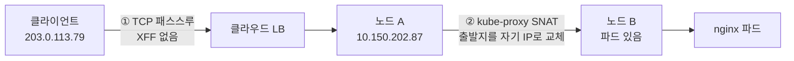

# IP whitelist가 조용히 뚫려 있었다 — 클라이언트 IP는 어디서 사라지는가

> [외부 트래픽은 어떻게 Pod까지 닿는가](./external-traffic-path.md)와 [ingress-nginx 운영에서 부딪힌 디테일들](./ingress-nginx-operations.md)을 먼저 읽으면 좋다. 이 글은 그 다음 단계로, 그때 걸어둔 whitelist가 실제로는 아무도 막지 못하고 있었다는 이야기다.

사내 전용으로 열어둔 검증 환경에 `whitelist-source-range`를 걸어놨다. `kubectl get ingress`로 보면 허용 IP 목록이 멀쩡히 들어 있다. 그런데 목록에 없는 IP에서 호출했더니 200이 돌아왔다.

설정은 정상이었다. 문제는 **nginx가 보는 "클라이언트 IP"가 진짜 클라이언트의 IP가 아니었다**는 것이다. 이 글은 그 IP가 어느 구간에서 어떻게 바뀌는지, 그리고 그게 왜 접근 제어를 통째로 무력화하는지 정리한 기록이다.

가져갈 결론부터 적으면 이렇다. **IP 기반 접근 제어를 걸었다면, 반드시 허용 목록에 없는 곳에서 차단되는지 확인해야 한다.** 설정 존재 확인(`kubectl get`)은 검증이 아니다.

## 증상 — 같은 요청인데 포트에 따라 결과가 갈렸다

처음엔 whitelist가 통째로 안 먹는 줄 알았다. 그런데 포트를 바꿔보니 결과가 달랐다.

```bash
# 443 (HTTPS) — 통과해버린다
curl -sk -o /dev/null -w "%{http_code}\n" \
  https://api.example.com/v1.0/ping
# 200

# 80 (HTTP) — 정상적으로 막힌다
curl -s -o /dev/null -w "%{http_code}\n" \
  http://api.example.com/v1.0/ping
# 403
```

같은 클라이언트, 같은 경로, 같은 Ingress 리소스인데 포트만 다르다. whitelist가 "동작은 하는데 443에서만 안 먹는" 상태였다.

## 진단 — nginx 액세스 로그에 찍힌 source IP를 본다

원인을 찾는 가장 빠른 방법은 **nginx가 실제로 무슨 IP를 봤는지** 확인하는 것이다. ingress controller의 로그에 그대로 남는다.

```bash
# controller 파드 전부에서 특정 경로 요청만 뽑는다.
# replica가 여러 개면 요청이 어디로 갔는지 모르니 전부 훑어야 한다.
for P in $(kubectl -n <ingress-ns> get pods -o name); do
  kubectl -n <ingress-ns> logs "$P" --tail=500 | grep "ping"
done
```

나온 로그가 결정적이었다.

```
# 443 요청 — source가 노드 IP로 찍혔다
10.150.202.87 - - [27/Jul/2026:09:52:05] "POST /v1.0/ping HTTP/2.0" 200

# 80 요청 — source가 진짜 내 공인 IP다
203.0.113.79 - - [27/Jul/2026:11:49:48] "POST /v1.0/ping HTTP/1.1" 403
[error] access forbidden by rule, client: 203.0.113.79
```

443으로 들어온 요청은 **클러스터 노드 IP(`10.150.202.87`)로 둔갑해 있었다.** 그리고 그 노드 IP가 속한 대역이 whitelist에 들어 있었다.

```yaml
nginx.ingress.kubernetes.io/whitelist-source-range: 10.150.202.0/24,10.100.0.0/16,203.0.113.5
#                                                   ^^^^^^^^^^^^^^^ 노드 대역
#                                                                   ^^^^^^^^^^^^^ Pod CIDR
```

내부 통신을 허용하려고 넣어둔 사설 대역이, 외부 트래픽의 **위장 주소**가 되어버린 것이다. 외부에서 오든 내부에서 오든 전부 노드 IP로 바뀌니 whitelist는 항상 통과다.

## 왜 IP가 바뀌었나 — 두 계층이 겹쳤다

원인은 하나가 아니라 두 개가 겹친 거였다. 하나만 있었으면 문제가 안 됐을 수도 있다.



### 원인 1 — L4 리스너는 헤더를 붙일 수 없다

TLS를 nginx에서 직접 끝내기로 하면서 LB의 443 리스너를 HTTP에서 **TCP 패스스루**로 바꿨다. 인증서를 LB가 아니라 nginx에서 관리하려는 결정이었다.

여기서 계층 차이가 결정적이다.

| | L7 (HTTP 리스너) | L4 (TCP 패스스루) |
|---|---|---|
| 하는 일 | 봉투를 뜯어 내용을 읽고 고쳐 씀 | 봉투를 안 뜯고 그대로 전달 |
| `X-Forwarded-For` | 붙일 수 있음 | **불가능** |
| TLS | LB에서 종료 | 백엔드까지 그대로 통과 |

**X-Forwarded-For**는 프록시를 거치면서 사라지는 원래 발신자 주소를 헤더에 적어 전달하는 관례다. 택배로 치면 중간 물류센터가 "이거 원래 어디서 왔음"이라고 송장에 적어주는 것과 같다. 그런데 이건 **봉투를 뜯을 수 있는 L7만 할 수 있다.** TCP 패스스루는 암호화된 바이트를 그대로 흘려보내니 헤더를 끼워 넣을 자리가 없다.

80이 정상 차단됐던 이유가 여기 있다. 80은 여전히 HTTP 리스너라 LB가 XFF를 붙여줬고, nginx의 이 설정이 그걸 읽어 실제 IP를 복원했다.

```yaml
use-forwarded-headers: "true"
real-ip-header: "X-Forwarded-For"
```

이 설정은 **XFF 헤더가 있을 때만 의미가 있다.** 443에는 그 헤더 자체가 없었으니 설정이 켜져 있어도 할 일이 없었다.

### 원인 2 — externalTrafficPolicy 기본값이 IP를 덮어쓴다

XFF가 없으면 TCP 연결의 출발지 IP라도 남아 있어야 하는데, 그것마저 사라졌다. Service의 `externalTrafficPolicy` 때문이다.

```bash
kubectl -n <ns> get svc -o custom-columns=\
'NAME:.metadata.name,POLICY:.spec.externalTrafficPolicy,EXT-IP:.status.loadBalancer.ingress[0].ip'
# NAME                 POLICY    EXT-IP
# ingress-controller   Cluster   203.0.113.100
```

`Cluster`가 기본값이다. 두 값의 차이는 이렇다.

| | `Cluster` (기본) | `Local` |
|---|---|---|
| 파드가 없는 노드로 오면 | 파드 있는 노드로 **넘긴다** | **버린다** |
| 클라이언트 IP | **SNAT로 사라짐** | 보존됨 |
| 부하 분산 | 고르게 퍼짐 | 노드별 파드 수에 쏠림 |
| 홉 | 노드 간 추가 홉 | 없음 |

`Cluster`에서 노드 A로 들어온 요청의 파드가 노드 B에 있으면, 노드 A가 B로 넘겨준다. 이때 **응답이 돌아올 길을 만들려고 출발지 주소를 자기 IP로 바꾼다.** 이게 SNAT(Source NAT)다.

집으로 온 택배를 옆집에 대신 전달하면서 송장의 발신자란에 자기 집 주소를 적는 셈이다. 옆집은 답장을 보낼 때 나에게 보내고, 내가 원래 발신자에게 다시 넘겨줄 수 있다. 경로는 완성되지만 **옆집은 원래 누가 보냈는지 영영 알 수 없다.**

Java 백엔드로 치면 프록시 클래스가 호출자 정보를 지우고 자기 이름으로 다시 호출하는 것과 비슷하다. 호출은 성공하는데 스택 추적에서 원래 호출자가 안 보인다.

## 왜 위험한가 — 내부 대역 허용이 백도어가 된다

이 사건에서 가장 위험했던 건 IP가 바뀐 것 자체가 아니다. **바뀐 그 주소가 마침 허용 목록에 있었다는 것**이다.

whitelist에 `10.150.202.0/24`(노드 대역)와 `10.100.0.0/16`(Pod CIDR)을 넣은 건 자연스러운 판단이었다. 클러스터 내부 통신은 막으면 안 되니까. 그런데 SNAT가 모든 외부 트래픽을 그 대역으로 바꿔놓는 순간, 그 허용 규칙이 **모두를 통과시키는 백도어**로 바뀐다.

그래서 이 조합은 특히 조심해야 한다.

- 클라이언트 IP가 보존되지 않는 경로 (L4 패스스루, `Cluster` 정책, 프록시 다단 경유)
- 그 경로에서 나타나는 주소 대역이 허용 목록에 포함

둘 다 성립하면 접근 제어는 **설정만 남고 기능은 사라진다.** 로그에도 정상처럼 200이 찍혀서 눈치채기 어렵다.

## 어떻게 고치나 — 선택지 세 개

### externalTrafficPolicy를 Local로

가장 간단하다. kube-proxy SNAT 홉이 사라지니 LB가 전달한 주소가 그대로 보인다.

```yaml
service:
  externalTrafficPolicy: Local
```

**함정이 있다.** 파드가 없는 노드로 온 트래픽은 그냥 버려진다. 정상 동작하려면 LB가 `healthCheckNodePort`로 "이 노드에 파드가 있나"를 확인해서 없는 노드에는 안 보내야 한다. 클라우드 provider가 이걸 제대로 연동하는지 확인이 필요하다.

파드 배치도 미리 봐야 한다. 나는 이걸 적용하려다 문제를 하나 발견했다.

```bash
kubectl -n <ingress-ns> get pods \
  -o custom-columns='NAME:.metadata.name,NODE:.spec.nodeName'
# 파드 2개가 전부 같은 노드에 있었다
```

replica 2개인데 둘 다 한 노드에 몰려 있었다. 처음엔 soft anti-affinity가 제 역할을 못 한 줄 알고 `required`로 올리려 했는데, 확인해보니 **`nodeSelector`가 특정 노드그룹으로 제한하고 있었고 그 노드그룹에 노드가 1대뿐**이었다. `required`로 바꿨으면 두 번째 파드가 영원히 Pending에 빠질 뻔했다.

`Local`은 이렇게 **파드 배치와 LB health check에 의존**한다. 설정 한 줄이지만 전제가 여럿이다.

### PROXY protocol

L4에서도 클라이언트 IP를 전달하는 방법이다. TCP 연결을 열자마자 **맨 앞에 발신자 정보를 담은 짧은 텍스트 한 줄**을 먼저 보낸다.

```
PROXY TCP4 203.0.113.79 10.150.202.87 54321 443\r\n
...이후부터 실제 TLS 바이트...
```

봉투를 안 뜯어도 되니 TLS 패스스루와 공존한다. 대신 **LB와 백엔드가 동시에 켜져야 한다.** 한쪽만 켜면 통신이 깨진다. 백엔드가 PROXY 헤더를 기대하는데 LB가 안 보내면 TLS handshake로 오해해서 실패하고, 반대면 그 한 줄이 요청 본문으로 섞여 들어간다.

전환 순간에 짧은 장애가 불가피해서, 이건 점검 시간대에 해야 한다.

### LB에서 TLS를 종료

443도 HTTP(S) 리스너로 되돌리면 LB가 XFF를 붙여준다. 가장 확실하지만, 인증서를 LB에서 관리해야 해서 **애초에 패스스루로 바꾼 이유와 정면 충돌**한다.

## 무엇을 배웠나

**설정했다와 동작한다는 다르다.** 애노테이션은 정상 적용돼 있었고 `kubectl get ingress`로 확인해도 IP 목록이 멀쩡했다. 그런데 실제로는 아무도 막지 못했다. 보안 설정은 존재 확인이 아니라 **차단되는지**를 봐야 한다.

**자기 IP로 테스트하면 안 된다.** 이게 내가 가장 크게 헛짚은 부분이다. 처음에 검증 환경에 접속이 되길래 "외부에 열려 있구나" 판단했는데, 알고 보니 **내 IP가 그 환경 whitelist에 들어 있었다.** 허용 목록에 내 IP가 없는 다른 환경과 비교하고 나서야 진짜 문제가 드러났다. 접근 제어를 검증할 때 통과했다는 사실만으로는 아무것도 증명하지 못한다. **차단돼야 할 곳에서 차단되는지**가 유일한 증거다.

**한 계층의 변경이 다른 계층의 전제를 깬다.** 인증서 관리를 편하게 하려고 TLS 종료 위치를 LB에서 nginx로 옮긴 결정이, IP 기반 접근 제어를 무너뜨렸다. 두 결정은 서로 다른 사람이 다른 시점에 내려도 이상하지 않다. 그래서 이 변경이 어떤 전제에 기대고 있었나를 짚어보는 습관이 필요하다. TLS 종료 위치를 옮길 때 XFF에 의존하던 게 있었는지 물었다면 바로 잡혔을 문제다.

**기본값은 선택이 아니라 상속이다.** `externalTrafficPolicy: Cluster`는 아무도 고르지 않았다. 그냥 기본값이었다. 부하 분산 관점에서는 합리적인 기본값이지만 클라이언트 IP를 포기한다는 대가가 딸려 있고, 그 대가는 IP 기반 정책을 쓰기 전까지 드러나지 않는다.

## 점검 체크리스트

IP 기반 접근 제어를 쓰는 환경이라면 이 순서로 확인하면 된다.

1. **허용 목록에 없는 곳에서 호출해본다.** 테더링이든 다른 환경이든, 내 IP가 목록에 없는 경로를 확보한다.
2. **포트별로 각각 확인한다.** 80과 443이 다른 리스너 타입이면 결과가 갈릴 수 있다.
3. **nginx 액세스 로그의 source IP를 본다.** 진짜 클라이언트 IP인지, 노드나 LB 주소인지.
4. **`externalTrafficPolicy`를 확인한다.** `Cluster`면 SNAT를 의심한다.
5. **허용 목록에 내부 대역이 있는지 본다.** 있다면 그게 SNAT 후 주소와 겹치는지 확인한다.

## 관련 글

- [외부 트래픽은 어떻게 Pod까지 닿는가](./external-traffic-path.md) — LoadBalancer부터 Pod까지의 경로. 이 글의 SNAT가 어느 구간에서 일어나는지 이해하는 배경
- [ingress-nginx 운영에서 부딪힌 디테일들](./ingress-nginx-operations.md) — whitelist를 처음 걸었던 맥락
- [API Gateway를 걷어낸 자리 채우기](./api-gateway-removal-rewrite-and-https.md) — TLS 종료 위치를 옮긴 작업
- [L4와 VIP](../../network/L4-and-VIP.md) — L4 로드밸런싱의 기본

## 참고 링크

- [Kubernetes — Preserving the client source IP](https://kubernetes.io/docs/tutorials/services/source-ip/)
- [Kubernetes — Service `externalTrafficPolicy`](https://kubernetes.io/docs/reference/networking/virtual-ips/#traffic-policies)
- [ingress-nginx — whitelist-source-range](https://kubernetes.github.io/ingress-nginx/user-guide/nginx-configuration/annotations/#whitelist-source-range)
- [ingress-nginx — use-forwarded-headers](https://kubernetes.github.io/ingress-nginx/user-guide/nginx-configuration/configmap/#use-forwarded-headers)
- [HAProxy — The PROXY protocol 사양](https://www.haproxy.org/download/1.8/doc/proxy-protocol.txt)
