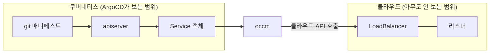

# ArgoCD는 초록불인데 서비스는 죽어 있었다 — 불변 필드와 재조정의 경계

> [선언형 API 와 reconcile loop](./declarative-api-reconcile-loop.md)를 먼저 읽으면 좋다. 이 글은 그 루프가 **닿지 못하는 바깥**을 다룬다.

운영 중인 API의 HTTPS가 통째로 죽어 있다는 제보를 받았다. 그런데 확인해보니 매니페스트도, ArgoCD도, 인증서도 전부 정상이었다. 선언한 대로 되어 있는데 실제로는 되어 있지 않은 상태였다.

원인은 클라우드 로드밸런서의 리스너 프로토콜이 **생성 후에는 바꿀 수 없는 필드**였기 때문이다. 이 글은 그 하루 동안 배운 것 — 쿠버네티스의 재조정이 어디서 멈추는지, 왜 아무도 나에게 실패를 알려주지 않았는지 — 를 정리한 것이다.

## 모든 계기판이 정상을 가리키고 있었다

먼저 확인한 것들이다. 하나도 이상하지 않았다.

| 확인 대상 | 결과 |
|---|---|
| Service 매니페스트의 TLS 어노테이션 | 4개 모두 선언되어 있음 |
| ArgoCD Application 상태 | 전부 `Synced` / `Healthy` |
| 인증서 유효기간·SAN | 유효, 도메인 커버됨 |
| LoadBalancer 상태 | `ACTIVE` / `ONLINE` |
| 80 포트 | 정상 응답 |
| 443 포트 | **TLS handshake 실패** |

`openssl s_client`로 붙어보니 이렇게 나왔다.

```
no peer certificate available
SSL handshake has read 5 bytes and written 1485 bytes
New, (NONE), Cipher is (NONE)
```

서버가 5바이트만 보내고 끊는다. 인증서를 아예 제시하지 않는다. TLS 1.0부터 1.3까지 전부 시도해도 같았으니 버전 협상 문제도 아니었다.

여기서 한참 헤맸다. 매니페스트에 인증서가 분명히 들어 있는데 서버가 인증서를 안 준다는 게 말이 안 됐다. **선언과 현실이 어긋나 있다**는 걸 인정하는 데 시간이 걸렸다.

## 쿠버네티스의 재조정은 클러스터 경계에서 끝난다

Service를 `type: LoadBalancer`로 선언하면 실제 로드밸런서는 쿠버네티스가 만들지 않는다. cloud-controller-manager(줄여서 occm)가 클라우드 API를 호출해서 만든다. 여기가 경계다.



이 그림에서 중요한 건 **점선이 아니라 경계 자체**다. ArgoCD는 왼쪽 상자 안만 본다. git의 Service 객체와 클러스터의 Service 객체를 비교해서 같으면 `Synced`다. 오른쪽 상자에 실제로 무엇이 서 있는지는 비교 대상이 아니다.

내 경우 왼쪽은 완벽했다. 어노테이션 4개가 그대로 들어 있었다. 오른쪽 리스너는 전혀 다른 프로토콜로 서 있었다.

```
선언: TCP-443 리스너 프로토콜 = TERMINATED_HTTPS (LB가 TLS 종료)
실제: TCP-443 리스너 프로토콜 = TCP (그냥 통과)
```

TCP로 통과시킨 TLS 트래픽이 뒤쪽 nginx의 **평문 HTTP 포트**로 꽂히고 있었다. nginx는 TLS ClientHello를 HTTP 요청으로 파싱하려다 실패하고 평문으로 에러를 뱉는다. 클라이언트는 그걸 깨진 TLS 레코드로 읽는다. 그래서 "TLS 오류"로 보였던 것이다.

## 왜 occm은 이걸 안 고쳤나 — 불변 필드

occm이 게을렀던 게 아니다. 어노테이션 변경을 감지하고 재조정도 돌았다. 문제는 **리스너의 protocol이 클라우드 API 수준에서 수정 불가능한 필드**라는 것이다.

이건 추측이 아니라 소스를 보면 바로 확인된다. OpenStack Octavia의 API 타입 정의(`octavia/api/v2/types/listener.py`)에서 생성용 클래스와 수정용 클래스를 비교하면 이렇다.

| 필드 | `ListenerPOST` (생성) | `ListenerPUT` (수정) |
|---|---|---|
| `protocol` | 있음, 필수 | **없음** |
| `protocol_port` | 있음, 필수 | **없음** |
| `default_tls_container_ref` | 있음 | 있음 |
| `tls_versions` | 있음 | 있음 |
| `allowed_cidrs` | 있음 | 있음 |

수정 요청 타입에 `protocol` 자체가 존재하지 않는다. 그러니 어떤 값을 보내도 반영될 수가 없다. 인증서(`default_tls_container_ref`)는 양쪽에 다 있어서 바꿀 수 있는데, 프로토콜만 못 바꾼다.

왜 이런 필드가 있냐면, 리스너의 프로토콜은 그 리스너가 **무엇인지를 정의하는 속성**이기 때문이다. L4로 통과시키는 리스너와 TLS를 종료하는 리스너는 내부 구현이 다르다. 바꾸려면 지웠다 다시 만드는 수밖에 없다. 데이터베이스로 치면 컬럼 타입을 바꾸는 게 아니라 테이블을 새로 만드는 쪽에 가깝다.

## 그래서 리스너를 지웠다

방법은 하나뿐이었다. 기존 443 리스너를 클라우드 API로 직접 삭제하고, occm이 그 자리에 새로 만들도록 두는 것이다.

지우자마자 60초 만에 `TERMINATED_HTTPS` 리스너가 재생성됐다. 로드밸런서 자체와 VIP, 공인 IP는 그대로 유지되고 리스너 하나만 교체됐다. 80 포트 리스너는 별개라 영향이 없었다.

프로덕션 리소스를 지우는 작업이라 부담스러웠지만, 판단 근거는 명확했다. **443은 이미 100% 죽어 있어서 잃을 트래픽이 없었다.** 복구 직후 클라이언트 요청이 200으로 들어오기 시작했고, 24시간 로그를 다시 뒤져보니 복구 이전 시간대에는 요청이 단 한 건도 도달하지 못한 상태였다.

## 불변 필드인지 어떻게 미리 아는가

이번에 제일 궁금했던 부분이다. 방법이 몇 가지 있는데, **신뢰도가 서로 다르다**는 게 핵심이다.

### API 타입 정의에서 생성과 수정을 비교한다

가장 확실하다. 위에서 한 방식이다. 오픈소스 클라우드 API는 대부분 생성용 타입과 수정용 타입이 따로 있고, 수정용에 없는 필드가 곧 불변 필드다. 문서보다 소스가 빠를 때가 많다.

### `kubectl explain`을 본다 — 단, 불완전하다

쿠버네티스 자체 리소스라면 필드 설명에 적혀 있는 경우가 있다.

```
$ kubectl explain service.spec.clusterIP
    ... This field may not be changed through updates unless the type field
    is also being changed to ExternalName
```

"may not be changed through updates"가 불변 표시다. 다만 **모든 불변 필드에 이 문구가 있는 건 아니다.** 실제로 `statefulset.spec.volumeClaimTemplates`로 확인해봤더니 설명에 그런 언급이 없었다. 있으면 확실한 근거지만, 없다고 가변인 건 아니다.

### 컨트롤러의 이슈 트래커를 본다

클라우드 API가 허용하더라도 중간 컨트롤러가 안 보내는 경우가 따로 있다. occm에도 [어노테이션 변경이 최초 생성 때만 반영되던 이슈](https://github.com/kubernetes/cloud-provider-openstack/issues/1149)가 있었고, 타임아웃 관련 어노테이션 여러 개가 여기 해당했다. 2020년에 고쳐졌지만, 이런 층이 따로 존재한다는 사실 자체가 중요하다. 클라우드 API가 허용하는 필드인데도 컨트롤러가 안 보내면 결과는 똑같이 "조용히 무시됨"이다.

### 그 어노테이션이 upstream 것인지 벤더 확장인지 구분한다

여기서 제일 오래 헤맸다. 내가 쓰던 어노테이션들의 네임스페이스를 다시 보니 두 종류가 섞여 있었다.

```
loadbalancer.openstack.org/subnet-id        ← upstream occm
loadbalancer.<vendor>/listener-protocol     ← 클라우드 사업자 자체 확장
```

upstream occm 문서에는 **리스너 프로토콜을 제어하는 어노테이션이 아예 없다.** 내가 쓰던 건 클라우드 사업자가 따로 만든 확장이었다. upstream 소스와 이슈 트래커를 아무리 뒤져도 이 동작이 안 나오는 게 당연했다.

관리형 쿠버네티스라 컨트롤러 파드도 클러스터에 안 보인다. 컨트롤 플레인 쪽에서 돌기 때문에 버전을 확인할 수도, 소스를 읽을 수도 없다. **동작을 알아낼 방법이 실측밖에 없는 영역**이 존재한다는 뜻이다.

정리하면 불변성은 세 층에서 온다.

| 층 | 원인 | 확인 방법 |
|---|---|---|
| 클라우드 API | 수정 요청 타입에 필드가 없음 | 소스·API 문서 |
| upstream 컨트롤러 | 감지해도 안 보냄 | 이슈 트래커·소스 |
| 벤더 확장 | 문서화가 얕고 소스가 비공개 | **실측 외에 없음** |

아래로 내려갈수록 미리 알기 어렵다. 세 번째 층은 "일단 해보고 클라우드 쪽에서 확인한다" 말고 방법이 없었다.

이 구분이 실무에서 갈리는 지점이 하나 있다. 반영이 안 될 때 **쿠버네티스 버전을 올리면 해결되는가**를 판단하는 자리다. 두 번째 층이면 컨트롤러 버전이 답이 되지만, 첫 번째나 세 번째 층이면 버전과 무관하다. 이번 건 첫 번째와 세 번째가 겹친 경우라 업그레이드로는 아무것도 달라지지 않았다.

### 직접 바꿔보고 에러를 확인한다

가장 직관적이지만 프로덕션에서는 쓸 수 없다. 개발 환경이 있다면 여기서 먼저 확인하는 게 맞다.

## 진짜 함정은 어노테이션이 검증되지 않는다는 것

여기까지 정리하고 나서야 이번 사건의 진짜 원인이 보였다. 불변 필드 자체가 아니라 **불변 필드를 어노테이션으로 다뤘다는 구조**가 문제였다.

쿠버네티스 자체 필드와 어노테이션은 실패하는 방식이 완전히 다르다.

| | 쿠버네티스 자체 필드 | 어노테이션 |
|---|---|---|
| 예시 | `service.spec.clusterIP` | `loadbalancer.<vendor>/listener-protocol` |
| 타입 검증 | apiserver가 스키마로 검증 | 없음, 임의 문자열 맵 |
| 불변 필드를 바꾸면 | **apply가 거부됨** | apply 성공 |
| 오타를 내면 | 필드 없음 에러 | apply 성공 |
| 반영 실패를 알 수 있나 | 즉시 에러로 안다 | **아무 신호 없음** |

`spec.clusterIP`를 바꾸려 하면 apiserver가 거부한다. 실수해도 즉시 알 수 있어서 안전하다. 반면 어노테이션은 apiserver 입장에서 그냥 문자열이다. 값이 무엇이든, 오타가 있든, 반영이 불가능하든 `kubectl apply`는 항상 성공한다.

> 클라우드 리소스 설정을 어노테이션으로 넘기는 순간, 그 설정에 대한 타입 안정성을 전부 포기하는 셈이 된다. 컴파일 타임 검사 없이 리플렉션으로 문자열 필드명을 넘기는 코드와 구조가 같다.

그리고 ArgoCD는 이 상황에서 초록불을 켠다. git의 어노테이션 문자열과 클러스터의 어노테이션 문자열이 같으니까 정말로 `Synced`가 맞다. ArgoCD가 틀린 게 아니라, **애초에 그걸 볼 수 있는 도구가 아니었다.**

## 다른 클라우드는 이걸 어떻게 풀었나

내가 겪은 게 특정 클라우드만의 문제인지 궁금해서 AWS와 GCP 문서를 찾아봤다. 셋 다 접근이 달랐고, 그 차이가 그대로 안전성 차이가 됐다.

**AWS는 API 층에서 애초에 막지 않는다.** ELBv2의 `ModifyListener`에는 `Protocol` 파라미터가 있다. 전환 시 부작용까지 문서에 적혀 있다 — "TLS에서 TCP로 바꾸면 보안 정책과 기본 인증서 속성이 제거된다". 리스너를 지웠다 만들 필요 자체가 없다.

다만 어노테이션 층에는 같은 함정이 남아 있다. `aws-load-balancer-type`에는 이런 경고가 붙어 있다.

> Do not add or modify this annotation on an existing Service. Adding or modifying this annotation on an existing Service can result in misconfigured resources, such as leaked AWS resources or exposing your NLB to the internet.

`aws-load-balancer-name`은 더 노골적이다. "서비스 생성 후 이 어노테이션을 바꾸면 아무 효과가 없다"고 적혀 있다. 내가 겪은 것과 똑같은 조용한 무시다. 차이는 **문서에 그렇게 적어뒀다**는 것뿐이다.

**GKE는 설계를 아예 다르게 했다.** 불변 속성을 어노테이션이 아니라 쿠버네티스 자체 필드로 올렸다.

```
spec.loadBalancerClass
  "This attribute is immutable and can't be changed after the
   Service manifest has been applied to a cluster."
```

`spec` 아래 필드라서 apiserver가 스키마로 검증한다. 바꾸려 하면 **apply 자체가 거부된다.** 조용한 실패가 구조적으로 불가능하다.

세 방식을 나란히 놓으면 이렇게 갈린다.

| 불변 속성을 어디에 두나 | 잘못 바꾸면 | 알아차리는 시점 |
|---|---|---|
| 쿠버네티스 `spec` 필드 (GKE) | apply 거부 | 즉시 |
| 어노테이션, 단 문서에 경고 있음 (AWS) | 조용히 무시 | 문서를 읽었다면 사전에 |
| 벤더 확장 어노테이션 | 조용히 무시 | 장애가 나야 |

> 불변 속성을 어느 층에 두느냐가 실패의 시끄러움을 결정한다. 어노테이션은 스키마 변경 없이 기능을 붙일 수 있어 편하지만, 그 편의의 대가로 타입 안정성을 통째로 내준다. GKE가 `loadBalancerClass`를 `spec`으로 승격시킨 건 그 대가를 치르지 않겠다는 선택이다.

설계할 일이 생긴다면 여기서 배울 게 있다. **한 번 정하면 못 바꾸는 값일수록 검증되는 자리에 둬야 한다.** 자유 문자열 맵에 넣어두고 "문서에 적어놨으니 됐다"고 하면, 문서를 안 읽은 사람이 아니라 문서가 지워진 다음 사람이 당한다.

## 같은 패턴이 나올 수 있는 다른 곳

LoadBalancer만의 문제가 아니다. 조건은 딱 두 가지다.

1. 쿠버네티스 객체가 **클러스터 밖의 리소스**를 대리한다
2. 그 리소스의 설정을 **어노테이션이나 CRD로** 넘긴다

이 조건을 만족하는 구성요소는 흔하다. 내가 직접 겪은 건 LoadBalancer 하나지만, 구조상 같은 함정이 가능한 자리들이다.

| 구성요소 | 클러스터 밖 리소스 | 어긋날 수 있는 지점 |
|---|---|---|
| cloud-controller-manager | 로드밸런서, 리스너, 풀 | 이 글의 사례 |
| external-dns | DNS 레코드 | 레코드 타입 변경 |
| cert-manager | 인증서 발급 기관의 상태 | 발급 실패가 Ingress에 안 드러남 |
| CSI 드라이버 | 볼륨, 스냅샷 | 스토리지 클래스·크기 축소 |
| Cluster Autoscaler | 노드 그룹 | 인스턴스 타입 변경 |

여기 적힌 것 중 내가 실제로 확인한 건 첫 줄뿐이다. 나머지는 "구조가 같으니 의심해볼 자리"라는 뜻이지, 실제로 그렇게 깨진다고 검증한 게 아니다.

## 그래서 무엇을 점검하나

이번 일 이후로 체크리스트를 이렇게 잡았다.

**설정을 바꿀 때**

- 어노테이션으로 클라우드 리소스 설정을 바꿨다면, `apply` 성공은 근거가 아니다. **클라우드 쪽에서 직접 조회해서 확인**한다.
- 특히 리소스의 "정체성"에 해당하는 필드(프로토콜, 타입, 이름)는 불변일 가능성이 높다고 먼저 의심한다.
- 어노테이션의 **네임스페이스가 upstream인지 벤더 확장인지** 먼저 본다. 벤더 확장이면 공식 문서와 소스로 검증할 길이 없으니 실측 계획부터 세운다.
- 개발 환경이 있으면 거기서 먼저 적용하고 클라우드 API로 결과를 확인한다.

**환경을 새로 켤 때**

- 기존 환경에서 통했던 어노테이션이 신규 환경에서도 통한다는 보장이 없다. 기존 환경은 **삭제·재생성이라는 수동 절차를 이미 거쳤을 수** 있다.
- 환경별로 클라우드 리소스의 실제 상태를 나란히 비교한다. 이번에도 개발·검증 환경과 운영 환경의 리스너 프로토콜을 나란히 놓고 나서야 확신이 섰다.

**증상이 이상할 때**

- `Synced` / `Healthy`는 "쿠버네티스 객체가 git과 같다"는 뜻이지 "서비스가 동작한다"는 뜻이 아니다.
- 클러스터 안에서 원인을 못 찾으면 경계 밖을 본다. [LoadBalancer가 안 만들어질 때의 진단 흐름](./loadbalancer-pending-diagnosis.md)과 같은 접근이다.

## 지금 보면

가장 뼈아픈 지점은 기술이 아니라 문서였다.

이 함정은 이미 알려져 있었다. 개발 환경에서 같은 문제를 겪고 매니페스트에 주석으로 남겨뒀었다. "컨트롤러가 리스너 프로토콜을 그 자리에서 바꾸지 못하므로 기존 리스너를 지워야 한다"는 내용이었다. 그런데 이후 구조를 바꾸는 커밋에서 그 주석이 함께 지워졌다. 개발·검증 환경은 이미 수동 절차를 밟은 뒤였으니 아무 문제가 없었고, 나중에 운영 환경을 켤 때는 그 절차가 필요하다는 사실이 어디에도 남아 있지 않았다.

**실측으로 알아낸 함정을 지우는 커밋은 코드 변경보다 위험하다.** 코드가 사라지면 컴파일이 깨지지만, 함정 기록이 사라지면 아무 일도 일어나지 않다가 몇 달 뒤에 터진다. 리팩터링할 때 주석을 정리하는 습관이 있었는데, "왜 이렇게 해야 하는가"를 담은 주석은 정리 대상이 아니라는 걸 이번에 확실히 배웠다.

또 하나는 관측의 공백이다. TLS handshake 실패는 **어디에도 로그가 남지 않는다.** 로드밸런서가 TLS를 종료하니 실패는 거기서 끝나고, 뒤쪽 nginx까지 도달하지 못하니 액세스 로그에도 없다. 클라우드가 로드밸런서 액세스 로그를 제공하지 않으면 관측 수단이 아예 없다. 결국 내가 근거로 쓴 건 **로그의 부재**였다. 24시간 동안 요청이 0건이라는 사실이 유일한 증거였다.

없는 로그를 근거로 삼아야 하는 상황이 온다는 걸 미리 알았다면, 외부에서 주기적으로 handshake를 찔러보는 점검 하나쯤은 미리 걸어뒀을 것이다. 지금 보면 그게 가장 실효성 있는 대비였다.

## 참고 링크

- [Octavia API v2 — 공식 문서](https://docs.openstack.org/api-ref/load-balancer/v2/)
- [octavia/api/v2/types/listener.py — 리스너 타입 정의 소스](https://github.com/openstack/octavia/blob/master/octavia/api/v2/types/listener.py)
- [occm: loadbalancer not updating when Octavia specific service annotations change](https://github.com/kubernetes/cloud-provider-openstack/issues/1149) — 2020년 해결됨. 컨트롤러 층에서 어노테이션이 누락되던 사례로 참고
- [occm 로드밸런서 어노테이션 목록 — upstream 공식 문서](https://github.com/kubernetes/cloud-provider-openstack/blob/master/docs/openstack-cloud-controller-manager/expose-applications-using-loadbalancer-type-service.md)
- [Annotations — 쿠버네티스 공식 문서](https://kubernetes.io/docs/concepts/overview/working-with-objects/annotations/)
- [AWS ELBv2 ModifyListener API — Protocol 변경 가능 여부](https://docs.aws.amazon.com/elasticloadbalancing/latest/APIReference/API_ModifyListener.html)
- [AWS Load Balancer Controller 어노테이션 — 변경 금지 경고 포함](https://kubernetes-sigs.github.io/aws-load-balancer-controller/latest/guide/service/annotations/)
- [GKE LoadBalancer Service 파라미터 — loadBalancerClass 불변성](https://cloud.google.com/kubernetes-engine/docs/concepts/service-load-balancer-parameters)
- [Kubernetes Controllers — 공식 문서](https://kubernetes.io/docs/concepts/architecture/controller/)
