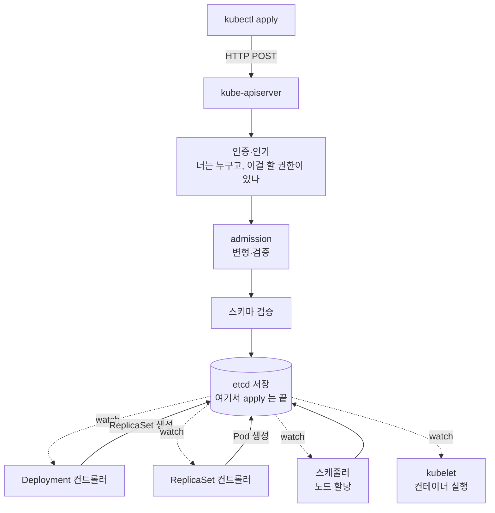

# 선언형 API 와 reconcile loop — 쿠버네티스를 관통하는 단 하나의 원리

> [컨테이너와 쿠버네티스가 필요한 이유](./why-kubernetes.md)에서 "원하는 상태를 선언하면 시스템이 맞춘다"까지 말하고 넘어갔다. 이 글은 그 문장의 내부를 연다.

쿠버네티스를 배우면서 가장 오래 헤맨 건 객체 이름이 아니었다. `kubectl apply` 를 하면 리소스가 "생긴다"는데, **누가 언제 그걸 만드는지**가 안 잡혔다. 명령을 보냈으니 그 명령이 실행되는 거라고 막연히 생각했는데, 실제로는 그게 아니었다.

한 줄로 먼저 말하면 — **쿠버네티스에서 내가 보내는 건 명령이 아니라 목표 상태의 기록이고, 실행은 그 기록을 계속 감시하는 별도의 루프가 한다.** 이 구조를 **reconcile loop**(조정 루프) 라고 부른다. 이걸 잡으면 Deployment 도 admission 도 ArgoCD 도 전부 같은 패턴의 반복으로 읽히고, 반대로 이걸 모르면 "왜 안 되는지"를 영영 못 찾는다.

## 명령형과 선언형의 차이

두 방식의 차이를 배포로 비교하면 명확하다.

**명령형**(imperative) — 무엇을 할지 절차로 적는다.

```
1. 기존 프로세스를 죽인다
2. 새 jar 를 복사한다
3. 프로세스를 띄운다
4. 헬스체크가 통과할 때까지 기다린다
```

**선언형**(declarative) — 결과가 어때야 하는지만 적는다.

```yaml
replicas: 2
image: my-app:v2
```

차이는 "누가 순서를 책임지느냐"다. 명령형은 내가 절차와 실패 처리를 다 짜야 한다. 3번에서 실패하면 어떻게 되돌릴지, 4번이 타임아웃이면 어떻게 할지 전부 내 스크립트 안에 있어야 한다.

선언형은 목표만 적고 나머지는 시스템이 맡는다. 대신 **시스템은 "지금 상태"와 "목표 상태"를 계속 비교할 수 있어야** 한다. 그 비교와 조치를 반복하는 것이 reconcile loop 다.

이 방식이 주는 실질적 이득이 두 가지 있다.

- **멱등성** — 같은 YAML 을 열 번 apply 해도 결과가 같다. 이미 목표 상태면 아무 일도 일어나지 않는다. 명령형 스크립트를 두 번 돌리면 프로세스가 두 개 뜨는 사고와 대비된다.
- **자가 치유** — 누가 Pod 를 지워도, 노드가 죽어도, 루프가 다음 바퀴에서 차이를 발견하고 다시 맞춘다. 복구를 위해 따로 짜 둔 코드가 없어도 복구된다.

## spec 과 status — 목표와 현실을 한 객체에 담는다

쿠버네티스 리소스를 열어보면 거의 항상 두 블록이 있다. 이 구분이 선언형의 실체다.

```yaml
spec:              # 내가 쓴다 — 이렇게 되어야 한다
  replicas: 2
status:            # 컨트롤러가 쓴다 — 지금은 이렇다
  replicas: 2
  readyReplicas: 1
  conditions:
    - type: Available
      status: "False"
      reason: MinimumReplicasUnavailable
```

- **`spec`** 은 **내가 선언한 목표**다. 사람이 쓰는 영역이다.
- **`status`** 는 **컨트롤러가 관찰한 현실**이다. 내가 쓰는 게 아니라 읽는 영역이다.

reconcile loop 가 하는 일은 이 한 줄로 요약된다 — **`status` 를 `spec` 에 맞춘다.**

그래서 무언가 안 될 때 볼 곳도 정해진다. `spec` 을 아무리 들여다봐도 원인은 안 나온다. **원인은 `status`, 그중에서도 `conditions` 와 이벤트에 있다.** 위 예시라면 "2개를 원했는데 준비된 건 1개고, 그래서 Available 이 False" 라고 시스템이 이미 말하고 있는 것이다.

## kubectl apply 를 하면 실제로 무슨 일이 일어나는가

`kubectl apply -f deployment.yaml` 한 줄 뒤의 흐름은 이렇다.



여기서 놓치기 쉬운 사실이 하나 있다. **`kubectl apply` 는 etcd 에 저장되는 순간 끝난다.** 명령이 성공했다는 응답은 "저장했다"는 뜻이지 "떴다"는 뜻이 아니다. `kubectl apply` 가 성공했는데 Pod 가 안 뜨는 상황이 흔한 건 이 때문이다. 저장은 됐고, 그 뒤 단계 어딘가에서 막힌 것이다.

그리고 그 뒤는 **하나의 컨트롤러가 통째로 처리하지 않는다.** 각 컨트롤러가 자기 몫만 하고 결과를 다시 etcd 에 쓰면, 그걸 보고 다음 컨트롤러가 움직인다. Deployment 컨트롤러는 ReplicaSet 까지만 만들고 Pod 는 만들지 않는다. 스케줄러는 노드를 정해 기록만 하고 컨테이너를 띄우지 않는다. 릴레이가 아니라 **각자 자기 조건이 맞는지 보고 움직이는 독립 루프들**이고, etcd 가 그 사이의 게시판 역할을 한다.

이 구조 덕에 컨트롤러 하나가 잠깐 죽어도 나머지가 각자 돌고, 살아나면 밀린 차이를 다음 바퀴에 맞춘다.

## 이벤트가 아니라 상태를 본다

컨트롤러 구현에서 중요한 성질이 하나 있다. 백엔드에서 이벤트 기반 처리를 짜 본 사람에게 특히 낯선 부분이다.

컨트롤러는 "Pod 가 삭제됐다"는 **이벤트를 소비해서** 대응하지 않는다. 매번 **현재 상태를 통째로 다시 조회해서** 목표와 비교한다. 이걸 **level-triggered**(상태 기반) 라고 하고, 이벤트 하나하나에 반응하는 방식을 **edge-triggered**(변화 기반) 라고 한다.

차이가 왜 중요하냐면 — **이벤트를 놓쳐도 복구되기 때문**이다.

- edge-triggered 로 짰다면, "Pod 삭제됨" 메시지를 한 번 유실하는 순간 replica 가 영영 1개 부족한 채로 남는다. 유실을 막으려면 메시지 큐에 재전송·순서 보장을 얹어야 한다.
- level-triggered 는 다음 바퀴에서 "지금 1개네, 2개여야 하는데" 를 다시 발견한다. 이벤트는 **루프를 깨우는 힌트**일 뿐이고, 판단 근거는 항상 현재 상태다.

쿠버네티스가 네트워크 단절·컨트롤러 재시작 같은 상황에서도 결국 수렴하는 건 이 선택 덕분이다. 백엔드로 옮기면, 메시지를 순서대로 소비해 잔액을 증감하는 방식이 아니라 **매 실행마다 원장을 다시 읽어 잔액을 계산하는 배치**에 가깝다. 느리지만 어디서 재실행해도 답이 같다.

같은 리소스를 두 컨트롤러가 동시에 고치는 충돌은 **낙관적 잠금**으로 막는다. 모든 객체에는 `resourceVersion` 이 있고, 내가 읽은 버전과 다르면 쓰기가 거부되어 다시 읽고 재시도한다. JPA 의 `@Version` 과 같은 방식이다.

## 이 패턴이 계속 반복된다

한 번 잡아두면 뒤에 나오는 것들이 전부 같은 그림으로 보인다.

| 컨트롤러 | 목표(spec) | 맞추는 대상 |
|---|---|---|
| Deployment | 이 버전으로 N개 | ReplicaSet 을 만들고 개수를 조절 |
| ReplicaSet | Pod N개 | Pod 를 만들거나 지움 |
| 스케줄러 | 노드 미할당 Pod 없음 | Pod 에 노드를 배정 |
| HPA | CPU 사용률 목표치 | Deployment 의 replicas 를 조절 |
| ArgoCD | git 에 적힌 상태 | 클러스터 리소스를 git 에 맞춤 |

맨 아래 줄이 특히 재밌다. **ArgoCD 는 쿠버네티스 바깥의 특별한 도구가 아니라, 같은 패턴을 git 까지 확장한 컨트롤러다.** 목표 상태의 출처가 etcd 대신 git 일 뿐 구조가 같다. 그래서 7편에서 ArgoCD 를 볼 때 새로 배울 게 생각보다 적다.

**CRD**(Custom Resource Definition) 로 내 리소스 타입을 정의하고 그에 맞는 컨트롤러를 직접 짜는 것도 같은 이유로 가능하다. 쿠버네티스는 기능 모음이라기보다 **목표를 선언하면 루프가 맞춘다는 틀 자체를 제공하는 플랫폼**에 가깝다.

## 실패는 어디서 드러나는가

선언형의 대가가 여기 있다. 절차를 내가 실행하지 않으니 **실패도 내 눈앞에서 나지 않는다.** `kubectl apply` 는 성공했는데 서비스는 안 뜬 상태가 정상적으로 존재한다.

그래서 확인 순서를 정해두는 게 낫다. 위에서 아래로 내려가며 "어느 루프까지 진행됐는지"를 찾는 방식이다.

```bash
# 1. 목표와 현실의 차이를 먼저 본다 — READY 가 목표에 못 미치면 아래로 내려간다
kubectl get deploy,rs,pod -n <namespace>

# 2. 그 리소스의 status·conditions·이벤트를 읽는다. 원인 대부분이 여기 있다
kubectl describe pod <pod-name> -n <namespace>

# 3. 네임스페이스 전체 이벤트를 시간순으로 본다
kubectl get events -n <namespace> --sort-by=.lastTimestamp

# 4. 컨트롤러가 실제로 뭘 기록했는지 원본으로 확인한다
kubectl get pod <pod-name> -n <namespace> -o yaml
```

단계별로 어디서 멈췄는지 읽는 법도 대체로 정해져 있다.

- **ReplicaSet 은 생겼는데 Pod 가 없다** — Deployment 컨트롤러까지는 돌았고 그 아래가 막혔다. ReplicaSet 의 이벤트에 quota 초과나 admission 거부가 찍혀 있는 경우가 많다.
- **Pod 가 `Pending` 에서 안 움직인다** — 스케줄러가 놓을 노드를 못 찾은 것이다. `describe` 에 리소스 부족, 노드 셀렉터 불일치 같은 이유가 그대로 나온다.
- **Pod 가 `ContainerCreating` 에서 멈춘다** — kubelet 단계다. 이미지 pull 실패, 볼륨 마운트 실패가 흔하다.
- **`CrashLoopBackOff`** — 컨테이너는 떴는데 계속 죽는다. 이건 쿠버네티스가 아니라 애플리케이션 로그를 볼 차례다.

한 가지 함정도 같이 알아두면 좋다. **컨트롤러 두 개가 같은 필드를 서로 다른 목표로 고치면 무한 루프가 된다.** 대표적인 게 HPA 와 Deployment 의 `replicas` 다. HPA 가 부하를 보고 5로 올리는데 git 에 `replicas: 2` 가 적혀 있고 ArgoCD 가 자동 동기화 중이면, 둘이 계속 서로를 되돌린다. 각 필드의 주인을 하나로 정하는 게 유일한 해법이다.

## 정리

- 쿠버네티스에 보내는 것은 명령이 아니라 **목표 상태의 기록**이다. `apply` 는 저장까지만 책임진다.
- 실행은 **목표(`spec`)와 현실(`status`)의 차이를 계속 좁히는 루프**가 한다. 여러 컨트롤러가 각자 자기 몫만 하고 etcd 를 통해 이어진다.
- 컨트롤러는 이벤트가 아니라 **현재 상태를 매번 다시 보고** 판단한다. 그래서 이벤트를 놓쳐도 결국 수렴한다.
- 문제가 생기면 `spec` 이 아니라 **`status` · `conditions` · 이벤트**를 본다. 어느 루프까지 진행됐는지가 곧 원인의 위치다.

다음 글에서는 이 루프들이 실제로 다루는 객체들 — [Pod · Service · Ingress · Namespace](./k8s-core-objects.md) — 의 관계를 본다.

## 참고 링크

- [Kubernetes Controllers — 공식 문서](https://kubernetes.io/docs/concepts/architecture/controller/)
- [Objects In Kubernetes(spec 과 status) — 공식 문서](https://kubernetes.io/docs/concepts/overview/working-with-objects/)
- [Kubernetes API Concepts — 공식 문서](https://kubernetes.io/docs/reference/using-api/api-concepts/)
- [Declarative Management of Kubernetes Objects — 공식 문서](https://kubernetes.io/docs/tasks/manage-kubernetes-objects/declarative-config/)
