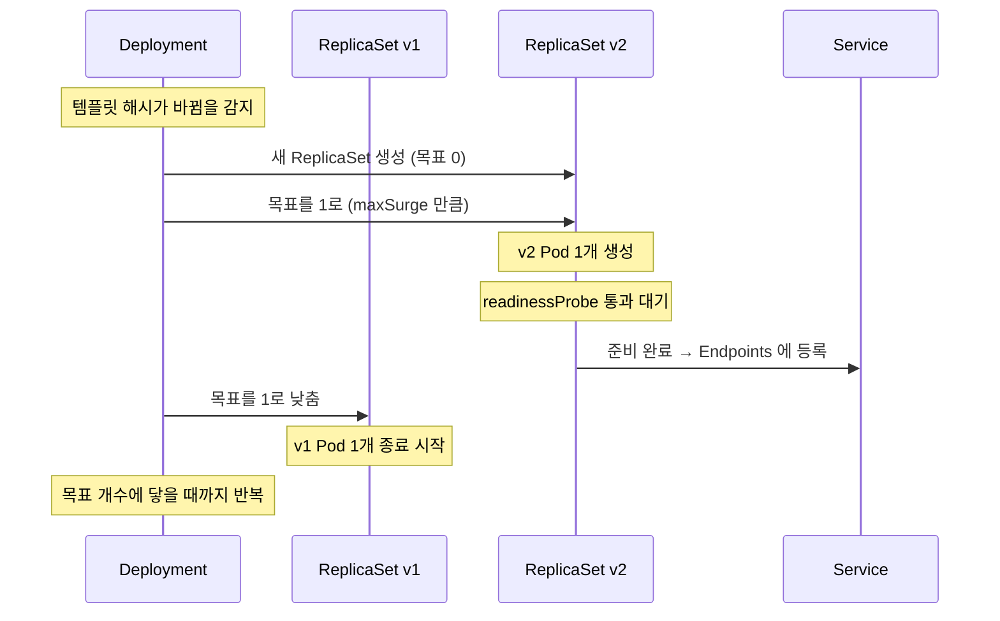

# Deployment · ReplicaSet · Pod — 배포가 굴러가는 3층 구조

> [핵심 객체 4종](./k8s-core-objects.md)에서 Pod 를 "불안정한 실체"로 소개하고 넘어갔다. 이 글은 그 Pod 를 실제로 만들고 유지하는 위쪽 두 층을 본다.

ArgoCD 화면을 처음 봤을 때 이해가 안 됐던 게 있다. 내가 만든 건 Deployment 하나인데, 화면에는 `api-deployment-7d4b9c` 같은 중간 이름이 하나 더 있고 그 밑에 Pod 들이 달려 있었다. 왜 두 단계가 아니라 세 단계인가.

답은 [앞 글](./declarative-api-reconcile-loop.md)의 원리에 있다. **각 층이 서로 다른 하나의 책임만 맞추는 루프**이기 때문이다. 한 문장으로 정리하면 이렇다 — **Deployment 는 버전과 전환 방식을, ReplicaSet 은 개수를, Pod 는 실행을 책임진다.**

백엔드 감각으로 옮기면 이 정도다.

| 층 | 역할 | 비유 |
|---|---|---|
| **Deployment** | 어떤 버전을, 어떤 방식으로 바꿀지 | 배포 계획서 |
| **ReplicaSet** | 특정 버전을 정확히 N개 유지 | 인스턴스 개수 유지 장치 |
| **Pod** | 실제로 도는 프로세스 | 실행 중인 Spring Boot 인스턴스 |

## Pod — 쿠버네티스가 다루는 가장 작은 단위

쿠버네티스는 컨테이너를 직접 관리하지 않는다. **Pod** 를 관리하고, 컨테이너는 그 안에 담긴다.

- **Pod 하나에 IP 하나.** Pod 안의 컨테이너들은 그 IP 와 포트 공간을 공유하고, 서로를 `localhost` 로 부른다.
- **일회용이다.** Pod 는 고쳐 쓰지 않는다. 문제가 생기면 폐기하고 새로 만든다. 새로 태어날 때마다 이름 뒤 해시와 IP 가 바뀐다.
- **보통 컨테이너는 하나다.** 다만 로그 수집기나 프록시 같은 보조 컨테이너를 같은 Pod 에 얹는 **사이드카** 패턴을 쓰기도 한다. 같은 Pod 에 넣는 기준은 "생명주기를 완전히 같이 해야 하는가"다. 따로 스케일하고 싶은 것이 있다면 별도 Pod 로 떼는 게 맞다.

"일회용"이라는 성질이 실무에 직접 영향을 준다. Pod 안 파일 시스템에 로그를 쌓아두면 재시작과 함께 사라지므로 표준 출력으로 내보내 외부에서 수집해야 하고, 업로드 임시 파일 같은 것도 Pod 로컬에 두면 안 된다.

그래서 Pod 를 직접 만드는 일은 거의 없다. 직접 만든 Pod 는 **죽으면 그걸로 끝**이고 아무도 다시 만들어주지 않는다. 개수를 보장해 줄 누군가가 필요하다.

## ReplicaSet — 개수만 맞추는 단순한 루프

**ReplicaSet** 의 책임은 하나다. 자기 라벨 셀렉터에 맞는 Pod 가 정확히 N개 있게 한다.

- 2개인데 3개여야 하면 하나 만든다.
- 4개인데 3개여야 하면 하나 지운다.
- 버전이나 배포 전략은 **모른다.** 개수만 센다.

`api-deployment-7d4b9c` 처럼 해시가 붙은 그 중간 이름이 ReplicaSet 이다. 해시는 Pod 템플릿 내용에서 계산되므로, **이미지 태그나 환경변수가 바뀌면 다른 해시 = 다른 ReplicaSet** 이 된다. 이 성질이 다음 층의 동작 방식을 결정한다.

ReplicaSet 을 직접 만들 일도 거의 없다. Deployment 가 알아서 만든다.

## Deployment — 버전 전환을 지휘하는 층

우리가 실제로 쓰는 YAML 의 대부분이 Deployment 다. 이 층의 책임은 **버전이 바뀔 때 이전 ReplicaSet 에서 새 ReplicaSet 으로 트래픽을 어떻게 옮길지**다.

핵심은 Deployment 가 Pod 를 직접 만들지 않는다는 점이다. **버전마다 ReplicaSet 을 하나씩 두고, 각 ReplicaSet 의 목표 개수를 조절하는 방식으로** 배포를 진행한다. 옛 버전 ReplicaSet 은 개수 0으로 남겨두는데, 이게 롤백이 즉시 되는 이유다. 새로 배포하는 게 아니라 **옛 ReplicaSet 의 개수를 다시 올리기만** 하면 된다.

```yaml
apiVersion: apps/v1
kind: Deployment
metadata:
  name: api
spec:
  replicas: 2
  strategy:
    type: RollingUpdate
    rollingUpdate:
      maxSurge: 1          # 목표 개수보다 최대 1개까지 더 띄워도 됨
      maxUnavailable: 0    # 준비된 Pod 가 목표보다 적어지는 것은 허용 안 함
  selector:
    matchLabels:
      app: api             # 이 라벨을 가진 Pod 를 내 것으로 본다
  template:                # 여기부터가 Pod 의 설계도
    metadata:
      labels:
        app: api           # selector 와 반드시 일치해야 한다
    spec:
      terminationGracePeriodSeconds: 30
      containers:
        - name: api
          image: my-repo/api:v2.0.0
          ports:
            - containerPort: 8080
          resources:
            requests:                 # 스케줄러가 노드를 고를 때 쓰는 최소 보장치
              cpu: "500m"
              memory: "512Mi"
            limits:                   # 넘으면 CPU 는 조여지고 메모리는 강제 종료
              cpu: "2"
              memory: "1536Mi"
          startupProbe:               # 뜨는 데 오래 걸리는 앱을 위한 유예
            httpGet:
              path: /actuator/health/liveness
              port: 8080
            periodSeconds: 5
            failureThreshold: 30      # 5초 x 30 = 최대 150초까지 기다려 준다
          readinessProbe:             # 트래픽을 받아도 되는가
            httpGet:
              path: /actuator/health/readiness
              port: 8080
            periodSeconds: 5
          livenessProbe:              # 살아 있는가, 아니면 재시작해야 하는가
            httpGet:
              path: /actuator/health/liveness
              port: 8080
            periodSeconds: 10
```

`template` 아래가 통째로 Pod 의 설계도라는 점, 그리고 `selector.matchLabels` 와 `template.metadata.labels` 가 일치해야 한다는 점이 처음에 자주 걸리는 부분이다. 일치하지 않으면 API 서버가 거부한다.

## 롤링 업데이트가 실제로 도는 순서

이미지 태그를 `v1` 에서 `v2` 로 바꿔 apply 하면 이런 일이 벌어진다.



여기서 **모든 안전장치가 `readinessProbe` 하나에 걸려 있다.** 새 Pod 가 준비됐다고 판정돼야 Service 의 Endpoints 에 들어가고, 그래야 옛 Pod 를 줄이기 시작한다.

`readinessProbe` 를 안 걸면 어떻게 되는지가 중요하다. 쿠버네티스는 **컨테이너 프로세스가 떴다는 사실만으로 준비 완료로 간주한다.** Spring Boot 가 컨텍스트를 초기화하는 데 20초가 걸린다면, 그 20초 동안 트래픽이 아직 못 받는 Pod 로 들어간다. 롤링 업데이트를 켜 뒀는데 배포할 때마다 에러가 튀는 원인의 대부분이 여기다. **무중단은 기본으로 주어지는 게 아니라 probe 로 만들어내는 것이다.**

## probe 3종을 어떻게 나눠 쓰는가

세 개가 비슷해 보이지만 실패했을 때의 결과가 완전히 다르다. 이 차이로 나누는 게 맞다.

| probe | 질문 | 실패하면 |
|---|---|---|
| `startupProbe` | 아직 뜨는 중인가 | 다른 probe 를 시작하지 않고 기다린다 |
| `readinessProbe` | 트래픽을 받아도 되나 | Service 에서 **빼기만** 한다. 재시작 안 함 |
| `livenessProbe` | 살아 있나 | 컨테이너를 **재시작**한다 |

여기서 실무 사고가 나는 조합이 두 가지 있다.

- **`livenessProbe` 를 무거운 헬스체크로 걸면 재시작 폭풍이 온다.** DB 연결까지 확인하는 엔드포인트를 liveness 로 걸어두면, DB 가 잠깐 느려질 때 멀쩡한 Pod 들이 전부 재시작된다. 부하가 몰려 더 느려지고, 더 많이 재시작되는 악순환이 된다. **외부 의존성 확인은 readiness 에, liveness 는 프로세스 자체가 응답하는지만** 보는 게 안전하다. Spring Boot Actuator 가 `health/liveness` 와 `health/readiness` 를 나눠 제공하는 이유가 이것이다.
- **느린 기동을 `initialDelaySeconds` 로 때우면 어중간해진다.** 30초로 잡아뒀는데 어느 날 40초 걸리면 liveness 가 재시작을 걸고, 그 Pod 는 영원히 못 뜬다. 기동 유예는 `startupProbe` 로 분리하는 쪽이 낫다. 기동 중에는 넉넉히 기다리고, 뜨고 나서는 촘촘히 감시할 수 있다.

## 종료도 절반은 애플리케이션 몫이다

배포 때 에러가 나는 또 하나의 지점이 **종료 쪽**이다. 시작만 챙기고 종료를 안 챙기면 롤링 업데이트마다 처리 중이던 요청이 끊긴다.

Pod 가 종료될 때 두 가지 일이 **동시에** 시작된다.

1. Service 의 Endpoints 에서 그 Pod 가 빠진다 (새 요청이 안 들어오게)
2. 컨테이너에 `SIGTERM` 이 전달된다 (앱이 스스로 정리하도록)

문제는 1번이 클러스터 전체에 퍼지는 데 시간이 걸린다는 것이다. 그 짧은 틈에 이미 출발한 요청이 종료 중인 Pod 에 도착할 수 있다. 그래서 두 가지를 같이 맞춰야 한다.

- **애플리케이션이 `SIGTERM` 을 받고 처리 중인 요청을 마저 끝내야 한다.** Spring Boot 는 `server.shutdown=graceful` 로 켠다. 이게 없으면 프로세스가 즉시 죽고 처리 중이던 요청은 그대로 끊긴다.
- **`terminationGracePeriodSeconds` 가 그 시간보다 길어야 한다.** 기본값 30초 안에 정리가 안 끝나면 `SIGKILL` 로 강제 종료된다. 오래 걸리는 처리가 있다면 이 값을 늘린다.

실제로 이 준비가 안 된 서비스에서 배포와 스케일인 때마다 클라이언트에 503 이 나가는 걸 겪었다. 쿠버네티스 설정 문제로 보였지만 원인은 애플리케이션이 종료 신호를 무시하고 있던 것이었다. **무중단 배포는 쿠버네티스 기능이 아니라 쿠버네티스와 앱의 합작이다.**

## resources 를 왜 꼭 적어야 하는가

`requests` 와 `limits` 는 생략해도 배포가 되기 때문에 자주 빠진다. 그런데 둘의 역할이 다르고, 빠졌을 때 결과가 다르다.

- **`requests`** 는 **스케줄러가 노드를 고르는 기준**이다. "이만큼은 확보돼야 한다"는 예약이다. 안 적으면 스케줄러가 이 Pod 를 0에 가깝게 보고 이미 빡빡한 노드에 밀어 넣는다.
- **`limits`** 는 **실행 중 상한**이다. CPU 는 넘으면 조여지기만 하지만(throttling), **메모리는 넘는 즉시 강제 종료**된다. 컨테이너 상태에 `OOMKilled` 로 찍히는 게 이 경우다.

JVM 을 올릴 때 특히 주의할 게 있다. 예전 JVM 은 컨테이너 메모리 제한을 못 보고 호스트 전체 메모리 기준으로 힙을 잡아 그대로 `OOMKilled` 가 나곤 했다. 요즘 JDK 는 컨테이너 제한을 인식하지만, 힙 외에 메타스페이스·스레드 스택·네이티브 버퍼가 별도로 필요하므로 **`limits` 를 힙 크기와 같게 잡으면 안 된다.** 여유를 둬야 한다.

## 정리

- 3층으로 나뉜 이유는 **각 층이 하나의 책임만 맞추기 때문**이다. Deployment 는 버전 전환, ReplicaSet 은 개수, Pod 는 실행.
- 롤백이 빠른 건 옛 ReplicaSet 을 개수 0으로 남겨두기 때문이다. 다시 만드는 게 아니라 개수를 올린다.
- **무중단의 실체는 `readinessProbe`** 다. 이게 없으면 롤링 업데이트가 켜져 있어도 배포마다 에러가 난다.
- `livenessProbe` 에 외부 의존성을 넣지 않는다. 재시작 폭풍의 원인이 된다.
- 종료 쪽도 챙긴다. `SIGTERM` 처리와 `terminationGracePeriodSeconds` 가 맞물려야 배포 중 요청이 안 끊긴다.

다음 글에서는 지금까지 계속 나온 "API 서버가 거부한다"는 지점 — [admission](./admission-control.md) — 을 본다.

## 참고 링크

- [Deployments — 공식 문서](https://kubernetes.io/docs/concepts/workloads/controllers/deployment/)
- [Pod Lifecycle(probe 와 종료) — 공식 문서](https://kubernetes.io/docs/concepts/workloads/pods/pod-lifecycle/)
- [Resource Management for Pods and Containers — 공식 문서](https://kubernetes.io/docs/concepts/configuration/manage-resources-containers/)
- [Graceful shutdown — Spring Boot 공식 문서](https://docs.spring.io/spring-boot/reference/web/graceful-shutdown.html)
