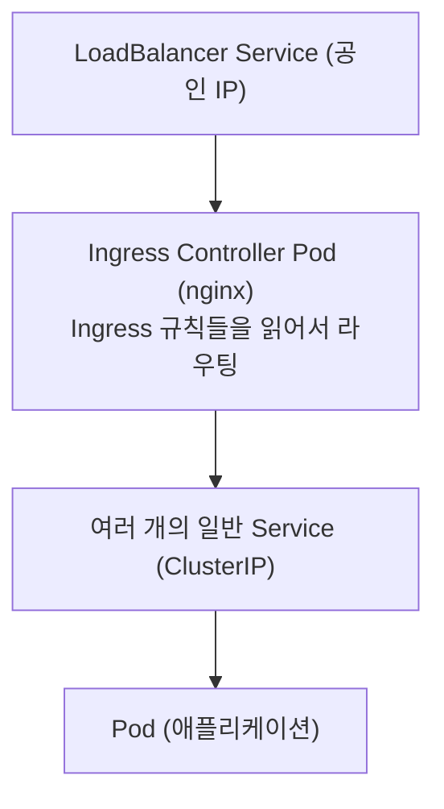
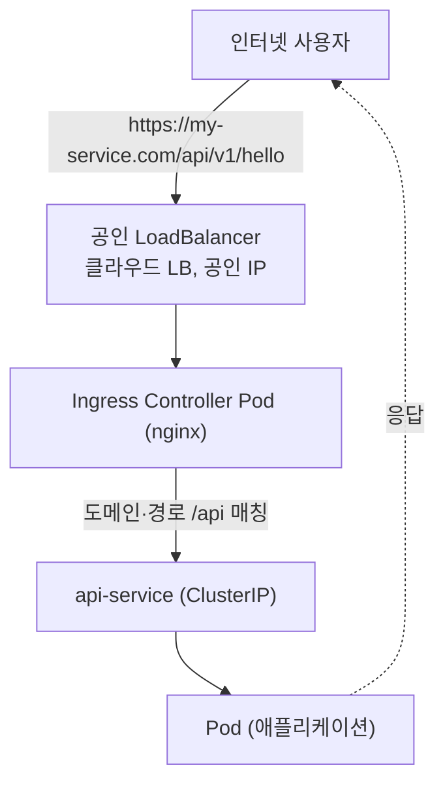

# 외부 트래픽은 어떻게 Pod까지 닿는가 — LoadBalancer, Ingress Controller, 내부와 외부 분리

회사에서 "API Gateway를 걷어내고, 쿠버네티스 앞에 LoadBalancer를 직접 붙여서 외부로 노출하자"는 작업을 맡게 됐다. 그런데 막상 들여다보니 나는 Ingress가 뭔지도 제대로 몰랐다. "외부 요청이 들어와서 서버가 응답한다" 정도로만 알고 있었지, 그 사이에 LoadBalancer니 Ingress Controller니 하는 것들이 몇 겹으로 끼어 있는지는 감이 없었다.

그래서 외부 트래픽이 인터넷에서 출발해 Pod 안의 애플리케이션까지 닿는 전체 경로를 한 번 정리하기로 했다. Service와 Ingress의 기본 개념은 [쿠버네티스 핵심 객체 4종](./k8s-core-objects.md)에 따로 정리해 뒀으니, 이 글은 그 위에서 "그래서 외부에서 진짜로 어떻게 들어오는가"에 집중한다.

## 먼저, Pod는 믿을 수 없는 주소다

쿠버네티스에서 실제로 코드가 도는 단위는 Pod다. 문제는 Pod가 일회용이라는 점이다. 배포할 때마다, 혹은 죽었다 살아날 때마다 새 Pod가 뜨고 IP가 바뀐다.

그래서 Pod IP를 직접 부르는 건 의미가 없다. 대신 그 앞에 **Service**를 둔다. Service는 뒤에 있는 Pod 묶음에게 트래픽을 나눠주는 고정된 내부 진입점이다. 비유하자면 Pod는 자주 자리를 옮기는 직원이고, Service는 바뀌지 않는 부서 대표번호다.

여기까지가 [쿠버네티스 핵심 객체 4종](./k8s-core-objects.md)에서 정리한 내용이고, 이 글의 출발점이다.

## ClusterIP만으로는 외부에서 못 들어온다

Service에도 종류가 있다. 외부 노출을 이해하려면 이 세 가지를 구분해야 한다.

- **ClusterIP** — 기본값. 클러스터 **내부에서만** 닿는 IP를 받는다. 외부에서는 접근 불가.
- **NodePort** — 모든 노드의 특정 포트(예: 30000번대)를 열어서 외부에 노출한다. 직접 쓰기엔 투박하다.
- **LoadBalancer** — 클라우드의 로드밸런서를 하나 만들어서, 외부에서 접근 가능한 진입점을 붙여준다.

내가 헷갈렸던 지점이 여기였다. 보통 애플리케이션 Service는 ClusterIP로 떠 있다. 즉 **그 자체로는 외부에서 절대 못 들어온다.** 외부 노출은 누군가 따로 길을 뚫어줘야 하고, 그 길의 시작이 LoadBalancer 타입 Service다.

## LoadBalancer 타입 — 클라우드가 로드밸런서를 만들어준다

LoadBalancer 타입으로 Service를 만들면, 쿠버네티스가 클라우드(AWS, Azure, 또는 OpenStack 기반 관리형 쿠버네티스 등)에게 "이 Service로 들어오는 로드밸런서를 하나 만들어줘"라고 요청한다. 그러면 클라우드가 실제 LB 장비를 띄우고, 거기에 IP(VIP, 가상 IP)를 붙여서 돌려준다.

```yaml
apiVersion: v1
kind: Service
metadata:
  name: my-lb
spec:
  type: LoadBalancer   # ← 이 한 줄이 클라우드 LB를 생성시킨다
  selector:
    app: my-app
  ports:
    - port: 80
      targetPort: 8080
```

핵심은 **이 LB가 클러스터 바깥의 실제 자원**이라는 점이다. 쿠버네티스 YAML 한 줄이 클라우드 인프라를 움직인다.

## 사설 LB와 공인 LB — annotation 한 줄의 차이

여기서 한 단계 더 들어간다. 같은 LoadBalancer 타입이라도, 받는 IP가 **사설(내부망 전용)**일 수도 있고 **공인(인터넷에서 닿는)**일 수도 있다. 이걸 가르는 건 annotation 한 줄이다.

```yaml
metadata:
  annotations:
    # 이 한 줄이 있으면 사설 IP만 받는다 (내부망 전용)
    service.beta.kubernetes.io/openstack-internal-load-balancer: "true"
```

이 annotation이 붙어 있으면 LB가 사설 VIP만 받아서, 같은 VPC 안에서만 닿는다. 이걸 빼면 공인 IP를 받아 인터넷에 열린다. 클라우드 벤더마다 annotation 이름은 다르다(Azure는 `azure-load-balancer-internal` 같은 식). 개념은 같다 — **이 LB를 안쪽으로만 열까, 바깥까지 열까**를 선언으로 정한다.

공인 IP를 다룰 때 내가 처음에 오해했던 게 있다. "공인 IP를 먼저 발급받아서 지정해야 하는 줄" 알았는데, 실제로는 반대였다. **LB를 먼저 만들면 클라우드가 공인 IP를 자동으로 할당해준다.** 그 다음 할당된 IP를 `spec.loadBalancerIP`에 적어서 "앞으로도 이 IP를 고정해서 써라"라고 못 박는 식이다. 발급이 먼저가 아니라 생성이 먼저고, 고정은 나중이다.

## Ingress Controller 앞에도 LB가 있다

여기서 Ingress가 다시 등장한다. [쿠버네티스 핵심 객체 4종](./k8s-core-objects.md)에서 정리했듯, Ingress는 "어느 도메인의 어느 경로를 어느 Service로 보낼지"를 적은 규칙(YAML)이고, 그 규칙을 실제로 실행하는 건 **Ingress Controller**(nginx 같은 reverse proxy가 도는 Pod)다.

내가 놓쳤던 연결고리가 이거였다. Ingress Controller도 결국 **Pod**다. Pod는 외부에서 직접 못 닿는다. 그러니 Ingress Controller 앞에도 외부 진입점이 필요하고, 그게 바로 앞에서 말한 **LoadBalancer 타입 Service**다.

즉 실무에서 흔한 구성은 이렇다.



Ingress Controller 하나가 여러 Ingress 규칙을 한꺼번에 처리한다. 그래서 LB는 보통 Controller 앞에 하나만 두고, 도메인·경로 분기는 Controller가 Ingress 규칙으로 처리한다.

## 전체 경로 다시 그리기

이제 인터넷에서 출발한 요청이 Pod까지 닿는 전체 여정을 한 줄로 이으면 이렇게 된다.



중간에 한 가지 더 알아두면 좋은 게 **경로 재작성(path rewrite)**이다. 외부에 노출하는 경로와 애플리케이션이 실제로 받는 경로가 다를 때가 많다. 예를 들어 외부에는 `/api/v1/hello`로 열어두고, 안에서는 `/internal/api/v1/hello`로 바꿔서 보내는 식이다. 이런 변환을 Ingress Controller가 규칙(annotation)으로 처리한다. 예전에 API Gateway가 하던 경로 변환을 Controller로 옮기는 것도 같은 얘기다.

## 내부 서비스와 외부 서비스를 한 Controller에 섞으면 생기는 일

여기서부터가 이번 작업에서 가장 중요했던 부분이다.

클러스터 안에는 외부 고객에게 열어야 하는 서비스(예: 공개 API)도 있지만, 절대 외부에 노출되면 안 되는 내부 도구도 있다. 대표적으로 배포를 관리하는 GitOps 도구(ArgoCD), 관리자 콘솔, 모니터링 같은 것들이다.

처음 우리 클러스터는 **Ingress Controller가 딱 하나**였고, 외부 API든 내부 도구든 전부 그 하나의 Controller(사설 LB)에 붙어 있었다. 외부 노출은 별도의 API Gateway가 담당하고 있었기 때문에 가능한 구성이었다.

그런데 "API Gateway를 걷어내고 Controller를 공인으로 바꾸자"라고 단순하게 생각하면 사고가 난다. 그 하나의 Controller를 공인으로 열어버리면, **거기 붙어 있던 ArgoCD와 관리자 콘솔까지 전부 인터넷에 노출**되기 때문이다. 게다가 그 LB의 IP가 바뀌는 순간, 같은 LB로 접근하던 배포 도구 자신이 끊겨서 손도 못 대는 상황이 올 수 있다(배포 도구로 그 변경을 적용하려다 배포 도구가 죽는 자기참조 문제).

> 외부로 열 건 외부로 열 것만. 내부 도구를 외부 진입점에 같이 태우면, "노출 사고"와 "자기 발 묶기"가 동시에 온다.

## 해결책: Controller를 둘로 나누고 IngressClass로 가른다

정석은 **Ingress Controller를 용도별로 둘 두는 것**이다.

- **내부용 Controller** — 사설 LB. 기존 그대로. ArgoCD, 관리자 콘솔, 모니터링 등 내부 서비스만.
- **외부용 Controller** — 공인 LB. 새로 추가. 외부에 열어야 하는 공개 API만.

그럼 "어떤 Ingress 규칙을 어떤 Controller가 처리할지"는 어떻게 정할까? 이게 **IngressClass**다. Ingress 리소스에 `ingressClassName`을 적으면, 그 클래스를 담당하는 Controller만 그 규칙을 가져간다.

```yaml
apiVersion: networking.k8s.io/v1
kind: Ingress
metadata:
  name: public-api-ingress
spec:
  ingressClassName: nginx-external   # ← 외부용 Controller가 처리
  rules:
    - http:
        paths:
          - path: /api
            pathType: Prefix
            backend:
              service:
                name: api-service
                port:
                  number: 80
```

내부 서비스들은 기존 `nginx`(내부용) 클래스를 그대로 쓰고, 외부에 열 공개 API만 `nginx-external`(외부용)로 지정한다. 그러면 공인 LB로는 공개 API만 닿고, ArgoCD나 콘솔은 사설 LB에 그대로 남는다. 노출 사고도, 자기 발 묶기도 사라진다.

공식 문서에서도 멀티 Controller의 핵심 규칙을 이렇게 정리한다.

- Controller마다 `--controller-class`를 다른 값으로 줘서 서로의 Ingress를 침범하지 않게 한다.
- 각 Controller는 자기 namespace에 따로 설치한다.
- `ingressClassName`을 **항상 명시**한다. 안 적으면 어느 Controller도 그 Ingress를 안 가져간다.
- **여러 IngressClass를 동시에 default로 두지 않는다.** default가 둘이면 충돌한다.

## 내가 놓쳤다가 배운 함정 두 가지

개념만 알면 끝날 줄 알았는데, 실제로는 두 군데서 더 걸렸다.

**첫째, admission webhook은 Controller 단위가 아니라 클러스터 전체로 동작한다.** ingress-nginx를 설치하면 "잘못된 Ingress 설정을 사전에 거부하는" 검증 webhook이 같이 깔린다. 그런데 이 webhook은 IngressClass로 격리되지 않고 **클러스터의 모든 Ingress 변경**을 가로챈다. 외부용 Controller를 새로 추가하면 webhook도 하나 더 생기는데, 이 새 webhook이 죽으면 **내부 Ingress 변경까지 거부**될 수 있다. Controller는 클래스로 갈라지지만 webhook은 안 갈라진다는 게 직관에 어긋나는 지점이었다. 외부 Controller의 webhook 범위를 자기 것으로 좁히거나, 필요하면 꺼서 내부 경로와 격리해야 한다.

**둘째, TLS(HTTPS)를 어디서 끊을지 정해야 한다.**([TLS·HTTPS 기초](../../http/https-tls-basics.md)) 그동안 HTTPS 인증서 처리는 API Gateway가 다 해주고 있었다. API Gateway를 걷어내면 그 역할도 누군가 가져가야 한다. 공인 LB에서 끊을지(LB의 HTTPS 리스너), Ingress Controller에서 끊을지(Controller에 인증서 등록), 인증서는 누가 갱신할지를 결정해야 한다. "외부로 열었다"는 곧 "평문 HTTP로 인터넷에 열면 안 된다"는 뜻이라, 이 결정을 빼먹으면 안 된다.

## 정리하면

처음에 나는 "외부 요청 → 서버"라는 두 칸짜리 그림만 갖고 있었는데, 실제로는 이렇게 여러 겹이었다.

- 애플리케이션 Service는 보통 ClusterIP라 그 자체로는 외부에서 못 닿는다.
- 외부 진입점은 LoadBalancer 타입 Service가 만들고, annotation 한 줄로 사설/공인이 갈린다.
- Ingress Controller도 Pod라서 그 앞에 LB가 필요하고, 라우팅 규칙은 Ingress가 담당한다.
- 내부 도구와 외부 공개 서비스는 Controller를 분리하고 IngressClass로 갈라야 안전하다.

쿠버네티스가 네트워킹을 여러 층으로 쪼개 둔 게 처음엔 과하다고 느꼈는데, 막상 "내부는 사설, 외부는 공인"처럼 층마다 다른 정책을 걸어야 하는 상황이 오니 그 분리가 왜 필요한지 납득이 됐다.

## 참고 링크

- [Multiple Ingress controllers — Ingress-Nginx Controller 공식 문서](https://kubernetes.github.io/ingress-nginx/user-guide/multiple-ingress/)
- [Service — Kubernetes 공식 문서](https://kubernetes.io/docs/concepts/services-networking/service/)
- [Ingress — Kubernetes 공식 문서](https://kubernetes.io/docs/concepts/services-networking/ingress/)
- [IngressClass — Kubernetes 공식 문서](https://kubernetes.io/docs/concepts/services-networking/ingress/#ingress-class)
