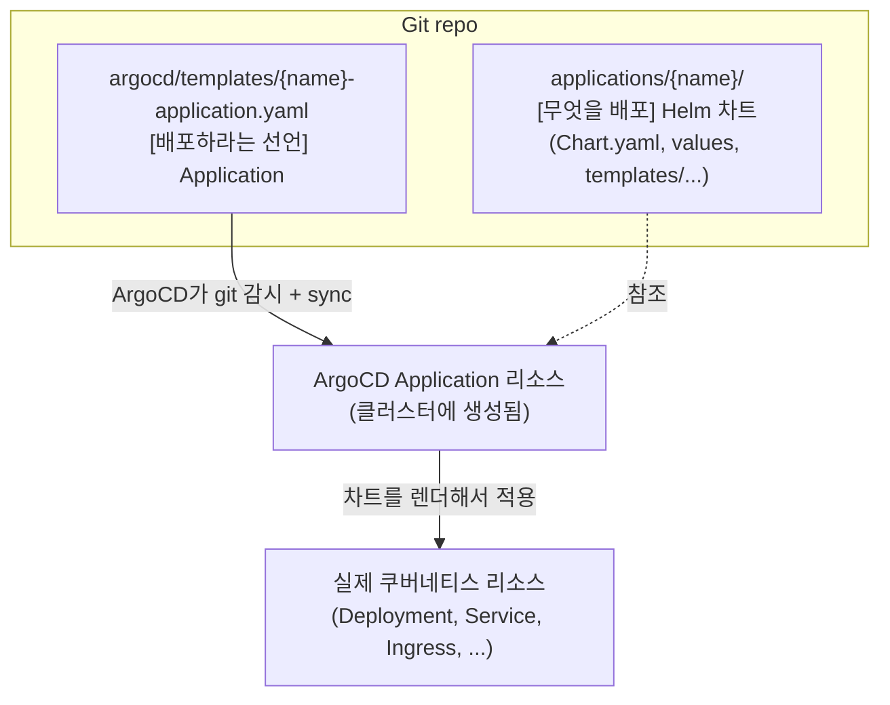

# Helm과 ArgoCD로 GitOps 하기 — chart, Application, 그리고 새 컴포넌트 추가 흐름

쿠버네티스에 새 컴포넌트(ingress controller 하나)를 추가하는 작업을 맡고 나서야, 그동안 "어딘가에서 알아서 배포되던" 그 과정의 구조를 처음 들여다봤다. Helm 차트가 뭐고, ArgoCD가 뭘 하고, Application이라는 게 왜 또 따로 있는지. 막상 정리해보니 큰 그림은 단순했다. 그 구조와, 실제로 새 컴포넌트를 추가하려면 어디서부터 손대야 하는지를 정리한다.

## 왜 이런 도구들이 필요한가

순수하게 하면, 쿠버네티스에 뭘 배포하려면 YAML(Deployment, Service, Ingress...)을 손으로 쓰고 `kubectl apply` 하면 된다. 그런데 실무에서 이 방식은 금방 무너진다.

- 환경(테스트/스테이징/운영)마다 값만 다르고 구조는 똑같은 YAML을 **중복**해서 관리해야 한다.
- 누가 언제 뭘 바꿨는지 **추적**이 안 된다. 누군가 `kubectl edit`으로 클러스터를 직접 고치면 기록이 안 남는다.
- 클러스터의 실제 상태와 "원래 의도했던 상태"가 **어긋나도** 알아챌 방법이 없다.

이 두 종류의 문제를 각각 푸는 게 **Helm**(중복·템플릿 문제)과 **ArgoCD**(추적·동기화 문제)다. 둘은 역할이 다르고, 같이 쓴다.

## Helm — 쿠버네티스 YAML의 템플릿 엔진

Helm은 **템플릿 + 값 → 최종 YAML**을 만들어주는 도구다. 매번 YAML을 손으로 쓰는 대신, 빈칸(`{{ }}`)이 뚫린 템플릿을 만들어두고 값만 갈아끼운다.

이 패키지 단위를 **Chart**라고 부른다. 차트 디렉터리 구조는 대략 이렇게 생겼다.

```
my-component/
├── Chart.yaml          # 차트 메타 + 의존성 선언
├── values.yaml         # 기본값 (모든 환경 공통)
├── alpha-values.yaml   # 환경별 오버라이드
└── charts/
    └── some-dependency-1.0.0.tgz   # 의존하는 외부 차트
```

각 파일의 역할:

- **`Chart.yaml`** — 차트 이름, 버전, 그리고 **의존성**. 남이 만든 차트(예: 공식 ingress-nginx)에 의존한다면 여기에 선언한다.
- **`values.yaml`** — 템플릿에 끼워넣을 **기본값**. `{{ .Values.foo }}`로 템플릿에서 참조한다.
- **`{stage}-values.yaml`** — 환경별로 **덮어쓸 값**. Helm은 `-f values.yaml -f alpha-values.yaml`처럼 여러 값 파일을 주면 **뒤가 앞을 덮어쓴다.** 그래서 공통값은 `values.yaml`에 두고, 환경마다 다른 부분만 `{stage}-values.yaml`에 둔다.
- **`charts/`** — 의존하는 외부 차트를 압축 파일로 담아둔다(vendoring). 인터넷에서 매번 받아오는 대신 레포에 박아두는 방식이다.

### 두 가지 차트 패턴 — 이 차이가 핵심

차트를 만드는 방식에는 두 갈래가 있다. 둘 다 실무에서 쓴다.

| 패턴 | 방식 | `templates/` |
|---|---|---|
| **의존 차트 재사용** | 남이 만든 차트(공식 ingress-nginx 등)를 가져와 **설정값만** 준다 | 없음 |
| **직접 templates 작성** | 내 Deployment/Service/Ingress를 **직접 템플릿으로** 쓴다 | 있음 |

- ingress controller처럼 **이미 잘 만들어진 공식 차트가 있으면**, 그걸 의존성으로 두고 `values`로 설정만 조정한다. 이때는 내가 쓸 YAML이 없으니 `templates/` 폴더가 없다.
- 반대로 **내 애플리케이션**은 공식 차트가 없으니, `templates/` 안에 `deployment.yaml`, `service.yaml`, `ingress.yaml`을 직접 템플릿으로 쓴다.

`templates/` 안의 파일이 바로 `{{ .Values.foo }}` 빈칸이 뚫린 YAML이고, 거기에 values를 끼워 최종 매니페스트가 만들어진다. 이 렌더링 결과를 미리 확인하는 명령이 `helm template`인데, 이게 배포 전 검증의 핵심이다(뒤에서 다시 나온다).

## ArgoCD — git을 정답으로 삼는 GitOps

Helm이 YAML을 만들어준다면, ArgoCD는 그 YAML을 **언제 어떻게 클러스터에 반영할지**를 맡는다. 핵심 사상은 GitOps다.

**git에 적힌 상태 = 클러스터가 있어야 할 상태.** ArgoCD는 git을 계속 감시하다가, 클러스터가 git과 다르면 **sync**로 맞춘다. 그래서:

- git이 **single source of truth**가 된다. 클러스터를 `kubectl`로 직접 고치는 게 아니라, **git을 고치고 sync**한다. 모든 변경이 git 커밋으로 남으니 추적이 된다.
- sync 정책은 두 가지다. **auto-sync**는 git이 바뀌면 자동 반영하고, **manual sync**는 사람이 sync 버튼을 눌러야 반영한다. 중요한 인프라는 manual로 두는 경우가 많다. git에 머지됐다고 바로 배포되는 게 아니라, 사람이 한 번 더 확인하고 누르는 안전장치인 셈이다.

## ArgoCD Application — "이 차트를 배포해라"는 선언

ArgoCD에게 **어느 git의 / 어느 경로 차트를 / 어느 값으로 / 어느 클러스터·namespace에 배포할지**를 알려주는 리소스가 **Application**이다. 대략 이렇게 생겼다.

```yaml
kind: Application
spec:
  source:
    repoURL: https://.../my-repo.git        # 어느 git
    path: applications/my-component          # 어느 차트
    helm:
      valueFiles:
        - values.yaml
        - alpha-values.yaml                  # 어느 값
  destination:
    namespace: my-component                  # 어느 namespace
```

여기서 한 가지 헷갈렸던 게 있다. **배포할 내용(차트)과 배포하라는 선언(Application)은 별개**라는 점이다. 차트만 있고 Application이 없으면 ArgoCD는 그 차트의 존재를 모른다. 둘 다 있어야 동작한다.

### app-of-apps 패턴

레포 구조를 보다가 영리한 패턴을 하나 발견했다. **`argocd/` 디렉터리 자체가 하나의 Helm 차트**이고, 그 `templates/` 안에서 **여러 개의 Application을 찍어낸다.**

```
argocd/templates/
├── ingress-nginx-application.yaml        # 사설 controller 배포 선언
├── app-application.yaml                  # 앱들 배포 선언
└── my-component-application.yaml         # 내가 추가한 선언
```

이걸 **app of apps**라고 부른다. Application들을 만들어내는 상위 Application이다. 그래서 새 컴포넌트를 추가할 때는 여기에 Application 하나를 더 얹으면 된다.

## 전체 관계도

지금까지를 한 그림으로 묶으면 이렇다.



두 갈래만 기억하면 된다. **배포할 내용(차트)은 `applications/`에, 배포하라는 선언(Application)은 `argocd/templates/`에.** 둘 다 있어야 한 컴포넌트가 동작한다.

## 새 컴포넌트를 추가한다면 — 어디서 시작하나

내가 실제로 ingress controller를 하나 추가하며 밟은 단계를 정리하면, 비슷한 컴포넌트를 추가할 때 이대로 따라가면 된다.

**차트 만들기 (`applications/{name}/`)**
- 디렉터리를 만든다.
- `Chart.yaml`을 쓴다. 공식 차트에 의존한다면 `dependencies`에 명시한다.
- 의존 차트를 `charts/`에 압축 파일로 둔다. (기존에 쓰던 걸 복사하면 된다.)
- `values.yaml`에 공통 설정을 쓴다.
- `{stage}-values.yaml`에 환경별로 다른 부분만 쓴다.

**ArgoCD Application 추가 (`argocd/templates/{name}-application.yaml`)**
- 기존 Application 파일 하나를 복사해서 고친다.
- `path`(차트 위치), `namespace`(배포 대상), `valueFiles`를 지정한다.
- 리소스 생성 순서가 중요하면 `sync-wave`로 순서를 제어한다.

**로컬 렌더 검증 — 배포 전 필수**
- `helm template {name} . -f values.yaml -f alpha-values.yaml`로 렌더해서, **실제로 어떤 YAML이 나오는지 눈으로 확인**한다.
- 나는 이 단계에서 의도대로 리소스가 분리되는지를 확인했다. 이 단계를 건너뛰면, 잘못된 YAML이 클러스터에 가서야 문제가 드러난다. 미리 보는 비용이 훨씬 싸다.

**git에 반영**
- 브랜치 → commit → PR → 머지. GitOps라 **git에 들어가야 ArgoCD가 인식**한다.

**ArgoCD에서 sync**
- manual sync라면 사람이 sync를 눌러야 실제로 배포된다.
- sync 후 `kubectl get`으로 실제로 떴는지 확인한다.

여기까지 밟고 나서 잡힌 감각은 이거다. **내가 만들 건 결국 차트(`applications/`)와, 그걸 배포하라는 Application(`argocd/templates/`) 두 개다. 그리고 클러스터에 손대기 전에 `helm template`로 먼저 눈으로 확인하고, git을 통해서만 배포한다.** 이 흐름만 잡으면 새 컴포넌트 추가는 거의 같은 패턴의 반복이었다.

## 관련 글

- [쿠버네티스 핵심 객체 4종](./k8s-core-objects.md) — 차트가 만들어내는 Pod/Service/Ingress가 뭔지
- [ingress-nginx 운영에서 부딪힌 디테일들](./ingress-nginx-operations.md) — 이 흐름으로 실제 추가한 컴포넌트의 운영 디테일

## 참고 링크

- [Helm 공식 문서](https://helm.sh/docs/)
- [Argo CD 공식 문서](https://argo-cd.readthedocs.io/)
- [Argo CD — App of Apps 패턴](https://argo-cd.readthedocs.io/en/stable/operator-manual/cluster-bootstrapping/)
