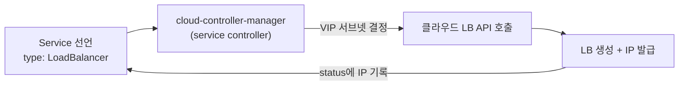
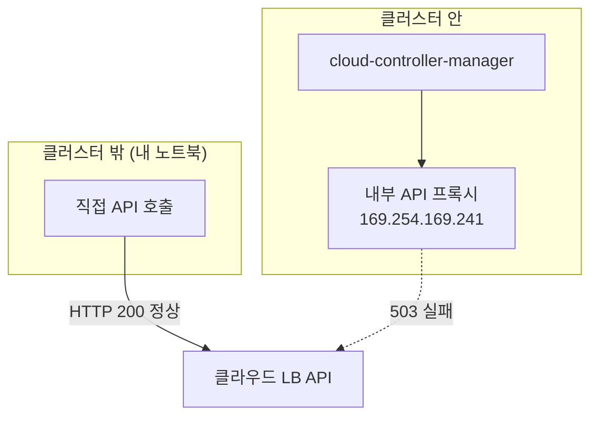

# 선언한 LoadBalancer가 안 만들어질 때 — cloud-controller-manager 장애 격리 진단기

> [외부 트래픽은 어떻게 Pod까지 닿는가](./external-traffic-path.md)를 먼저 읽으면 좋다. 그 글이 "LoadBalancer 타입 Service를 선언하면 클라우드가 LB를 만들어준다"까지 다뤘다면, 이 글은 **선언했는데 안 만들어질 때** 어디서부터 파고드는지를 다룬다.

공인 진입점 전환 작업에서 외부 전용 ingress-nginx controller를 배포했다. controller Pod는 정상으로 떴는데, LoadBalancer 타입 Service의 EXTERNAL-IP가 `<pending>`에서 움직이지 않았다.

```
NAME                        TYPE           CLUSTER-IP      EXTERNAL-IP   PORT(S)
ingress-nginx-controller    LoadBalancer   10.254.16.125   <pending>     80:31804/TCP,443:32031/TCP
```

10분을 기다려도 그대로였다. 나는 이날 pending 하나를 따라가면서, LB가 실제로 누구 손에서 만들어지는지, 그리고 관리형 쿠버네티스에서 장애를 "내 영역 / 플랫폼 영역"으로 가르는 방법을 배웠다.

## LB는 쿠버네티스가 만드는 게 아니다

`type: LoadBalancer`를 선언하면 쿠버네티스 자체가 LB를 만들 것 같지만, 쿠버네티스 코어에는 그런 능력이 없다. 실제 작업은 **cloud-controller-manager** 안의 service controller가 한다. Service 변경을 감시하다가 LoadBalancer 타입을 발견하면 클라우드 API를 호출해서 실제 LB 장비를 만들고, 발급된 IP를 Service의 status에 되써준다.

내가 쓰는 관리형 쿠버네티스(NHN Cloud NKS)는 OpenStack 기반이라, 이 역할을 openstack-cloud-controller-manager(occm)가 맡는다.



이 구조를 알면 진단 방향이 잡힌다. `<pending>`이라는 건 **이 체인 어딘가에서 멈췄다**는 뜻이고, 멈춘 지점을 찾는 게 진단이다.

## 진단의 시작은 이벤트다

첫 번째로 볼 곳은 Service의 Events다.

```bash
kubectl -n ingress-nginx describe svc ingress-nginx-controller
```

```
Warning  SyncLoadBalancerFailed  service-controller
  Error syncing load balancer: failed to ensure load balancer:
  no subnet-id for service ingress-nginx/ingress-nginx-controller :
  subnet-id not set in cloud provider config,
  and failed to find subnet-id from OpenStack:
  The service is currently unable to handle the request due to a temporary
  overloading or maintenance. This is a temporary condition. Try again later.
```

에러 메시지가 길지만, 뜯어보면 두 개의 실패가 겹쳐 있다.

- cloud provider 설정 파일에 subnet-id가 없다.
- 그래서 OpenStack API로 자동 조회를 시도했는데, 그 조회가 503으로 실패했다.

여기서 occm이 LB를 만들기 전에 **VIP를 둘 서브넷부터 결정해야 한다**는 걸 알게 됐다. 그 결정 순서는 이렇다.

1. Service의 `loadbalancer.openstack.org/subnet-id` annotation
2. cloud provider 설정 파일(cloud-config)의 subnet-id
3. 둘 다 없으면 OpenStack API로 자동 조회

내 클러스터는 1, 2가 모두 비어 있어서 3에 의존하고 있었고, 그 3이 죽어 있었다. 그렇다면 1번 경로로 서브넷을 직접 알려주면 자동 조회 의존을 끊을 수 있다.

참고로 cloud-config는 kube-system의 secret으로 들어 있는 경우가 많아서, 이렇게 직접 확인했다.

```bash
kubectl -n kube-system get secret cinder-csi-cloud-config -o json \
  | jq -r '.data["cloud-config"]' | base64 -d
```

## 서브넷 UUID는 어떻게 알아내나

annotation에 넣을 값은 서브넷의 UUID다. 나는 두 가지 사실을 대조해서 찾았다. 아래 IP와 UUID는 구조만 같은 예시 값이다.

먼저 클러스터가 실제로 쓰는 IP를 확인한다. 노드 IP와, 이미 잘 동작하고 있는 기존 사설 LB의 VIP가 단서다.

- 노드 IP: `10.0.10.25` (`kubectl get nodes -o wide`)
- 기존 사설 LB VIP: `10.0.10.80` (기존 LoadBalancer Service의 EXTERNAL-IP)

다음으로 테넌트의 서브넷 목록을 클라우드 API로 조회한다.

| CIDR | 이름 | 포함 범위 |
|---|---|---|
| `10.0.10.0/25` | DMZ | .0 부터 .127 — 노드도 기존 VIP도 여기 |
| `10.0.10.128/26` | INT | .128 부터 .191 |
| `10.0.10.192/26` | DB | .192 부터 .255 |

노드와 기존 LB가 모두 들어 있는 `10.0.10.0/25`가 클러스터 서브넷이고, 그 행의 UUID를 annotation에 넣으면 된다.

```yaml
service:
  annotations:
    loadbalancer.openstack.org/subnet-id: "a9c40f34-0000-0000-0000-000000000000"
```

이 클러스터는 GitOps로 관리하고 있어서 values 파일에 넣고 PR과 수동 sync로 반영했다. 이 반영 흐름은 [Helm과 ArgoCD로 GitOps 하기](./helm-argocd-gitops.md)에 정리해 뒀다.

## 에러 메시지가 바뀌면 그것도 진전이다

annotation 반영 후에도 LB는 안 만들어졌다. 하지만 에러가 바뀌었다.

```
Error syncing load balancer: failed to ensure load balancer:
error getting loadbalancer for Service ingress-nginx/ingress-nginx-controller:
The service is currently unable to handle the request due to a temporary
overloading or maintenance.
```

"no subnet-id"가 사라졌다. 서브넷 결정 단계는 통과했고, 이제 그다음 단계인 LB 조회 호출에서 같은 503을 받는 것이다. 결과만 보면 여전히 실패지만, **실패 지점이 앞으로 이동했다는 것 자체가 조치가 유효했다는 증거**다. 트러블슈팅에서 에러 메시지의 변화를 추적하는 습관이 왜 중요한지 체감한 순간이었다.

그리고 이 시점에서 의심이 하나로 좁혀졌다. 서브넷 조회도 503, LB 조회도 503 — 특정 API가 아니라 **occm이 클라우드 API로 나가는 길 자체**가 문제 아닌가?

## 안과 밖에서 같은 API를 두드려 격리한다

이 가설을 확인하려고 같은 클라우드 API를 클러스터 **밖**에서 직접 호출해 봤다. 테넌트 자격증명으로 identity 토큰을 받아서 LB 목록을 조회하는 것이다.

```bash
# 개념 설명용으로 축약 (실제는 identity API로 토큰 발급 후 호출)
curl -H "X-Auth-Token: $TOKEN" \
  https://<region>-api-network.example.com/v2.0/lbaas/loadbalancers
```

결과는 HTTP 200. 기존 LB 목록이 멀쩡히 조회됐고, 생성 시도가 실패하며 남긴 LB도 없었다. 클라우드의 LB 서비스 자체는 정상이라는 뜻이다.



같은 목적지를 두 경로로 두드렸는데 밖은 되고 안은 안 된다. 그러면 문제는 클라우드 서비스가 아니라 **클러스터 안에서 클라우드 API로 나가는 내부 경로**에 있다.

## 내부 경로의 정체 — 메타데이터 프록시와 trust 인증

cloud-config를 다시 보면 내부 경로의 구조가 보인다.

```ini
[Global]
auth-url=http://169.254.169.241/v3
user-id=...
trust-id=...
```

두 가지가 눈에 띈다.

- auth-url이 공인 API 주소가 아니라 link-local 대역의 **내부 프록시**다. 클러스터 안 컴포넌트는 이 프록시를 거쳐 클라우드 API에 나간다.
- password가 없고 **trust-id**가 있다. trust는 OpenStack keystone의 위임 인증으로, "이 클러스터가 사용자를 대신해 API를 호출해도 된다"는 위임장이다. 관리형 쿠버네티스가 사용자 비밀번호를 저장하지 않고 클라우드 리소스를 조작할 수 있는 이유가 이것이다.

그리고 결정적인 방증을 찾았다. 같은 프록시와 trust 인증을 쓰는 다른 컴포넌트인 csi-cinder-controllerplugin(볼륨 연동 담당)을 보니, 토큰 발급에서 403을 받으며 **57일째 CrashLoopBackOff** 상태였다.

```
Failed to GetOpenStackProvider: Request forbidden:
[POST http://169.254.169.241/v3/auth/tokens], error message:
{"error":{"code":403,"message":"You are not authorized to perform the requested action."}}
```

occm의 503과 csi의 403 — 에러 코드는 다르지만 둘 다 같은 내부 인증 경로 위에 있다. 이 클러스터는 내부에서 클라우드 API로 나가는 길이 꽤 오래전부터 죽어 있었고, LB를 새로 만들려는 순간에야 그게 드러난 것이다.

> 같은 인증 경로를 공유하는 **다른 컴포넌트의 상태**는 강력한 방증이다. 내 워크로드에서 재현하기 어려운 장애도, 옆 컴포넌트의 로그가 대신 증언해 준다.

## 여기서부터는 플랫폼의 영역이다

trust 인증과 내부 프록시는 관리형 쿠버네티스의 control plane 영역이라 사용자가 직접 고칠 수 없다. 내 쪽에서 할 수 있는 조치(서브넷 명시)는 끝났고, 나머지는 증거를 정리해 클라우드 지원 채널에 넘기는 게 맞다고 판단했다.

**(후속)** 문의 결과 원인은 클러스터 생성자 계정의 권한 상실로 확인됐고, 신원 모델 전환으로 해결했다. 전말과 배운 것은 [관리형 클러스터는 누구의 권한으로 클라우드를 만지는가](./managed-cluster-identity-trust.md)에 이어서 정리했다.

미해결 상태로 글을 남기는 이유는, 이번에 얻은 **진단 절차 자체가 결과와 무관하게 재사용 가능**하기 때문이다.

## LB pending 진단 체크리스트

다음에 또 `<pending>`을 만나면 이 순서로 내려갈 것이다.

1. `kubectl describe svc`로 Events를 본다 — 에러 메시지에서 **어느 단계**(서브넷 결정, LB 생성, LB 조회, 인증)에서 멈췄는지 읽는다.
2. 조치 후에는 에러 메시지가 **바뀌었는지**를 본다 — 같은 실패라도 지점이 이동했으면 진전이다.
3. 같은 클라우드 API를 클러스터 밖에서 직접 호출한다 — 플랫폼 장애인지 클러스터 내부 경로 문제인지 갈린다.
4. 같은 인증 경로를 쓰는 다른 컴포넌트(csi 등)의 상태를 본다 — 방증이 쌓이면 원인 범위가 좁아진다.
5. 관리형 경계를 넘는 원인이면 증거(이벤트 로그, 격리 결과, 방증)를 묶어 플랫폼에 문의한다.

## 지금 보면

이 클러스터는 2년 넘게 LB를 새로 만들 일이 없었다. 안 쓰는 경로는 죽어 있어도 아무 증상이 없다가, 쓰는 순간에야 드러난다. csi가 57일 동안 재시작 1만 6천 번을 찍는 동안 아무도 몰랐던 것도 같은 이유다 — 볼륨을 쓰는 워크로드가 없으니 아픈 데가 없었다.

돌아보면 "장애가 없다"와 "경로가 살아 있다"는 다른 명제였다. 평소 안 쓰는 의존 경로는 주기적으로 두드려 보거나, 최소한 코어 컴포넌트의 CrashLoopBackOff 정도는 알림으로 잡았어야 했다. 이번 작업이 끝나면 그 감시부터 챙길 생각이다.

## 관련 글

- [외부 트래픽은 어떻게 Pod까지 닿는가](./external-traffic-path.md) — LB와 Ingress Controller의 역할 분리
- [ingress-nginx 운영에서 부딪힌 디테일들](./ingress-nginx-operations.md) — 외부 전용 controller 구성 시 webhook, whitelist
- [Helm과 ArgoCD로 GitOps 하기](./helm-argocd-gitops.md) — annotation을 values로 반영한 GitOps 흐름

## 참고 링크

- [Exposing applications using services of LoadBalancer type — cloud-provider-openstack 공식 문서](https://github.com/kubernetes/cloud-provider-openstack/blob/master/docs/openstack-cloud-controller-manager/expose-applications-using-loadbalancer-type-service.md)
- [Cloud Controller Manager — Kubernetes 공식 문서](https://kubernetes.io/docs/concepts/architecture/cloud-controller/)
- [Trusts — OpenStack Keystone 공식 문서](https://docs.openstack.org/keystone/latest/user/trusts.html)
