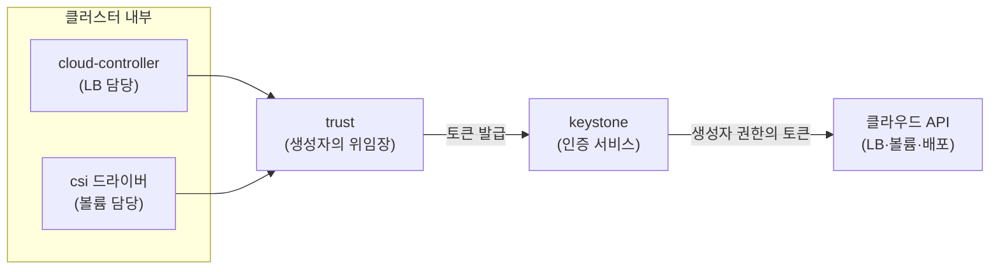

# 관리형 클러스터는 누구의 권한으로 클라우드를 만지는가 — trust 단절과 service user 전환

> [선언한 LoadBalancer가 안 만들어질 때](./loadbalancer-pending-diagnosis.md)의 후속 편이다. 그 글에서 "클러스터 내부 인증 경로가 죽었다"까지 격리해 놓고 플랫폼 문의로 넘겼는데, 답이 왔고 원인은 예상보다 훨씬 사람 냄새 나는 것이었다. **클러스터를 만든 사람의 권한이 사라져 있었다.**

관리형 쿠버네티스에서 LB 발급, 볼륨 생성, 클러스터 업그레이드가 몇 달에 걸쳐 하나씩 죽어 가는 장애를 겪었다. 최종 원인은 코드도 네트워크도 아닌 **클러스터의 신원(identity) 모델**이었다. 이 글은 그 모델 — 위임 인증(trust)과 service user — 을 이해한 기록이다.

## 클러스터는 내 비밀번호를 모른다 — 그래서 위임장이 필요하다

관리형 쿠버네티스 클러스터는 운영 중에 계속 클라우드 API 를 호출한다. LoadBalancer 타입 Service 를 만들면 LB API 를, PVC 를 만들면 블록 스토리지 API 를, 업그레이드하면 VM 배포 API 를 부른다. 그런데 이 호출에는 인증이 필요하고, 클러스터가 내 비밀번호를 저장해 둘 수는 없다.

OpenStack 계열 클라우드는 이 문제를 keystone 의 **trust** 로 푼다. 클러스터를 만들 때 인증 서비스가 위임장을 한 장 발급한다 — "이 클러스터(trustee)는 생성자(trustor)를 대신해, 생성자가 가진 권한 범위 안에서 API 를 호출할 수 있다." 클러스터 안의 컴포넌트들은 이 trust 로 토큰을 발급받아 클라우드를 조작한다. 비밀번호 없이 권한만 빌려 쓰는 구조다.

여기까지는 합리적인 설계다. 문제는 위임장의 수명이다.

## 위임장은 사람에 묶인다 — 생성자가 떠나면 클러스터의 손발이 묶인다

trust 는 "생성자가 가진 권한을 빌려주는" 구조라서, **생성자(trustor)가 그 프로젝트의 권한을 잃으면 위임장도 무효가 된다.** 퇴사, 팀 이동, 권한 정리 — 어떤 이유든 생성자 계정에서 프로젝트 역할이 회수되는 순간, 그 사람 이름으로 발급된 위임장으로는 더 이상 토큰이 나오지 않는다.

내 사례가 정확히 이거였다. 클러스터 상세를 조회해 보니 생성자 user_id 가 지금 운영하는 계정과 달랐고(만든 지 2년 넘은 클러스터였다), 플랫폼 지원의 답변도 한 줄이었다: "클러스터 생성 사용자에게 적절한 권한이 없는 상태입니다."

무서운 점은 **깨지는 방식**이다. 권한이 회수되는 순간 눈에 보이는 장애가 터지는 게 아니라, 클라우드 API 를 호출하는 시점에만 하나씩 조용히 실패한다.

| 시점 | 증상 | 정체 |
| --- | --- | --- |
| 권한 회수 직후 | 플랫폼 health 데이터 갱신 정지 | 상태 수집도 trust 기반이라 즉시 중단 |
| 몇 주 뒤 | csi 드라이버 403 CrashLoopBackOff | 파드가 재시작되며 토큰 재발급 시도 → 거부 |
| 몇 달 뒤 | 새 LB 발급 503, 기존 LB 갱신도 실패 | 새 클라우드 리소스가 필요해진 순간 발각 |
| 업그레이드 시도 | master 노드 무응답으로 2회 연속 실패 | 배포 채널도 같은 인증 경로 |

볼륨을 안 쓰고 LB 를 새로 안 만드는 동안은 아무도 모른다. "장애가 없다"와 "인증이 살아 있다"는 다른 명제라는 걸, 전편에 이어 한 번 더 확인했다.

## service_user_enabled: False — 고장 표시가 아니라 세대 표시

진단 중에 클러스터 라벨에서 `service_user_enabled: "False"` 를 발견하고 한참 헤맸다. 처음엔 "뭔가 꺼져 있어서 고장났나" 싶었는데, 반대였다. 이 라벨은 고장 여부가 아니라 **클러스터가 어느 세대의 신원 모델을 쓰는지**를 표시한다.

- `False` — 구세대. 생성자 개인의 trust 로 동작한다. 이 클러스터가 만들어질 당시의 유일한 방식이었다.
- `True` — 신세대. **service user**, 즉 플랫폼(NKS)이 서비스 수준에서 관리하는 내부 계정의 권한으로 동작한다. 특정 사람에게 묶이지 않는다.

플랫폼도 trust 모델의 사람 의존 문제를 알고 세대 교체를 한 것이다. 새로 만드는 클러스터는 service user 로 시작하지만, 구세대 클러스터는 명시적으로 전환하기 전까지 계속 생성자 trust 에 의존한다. 우리 클러스터의 False 는 "갑자기 꺼진" 게 아니라 **처음부터 False 였고, 생성자 권한이 살아 있는 동안은 문제가 드러나지 않았을 뿐**이다.

## 해결 버튼의 이름이 "키페어 변경"이었다

플랫폼 지원이 알려준 해결책은 의외였다: "키페어 변경 기능을 실행한 후 다시 시도해 주세요."

키페어는 노드 VM SSH 접속용 키인데 이게 인증 장애와 무슨 상관인가 싶지만, NHN Cloud NKS 의 키페어 변경 기능은 실제로 두 가지를 수행한다.

1. 워커 노드 VM 의 SSH 키페어를 선택한 것으로 교체 (이름 그대로의 기능)
2. **클러스터를 생성자 trust 모델에서 service user 모델로 전환** (문서를 읽어야 알 수 있는 기능)

공식 문서의 표현은 이렇다 — "일반 사용자가 오너로 설정된 클러스터는 키페어 변경 기능을 통해 서비스 사용자의 권한으로 동작하도록 변경할 수 있습니다." 즉 이 버튼이 사실상 **신원 모델 마이그레이션 버튼**이다. 실행하려면 실행자 본인 소유의 키페어와 프로젝트 ADMIN 권한이 필요하다 (키페어는 프로젝트+사용자 단위 리소스라, 남의 키페어는 목록에 뜨지 않는다).

실행 결과는 극적이었다. 완료 직후 `service_user_enabled` 가 `True` 로 바뀌었고, 몇 달간 죽어 있던 것들이 연쇄적으로 살아났다.

- 3월부터 정지돼 있던 health 데이터가 갱신을 재개했다 (ROTTEN → FRESH)
- 57일간 재시작 1만 6천 번을 찍던 csi 드라이버가 Running 으로 돌아왔다
- 몇 시간째 pending 이던 공인 LB 에 IP 가 발급됐다
- 2회 연속 실패하던 업그레이드가 진행되기 시작했다

증상이 네 개면 원인도 네 개일 것 같지만, 신원이 하나 풀리자 전부 풀렸다. **여러 컴포넌트가 동시에 이상하면 각각을 고치려 들기 전에 공유하는 의존성(인증·네트워크 경로)부터 의심하라**는 오래된 격언 그대로였다.

## 사람에 묶인 인프라 의존성 — 점검 질문

이번 일로 얻은 재사용 가능한 질문은 이것이다. 우리 인프라에서 **특정 개인의 계정이 사라지면 무엇이 멈추는가?**

- 관리형 클러스터의 생성자/오너는 누구인가? 그 사람이 아직 프로젝트에 있는가?
- 구세대 신원 모델(개인 trust)로 도는 클러스터가 있는가? 라벨(`service_user_enabled` 류)로 확인했는가?
- CI 배포 토큰, 웹훅, 스케줄 작업의 소유자는 개인 계정인가 서비스 계정인가?
- 이런 의존이 깨졌을 때 **즉시 드러나는가, 다음 사용 시점에야 드러나는가?** 후자라면 주기 점검이 필요하다.

개인 의존을 발견하면 서비스 계정으로 옮기는 게 정석이고, 옮길 수 없다면 최소한 문서에 "이 클러스터는 X 계정에 묶여 있음"이라고 남겨야 한다. 그 문서 한 줄이 몇 달짜리 미스터리를 몇 분짜리 확인으로 바꾼다.

## 지금 보면

전편에서 "조용히 죽은 경로는 쓰는 순간에야 드러난다"고 썼는데, 이번 편의 교훈은 그 앞 단계다 — **경로가 죽는 원인 중에는 기술이 아니라 조직 이벤트(퇴사·권한 회수)도 있다.** 기술 모니터링은 csi crashloop 을 잡을 수 있지만, "이 클러스터의 신원이 어느 개인에게 묶여 있다"는 위험은 장애가 나기 전엔 어떤 대시보드에도 안 뜬다. 인프라 자산 목록에 "소유 신원" 컬럼을 하나 추가하는 것 — 이번에 배운 가장 싼 예방책이다.

## 관련 글

- [선언한 LoadBalancer가 안 만들어질 때](./loadbalancer-pending-diagnosis.md) — 이 장애를 "내부 인증 경로 단절"까지 격리해 간 진단 과정 (전편)
- [외부 트래픽은 어떻게 Pod까지 닿는가](./external-traffic-path.md) — 이 작업의 출발점인 공인 진입점 구성

## 참고 링크

- [Trusts — OpenStack Keystone 공식 문서](https://docs.openstack.org/keystone/latest/user/trusts.html)
- [NHN Kubernetes Service 사용 가이드 — 키페어 변경](https://docs.nhncloud.com/ko/Container/NKS/ko/user-guide/)
- [Cloud Controller Manager — Kubernetes 공식 문서](https://kubernetes.io/docs/concepts/architecture/cloud-controller/)
