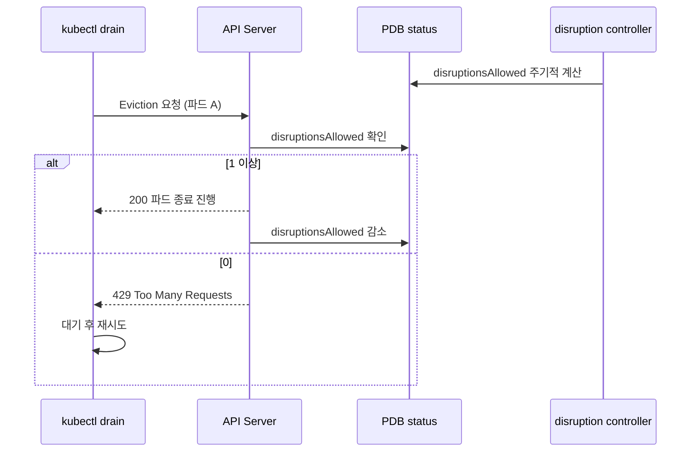

# 파드가 1개면 minAvailable 이 노드 교체를 막는다

> [Deployment · ReplicaSet · Pod](./deployment-pod.md)를 먼저 읽으면 좋다. 이 글에서 계산의 기준이 되는 "기대 파드 수"가 어느 층에서 나오는지 알고 있어야 한다.

관리형 쿠버네티스 클러스터의 버전을 올리다가 GPU 추론 서버가 전면 중단됐다. 노드 그룹 업그레이드는 노드를 하나씩 비우고 새 노드로 갈아 끼우는 작업이라, 파드가 옮겨 다니는 건 예상한 일이었다. 문제는 같은 서비스의 파드 두 개가 **같이** 내려간 것이다.

원인을 찾다 보니 클러스터에 PodDisruptionBudget 이 하나도 없었다. "이 서비스는 최소 몇 개는 살아 있어야 한다"를 아무도 선언하지 않았으니, 노드를 비우는 쪽에서는 파드를 전부 내려도 되는 줄 알았던 셈이다.

PDB 를 붙이는 건 5줄짜리 매니페스트다. 그런데 `minAvailable` 과 `maxUnavailable` 중 무엇을 쓰느냐가 **파드가 1개인 환경에서 정반대로 동작한다.** 한쪽은 노드 교체를 영구히 막고, 다른 쪽은 그냥 통과시킨다. 이 글은 그 차이가 어디서 나오는지, 그래서 무엇을 기준으로 골라야 하는지 정리한 기록이다.

## PDB 가 막는 것과 못 막는 것

PDB 는 **자발적 중단**만 다룬다. 이 구분을 놓치면 PDB 를 만능 안전장치로 오해한다.

| 종류 | 예 | PDB |
|---|---|---|
| 자발적 중단 | `kubectl drain`, 노드 그룹 업그레이드, 클러스터 오토스케일러의 노드 축소 | 막는다 |
| 비자발적 중단 | 노드 하드웨어 장애, 커널 패닉, OOM kill, 노드 네트워크 단절 | 막지 못한다 |

노드가 그냥 죽는 상황에 PDB 는 아무 힘이 없다. PDB 가 하는 일은 **누군가 정중하게 "이 파드 좀 내려도 되나"를 물어볼 때 아니라고 답하는 것**뿐이다. 그 질문이 eviction API 다.

## 판정은 disruptionsAllowed 에서 일어난다

PDB 매니페스트에 적는 `minAvailable` / `maxUnavailable` 은 선언이고, 실제 판정은 PDB 의 `status.disruptionsAllowed` 값으로 이뤄진다. disruption controller 가 이 값을 계산해 넣어두고, eviction 요청이 오면 그 값만 본다.



여기서 두 가지가 중요하다.

- **429 는 실패가 아니라 대기 신호다.** `kubectl drain` 은 429 를 받으면 포기하지 않고 재시도한다. 그래서 파드 하나가 새 노드에서 Ready 가 되면 자연히 다음 파드로 넘어간다. PDB 가 "한 번에 하나씩"을 만들어내는 방식이 이것이다.
- **거절당한 파드는 살아 있다.** eviction 이 429 를 받으면 그 파드는 종료되지 않는다. drain 이 멈춰 있는 것처럼 보이는 건 정상 동작이다.

`kubectl get pdb` 의 `ALLOWED DISRUPTIONS` 열이 바로 이 값이다. 운영 중 drain 이 진행되지 않으면 가장 먼저 볼 곳이다.

## 두 옵션의 계산식

같은 값을 계산하는데 식이 다르다.

```
minAvailable   → disruptionsAllowed = 건강한 파드 수 - minAvailable
maxUnavailable → disruptionsAllowed = maxUnavailable - 건강하지 않은 파드 수
```

`maxUnavailable` 식은 이렇게도 쓸 수 있다. 두 형태는 같은 값이다.

```
maxUnavailable → disruptionsAllowed = 건강한 파드 수 - (기대 파드 수 - maxUnavailable)
```

이 두 번째 형태가 왜 필요한지가 핵심이다. `maxUnavailable` 은 **기대 파드 수**를 알아야 계산된다. 그 값은 Deployment 나 StatefulSet 같은 컨트롤러의 `scale` 에서 온다. 그래서 컨트롤러 없이 직접 만든 파드에는 `maxUnavailable` 을 쓸 수 없다. `minAvailable` 은 건강한 파드 수만 세면 되니 그 제약이 없다.

## 파드 수에 따라 결과가 갈린다

같은 `1` 을 넣어도 파드 수에 따라 결과가 다르다.

| 파드 수 | `minAvailable: 1` | `maxUnavailable: 1` |
|---|---|---|
| 1개 | `1 - 1 = 0` → eviction 거절, drain 이 계속 대기 | `1 - 0 = 1` → eviction 허용, 그 파드는 내려간다 |
| 2개 | `2 - 1 = 1` → 하나씩 | `1 - 0 = 1` → 하나씩. 동일 |
| 4개 (HPA 로 늘어난 경우) | `4 - 1 = 3` → 동시에 3개까지 내려간다 | `1 - 0 = 1` → 여전히 하나씩 |

파드가 2개일 때는 둘이 같다. 대부분의 워크로드가 replica 2 라서, 이 구간만 보고 아무거나 골라도 된다고 판단하기 쉽다. 갈리는 건 양쪽 끝이다.

**파드가 늘어나는 쪽**에서는 `maxUnavailable` 이 더 강하게 보호한다. HPA 로 4개가 된 상황에서 `minAvailable: 1` 은 3개를 동시에 내려도 통과시킨다. 트래픽을 감당하려고 늘려놓은 파드가 한꺼번에 사라질 수 있다는 뜻이다. 이건 선언의 의도와 어긋난다. 처음에 `minAvailable: 1` 을 쓴 사람이 원한 건 "최소 1개"가 아니라 "한꺼번에 죽지 않기"였을 가능성이 높다.

## 파드 1개에서는 보호가 아니라 통과다

파드가 1개인 쪽이 이 글을 쓰게 만든 지점이다.

`minAvailable: 1` 을 걸면 `disruptionsAllowed` 가 0 이 되어 그 파드는 절대 축출되지 않는다. 노드를 비우려는 작업은 429 를 받고 계속 재시도한다. 파드를 옮길 여유 노드가 있든 없든 관계없다. 파드 수가 1 이면 축출 후 건강한 파드가 0 이 되고, 그건 `minAvailable: 1` 위반이기 때문이다.

여기서 오해하기 쉬운 게 있다. **이 상태는 "완벽한 보호"가 아니라 교착이다.** 노드 그룹 업그레이드가 그 파드 하나 때문에 끝나지 않는다. 클러스터 버전 지원 종료 기한이 걸려 있으면 이건 그냥 사고다.

반대로 `maxUnavailable: 1` 을 걸면 축출이 허용된다. 이쪽이 옳은 선택처럼 보이지만, 정확히 무슨 일이 일어나는지는 짚어야 한다. **그 파드는 보호받지 않는다.** 내려가고, 새 노드에서 다시 뜰 때까지 서비스가 없다. 쿠버네티스 공식 문서도 이 상황을 보호가 아니라 실질 100% 불가용으로 설명한다.

그러면 왜 `maxUnavailable` 을 고르나. 애초에 파드가 1개면 **지켜낼 여유분이 없다.** 하나를 내리지 않으면 노드 교체가 불가능하고, 내리면 서비스가 끊긴다. 둘 중 하나다. PDB 로 해결할 문제가 아니라 replica 를 늘려야 하는 문제다.

정리하면 이렇다.

- 파드 1개에 `minAvailable: 1` → 노드 교체를 영구히 막는다. 문제를 숨기는 게 아니라 다른 문제로 바꾼다.
- 파드 1개에 `maxUnavailable: 1` → 노드 교체는 진행되고 그 시간만큼 서비스가 없다. 상황을 정직하게 반영한다.
- 진짜 해결은 replica 를 2 이상으로 올리는 것이다.

공식 문서는 단일 인스턴스에 대해 PDB 를 아예 두지 않거나, `maxUnavailable: 0` 으로 잠근 뒤 유지보수 시점에 운영자가 협의해 PDB 를 지우는 방식을 제시한다. `maxUnavailable: 0` 은 `minAvailable: 1` 과 같은 교착을 만들지만, 잠갔다는 의도가 매니페스트에 드러나는 점이 다르다.

## 비율로 쓸 때의 올림 함정

`minAvailable` 과 `maxUnavailable` 은 `50%` 같은 비율도 받는다. 이때 양쪽 다 **올림**한다.

파드 7개에 `maxUnavailable: 50%` 를 걸면 `7 × 0.5 = 3.5` 를 올려 4개까지 내려갈 수 있다. 절반보다 많다. 비율로 적어놓고 "절반은 남는다"고 읽으면 틀린다.

파드 1개에 비율을 쓰면 더 극적이다. `maxUnavailable: 10%` 는 `1 × 0.1 = 0.1` 을 올려 1이 된다. 10% 라고 적었는데 100% 가 내려갈 수 있다. 비율은 파드 수가 충분히 클 때만 의도한 대로 동작한다.

## 노드 교체가 여유 노드를 먼저 만드는가

PDB 를 붙이기 전에 확인해야 할 게 하나 더 있었다. 내 워크로드에는 `podAntiAffinity` 가 `requiredDuringSchedulingIgnoredDuringExecution` 으로 걸려 있다. 같은 서비스의 파드는 서로 다른 노드에만 뜬다는 강제 조건이다.

노드 그룹이 2대이고 파드가 2개면 각 노드에 하나씩 있다. 이 상태에서 노드 하나를 비우면 그 파드는 어디로 가나. 남은 노드에는 이미 같은 서비스의 파드가 있어서 antiAffinity 때문에 못 들어간다. 새 노드가 생기지 않으면 파드는 Pending 에 머물고, PDB 는 그 파드가 Ready 가 아니니 다음 축출을 계속 거절한다. 교착이다.

그래서 관리형 쿠버네티스의 노드 그룹 업그레이드가 어떤 순서로 도는지 확인했다. 문서 본문에는 설명이 없었는데, CLI 의 업그레이드 파라미터가 답을 갖고 있었다.

- 비우는 노드에서 나온 파드를 받을 **여유 노드를 먼저 만드는 옵션**이 있고 기본값이 1이다. 작업이 끝나면 자동으로 지워진다.
- **한 번에 불가 상태로 둘 노드 수**를 정하는 옵션이 있고 기본값이 1이다.


여유 노드가 먼저 생기므로 antiAffinity 가 required 인 워크로드도 갈 자리가 있다. 그리고 노드가 1대씩만 빠지므로 PDB 가 "한 번에 하나씩"을 실제로 강제할 수 있다.

이 전제는 플랫폼마다 다르다. 관리형 서비스가 여유 노드를 만들지 않고 노드를 그 자리에서 갈아 끼우는 방식이라면, PDB 와 required antiAffinity 조합이 교착을 만들 수 있다. **PDB 를 붙이기 전에 내 플랫폼의 노드 교체 순서를 확인하는 게 순서다.** 나는 이걸 나중에 확인했는데, 순서를 바꿔야 했다.

## 그래서 무엇을 골랐나

전 컴포넌트에 `maxUnavailable: 1` 을 넣었다. 이유는 두 방향 모두에서 낫기 때문이다.

- 파드가 1개인 환경에서 노드 교체를 막지 않는다. 검증 환경의 GPU 추론 서버가 여기 해당한다. 비용 때문에 replica 1 로 두고 있고, 그 환경의 중단은 감수하기로 한 상태다.
- 파드가 HPA 로 늘어나는 환경에서 한 번에 하나씩만 내려간다.

값을 `1` 로 고정하고 비율을 쓰지 않은 것도 의도다. 위의 올림 함정을 피하고, 파드 수가 바뀌어도 "한 번에 하나"라는 의미가 변하지 않는다.

전면 중단의 원인을 다시 보면, 기동 시간이 길어서 벌어진 일이 아니었다. 추론 서버의 기동이 느린 건 사실이다.

- 컨테이너 이미지가 15GB 라 새 노드에서 내려받는 데만 6분 8초
- 그 뒤 모델을 메모리에 올리는 시간이 더 필요
- 기동 대기 설정은 최대 30분까지 허용

처음에는 이 긴 기동 시간이 원인이라고 봤다. 그러면 PDB 만으로는 부족하니 새 파드가 준비된 뒤 기존 파드를 내리는 별도 장치가 필요하다고 판단했다.

계산식을 따라가 보니 그게 아니었다. PDB 가 있으면 첫 파드가 Ready 가 될 때까지 두 번째 파드의 eviction 이 429 로 대기한다. 기동에 30분이 걸려도 그 30분 동안 첫 파드가 아직 안 떴을 뿐, 두 번째 파드는 살아 있다. **기동이 느린 게 문제가 아니라 순차성이 없었던 게 문제였다.** 노드 그룹 교체에 걸리는 시간은 그만큼 길어지지만, 그건 중단과 교환할 만한 비용이다.

이 판단을 바꾼 게 이 작업에서 가장 쓸모 있었던 부분이다. 증상만 보고 "기동이 느리니 더 복잡한 장치가 필요하다"로 갔으면 배포 전략을 손대는 큰 작업이 됐을 것이다. 계산식 두 줄을 확인하는 게 그걸 막았다.

## 언제 minAvailable 이 맞나

`maxUnavailable` 이 항상 정답은 아니다. `minAvailable` 이 의도를 더 정확히 표현하는 경우가 있다.

- **정족수가 있는 시스템.** etcd, ZooKeeper, Kafka 컨트롤러처럼 "N개 중 과반이 살아 있어야 쓰기가 가능한" 워크로드는 요구사항 자체가 최소 가동 수다. 5개 중 3개가 필요하면 `minAvailable: 3` 이 그대로 그 뜻이다. 이걸 `maxUnavailable: 2` 로 적으면 파드 수가 7개로 늘었을 때 5개가 남게 되어 의미가 달라진다.
- **컨트롤러 없는 파드.** `maxUnavailable` 은 기대 파드 수를 알아야 하므로 쓸 수 없다.
- **절대적인 최소 처리량이 있는 경우.** "이 서비스는 파드 2개 미만으로는 트래픽을 못 받는다"가 측정된 사실이라면 그 수를 `minAvailable` 로 적는 게 맞다.

기준은 이렇게 잡으면 된다. 몇 개는 반드시 살아 있어야 한다가 요구사항이면 **minAvailable**, 한꺼번에 죽지 않아야 한다가 요구사항이면 **maxUnavailable** 이다. 대부분의 무상태 웹 서비스는 후자다.

## 붙이기 전 점검 목록

다른 클러스터에 PDB 를 넣을 때 내가 다시 볼 목록이다.

- 이 워크로드의 최소 파드 수가 환경마다 다른가. 1인 환경이 있으면 `minAvailable` 은 교착을 만든다.
- HPA 를 쓰는가. 쓴다면 `minAvailable` 은 파드가 늘어날 때 보호가 느슨해진다.
- `podAntiAffinity` 가 required 인가. required 이면 노드 교체 중 파드가 갈 자리가 있는지 확인해야 한다.
- 플랫폼의 노드 교체가 여유 노드를 먼저 만드는가. 아니면 PDB 가 교착을 만들 수 있다.
- 비율 대신 정수를 쓸 수 있는가. 비율은 올림 때문에 의도보다 느슨해진다.
- 정족수가 필요한 워크로드인가. 그러면 `minAvailable` 이 맞다.

PDB 만으로 안 되는 것도 같이 적어둔다. 파드가 내려갈 때 처리 중인 요청을 흘리지 않으려면 종료 처리가 따로 필요하다. PDB 는 **언제 내려도 되는지**만 정하고, **어떻게 내려가는지**는 [OCR 서버 배포·스케일인 시 503 에러 수정](../../task/ai-service-team/graceful-shutdown-503-fix.md)에서 다룬 graceful shutdown 의 영역이다. 둘 다 있어야 노드 교체가 조용히 지나간다.

## 참고

- [Specifying a Disruption Budget for your Application](https://kubernetes.io/docs/tasks/run-application/configure-pdb/) — 계산식, 비율 올림 규칙, 단일 인스턴스 권장사항
- [Disruptions](https://kubernetes.io/docs/concepts/workloads/pods/disruptions/) — 자발적 중단과 비자발적 중단의 구분
- [API-initiated Eviction](https://kubernetes.io/docs/concepts/scheduling-eviction/api-eviction/) — eviction API 가 429 를 반환하는 조건
- [Kubernetes GPU 노드에서 /run tmpfs가 꽉 차서 Pod가 안 뜰 때](../../mlops/gpu-node-run-tmpfs-full.md) — 같은 GPU 노드 그룹에서 겪은 다른 문제
