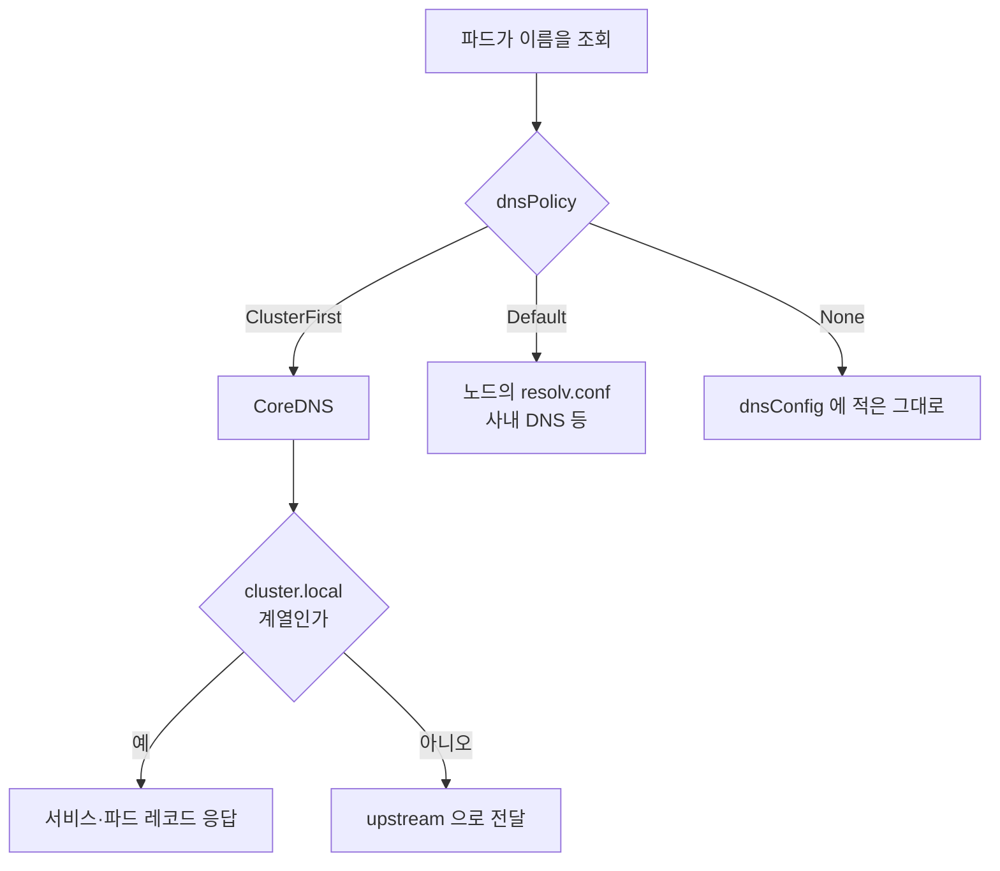

# 파드가 서비스 이름을 못 푸는 이유 — dnsPolicy 4종과 ndots

> [외부 트래픽은 어떻게 Pod까지 닿는가](./external-traffic-path.md)와 [IP whitelist가 조용히 뚫려 있었다](./client-ip-preservation.md)를 먼저 읽으면 좋다. 이 글은 그 다음 단계로, 클러스터 안에 있으면서도 서로를 밖으로 돌아 부르던 두 서버 이야기다.

관리자 서버가 API 서버를 호출하는데 403이 떨어졌다. 둘 다 같은 클러스터, 같은 네임스페이스에 떠 있다. 그런데 관리자 서버는 API 서버를 `http://api-service` 같은 내부 이름이 아니라 **공인 도메인으로 부르고 있었다.** 클러스터 밖으로 나갔다가 LoadBalancer와 Ingress를 거쳐 다시 들어오는 경로다.

왜 그렇게 짜여 있었나 확인해보니, 그 파드는 **서비스 이름을 아예 해석하지 못했다.** `curl http://api-service` 가 "Couldn't resolve host"로 죽는다. 원인은 배포 매니페스트 한 줄이었다.

```yaml
spec:
  dnsPolicy: "Default"
```

이 한 줄의 의미를 정확히 모르면 `Default`라는 이름 때문에 "기본값이겠거니" 하고 넘어가게 된다. **그런데 `Default`는 기본값이 아니다.** 이 글은 그 함정과, 쿠버네티스 DNS가 이름을 푸는 실제 절차를 정리한 기록이다.

가져갈 결론부터 적으면 두 가지다.

- **`dnsPolicy: Default`는 "기본값"이 아니라 "노드의 DNS를 그대로 쓴다"는 뜻이다.** 명시하지 않았을 때의 실제 기본값은 `ClusterFirst`다.
- **내부 통신을 공인 도메인으로 우회시키면 접근 제어가 무력화된다.** 요청이 밖에서 들어온 것처럼 보이기 때문이다.

## 증상 — 내부 전용 API가 내부 호출을 막았다

API 서버에는 관리자 전용 경로를 내부에서만 부를 수 있게 막는 인터셉터가 있었다. 요청의 출발지 IP가 사설 대역인지 확인하고, 아니면 403을 던진다.

```java
// 개념 설명용 의사코드 (실 구현은 축약)
ResolvedClientIp resolved = resolver.resolve(request);
if (!resolved.internal()) {
    throw new ForbiddenException(resolved.value());
}
```

관리자 서버는 분명 같은 클러스터 안에 있는데 이 검사에 걸렸다. 로그를 보면 요청이 API 서버까지 도달은 했고, 판정에서 떨어졌다.

```
ForbiddenException: [403 : Forbidden] 10.x.x.0
GET http://<공인-도메인>/api/ocr-admin/v1.0/user/list
```

호출 주소가 힌트였다. 내부 서비스 이름이 아니라 **공인 도메인**이다. 관리자 서버 → 공인 LoadBalancer → Ingress Controller → API 서버 순으로 한 바퀴 돌아 들어온다. 그 과정에서 출발지 IP가 SNAT으로 바뀌고, 프록시가 전달 헤더를 새로 쓴다.

판정이 걸린 지점은 여기가 맞았다. 다만 **정확히 무엇 때문에 걸렸는지는 한참 뒤에야 알았고, 내 처음 추측과 달랐다.** 그 이야기는 글 뒤쪽에 따로 적는다. 먼저 왜 이 경로로 부르게 됐는지가 이 글의 본론이다.

증명은 간단했다. 같은 요청을 Ingress를 거치지 않고 서비스 IP로 직접 던져봤다.

```bash
# Ingress 경유 — 403
curl "http://<공인-도메인>/api/ocr-admin/v1.0/user/list"
{"header":{"isSuccessful":false,"resultCode":403,"resultMessage":"Forbidden"}}

# 클러스터 내부 직접 — 성공
curl "http://10.x.x.x/api/ocr-admin/v1.0/user/list"
{"header":{"isSuccessful":true,"resultCode":0,"resultMessage":"SUCCESS"},"userList":[...]}
```

경로만 바꿨는데 결과가 갈렸다. 그러면 내부 이름으로 부르면 되는데, 그게 안 됐다.

```bash
curl "http://api-service/..."
# exit code 6 — Couldn't resolve host
```

## 파드의 resolv.conf를 열어보면 답이 나온다

DNS 문제는 추측하지 말고 `/etc/resolv.conf`를 직접 보는 게 가장 빠르다. 같은 클러스터의 두 파드를 비교했다.

```bash
# 문제의 파드 — dnsPolicy: Default
$ kubectl exec -n <ns> <pod> -- cat /etc/resolv.conf
search openstacklocal
nameserver 10.a.a.6
nameserver 10.a.a.7

# 옆 파드 — dnsPolicy 미지정 (ClusterFirst)
$ kubectl exec -n <ns> <other-pod> -- cat /etc/resolv.conf
search <ns>.svc.cluster.local svc.cluster.local cluster.local openstacklocal
nameserver 10.b.b.10
options ndots:5
```

차이가 분명하다.

- 위쪽은 **노드의 DNS 서버**를 그대로 물려받았다. 클러스터 DNS(CoreDNS)를 아예 모른다. `api-service` 같은 이름은 클러스터 DNS만 알고 있으므로 해석될 리가 없다.
- 아래쪽은 **CoreDNS**를 보고 있고, `svc.cluster.local` 계열 search 도메인과 `ndots:5` 옵션이 붙어 있다.

`dnsPolicy: Default`가 하는 일이 정확히 이것이다. 노드가 쓰는 `/etc/resolv.conf`를 파드에 그대로 복사한다.

## dnsPolicy 4종

공식 문서 기준으로 값은 네 개다. 이름과 실제 동작이 어긋나는 게 하나 있어서 그것부터 짚는다.

| 값 | 동작 | 서비스 이름 해석 |
| --- | --- | --- |
| `ClusterFirst` | **명시하지 않았을 때의 실제 기본값.** 클러스터 도메인(`cluster.local`) 이름은 CoreDNS가 처리하고, 나머지는 upstream으로 넘긴다 | 가능 |
| `Default` | 파드가 떠 있는 **노드의 DNS 설정을 그대로 물려받는다.** 이름과 달리 기본값이 아니다 | 불가 |
| `ClusterFirstWithHostNet` | `hostNetwork: true` 파드에서 클러스터 DNS를 쓰고 싶을 때 쓴다 | 가능 |
| `None` | 쿠버네티스가 주는 DNS 설정을 전부 무시한다. `dnsConfig`로 직접 다 채워야 한다 | `dnsConfig`에 넣기 나름 |

이름이 헷갈리는 지점을 한 번 더 정리하면 이렇다.

- `Default`는 "기본값"이 아니라 **노드 기본 설정**이라는 뜻이다.
- 아무것도 안 쓰면 `ClusterFirst`가 적용된다.

`ClusterFirstWithHostNet`이 따로 있는 이유도 알아둘 만하다. `hostNetwork: true`인 파드에 `ClusterFirst`를 주면 쿠버네티스가 조용히 `Default`처럼 동작시킨다. 호스트 네트워크를 쓰면서 클러스터 DNS도 쓰려면 이 값을 명시적으로 골라야 한다.



`ClusterFirst`가 외부 도메인을 못 푼다는 오해가 흔한데, 그렇지 않다. 클러스터 도메인이 아니면 upstream으로 넘기므로 외부 이름도 정상적으로 풀린다. 실제로 내가 두 방식에서 사내 도메인 해석을 대조해봤다.

| 조회 대상 | `Default` | `ClusterFirst` |
| --- | --- | --- |
| 사내 회원 API 도메인 | 200 | 200 |
| 사내 인증 API 도메인 | 404 (서버 응답) | 404 (서버 응답) |
| 퍼블릭 클라우드 권한 API | 404 | 404 |
| OAuth 토큰 발급 도메인 | 404 | 404 |
| 클러스터 서비스 이름 | **해석 실패** | **성공** |

여기서 404는 루트 경로가 없다는 서버의 응답이므로 **이름이 풀리고 연결까지 됐다는 증거**다. 해석 자체가 실패하면 curl은 exit 6으로 죽고 HTTP 코드가 아예 안 찍힌다. 둘을 구분하지 않으면 "404니까 실패"로 잘못 읽게 된다.

즉 `ClusterFirst`로 바꿔서 잃는 건 없고, 서비스 이름 해석이 추가로 생긴다.

## ndots — 왜 짧은 이름이 FQDN보다 빠른가

`resolv.conf`에 붙는 `options ndots:5`가 이 글에서 가장 헷갈렸던 부분이다.

`ndots:N`은 이렇게 동작한다. **조회하려는 이름에 든 점의 개수가 N보다 적으면, resolver는 그 이름을 절대 이름으로 보지 않고 search 도메인을 하나씩 붙여가며 먼저 시도한다.**

쿠버네티스의 기본값이 5인 이유는 서비스 짧은 이름을 편하게 쓰기 위해서다.

```
search <ns>.svc.cluster.local svc.cluster.local cluster.local openstacklocal
options ndots:5
```

`api-service`(점 0개)를 조회하면 이렇게 전개된다.

1. `api-service.<ns>.svc.cluster.local` → **성공.** 여기서 끝
2. (이하 시도 안 함)

한 번에 끝난다. 그런데 같은 대상을 FQDN으로 적으면 오히려 손해다. `api-service.<ns>.svc.cluster.local`은 점이 4개라 여전히 5보다 적다. 그래서 **절대 이름으로 먼저 묻지 않고 search 도메인부터 붙인다.**

1. `api-service.<ns>.svc.cluster.local.<ns>.svc.cluster.local` → NXDOMAIN
2. `api-service.<ns>.svc.cluster.local.svc.cluster.local` → NXDOMAIN
3. `api-service.<ns>.svc.cluster.local.cluster.local` → NXDOMAIN
4. `api-service.<ns>.svc.cluster.local.openstacklocal` → NXDOMAIN
5. `api-service.<ns>.svc.cluster.local` → 성공

조회가 5번으로 늘어난다. 내가 직접 재본 값이다.

```
ocr-api-service                            dns=0.0012s
ocr-api-service.<ns>.svc.cluster.local     dns=0.2561s
```

**FQDN이 짧은 이름보다 200배 느리다.** 직관과 반대라 처음엔 측정을 잘못한 줄 알았는데, 위 전개 과정을 따라가 보면 당연한 결과다.

사내 도메인처럼 점이 3개인 이름도 같은 문제를 겪는다. `api-cab.<내부-도메인>` 형태는 점이 3개라 search 4개를 먼저 훑고 나서야 진짜 조회에 도달한다. 클러스터 안에서 외부 API를 자주 호출하는 파드라면 매 호출마다 헛조회가 4번씩 붙는 셈이다.

이럴 때 쓰는 게 `dnsConfig`의 ndots 조정이다.

```yaml
spec:
  dnsPolicy: "ClusterFirst"
  dnsConfig:
    options:
      - name: ndots
        value: "1"
```

`ndots:1`이면 점이 1개 이상인 이름은 전부 절대 이름으로 먼저 조회한다. 외부 도메인 호출이 많은 파드에 유리하다. 대신 **서비스 짧은 이름(`api-service`, 점 0개)은 여전히 search를 타므로 클러스터 내부 통신도 그대로 동작한다.** 우리 클러스터의 다른 파드 하나가 이미 이 조합을 쓰고 있었는데, 이유를 이제야 이해했다.

주의할 점도 있다. `ndots`를 낮추면 **다른 네임스페이스의 서비스를 짧은 이름으로 부르던 코드가 깨질 수 있다.** `other-ns-service`처럼 점 없는 이름은 괜찮지만, `service.other-ns`(점 1개)로 부르던 곳은 `ndots:1`에서 절대 이름으로 먼저 조회돼 실패한다. 바꾸기 전에 코드에서 서비스 참조 형태를 훑어보는 게 안전하다.

## 언제 무엇을 쓰나

내가 정리한 판단 기준이다.

| 상황 | 선택 |
| --- | --- |
| 일반적인 애플리케이션 파드 | **지정하지 않는다.** 기본값 `ClusterFirst`가 맞다 |
| 클러스터 서비스를 부를 일이 전혀 없고, 노드의 특수 DNS만 써야 함 | `Default` — 다만 정말 그런지 의심해볼 것 |
| `hostNetwork: true`를 쓰면서 서비스 이름도 필요 | `ClusterFirstWithHostNet` |
| 외부 DNS 서버를 직접 지정해야 함 | `None` 과 `dnsConfig` 조합 |
| 외부 도메인 호출이 잦아 헛조회를 줄이고 싶음 | `ClusterFirst` 에 `dnsConfig` 로 `ndots` 낮추기 |

`Default`를 골라야 하는 상황은 생각보다 드물다. 우리 매니페스트에 `Default`가 박혀 있던 이유를 git 이력으로는 끝내 못 찾았는데, 아마 사내 DNS로만 풀리는 도메인이 있어서 그렇게 뒀을 것이라 짐작한다. 그런데 위 대조표에서 봤듯 `ClusterFirst`도 upstream으로 넘기므로 그 도메인들은 똑같이 풀린다. **가정이 한 번 검증되지 않은 채로 굳어 있었던 셈이다.**

## 잘못 두면 어디서 깨지나

이 설정이 틀렸을 때 나타나는 증상들을 정리해둔다. 바로 DNS를 의심하기 어려운 형태로 나타나는 게 문제다.

- **서비스 이름 해석 실패** — `Couldn't resolve host`, `UnknownHostException`. 가장 알기 쉬운 형태다.
- **내부 통신이 밖으로 우회** — 이번 사례다. 이름을 못 푸니 개발자가 공인 도메인을 박아둔다. 동작은 하므로 문제로 인식되지 않다가, **출발지 IP 기반 접근 제어가 들어오는 순간 403으로 터진다.** 원인과 증상 사이가 멀어서 추적이 오래 걸린다.
- **불필요한 외부 트래픽과 지연** — 클러스터 안에서 끝날 호출이 LoadBalancer를 왕복한다. 지연이 늘고 LB 비용도 붙는다.
- **조용한 성능 저하** — `ndots` 때문에 매 호출마다 NXDOMAIN이 몇 번씩 쌓인다. 개별 요청은 밀리초 단위라 눈에 안 띄지만 호출량이 많아지면 CoreDNS 부하로 돌아온다.

두 번째 항목이 이 글의 핵심이다. **DNS 설정 실수가 보안 경계 문제로 번진다.** [IP whitelist가 조용히 뚫려 있었다](./client-ip-preservation.md)에서 정리한 것과 같은 계열의 함정인데, 그때는 IP가 프록시에서 바뀌었고 이번엔 애초에 경로 자체가 밖을 돌았다.

## 남은 조각 — 판정은 왜 걸렸나

앞에서 미뤄둔 이야기다. 나는 처음에 "밖을 한 바퀴 돌면서 출발지 정보가 뭉개져 내부 요청과 구분할 근거가 사라졌다"고 추측했다. **틀렸다.**

진단 로그를 넣고 보니 출발지 IP는 내부 대역으로 멀쩡히 남아 있었고, **`X-Forwarded-For` 헤더만 사라져 있었다.** 판정 코드가 두 헤더가 짝으로 있어야 한다고 요구했기 때문에, 값을 보기도 전에 떨어진 것이다.

헤더를 지운 건 프록시가 아니라 Spring Boot 였다. **쿠버네티스에 배포하면 `server.forward-headers-strategy` 가 아무 설정 없이 `NATIVE` 로 켜지고**, 그게 활성화하는 Tomcat 의 `RemoteIpValve` 가 `X-Forwarded-For` 를 읽은 뒤 제거한다.

이건 DNS 와는 별개의 주제라 따로 정리했다.

> [쿠버네티스에 올렸더니 X-Forwarded-For 가 사라졌다](../../java/spring/forwarded-headers-and-remote-ip.md)

이 글의 결론에는 영향이 없다. 헤더가 어떻게 되든 **내부 호출을 클러스터 밖으로 우회시킨 것 자체가 문제**였고, 서비스 이름으로 부르도록 고치면 프록시를 아예 거치지 않으므로 이 판정에 걸릴 일이 없다.

## 확인 절차

DNS를 의심할 때 내가 밟는 순서다. 추측보다 이게 빠르다.

```bash
# 1. 파드가 어떤 DNS를 보고 있나
kubectl get pod <pod> -o jsonpath='{.spec.dnsPolicy}'
kubectl exec <pod> -- cat /etc/resolv.conf

# 2. 서비스 이름이 실제로 풀리나 (해석 실패는 exit 6)
kubectl exec <pod> -- curl -s -o /dev/null -m 5 \
  -w "%{http_code} dns=%{time_namelookup}s\n" "http://<service-name>/"

# 3. 짧은 이름과 FQDN 을 비교해 ndots 영향 확인
#    FQDN 쪽이 눈에 띄게 느리면 search 전개를 타고 있다는 신호

# 4. 바꾸기 전, 이미 다른 정책으로 뜬 파드에서 먼저 실험
#    같은 클러스터에 ClusterFirst 파드가 있으면 거기서 도메인들을 미리 조회해본다
```

4번이 특히 유용했다. 매니페스트를 고쳐 배포한 다음에 "사내 도메인이 안 풀린다"를 발견하면 롤백해야 하는데, 다른 정책으로 이미 떠 있는 파드가 있으면 **바꾸기 전에 위험을 미리 확인할 수 있다.** 위 대조표가 그렇게 얻은 것이다.

## 지금 보면

이 문제를 처음 붙잡았을 때 나는 403만 보고 권한 설정을 뒤졌다. 인터셉터, 역할 검사, 프록시 설정 순으로 내려가다가 한참 뒤에야 호출 주소가 공인 도메인인 걸 알아챘다. "내부 호출인데 왜 밖의 주소를 쓰지"라는 질문을 **훨씬 먼저 던졌어야 했다.**

돌아보면 세 개의 결정이 층층이 쌓여 있었다. 매니페스트에 `Default`가 박혔고, 그래서 코드가 공인 도메인을 쓰게 됐고, 나중에 IP 기반 검사가 들어오면서 터졌다. 각 결정은 그 시점에는 합리적이었고 아무도 틀리지 않았다. 다만 **첫 번째 결정의 전제가 여전히 유효한지 아무도 다시 묻지 않았다는 게** 회고 지점이다.

설정 한 줄이 왜 그렇게 되어 있는지 모를 때, "일단 동작하니까 두자"와 "왜 이런지 확인하자" 사이에서 나는 대체로 전자를 골라왔다. 이번 건은 그 선택의 비용이 몇 달 뒤에 청구된 사례다.

## 참고

- [Kubernetes 공식 문서 — DNS for Services and Pods](https://kubernetes.io/docs/concepts/services-networking/dns-pod-service/)
- [Kubernetes 공식 문서 — Customizing DNS Service](https://kubernetes.io/docs/tasks/administer-cluster/dns-custom-nameservers/)
