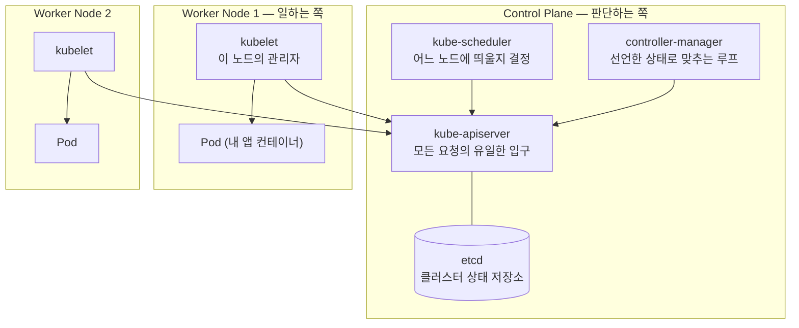

# 컨테이너와 쿠버네티스가 필요한 이유 — jar 를 서버에 올리던 사람의 관점에서

나는 오랫동안 Spring Boot 를 jar 로 말아서 서버에 올리는 방식으로 일했다. 배포는 "서버에 접속해서 기존 프로세스를 죽이고 새 jar 를 띄운다"였고, 그걸로 충분했다. 그러다 쿠버네티스 위에서 도는 서비스를 맡게 됐는데, ArgoCD 화면은 매일 보면서도 그 안에서 무슨 일이 벌어지는지는 몰랐다. Pod 가 왜 이름이 매번 바뀌는지, 왜 서버에 SSH 로 들어갈 생각을 안 하는지.

이 시리즈는 그때부터 하나씩 밟아나간 기록이다. 첫 글에서 답할 질문은 하나다 — **jar 를 서버에 올리는 방식은 정확히 어디서 무너지고, 쿠버네티스는 그중 무엇을 대신해 주는가.**

## 컨테이너가 먼저 푸는 문제 — "내 로컬에선 됐는데"

쿠버네티스 얘기를 하려면 컨테이너부터다. 컨테이너는 **애플리케이션을 어디서 돌리든 똑같이 돌도록 만든 격리된 실행 환경**이다.

jar 배포에서 겪던 문제를 떠올리면 필요성이 바로 보인다. 로컬은 JDK 17, 개발 서버는 11 이 깔려 있어서 안 뜬다. 서버마다 타임존이 다르다. 누군가 서버에 직접 설치한 라이브러리에 의존하고 있었는데 그 서버를 재구축하니 안 뜬다. 전부 **실행 환경이 코드 밖에 있어서** 생기는 문제다.

컨테이너는 실행 환경을 코드와 같이 묶어서 이 문제를 없앤다.

- **이미지**(Image) — 베이스 OS · JDK · 내 jar · 설정까지 통째로 담은 스냅샷. `eclipse-temurin:21-jre` 위에 `app.jar` 를 얹은 것이 하나의 이미지다.
- **컨테이너**(Container) — 그 이미지를 실행한 상태. 즉 프로세스다.
- **불변성** — 한 번 빌드한 이미지는 어디서 실행하든 내용이 같다. 그래서 "개발 서버에서 검증한 그 이미지"를 운영에 그대로 올린다. 운영에서 다시 빌드하지 않는다.

VM 과 헷갈리기 쉬운데, 결정적 차이는 **OS 커널을 새로 띄우느냐**다. VM 은 게스트 OS 를 통째로 부팅하므로 수십 초가 걸리고 메모리도 GB 단위로 먹는다. 컨테이너는 호스트 커널을 공유하고 프로세스만 격리하므로 수 초 안에 뜨고 오버헤드가 훨씬 작다. 배포 한 번에 컨테이너 수십 개를 새로 띄우는 롤링 업데이트가 현실적인 건 이 가벼움 덕분이다.

## 도커만으로는 어디서 막히는가

컨테이너로 실행 환경 문제는 풀렸다. 그런데 서비스가 커지면 도커 단독으로는 감당이 안 되는 지점이 순서대로 나타난다.

| 막히는 지점 | 도커 단독 | 쿠버네티스가 대신하는 것 |
|---|---|---|
| 컨테이너가 죽음 | 사람이 알아채고 다시 띄움 | 죽으면 자동으로 새로 띄움 |
| 트래픽 증가 | 사람이 서버에 들어가 추가 실행 | replica 수를 늘리면 알아서 배치 |
| 무중단 배포 | 스크립트로 직접 구현 | 롤링 업데이트가 기본 기능 |
| 서버 여러 대 분산 | 어느 서버에 뭘 띄울지 사람이 관리 | 스케줄러가 여유 있는 노드에 배치 |
| 컨테이너 주소 찾기 | IP·포트를 사람이 관리 | Service 이름으로 호출 |

표를 세로로 읽으면 공통점이 보인다. 왼쪽 열은 전부 **사람이 알아채고 사람이 조치하는 일**이고, 오른쪽 열은 전부 **시스템이 알아채고 시스템이 조치하는 일**이다. 쿠버네티스가 파는 것은 기능 목록이 아니라 이 전환이다.

그래서 쿠버네티스를 한 문장으로 정의하면 이렇게 된다 — **컨테이너를 자동으로 배치하고, 유지하고, 스스로 복구하는 오케스트레이션 시스템.**

## 클러스터는 어떻게 생겼나

쿠버네티스는 서버 여러 대를 하나의 자원 풀로 묶는다. 그 묶음이 **클러스터**(Cluster) 고, 안에는 역할이 다른 두 종류의 서버가 있다.

각 조각을 백엔드 개념에 붙여 보면 이해가 빠르다.

- **kube-apiserver** — 클러스터의 유일한 REST API 서버다. `kubectl` 도, 각 노드의 kubelet 도, 컨트롤러도 전부 여기를 통해서만 대화한다. 컴포넌트끼리 직접 연결되지 않고 API 서버 하나를 허브로 두는 구조라, 인증·권한·검증을 한 곳에서 건다.
- **etcd** — 클러스터의 모든 상태가 저장되는 데이터베이스다. "Pod 를 2개 띄워라"는 선언도, 지금 몇 개가 떠 있는지도 전부 여기 있다. etcd 가 죽으면 클러스터의 기억이 사라진다.
- **kube-scheduler** — 새로 만들어야 할 Pod 를 보고 **어느 노드에 놓을지** 정한다. CPU·메모리 여유, 노드 라벨, 배치 제약을 따진다. 놓기만 하고 실행은 하지 않는다.
- **controller-manager** — "선언된 상태"와 "실제 상태"를 계속 비교해 맞추는 루프들의 집합이다. 이 루프가 쿠버네티스의 핵심 원리인데, 다음 글에서 따로 다룬다.
- **kubelet** — 각 워커 노드에 상주하는 에이전트다. API 서버에서 "네 노드에 이 Pod 를 띄워라"를 받아 실제로 컨테이너를 실행하고, 상태를 다시 보고한다.

여기서 감각이 하나 바뀐다. **내가 특정 서버를 지목해서 앱을 올리는 게 아니다.** 나는 "이 앱을 2개 띄워둬"라고 API 서버에 말할 뿐이고, 어느 노드에 놓을지는 스케줄러가 정한다. 그래서 Pod 가 어느 서버에 떠 있는지 평소에 신경 쓰지 않고, SSH 로 들어갈 생각도 하지 않게 된다.

## 배포의 의미가 바뀐다

정리하면 쿠버네티스로 넘어오면서 바뀌는 건 도구가 아니라 **배포라는 행위의 정의**다.

- 기존: 서버에 접속해 **절차를 실행한다.** 프로세스를 죽이고, 새 jar 를 올리고, 다시 띄운다.
- 쿠버네티스: **원하는 상태를 선언한다.** "이 이미지로 2개 떠 있어야 한다"고 적어두면, 그 상태를 유지하는 건 시스템 몫이다.

이 차이 때문에 장애 대응 방식도 달라진다. Pod 가 죽었을 때 되살리는 게 아니라 **폐기하고 새로 만든다.** 그래서 Pod 안에 중요한 걸 쌓아두면 안 되고, 로그도 파일로 남기지 않고 표준 출력으로 내보내 외부 수집기로 보낸다. 서버를 "고쳐 쓰는 가축이 아니라 갈아 끼우는 부품"으로 보는 전제가 깔려 있다.

## 쿠버네티스가 해결해 주지 않는 것

도입하면 다 되는 것처럼 보이지만, 실제로 겪어보니 그렇지 않았다. 미리 알아두면 좋은 한계가 있다.

- **애플리케이션이 준비돼 있어야 무중단이 된다.** 롤링 업데이트 기능이 있다고 무중단이 되는 게 아니다. 종료 신호를 받았을 때 처리 중인 요청을 마저 끝내는 코드가 없으면, 배포할 때마다 사용자 쪽에 에러가 나간다. 실제로 이 준비가 안 된 서비스에서 배포·스케일인 때마다 503 이 튀는 걸 겪었다.
- **상태를 가진 것은 여전히 어렵다.** DB 처럼 데이터를 들고 있는 컴포넌트는 "죽으면 새로 만든다"는 전제와 충돌한다. 방법은 있지만(StatefulSet, PersistentVolume) 난이도가 다르고, 관리형 DB 를 쓰는 선택이 흔하다.
- **네트워크를 모르면 결국 막힌다.** 외부 요청이 Pod 까지 닿는 경로에는 로드밸런서·Ingress·Service 가 겹겹이 끼어 있다. 이 계층을 모르면 "왜 접속이 안 되는지"를 추적할 수 없다. 이 시리즈와 별개로 [실전 연재](./external-traffic-path.md)를 따로 둔 이유다.
- **추상화가 두꺼워 디버깅이 어렵다.** 선언만 하고 실행은 시스템이 하므로, 안 될 때 "어디서 멈췄는지"가 안 보인다. 이걸 읽는 법이 다음 글의 주제다.

## 이 시리즈에서 다룰 것

앞으로의 순서는 이렇다. 아래로 갈수록 구체적이다.

1. **컨테이너와 쿠버네티스가 필요한 이유** — 지금 이 글
2. [선언형 API 와 reconcile loop](./declarative-api-reconcile-loop.md) — 쿠버네티스를 관통하는 단 하나의 원리
3. [핵심 객체 4종](./k8s-core-objects.md) — Pod · Service · Ingress · Namespace 의 관계
4. [Deployment · ReplicaSet · Pod](./deployment-pod.md) — 배포가 실제로 굴러가는 3층 구조
5. [admission — etcd 에 저장되기 직전](./admission-control.md) — 요청이 거부되는 지점
6. [Helm](./helm.md) — YAML 을 템플릿으로 관리하기
7. [Argo CD](./argo-cd.md) — git 을 정답으로 삼는 배포
8. [Helm 과 ArgoCD 로 GitOps 하기](./helm-argocd-gitops.md) — 둘을 합친 실전 흐름

다음 글에서는 지금까지 계속 미뤄 둔 것 — "원하는 상태를 선언하면 시스템이 맞춘다"가 내부적으로 어떤 구조인지 — 를 본다. 이 원리 하나를 잡아두면 뒤의 Deployment · admission · ArgoCD 가 전부 같은 패턴의 변주로 읽힌다.

## 참고 링크

- [Kubernetes Components — 공식 문서](https://kubernetes.io/docs/concepts/overview/components/)
- [What is Kubernetes — 공식 문서](https://kubernetes.io/docs/concepts/overview/)
- [컨테이너 격리 원리 — Linux 프로세스 격리](../docker/linux-process-isolation.md)
