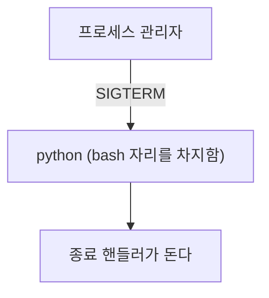
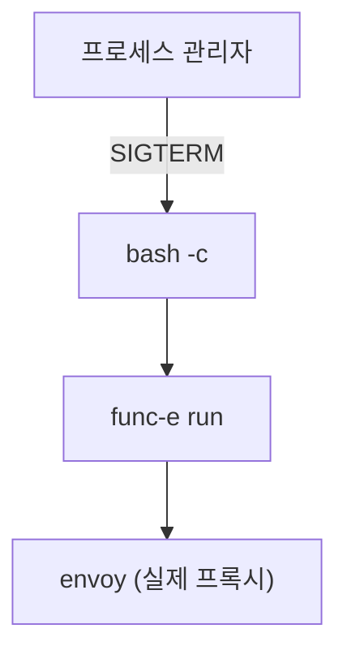

# 종료 신호는 어디서 멈추는가

`stopwaitsecs` 를 27초로 늘렸다. gRPC `grace` 도 24초로 올렸다. preStop 도 줄였다. 계산상 30초 예산 안에 다 들어간다.

그런데 여전히 처리 중이던 요청이 끊겼다.

설정값이 다 맞는데 동작이 틀릴 때, 나는 값을 더 조정하는 쪽으로 갔다. 그게 틀린 방향이었다. **문제는 값이 아니라 그 값을 쓰는 프로세스에게 신호가 애초에 닿지 않는 것**이었다.

이 글은 그 하루를 정리한 기록이다. 신호가 어디서 멈추는지, 왜 멈추는지, 그리고 **신호가 실제로 전달됐는지 어떻게 확인하는지**를 다룬다. 마지막 것이 이 글에서 가장 쓸모 있는 부분이라고 생각한다.

> 시그널 자체가 처음이면 [Graceful Shutdown](./graceful-shutdown.md) 을 먼저 읽는 게 낫다. 이 글은 그 다음 단계다.

---

## 신호는 알림이지 명령이 아니다

Java 를 하다 왔다면 이 코드가 익숙할 것이다.

```java
Runtime.getRuntime().addShutdownHook(new Thread(() -> {
    // 커넥션 풀 닫기, 처리 중인 작업 마무리
}));
```

`kill <pid>` 를 치면 이 훅이 돈다. 리눅스가 그 프로세스에게 SIGTERM 을 보내고, JVM 이 그걸 받아 훅을 실행한다.

여기서 중요한 것은 **SIGTERM 이 "죽어라"가 아니라 "이제 끝내도 된다"는 알림**이라는 점이다. 받는 쪽이 핸들러를 등록해뒀으면 정리할 시간을 갖고, 무시하면 그냥 계속 산다. 강제로 죽이는 것은 SIGKILL 이고 그건 핸들러를 등록할 수조차 없다.

그래서 graceful shutdown 은 전부 이 구조다.

1. SIGTERM 을 받는다
2. 새 요청을 안 받는다
3. 처리 중인 것을 마친다
4. 스스로 끝낸다

**1번이 안 되면 나머지 셋은 시작조차 되지 않는다.** 내가 놓쳤던 게 그거다.

---

## 신호는 자식에게 자동으로 내려가지 않는다

프로세스에 신호를 보내면 **그 프로세스 하나만** 받는다. 아래에 자식이 있어도 알아서 전달되지 않는다.

이게 왜 문제가 되냐면, 컨테이너 안의 프로세스가 우리가 생각하는 것보다 한 겹 더 깊은 곳에 있는 경우가 많기 때문이다.

내가 맡은 모델 서버의 프로세스 관리자 설정은 이렇게 생겼었다.

```ini
[program:grpc-server]
command=bash -c "cd /app && python server_grpc.py"
```

읽으면 "python 을 띄운다"로 보인다. 실제로 무엇이 실행되는지는 한 겹 더 들어가야 안다.

### 셸을 띄운다는 게 무슨 뜻인가

셸은 특별한 무엇이 아니라 그냥 프로그램이다. `/bin/bash` 라는 실행 파일이 디스크에 있고, 터미널을 열면 그게 하나 실행되어 있는 것이다.

이 프로그램이 하는 일은 **사람이 친 문자열을 해석해서 진짜 프로그램을 실행해주는 것**이다. `ls -al` 을 치면 셸이 그 문자열을 읽고, `ls` 라는 실행 파일을 찾아서, `-al` 을 인자로 넘겨 실행한다.

`bash -c "명령 문자열"` 은 **그 해석기를 하나 더 실행해서 문자열을 넘기는 것**이다. 터미널 없이, 셸에게 "이거 해석해서 실행해줘" 하고 시키는 셈이다.

왜 굳이 거치냐면, 해석이 필요한 문법이 있기 때문이다.

| 문법 | 누가 처리하나 |
| --- | --- |
| `&&`, `\|\|`, `;` (명령 이어붙이기) | 셸 |
| `>`, `<`, `\|` (리다이렉션, 파이프) | 셸 |
| `$VAR`, `$(cmd)` (변수와 치환) | 셸 |
| `*.log` (와일드카드 확장) | 셸 |
| 프로그램 실행 자체 | 운영체제 |

`python server.py` 하나만 실행할 거라면 셸이 필요 없다. 운영체제에게 직접 시키면 된다. 하지만 `cd /app && python server.py` 처럼 두 개를 이어붙이려면 `&&` 를 이해하는 존재가 있어야 하고, 그게 셸이다.

Java 로 하다가 한 번쯤 겪는 함정이 정확히 이 지점이다.

```java
// 리다이렉션이 동작하지 않는다. "> out.txt" 가 ls 의 인자로 넘어간다
Runtime.getRuntime().exec("ls > out.txt");

// 셸에게 해석을 맡겨야 동작한다
new ProcessBuilder("bash", "-c", "ls > out.txt").start();
```

`>` 는 파일 시스템 기능이 아니라 셸의 문법이다. 셸을 거치지 않으면 해석해줄 존재가 없다.

### 그런데 셸이 항상 자식을 만들지는 않는다

여기서 내가 처음에 잘못 알고 있던 게 있다. `bash -c "..."` 를 쓰면 항상 bash 프로세스가 한 겹 남는다고 생각했는데, 직접 재보니 아니었다.

bash 가 띄운 프로세스의 PID 가 bash 자신의 PID 와 같은지로 판정했다. 같으면 bash 가 자기 자리를 내준 것이고, 다르면 자식을 만들어 위에 남아 있는 것이다.

```bash
bash -c "sleep 60" &
echo "bash PID: $!"
pgrep -f "sleep 60"     # 이 값이 위와 같은가
```

| 명령 | 결과 |
| --- | --- |
| `bash -c "sleep N"` | 같은 PID. bash 층 없음 |
| `bash -c "cd /tmp && sleep N"` | 같은 PID. bash 층 없음 |
| `bash -c "export A=1 && export B=2 && sleep N"` | 같은 PID. bash 층 없음 |

**bash 는 실행할 마지막 명령이면 자기를 그 프로그램으로 대체한다.** 뒤에 더 할 일이 없으니 굳이 자식을 만들고 기다릴 이유가 없어서다.

그러면 계층은 언제 생기나. 뒤에 할 일이 남아 있을 때다. `cmd; echo done` 처럼 뒤 명령이 있거나, `trap` 으로 신호를 잡아 처리하기로 했거나, 파이프로 묶여 있는 경우다. 그때는 bash 가 자식을 만들고 위에서 기다린다.

> 이 측정은 macOS 의 bash 3.2 에서 한 것이다. 컨테이너는 대개 리눅스에 bash 5 라 최적화 조건이 다를 수 있다. 그래서 **어떤 명령 문자열이 계층을 만드는지 설정만 보고 단정하면 안 된다.** 실제로 돌려서 프로세스 트리를 봐야 한다는 게 이 글에서 두 번째로 하고 싶은 말이다.

### 그래서 exec 을 명시한다

내가 맡은 서버에서는 `exec` 을 명시적으로 붙였다.

```ini
command=bash -c "cd /app && exec python server_grpc.py"
```

`exec` 은 **자식을 만들지 않고, 지금 프로세스를 그 프로그램으로 갈아 끼운다.** PID 는 그대로고 실행 중인 코드만 바뀐다.

앞에서 본 대로 bash 가 알아서 대체해주는 경우도 있다. 그런데도 명시하는 이유는, 그 최적화가 조건에 걸려 있기 때문이다. 나중에 누가 뒤에 정리 명령 한 줄을 붙이거나 `trap` 을 추가하면 조건이 깨지고, 그때 계층이 조용히 생긴다. 종료가 망가지는데 설정 파일만 봐서는 이유가 안 보인다. `exec` 을 적어두면 그 조건에 기대지 않는다.



Java 에는 대응하는 개념이 없다. `ProcessBuilder` 로 자식을 만드는 것의 정반대라고 보면 된다. 자식을 만드는 게 아니라 **자기 자신을 버리고 그 자리에 다른 프로그램을 앉히는 것**이다.

> `exec` 뒤에 명령을 더 쓰면 그건 실행되지 않는다. 프로세스가 이미 대체됐기 때문이다. 정리 코드를 뒤에 붙여뒀다면 조용히 사라진다.

여기까지가 첫 번째 층이다. 나는 이걸로 끝난 줄 알았다.

---

## 런처는 exec 으로 없앨 수 없다

같은 컨테이너에 프로세스가 하나 더 있었다. HTTP 요청을 gRPC 로 바꿔주는 [Envoy Proxy](./envoy-proxy.md) 다. 이쪽 설정은 이랬다.

```ini
[program:envoy]
command=bash -c "func-e use 1.21.1 && func-e run -c /app/envoy.yaml"
```

`func-e` 라는 게 나온다. 이게 뭐냐면 **Envoy 바이너리를 대신 받아서 실행해주는 런처**다. Envoy 는 버전마다 바이너리를 직접 받아야 하는데, `func-e use 1.21.1` 하면 그 버전을 내려받고 `func-e run` 하면 그걸 띄워준다. `nvm` 이 Node 버전을 관리하는 것과 비슷한 위치에 있다.

편한데, 종료 관점에서는 문제가 있다. **`func-e` 는 Envoy 를 자식 프로세스로 띄운다.**



앞에서 배운 대로 `exec` 을 붙이면 `bash` 는 없어진다. 그런데 `func-e` 는 안 없어진다. `exec` 은 셸이 자기를 대체하게 만드는 것이지, `func-e` 가 자식을 안 만들게 하지는 못한다.

**중간 계층이 생기는 경로가 두 가지라는 게 여기서 드러난다.**

| 경로 | 예 | `exec` 으로 없어지나 |
| --- | --- | --- |
| 셸이 명령을 감싼다 | `bash -c "cmd"` | 없어진다 |
| 런처가 대상을 자식으로 띄운다 | `func-e run`, `nvm exec`, 각종 wrapper | 없어지지 않는다 |

두 번째는 그 런처가 신호를 아래로 전달해주기를 기대하는 수밖에 없다. 잘 만든 런처는 전달한다. 안 만든 런처는 안 한다.

그래서 질문이 생겼다. **`func-e` 에 SIGTERM 을 보내면 그 아래 envoy 까지 전달되는가.**

---

## func-e 는 SIGTERM 을 envoy 로 전달하는가

이게 이 글에서 가장 중요한 부분이다.

처음에 나는 이걸 컨테이너 없이는 확인할 수 없다고 판단했다. Docker 데몬을 못 띄우는 장비였고 베이스 이미지도 GPU 용이라 로컬에서 안 돌았다. 그래서 "실측한 뒤 정한다"고 문서에 적고 미뤘다.

틀린 판단이었다. **컨테이너가 필요한 게 아니라 로그를 읽는 위치를 바꾸면 되는 문제**였다.

### 왜 stdout 으로 보면 판정이 안 되나

처음 시도는 이랬다. `func-e run` 을 띄우고 신호를 보낸 다음, 터미널에 찍히는 Envoy 로그를 본다. 종료 메시지가 나오면 닿은 것이다.

그런데 이 방법으로는 아무것도 판정할 수 없다. Envoy 의 로그가 `func-e` 의 stdout 을 거쳐 나오기 때문이다.


`func-e` 가 먼저 끝나면 그 뒤에 Envoy 가 뭘 쓰든 갈 곳이 없다. 그러면 화면에는 종료 메시지가 안 보인다. 하지만 그게

- Envoy 가 SIGTERM 을 받지 못해 아무 로그도 남기지 않은 것인지
- Envoy 는 로그를 남겼는데 출력 통로가 먼저 닫혀서 못 본 것인지

구분이 안 된다. 둘 다 "화면에 없다"로 똑같이 보인다.

### 로그를 그 프로세스가 직접 쓰게 만든다

Envoy 에는 `--log-path` 옵션이 있다. 이걸 주면 stdout 을 거치지 않고 **Envoy 가 파일에 직접 쓴다.** 중간 통로가 사라지니 위 두 가지가 갈린다.

```bash
# 기준선: envoy 에 직접 SIGTERM
envoy -c envoy-live.yaml --log-path envoy_direct.log --file-flush-interval-msec 100 &
kill -TERM "$(pgrep -x envoy)"

# 비교: func-e 에 SIGTERM
func-e run -c envoy-live.yaml --log-path envoy_funce.log --file-flush-interval-msec 100 &
kill -TERM "$(pgrep -f 'func-e run')"
```

`--file-flush-interval-msec 100` 도 같은 이유로 넣었다. 버퍼가 크면 마지막 몇 줄이 디스크에 닿기 전에 프로세스가 끝나서 또 애매해진다.

결과는 이랬다.

| 신호 대상 | 로그 파일의 종료 흔적 | envoy 프로세스 |
| --- | ---: | --- |
| envoy 직접 | 4줄 | 종료 |
| `func-e` 경유 | 0줄 | 종료 |

직접 보내면 이 넷이 남는다.

```
[warning][main] caught ENVOY_SIGTERM
[info][main] shutting down server instance
[info][main] main dispatch loop exited
[info][main] exiting
```

`func-e` 를 거치면 **하나도 남지 않는다.** 신호를 받지 못했고, 자기 종료 경로를 타지 않은 채 끝난 것이다.

여기서 함정이 하나 더 있다. `func-e` 경유일 때도 **프로세스는 1초 안에 사라지고 포트도 풀린다.** 밖에서 보면 정상 종료와 구분이 안 된다. 프로세스 목록이나 포트로 판정했다면 "잘 되고 있다"는 결론이 나왔을 것이다. 실제로는 Envoy 가 진행 중인 연결을 정리할 기회 없이 끝난 것이다.

### 여기서 얻은 판정 원칙

두 가지를 배웠다.

**신호가 전달됐는지는 받는 프로세스가 남긴 흔적으로 판정한다.** 보내는 쪽에서 `kill` 이 성공했다는 것은 아무것도 증명하지 않는다. `kill` 은 신호를 큐에 넣는 데 성공했다는 뜻이지, 그게 의미 있게 처리됐다는 뜻이 아니다.

**그 흔적은 중간 계층을 거치지 않는 경로로 받는다.** 신호 전달을 의심하는 상황에서 그 중간 계층을 통해 증거를 받으면, 증거 자체가 중간 계층의 상태에 오염된다. Envoy 는 마침 `--log-path` 가 있어서 쉬웠다. 없는 프로그램이면 컨테이너 밖에서 `strace` 로 보거나, 종료 핸들러 안에서 파일을 하나 만들게 하는 식으로 우회할 수 있다.

---

## 신호가 안 통하면 다른 경로로 종료를 건다

`func-e` 가 SIGTERM 을 전달하지 않는 것이 확정됐으니 선택지는 셋이었다.

| 방법 | 대가 |
| --- | --- |
| `func-e` 를 버리고 Envoy 바이너리를 직접 `exec` | 바이너리 경로가 런처 내부 구조라 버전 올릴 때 깨진다 |
| 신호를 포기하고 프로세스만 죽인다 | 동작은 하지만 종료가 로그에 안 남아 순서 판정을 못 한다 |
| Envoy 의 관리 API 로 종료를 요청한다 | 관리 포트가 살아 있어야 한다 |

세 번째를 골랐다. Envoy 는 admin 포트에 `/quitquitquit` 이라는 엔드포인트를 갖고 있다. 이름 그대로 "그만 끝내라"는 뜻이고, POST 를 받으면 Envoy 가 **스스로** 종료 절차를 시작한다.

```bash
curl -sS -m 2 -X POST localhost:9901/quitquitquit
```

핵심은 이게 **프로세스 계층을 타지 않는다**는 점이다. 신호는 프로세스 트리를 따라가야 하지만 HTTP 요청은 포트로 바로 꽂힌다. `func-e` 가 몇 겹이든 상관이 없다.

실제로 `func-e` 를 거쳐 띄운 상태에서 호출해도 종료 로그가 남았다.

```
[info][main] shutting down server instance
[info][main] main dispatch loop exited
[info][main] exiting
```

`caught ENVOY_SIGTERM` 이 없는 것은 신호가 아니라 admin 요청으로 들어왔기 때문이다. 나머지 종료 경로는 같다.

### 이 방식의 실패 모드

공짜는 아니다.

- **관리 포트가 응답해야 한다.** Envoy 가 이미 멈춰 있거나 포트가 막혀 있으면 실패한다. 그래서 `kill -TERM` 을 대비책으로 남겨뒀다. 그 경로로 내려가면 실측한 `func-e` 동작과 같아지는데, 원래 그 상태였으니 결과가 나빠지지는 않는다.
- **관리 포트를 외부에 열면 안 된다.** 아무나 POST 한 번으로 프록시를 내릴 수 있다. 컨테이너 안에서만 접근되게 두는 게 전제다.

같은 발상이 다른 데도 있다. Spring Boot Actuator 의 `/actuator/shutdown` 이 정확히 같은 자리에 있는 기능이다. 평소에는 꺼두지만, 신호가 안 통하는 환경에서는 이게 유일한 수단이 되기도 한다.

---

## 예산은 그다음 문제였다

신호가 닿게 만든 뒤에야 시간 배분이 의미를 갖는다.

컨테이너 플랫폼이 종료에 30초를 준다. 그 안에 안 끝나면 SIGKILL 이다. 이 값은 플랫폼이 고정한 것이라 늘릴 수 없었다.

| 구간 | 이전 | 이후 | 이유 |
| --- | ---: | ---: | --- |
| preStop | 최대 25초 | 3초 | 같은 컨테이너 안의 호출이라 정상이면 밀리초다 |
| 추론 서버 종료 대기 | 12초 | 24초 | 실제 서비스타임이 19초까지 나온다 |
| 관리자 대기 상한 | 10초 | 27초 | 위 대기를 중간에 끊지 않게 |

이전 배분이 왜 안 됐는지가 여기서 보인다. preStop 이 25초를 쓰고 나면 실제 종료에 5초가 남는다. 19초 걸리는 작업이 5초 안에 끝날 리가 없다.

그런데 이 표를 아무리 잘 맞춰도 **`exec` 이 빠져 있으면 전부 무효**다. 값을 읽는 코드가 실행되지 않으니까. 순서가 있다.

1. 신호가 실제 프로세스까지 전달되는가
2. 전달받은 프로세스가 종료 절차를 실행하는가
3. 그 절차에 주어진 시간이 충분한가

나는 3번부터 손댔고, 1번이 깨져 있어서 며칠을 돌았다.

---

## 다음에 같은 걸 만나면

컨테이너가 내려갈 때 뭔가 끊긴다면, 설정값을 보기 전에 이 순서로 확인하려 한다.

**프로세스 트리부터 그린다.** `ps -ef --forest` 나 `pstree` 로 실제 부모 자식 관계를 본다. 설정 파일에 적힌 명령과 실제 트리는 다르다.

**중간 계층을 센다.** 셸로 감싼 곳이 있는지, 런처를 거치는지 본다. 셸은 `exec` 으로 없애고, 런처는 없앨 수 없으니 다음 단계로 넘어간다.

**신호가 전달됐는지를 받는 프로세스의 로그로 판정한다.** 그 프로세스가 직접 쓰는 로그를 확보한다. stdout 이 상위 프로세스를 거친다면 그건 증거로 못 쓴다.

**전달되지 않으면 프로세스 계층을 타지 않는 경로를 찾는다.** 관리 API, admin 엔드포인트, 유닉스 소켓 같은 것들이다.

**그다음에 시간을 나눈다.**

돌아보면 이 작업에서 제일 오래 걸린 게 "확인할 수 없다"고 판단하고 미뤄둔 구간이었다. 컨테이너가 필요하다고 생각했는데 실제로는 로그를 어디서 읽느냐의 문제였다. 못 잰다고 결론 내리기 전에 **왜 못 재는지**를 한 번 더 따져봤어야 했다.

---

## 함께 읽기

- [Graceful Shutdown](./graceful-shutdown.md) 시그널 기초와 시간 예산
- [Docker에서 좀비 프로세스가 쌓이는 이유](./docker/pid1-zombie-tini.md) PID 1 과 프로세스 트리
- [OCR 오토스케일 전환의 connection 에러를 양쪽에서 막기](../task/ai-service-team/ocr-scale-connection-resilience.md) 이 문제를 만난 실제 작업

## 참고 링크

- [Envoy admin interface](https://www.envoyproxy.io/docs/envoy/latest/operations/admin)
- [func-e](https://func-e.io/)
- [exec (POSIX)](https://pubs.opengroup.org/onlinepubs/9699919799/functions/exec.html)
