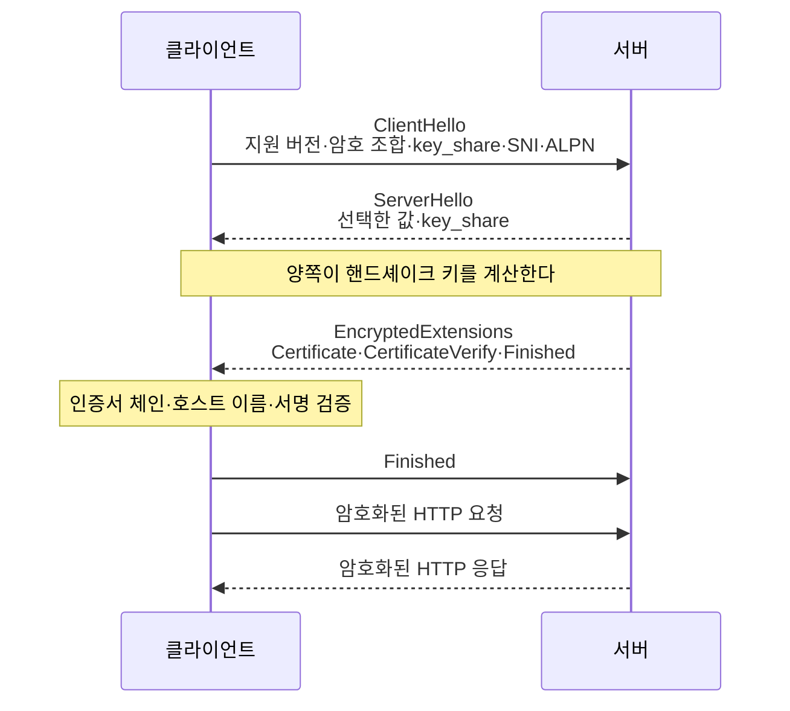
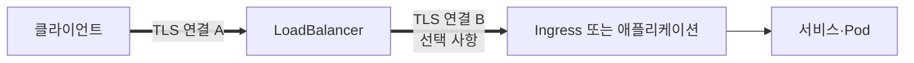

# HTTPS와 TLS: 핸드셰이크, 인증서, 종료 지점

HTTPS는 HTTP 메시지를 TLS로 보호하는 통신 방식이다.
클라이언트는 접속한 서버의 신원을 확인하고, 양쪽은 통신에 사용할 키를 합의한 뒤 HTTP 요청과 응답을 암호화한다.
[HTTP 표준](https://www.rfc-editor.org/rfc/rfc9110.html#name-https-uri-scheme)은 HTTPS 연결이 서버 인증, 기밀성, 무결성을 제공해야 한다고 정의한다.

이 글은 TLS 1.3을 기준으로 HTTPS 연결이 만들어지는 과정과 인증서 검증을 설명한다.
마지막에는 LoadBalancer, Ingress와 애플리케이션 중 어디에서 TLS를 종료할지 판단하는 기준을 정리한다.

## HTTPS가 보호하는 범위

TLS는 네트워크를 지나는 HTTP 메시지에 다음 속성을 제공한다.

| 속성 | 막으려는 문제 | 확인할 내용 |
| --- | --- | --- |
| 기밀성 | 중간 장비나 공격자가 요청과 응답 본문을 읽는 문제 | 협상한 대칭키로 레코드를 암호화한다. |
| 무결성 | 전송 중인 메시지를 바꾸는 문제 | AEAD 암호가 변경 여부를 함께 검증한다. |
| 서버 인증 | 공격자가 대상 서버를 사칭하는 문제 | 인증서 체인과 호스트 이름을 검증한다. |

일반적인 공개 HTTPS에서는 클라이언트가 서버만 인증한다.
서버도 클라이언트 인증서를 검증해야 한다면 상호 TLS(mutual TLS, mTLS)를 사용한다.

TLS가 애플리케이션 전체를 안전하게 만드는 것은 아니다.
TLS가 종료된 뒤의 평문 구간, 서버 로그에 저장된 민감 정보, 애플리케이션 취약점과 탈취된 서버 개인키는 별도로 보호해야 한다.
접속한 IP와 포트 같은 연결 정보도 TLS가 숨기지 않는다.

## TLS 1.3 핸드셰이크

다음 흐름은 새 TLS 1.3 연결에서 서버 인증서를 사용하는 일반적인 전체 핸드셰이크다.
HTTP/1.1과 HTTP/2가 TCP 위에서 TLS를 사용하는 경우를 기준으로 단순화했다.
HTTP/3은 QUIC 안에 TLS 1.3 핸드셰이크를 통합하지만, 인증서 검증과 키 합의의 목적은 같다.



### 연결 조건 협상

클라이언트는 `ClientHello`에 지원하는 TLS 버전과 암호 조합을 넣는다.
`SNI`에는 접속하려는 호스트 이름을, `ALPN`에는 `h2`나 `http/1.1`처럼 사용할 애플리케이션 프로토콜 후보를 보낸다.
서버는 `ServerHello`에서 실제로 사용할 값을 고른다.

하나의 IP가 여러 도메인을 서비스할 때 서버는 SNI를 보고 알맞은 인증서를 선택한다.
SNI가 인증서의 유효성을 보장하는 것은 아니다.
인증서가 접속한 호스트 이름에 유효한지는 이후의 인증서 검증에서 따로 확인한다.

### 공유 비밀과 통신 키 계산

클라이언트와 서버는 `key_share`에 담긴 임시 Diffie-Hellman 공개값으로 같은 공유 비밀을 계산한다.
공유 비밀이나 실제 통신 키를 네트워크로 직접 보내지 않는다.
각자 계산한 공유 비밀과 핸드셰이크 내용을 HKDF에 넣어 방향별 대칭키를 만든다.

이 지점이 자주 잘못 설명된다.
TLS 1.3에서 서버 인증서의 공개키는 세션용 대칭키를 암호화해 전달하는 데 사용하지 않는다.
서버는 인증서와 연결된 개인키로 핸드셰이크 내용에 서명하고, 클라이언트는 인증서의 공개키로 그 서명을 검증한다.
키 합의와 서버 인증은 협력하지만 역할은 다르다.

핸드셰이크가 끝난 뒤에는 대칭키 기반 AEAD 암호로 HTTP 메시지를 보호한다.
공개키 연산을 모든 요청과 응답에 반복하지 않으므로 처리 비용을 줄일 수 있다.

이 과정의 메시지와 키 계산은 [TLS 1.3 표준](https://www.rfc-editor.org/rfc/rfc8446.html#section-2)에 정의되어 있다.

## 인증서 검증

서버가 인증서를 보냈다는 사실만으로는 신뢰할 수 없다.
클라이언트는 적어도 다음 조건을 확인해야 한다.

| 검사 | 의미 |
| --- | --- |
| 신뢰 체인 | 서버 인증서에서 중간 CA를 거쳐 클라이언트가 신뢰하는 루트 CA까지 서명이 이어진다. |
| 유효 기간 | 현재 시각이 인증서의 `notBefore`와 `notAfter` 사이에 있다. |
| 서비스 이름 | 접속한 호스트 이름이 인증서의 Subject Alternative Name과 일치한다. |
| 키 용도와 정책 | 인증서가 서버 인증과 협상한 서명 알고리즘에 사용할 수 있다. |
| 개인키 보유 증명 | 서버가 `CertificateVerify` 서명을 만들고 클라이언트가 이를 검증한다. |

루트 CA 인증서는 서버가 매번 보내는 신뢰의 시작점이 아니다.
운영체제, 브라우저나 애플리케이션의 trust store에 미리 들어 있고, 클라이언트는 그중 하나를 신뢰 기준으로 선택한다.
인증서 경로 검증은 [RFC 5280](https://www.rfc-editor.org/rfc/rfc5280.html#section-6)에 정의되어 있다.

호스트 이름은 인증서의 Common Name이 아니라 Subject Alternative Name에 있는 DNS-ID를 기준으로 확인한다.
[RFC 9525](https://www.rfc-editor.org/rfc/rfc9525.html#section-4)는 Common Name을 서비스 식별에 사용하지 않도록 규정한다.

인증서 체인은 유효하지만 호스트 이름이 다르면 접속 대상의 신원을 증명하지 못한다.
반대로 호스트 이름이 같아도 신뢰 체인이 끊겼거나 인증서가 만료되면 검증에 실패한다.

## TLS 1.3의 연결 재개와 0-RTT

새 TLS 1.3 전체 핸드셰이크는 애플리케이션 데이터를 보내기 전에 보통 한 번의 왕복이 필요하다.
이 수치는 TCP 연결을 만드는 시간과 DNS 조회 시간을 포함하지 않는다.

한 번 연결했던 서버에는 세션 티켓을 이용해 연결을 재개할 수 있다.
TLS 1.3의 0-RTT early data를 사용하면 재개 연결의 첫 메시지부터 애플리케이션 데이터를 보낼 수 있지만, 연결 사이의 재전송을 완전히 막지 못한다.
[RFC 8446](https://www.rfc-editor.org/rfc/rfc8446.html#section-8)도 0-RTT 데이터에는 일반 1-RTT 데이터보다 약한 보안 속성이 있다고 명시한다.

따라서 결제, 주문 생성과 상태 변경처럼 재실행 시 부작용이 생기는 요청에는 0-RTT를 그대로 허용하면 안 된다.
프로토콜과 애플리케이션이 재전송을 안전하게 처리한다고 확인한 요청에만 제한해야 한다.

운영 환경은 TLS 1.3을 우선하고 필요한 클라이언트 호환성을 위해 TLS 1.2를 함께 지원할 수 있다.
TLS 1.0과 1.1은 사용하지 않는다.
구체적인 버전과 암호 조합은 직접 나열해 고정하기보다 사용 중인 TLS 구현과 [RFC 9325의 운영 권고](https://www.rfc-editor.org/rfc/rfc9325.html)를 기준으로 관리한다.

## TLS 종료 지점

TLS 종료(TLS termination)는 한 TLS 연결의 암호화를 해제하고 HTTP 메시지를 읽는 지점이다.
인증서와 개인키는 그 연결을 종료하는 구성요소가 사용한다.

종료 뒤에 새 TLS 연결을 만들 수 있으므로, 종료가 곧 나머지 경로 전체를 평문으로 만든다는 뜻은 아니다.
다음 그림의 두 TLS 연결은 인증서, 키와 신뢰 경계가 서로 다른 별도 연결이다.



| 종료 위치 | 인증서 위치 | 다음 구간 | 적합한 상황 |
| --- | --- | --- | --- |
| Edge나 LoadBalancer | 클라우드 인증서 관리자 또는 LB | HTTP 또는 새 TLS 연결 | 인증서와 WAF, L7 라우팅을 앞단에서 통합할 때 |
| Ingress Controller | Kubernetes Secret이나 인증서 관리자 | 보통 HTTP, 필요하면 TLS | 호스트와 경로별 라우팅을 클러스터에서 관리할 때 |
| 애플리케이션 | 각 애플리케이션 인스턴스 | 애플리케이션에서 종료 | 워크로드까지 동일 TLS 연결을 유지해야 할 때 |

Kubernetes Ingress의 일반적인 TLS 구성은 Ingress에서 연결을 종료하고 Service와 Pod로 평문을 전달한다.
이 동작은 [Kubernetes Ingress 문서](https://kubernetes.io/docs/concepts/services-networking/ingress/#tls)에도 명시되어 있다.
내부 구간까지 암호화가 필요하면 Ingress에서 백엔드로 새 TLS 연결을 만들거나 서비스 간 mTLS를 적용해야 한다.

### 종료 위치를 정하는 기준

종료 위치는 인증서를 두기 편한 곳만 보고 정하지 않는다.
먼저 보호해야 할 네트워크 경계를 정하고 다음 조건을 함께 본다.

1. LB 뒤의 네트워크를 신뢰할 수 있는가.
2. 규정이나 위협 모델이 Pod까지의 암호화를 요구하는가.
3. 어느 계층에서 WAF, 호스트와 경로 라우팅, 요청 크기 제한을 수행하는가.
4. 인증서 발급, 배포, 갱신과 개인키 접근 권한을 어디에서 관리할 것인가.
5. 내부 서비스도 서로의 신원을 확인해야 하는가.

LB에서 TLS를 종료해야 L7 기능을 사용할 수 있는 구성도 있다.
반대로 TLS passthrough를 선택하면 앞단 장비는 암호화된 HTTP 헤더와 본문을 읽지 못하므로, 그 장비에서 제공하던 경로 라우팅이나 WAF 기능을 사용할 수 없을 수 있다.

## 종료 지점을 바꿀 때 발생하는 문제

### 내부 구간의 보안 수준이 바뀐다

`클라이언트 -> LB`만 HTTPS이고 `LB -> 애플리케이션`이 HTTP라면 보호 범위는 LB에서 끝난다.
클러스터 내부라는 이유만으로 다음 구간이 자동으로 신뢰되는 것은 아니다.
공유 네트워크, 다른 테넌트와 규정 요구 사항을 기준으로 재암호화 여부를 결정한다.

### 원래 요청 스킴을 애플리케이션이 잃는다

앞단에서 TLS를 종료하면 애플리케이션에는 HTTP 요청이 도착할 수 있다.
애플리케이션이 이를 외부 요청도 HTTP였다고 해석하면 HTTPS URL 대신 HTTP URL을 만들거나, 잘못된 redirect를 반복하거나, `Secure` 쿠키를 누락할 수 있다.

신뢰하는 프록시가 `Forwarded` 또는 `X-Forwarded-Proto: https`를 전달하고 애플리케이션이 해당 프록시에서 온 헤더만 신뢰하도록 설정해야 한다.
외부 클라이언트가 직접 넣은 전달 헤더는 프록시가 제거하거나 덮어써야 한다.

### SNI와 인증서 이름이 어긋난다

IP 주소로 연결하거나 SNI 없이 호출하면 여러 인증서 중 기본 인증서가 선택될 수 있다.
특정 IP를 시험하더라도 URL과 SNI에는 실제 호스트 이름을 유지해야 한다.

### 중간 CA 인증서가 빠진다

서버가 leaf 인증서만 보내고 필요한 중간 인증서를 보내지 않으면 일부 클라이언트에서 체인을 만들지 못한다.
브라우저 한 종류에서 접속된다는 결과만으로 서버의 인증서 구성이 완전하다고 판단하면 안 된다.

### 인증서 갱신이 실제 리스너에 반영되지 않는다

Secret이나 인증서 관리자의 값이 바뀌어도 종료 지점이 새 인증서를 다시 읽지 못하면 만료된 인증서를 계속 제공한다.
발급 성공뿐 아니라 외부에서 관찰한 인증서의 일련번호와 만료일을 확인해야 한다.

## 외부에서 검증하기

특정 IP로 새 경로를 검증하면서도 실제 호스트 이름과 SNI를 유지하려면 `curl --resolve`를 사용한다.

```bash
curl --verbose \
  --resolve api.example.com:443:203.0.113.10 \
  https://api.example.com/health
```

출력에서 연결한 IP, 협상한 TLS 버전과 HTTP 프로토콜, 서버 인증서의 대상 이름을 확인한다.
`--insecure` 옵션은 인증서 검증을 끄므로 정상 검증 절차에는 사용하지 않는다.

인증서 체인과 호스트 이름 검증 실패를 오류로 종료하려면 `openssl s_client`를 다음처럼 실행한다.

```bash
openssl s_client \
  -connect api.example.com:443 \
  -servername api.example.com \
  -verify_hostname api.example.com \
  -verify_return_error \
  -showcerts </dev/null
```

`openssl s_client`는 기본적으로 인증서 검증 오류가 있어도 진단을 계속할 수 있다.
자동 점검에서는 `-verify_return_error`를 넣어 실패를 종료 코드로 확인한다.
각 옵션의 동작은 [OpenSSL s_client 문서](https://docs.openssl.org/master/man1/openssl-s_client/)에서 확인할 수 있다.

종료 위치를 바꾼 뒤에는 인증서 확인으로 끝내지 않는다.
HTTP와 HTTPS 각각에 대해 다음 동작을 검증한다.

- 허용한 TLS 버전으로 연결되는가.
- 만료되지 않은 인증서와 완전한 체인을 제공하는가.
- 호스트 이름 검증이 통과하는가.
- HTTP 요청을 거부하거나 의도한 HTTPS 주소로 전환하는가.
- 애플리케이션이 외부 URL과 `Secure` 쿠키를 올바르게 생성하는가.
- 종료 뒤의 내부 구간이 설계한 대로 HTTP, TLS 또는 mTLS를 사용하는가.

## 관련 글

- [API Gateway를 제거하고 공인 LoadBalancer로 직접 노출하기](../task/ai-service-team/ocr-api-gateway-removal.md)
- [API Gateway를 제거한 자리 채우기](../devops/k8s/api-gateway-removal-rewrite-and-https.md)
- [외부 트래픽이 Pod까지 닿는 경로](../devops/k8s/external-traffic-path.md)
- [TLS 종료 지점으로 연결 재설정 주체 찾기](../network/connection-reset-rst-proxy-hops.md)

## 참고 자료

- [RFC 9110: HTTP Semantics](https://www.rfc-editor.org/rfc/rfc9110.html#name-https-uri-scheme)
- [RFC 8446: TLS 1.3](https://www.rfc-editor.org/rfc/rfc8446.html)
- [RFC 5280: X.509 인증서 경로 검증](https://www.rfc-editor.org/rfc/rfc5280.html)
- [RFC 9525: TLS 서비스 신원 확인](https://www.rfc-editor.org/rfc/rfc9525.html)
- [RFC 9325: TLS 운영 권고](https://www.rfc-editor.org/rfc/rfc9325.html)
- [Kubernetes Ingress TLS](https://kubernetes.io/docs/concepts/services-networking/ingress/#tls)
