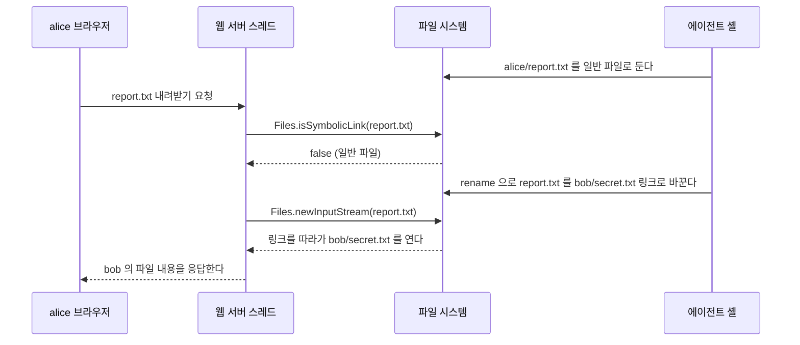

# Alpine 이미지의 Java 에서 링크 바꿔치기(TOCTOU)를 막지 못하는 이유

Alpine 이미지에서 도는 JDK 21 은 `Files.newDirectoryStream` 이 `SecureDirectoryStream` 을 돌려주지 않는다.
그래서 "디렉터리 핸들을 기준으로, 링크를 따라가지 않고 파일을 연다" 는 방어를 Java 표준 API 로 쓸 수 없다.
원인은 커널이 아니라 libc 다.
JDK 는 시작할 때 `openat64` 라는 C 함수를 이름으로 찾는데, Alpine 이 쓰는 musl 1.2.4 이상에서는 그 이름으로 찾으면 아무것도 나오지 않는다.

이 글은 그 결론에 이르는 과정을 순서대로 정리한다.
링크 바꿔치기가 왜 위험한지, 리눅스와 Java 가 어떻게 막는지, Alpine 에서 그 방법이 왜 꺼지는지, 그때 무엇을 고를지를 차례로 다룬다.

## 확인한 환경

| 항목 | 값 |
| --- | --- |
| JDK | Eclipse Temurin 21.0.12.1 (`eclipse-temurin:21-jre-alpine`, `eclipse-temurin:21-jre`) |
| Alpine 쪽 | Alpine Linux 3.24, musl 1.2.6 |
| glibc 쪽 | Ubuntu 26.04.1, glibc 2.43 |
| CPU 아키텍처 | aarch64 (Apple Silicon 의 Docker) |
| 추가 확인 | Eclipse Temurin 25.0.4.1 (`eclipse-temurin:25-jre-alpine`) |
| JDK 소스 | `openjdk/jdk21u` 의 `jdk-21.0.12.1-ga` 태그 |

글에서 "직접 확인" 은 위 컨테이너에서 코드를 돌려 본 결과이고, "추론" 은 소스를 읽고 판단했지만 실행으로 확인하지 않은 내용이다.

## 상황: 사용자별 폴더를 웹에서 탐색하게 하는 기능

개인 프로젝트로 만든 AI 비서에서 이 문제를 만났다.

디스크에는 사용자별로 격리된 폴더가 나란히 있다.
Spring Boot 웹 서버는 이 디스크를 읽기 전용으로 마운트하고, 로그인한 사용자에게 자기 폴더만 탐색하고 내려받게 한다.

```text
/data/users/alice/...
/data/users/bob/...
```

문제는 폴더 안에 쓰는 쪽이다.
각 폴더 안에서는 LLM 에이전트가 셸 명령을 실행하고, 그 셸은 파일과 심볼릭 링크를 마음대로 만들 수 있다.
사용자는 자기 에이전트에게 링크를 만들라고 시킬 수 있고, 에이전트가 프롬프트 인젝션으로 의도하지 않은 명령을 실행할 수도 있다.
그래서 웹 서버는 폴더 안의 파일과 링크를 신뢰할 수 없는 입력으로 다뤄야 한다.

웹 서버의 마운트가 읽기 전용이어도 소용이 없다.
링크를 만드는 쪽은 웹 서버가 아니라 에이전트 셸이고, 웹 서버는 그 링크를 읽을 때 따라간다.
`alice` 폴더 안에 `/data/users/bob/secret.txt` 를 가리키는 링크가 생기면, alice 가 웹에서 그 링크를 열 때 bob 의 파일이 alice 에게 내려간다.

## 검사하고 여는 사이의 틈

가장 먼저 떠오르는 방어는 "링크면 거부한다" 다.

```java
Path target = userRoot.resolve(requestPath).normalize();
if (!target.startsWith(userRoot)) {
    throw new AccessDeniedException(requestPath);
}
if (Files.isSymbolicLink(target)) {
    throw new AccessDeniedException(requestPath);
}
try (InputStream in = Files.newInputStream(target)) {   // 여기서 다시 경로를 해석한다
    in.transferTo(response.getOutputStream());
}
```

`normalize()` 와 `startsWith()` 는 문자열 수준의 검사라서 `../` 는 막지만 링크는 보지 못한다.
그래서 `isSymbolicLink` 를 더했는데, 이 코드에도 틈이 있다.

`Files.isSymbolicLink(target)` 와 `Files.newInputStream(target)` 은 각각 따로 경로를 해석한다.
검사할 때 본 파일과 열 때 여는 파일이 같다는 보장이 없다.
이런 결함을 **TOCTOU**(Time Of Check to Time Of Use, 검사 시점과 사용 시점의 불일치)라고 부른다.

Java 개발자에게 익숙한 모양으로 바꾸면 락 없는 check-then-act 다.

```java
// 두 스레드가 동시에 containsKey 를 통과하면 둘 다 put 한다
if (!map.containsKey(key)) {
    map.put(key, value);
}
```

`HashMap` 에서는 두 호출 사이에 다른 스레드가 끼어들 수 있어서 `ConcurrentHashMap.putIfAbsent` 처럼 검사와 실행을 한 번에 하는 연산을 쓴다.
파일 시스템도 같다.
다른 점은 끼어드는 쪽이 같은 JVM 의 스레드가 아니라 다른 프로세스라서 `synchronized` 로 막을 수 없다는 것이다.

### 바꿔치기 흐름

공격하는 쪽은 `report.txt` 를 일반 파일과 링크로 번갈아 바꾸는 루프를 돌리기만 하면 된다.
`rename` 은 원자적이라서 `report.txt` 는 언제 봐도 둘 중 하나로 존재한다.



### 직접 재현한 결과

위 흐름을 그대로 코드로 만들어 돌려 봤다.
한 스레드는 `alice/report.txt` 를 일반 파일과 `bob/secret.txt` 링크로 계속 바꾸고, 메인 스레드는 `isSymbolicLink` 로 검사한 뒤 여는 동작을 10만 번 반복했다.

| 이미지 | 10만 번 중 bob 의 파일을 읽은 횟수 |
| --- | --- |
| `eclipse-temurin:21-jre` (glibc) | 964 |
| `eclipse-temurin:21-jre-alpine` (musl) | 316 |

횟수는 실행할 때마다 달라진다.
중요한 것은 0 이 아니라는 점이다.
공격자는 실패해도 잃을 것이 없어서 몇 번이든 다시 시도할 수 있다.

## 해결: 디렉터리 핸들을 기준으로, 링크를 따라가지 않고 연다

틈이 생기는 이유는 검사와 열기가 같은 경로 문자열을 두 번 해석하기 때문이다.
그렇다면 한 번 연 대상을 계속 붙잡고 그 기준으로 다음 단계를 진행하면 된다.
`Map` 에서 키로 매번 다시 찾지 않고, 한 번 꺼낸 객체 참조를 들고 다니는 것과 비슷하다.

리눅스는 이를 위해 두 가지를 제공한다.

| 기능 | 하는 일 |
| --- | --- |
| `openat(dirfd, name, flags)` | 경로 문자열 대신 이미 열어 둔 디렉터리의 파일 디스크립터(`dirfd`)를 기준으로 `name` 을 연다 |
| `O_NOFOLLOW` | 여는 대상의 마지막 경로 요소가 링크면 따라가지 않고 `ELOOP` 오류를 낸다 |

검사를 따로 하지 않고, 여는 동작 자체가 "링크면 실패" 하도록 만든다.
검사와 실행이 커널 안에서 한 번에 일어나므로 끼어들 틈이 없다.

### `O_NOFOLLOW` 만으로는 부족하다

`O_NOFOLLOW` 는 마지막 경로 요소만 본다.
`alice/docs/a.txt` 를 열 때 `a.txt` 가 링크면 거부하지만, 중간의 `docs` 가 `bob` 을 가리키는 링크면 그대로 따라간다.

Java 에서는 `Files.newInputStream(path, LinkOption.NOFOLLOW_LINKS)` 가 `O_NOFOLLOW` 를 붙여 연다.
Alpine 컨테이너에서 이 옵션으로 10만 번씩 열어 봤다.

| 바꿔치기 대상 | 10만 번 중 bob 의 파일을 읽은 횟수 |
| --- | --- |
| 마지막 요소 (`alice/report.txt` 가 링크로 바뀜) | 0 |
| 중간 디렉터리 (`alice/docs` 가 `bob` 링크로 바뀜) | 22,709 |

그래서 경로를 한 단계씩 내려가야 한다.
루트 디렉터리를 열고, 그 핸들을 기준으로 다음 디렉터리를 `O_NOFOLLOW` 로 열고, 마지막에 파일을 `O_NOFOLLOW` 로 연다.
어느 단계에서든 링크를 만나면 실패한다.

### Java 의 `SecureDirectoryStream`

Java 는 이 방식을 `java.nio.file.SecureDirectoryStream` 으로 제공한다.
따로 만드는 클래스가 아니라, `Files.newDirectoryStream` 이 돌려주는 `DirectoryStream` 이 런타임에 따라 이 타입일 수도 있고 아닐 수도 있다.
그래서 쓰기 전에 `instanceof` 로 확인해야 한다.

```java
static InputStream openBeneath(Path root, List<String> segments) throws IOException {
    for (String s : segments) {
        if (s.isEmpty() || s.equals(".") || s.equals("..") || s.contains("/")) {
            throw new AccessDeniedException(s);
        }
    }
    DirectoryStream<Path> ds = Files.newDirectoryStream(root);
    if (!(ds instanceof SecureDirectoryStream<Path> current)) {
        ds.close();
        throw new UnsupportedOperationException("SecureDirectoryStream 을 지원하지 않는 런타임");
    }
    try {
        // 중간 디렉터리를 하나씩, 링크를 따라가지 않고 연다
        for (String dir : segments.subList(0, segments.size() - 1)) {
            SecureDirectoryStream<Path> next =
                    current.newDirectoryStream(Path.of(dir), LinkOption.NOFOLLOW_LINKS);
            current.close();
            current = next;
        }
        // 마지막 파일도 링크면 거부한다
        String fileName = segments.get(segments.size() - 1);
        SeekableByteChannel ch = current.newByteChannel(Path.of(fileName),
                Set.of(StandardOpenOption.READ, LinkOption.NOFOLLOW_LINKS));
        return Channels.newInputStream(ch);
    } finally {
        current.close();
    }
}
```

몇 가지를 짚는다.

- `..` 은 링크가 아니라서 `O_NOFOLLOW` 가 막지 않는다. 경로 요소를 직접 검사해서 거부한다.
- 디렉터리 스트림을 닫아도 이미 연 채널은 계속 읽을 수 있다. 채널은 자기 파일 디스크립터를 따로 갖는다.
- 지원하지 않는 런타임에서는 예외를 던진다. 조용히 일반 `Files.newInputStream` 으로 넘어가면 방어가 사라진 것을 아무도 모른다.

JDK 21 소스에서 이 호출이 실제로 `openat` 과 `O_NOFOLLOW` 로 이어지는 것을 확인했다.
`UnixSecureDirectoryStream.newDirectoryStream` 은 `NOFOLLOW_LINKS` 이면 `O_NOFOLLOW` 를 붙여 `openat(dfd, ...)` 을 호출한다.
`newByteChannel` 은 `UnixChannelFactory.newFileChannel(dfd, ...)` 로 넘기고, 거기서 `dfd >= 0` 이면 `openat` 을 쓴다.

glibc 컨테이너에서 위 코드에 경로 네 개를 넣어 본 결과다.

| 요청 경로 | 결과 |
| --- | --- |
| `docs/a.txt` (정상 파일) | 읽음 |
| `evil/secret.txt` (`evil` 이 `bob` 링크) | `FileSystemException: evil: Too many levels of symbolic links ...` |
| `docs/evil.txt` (`evil.txt` 가 `bob/secret.txt` 링크) | `IOException: Too many levels of symbolic links (NOFOLLOW_LINKS specified)` |
| `../bob/secret.txt` | `AccessDeniedException: ..` |

앞의 바꿔치기 재현도 같은 glibc 컨테이너에서 이 방식으로 다시 돌렸다.
10만 번 중 bob 의 파일을 읽은 횟수는 0 이었고, 85,799번은 예외로 끝났다.
링크인 순간에 열면 `O_NOFOLLOW` 때문에 실패하므로 예외가 많은 것은 예상한 결과다.
다만 예외 종류를 하나하나 세지는 않았다.

## Alpine 에서는 `SecureDirectoryStream` 이 나오지 않는다

같은 코드를 Alpine 이미지에서 돌리면 첫 단계에서 멈춘다.
`Files.newDirectoryStream` 이 돌려준 객체의 클래스를 찍어 봤다.

| 이미지 | 돌려받은 클래스 | `instanceof SecureDirectoryStream` |
| --- | --- | --- |
| `eclipse-temurin:21-jre` (glibc) | `sun.nio.fs.UnixSecureDirectoryStream` | `true` |
| `eclipse-temurin:21-jre-alpine` (musl) | `sun.nio.fs.UnixDirectoryStream` | `false` |
| `eclipse-temurin:25-jre-alpine` (musl) | `sun.nio.fs.UnixDirectoryStream` | `false` |

JDK 버전이 같고 커널도 같은 호스트 커널인데 결과가 다르다.
남은 차이는 libc 다.
JDK 소스를 따라가면 이유가 나온다.

### 판정 경로 1: `newDirectoryStream` 의 분기

`sun.nio.fs.UnixFileSystemProvider.newDirectoryStream` 은 다음 조건이면 일반 `UnixDirectoryStream` 을 돌려준다.

```java
// can't return SecureDirectoryStream on kernels that don't support openat
// or O_NOFOLLOW
if (!openatSupported() || O_NOFOLLOW == 0) {
    ...
    return new UnixDirectoryStream(dir, ptr, filter);
}
```

리눅스용 `LinuxFileSystemProvider` 는 이 메서드를 재정의하지 않으므로 이 분기가 그대로 적용된다.
`O_NOFOLLOW` 는 musl 에도 있는 상수이고, 앞의 실험에서 `NOFOLLOW_LINKS` 가 Alpine 에서도 동작했다.
남는 것은 `openatSupported()` 다.

### 판정 경로 2: `openatSupported()` 는 C 함수 이름을 찾는다

`sun.nio.fs.UnixNativeDispatcher.openatSupported()` 는 `SUPPORTS_OPENAT` 비트를 읽기만 한다.
이 비트는 네이티브 초기화 코드 `UnixNativeDispatcher.c` 가 켠다.
JDK 는 libc 를 빌드 시점에 직접 링크하지 않고, 실행 시점에 `dlsym` 으로 함수 주소를 이름으로 찾는다.

```c
my_openat64_func = (openat64_func*) dlsym(RTLD_DEFAULT, "openat64");
my_fstatat64_func = (fstatat64_func*) dlsym(RTLD_DEFAULT, "fstatat64");
my_unlinkat_func = (unlinkat_func*) dlsym(RTLD_DEFAULT, "unlinkat");
my_renameat_func = (renameat_func*) dlsym(RTLD_DEFAULT, "renameat");
my_futimesat_func = (futimesat_func*) dlsym(RTLD_DEFAULT, "futimesat");
my_fdopendir_func = (fdopendir_func*) dlsym(RTLD_DEFAULT, "fdopendir");
...
if (my_openat64_func != NULL &&  my_fstatat64_func != NULL &&
    my_unlinkat_func != NULL && my_renameat_func != NULL &&
    my_futimesat_func != NULL && my_fdopendir_func != NULL)
{
    capabilities |= sun_nio_fs_UnixNativeDispatcher_SUPPORTS_OPENAT;
}
```

Java 로 비유하면 `Class.forName("...")` 로 클래스를 이름으로 찾고, 하나라도 없으면 기능 플래그를 끄는 구조다.
여섯 개 중 하나만 `NULL` 이어도 `SecureDirectoryStream` 이 꺼진다.

### 판정 경로 3: musl 에는 `openat64` 라는 이름이 없다

두 컨테이너에서 같은 이름을 `dlsym` 으로 찾는 C 프로그램을 돌려 봤다.

| 함수 이름 | musl 1.2.6 | glibc 2.43 |
| --- | --- | --- |
| `openat64` | `NULL` | 찾음 |
| `fstatat64` | `NULL` | 찾음 |
| `unlinkat` | 찾음 | 찾음 |
| `renameat` | 찾음 | 찾음 |
| `futimesat` | 찾음 | 찾음 |
| `fdopendir` | 찾음 | 찾음 |
| `openat` | 찾음 | 찾음 |
| `fstatat` | 찾음 | 찾음 |

`openat` 은 musl 에도 있다.
없는 것은 이름 끝에 `64` 가 붙은 버전이다.

`64` 가 붙은 함수는 **LFS64**(Large File Support) 인터페이스다.
32비트 시스템에서 2GB 넘는 파일을 다루려고 만든 별도 이름이고, glibc 는 지금도 이 이름을 제공한다.
musl 은 처음부터 파일 오프셋이 항상 64비트라서 이 이름이 따로 필요 없고, 호환을 위해 같은 함수에 별칭만 걸어 두었다.

musl 1.2.4(2023년 5월)에서 이 별칭을 지웠다.
해당 커밋 `246f1c8` 의 설명은 "LFS64 심볼 별칭을 지우고, 동적 링커의 심볼 조회가 실패하면 이름에서 `64` 를 떼고 다시 찾는 방식으로 대신한다" 는 내용이다.
musl 의 `ldso/dynlink.c` 를 보면 이 재시도(`get_lfs64`)는 프로그램을 적재할 때 재배치를 처리하는 경로에만 있고, `dlsym` 이 쓰는 `do_dlsym` 에는 없다.
그래서 예전에 빌드된 바이너리는 계속 실행되지만, 실행 중에 `dlsym("openat64")` 로 찾으면 `NULL` 이 나온다.

### 결론과 남은 추론

정리하면 다음과 같다.

1. musl 1.2.4 이상에서 `dlsym("openat64")` 는 `NULL` 이다. (직접 확인)
2. JDK 21 은 `openat64` 가 `NULL` 이면 `SUPPORTS_OPENAT` 을 켜지 않는다. (소스)
3. `SUPPORTS_OPENAT` 이 꺼지면 `newDirectoryStream` 은 `UnixDirectoryStream` 을 돌려준다. (소스, 직접 확인)

`fstatat64` 도 `NULL` 이지만 이것은 원인이 아니라고 판단했다.
JDK 소스에는 64비트 리눅스에서 `fstatat64` 를 찾지 못하면 `newfstatat` 시스템 콜을 직접 부르는 대체 함수를 넣는 코드가 있다.
따라서 결정적인 것은 `openat64` 다. (추론. JDK 내부 변수를 직접 찍어 보지는 않았다.)

소스 주석은 "openat 을 지원하지 않는 커널" 이라고 쓰지만, Alpine 의 경우 커널은 `openat` 을 지원한다.
판정이 커널 기능이 아니라 libc 의 함수 이름에 걸려 있어서 생긴 결과다.

JDK 25 Alpine 이미지에서도 결과가 같았다.
2026년 10월 기준 `openjdk/jdk` main 브랜치의 같은 파일도 리눅스에서 여전히 `dlsym(RTLD_DEFAULT, "openat64")` 로 찾는다.
가까운 시일에 JDK 업데이트만으로 해결된다고 기대하기는 어렵다. (추론)

## 선택지

Alpine 이미지에서 이 기능을 운영해야 한다면 고를 수 있는 길은 세 가지다.

| 선택지 | 막는 범위 | 비용 |
| --- | --- | --- |
| glibc 이미지로 바꾼다 | 위 `openBeneath` 로 링크 경쟁을 막는다 | 이미지가 커진다. 이 머신의 `docker image ls` 기준 `21-jre-alpine` 287MB, `21-jre` 491MB |
| 기능을 끈다(fail-closed) | `SecureDirectoryStream` 이 없으면 파일 열기를 거부한다 | Alpine 에서는 사용자가 그 기능을 쓸 수 없다 |
| 위험을 감당하고 문서화한다 | 마지막 요소 링크는 `NOFOLLOW_LINKS` 로 막는다. 중간 디렉터리 링크 경쟁은 남는다 | 남은 위험을 알고 있어야 하고, 조건이 바뀌면 다시 판단해야 한다 |

glibc 이미지로 바꿀 때 애플리케이션 코드는 바뀌지 않는다.
베이스 이미지 한 줄을 바꾸고, 시작할 때 `SecureDirectoryStream` 지원 여부를 확인해 지원하지 않으면 기동을 실패시키면 된다.
이렇게 해 두면 누군가 이미지를 다시 Alpine 으로 되돌렸을 때 바로 드러난다.

세 번째 선택지에서 `NOFOLLOW_LINKS` 는 반드시 함께 쓴다.
앞의 실험처럼 마지막 요소 바꿔치기는 0 회로 막히므로, 남는 공격 경로가 중간 디렉터리 하나로 줄어든다.

### 고르는 기준

판단은 "링크를 만드는 쪽과 피해를 입는 쪽이 다른 사람인가" 에서 시작한다.

- 사용자가 한 명이면 경쟁에 성공해도 자기 파일을 자기가 읽는 것이다. 위험을 감당해도 된다.
- 사용자가 서로 아는 몇 명뿐이면, 공격하려면 그중 누군가가 일부러 바꿔치기 루프를 돌리고 내려받기를 반복해야 한다. 이 위험을 감당할지는 그 사람들 사이의 신뢰로 정한다.
- 서로 모르는 사용자가 가입할 수 있으면, 한 사용자가 자기 폴더에서 링크를 만들어 다른 사용자의 파일을 내려받을 수 있다. glibc 이미지로 바꾸거나 기능을 끈다.
- 폴더에 다른 사용자의 비밀번호, 토큰, 개인 정보처럼 한 번 새면 되돌릴 수 없는 데이터가 있으면 사용자 수와 관계없이 막는 쪽을 고른다.

예를 들어 개인 프로젝트의 AI 비서를 혼자 또는 서로 아는 몇 명만 쓰고 있다면 "지금은 감당하고, 사용자가 늘면 glibc 이미지로 옮긴다" 는 판단이 가능하다.
이때 감당한다는 결정을 코드 주석이나 운영 문서에 남겨 둔다.
무엇을 막았고 무엇이 남았는지, 어떤 조건이 되면 옮기는지를 적어 두지 않으면, 사용자가 늘어난 시점에 아무도 이 결정을 다시 보지 않는다.

## 내 이미지에서 확인하는 방법

쓰고 있는 베이스 이미지에서 아래 코드를 실행하면 바로 알 수 있다.

```java
try (DirectoryStream<Path> ds = Files.newDirectoryStream(Path.of("/tmp"))) {
    System.out.println(ds.getClass().getName());
    System.out.println(ds instanceof SecureDirectoryStream);
}
```

`sun.nio.fs.UnixSecureDirectoryStream` 과 `true` 가 나오면 이 글의 방어를 쓸 수 있다.
`sun.nio.fs.UnixDirectoryStream` 과 `false` 가 나오면 그 런타임에서는 링크 경쟁을 표준 API 로 막을 수 없다.
같은 확인을 애플리케이션 시작 코드에 넣어 두면, 이미지를 바꿨을 때 방어가 사라지는 것을 배포 전에 발견할 수 있다.

## 출처

- JDK 21 `UnixFileSystemProvider.newDirectoryStream`: [openjdk/jdk21u `jdk-21.0.12.1-ga`, `src/java.base/unix/classes/sun/nio/fs/UnixFileSystemProvider.java`](https://github.com/openjdk/jdk21u/blob/jdk-21.0.12.1-ga/src/java.base/unix/classes/sun/nio/fs/UnixFileSystemProvider.java#L468-L508)
- JDK 21 `SUPPORTS_OPENAT` 판정: [openjdk/jdk21u `jdk-21.0.12.1-ga`, `src/java.base/unix/native/libnio/fs/UnixNativeDispatcher.c`](https://github.com/openjdk/jdk21u/blob/jdk-21.0.12.1-ga/src/java.base/unix/native/libnio/fs/UnixNativeDispatcher.c#L376-L425)
- JDK 21 `openatSupported()`: [openjdk/jdk21u `jdk-21.0.12.1-ga`, `src/java.base/unix/classes/sun/nio/fs/UnixNativeDispatcher.java`](https://github.com/openjdk/jdk21u/blob/jdk-21.0.12.1-ga/src/java.base/unix/classes/sun/nio/fs/UnixNativeDispatcher.java#L744-L760)
- JDK 21 `openat` 과 `O_NOFOLLOW` 호출: [`UnixSecureDirectoryStream.java`](https://github.com/openjdk/jdk21u/blob/jdk-21.0.12.1-ga/src/java.base/unix/classes/sun/nio/fs/UnixSecureDirectoryStream.java), [`UnixChannelFactory.java`](https://github.com/openjdk/jdk21u/blob/jdk-21.0.12.1-ga/src/java.base/unix/classes/sun/nio/fs/UnixChannelFactory.java)
- JDK main 브랜치(2026-10-09 기준 `1fd948de21cf`)의 같은 판정: [openjdk/jdk `UnixNativeDispatcher.c`](https://github.com/openjdk/jdk/blob/1fd948de21cf/src/java.base/unix/native/libnio/fs/UnixNativeDispatcher.c#L338-L371)
- musl 1.2.4 릴리스 안내: [musl releases](https://musl.libc.org/releases.html)
- musl 커밋 "remove LFS64 symbol aliases; replace with dynamic linker remapping": [`246f1c811448`](https://git.musl-libc.org/cgit/musl/commit/?id=246f1c811448f37a44b41cd8df8d0ef9736d95f4)
- musl 동적 링커의 `get_lfs64` 와 `do_dlsym`: [musl `ldso/dynlink.c`](https://git.musl-libc.org/cgit/musl/tree/ldso/dynlink.c)
- Linux `openat(2)` 와 `O_NOFOLLOW`: [man7.org open(2)](https://man7.org/linux/man-pages/man2/open.2.html)
- `SecureDirectoryStream` API: [Java SE 21 API 문서](https://docs.oracle.com/en/java/javase/21/docs/api/java.base/java/nio/file/SecureDirectoryStream.html)
