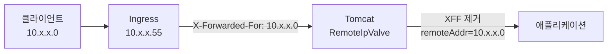

# 쿠버네티스에 올렸더니 X-Forwarded-For 가 사라졌다 — forward-headers-strategy 와 RemoteIpValve

프록시 뒤에서 클라이언트 IP 를 확인하는 인터셉터를 만들었다. `X-Forwarded-For` 와 `X-Real-IP` 를 읽어 내부 요청인지 판정하는 코드였다. 로컬에서는 잘 돌았는데 쿠버네티스에 올리니 **정상 내부 호출이 전부 차단**됐다.

진단 로그를 찍어보니 이랬다.

```
remoteAddr=10.x.x.0
xffCount=0  xff=[]
realIpCount=1  realIp=[<10.x.x.0>]
allHeaders=[host, x-request-id, x-real-ip, x-forwarded-host,
            x-forwarded-port, x-forwarded-proto, x-forwarded-scheme, ...]
```

`x-forwarded-host`, `x-forwarded-port`, `x-forwarded-proto` 는 다 있는데 **`x-forwarded-for` 만 없다.** nginx 설정에는 분명 보내게 돼 있었고, 같은 변수를 쓰는 `X-Real-IP` 는 멀쩡히 도착했다.

범인은 프록시가 아니라 **Spring Boot 자신**이었다. 가져갈 결론부터 적으면 이렇다.

- **쿠버네티스에 배포하면 `server.forward-headers-strategy` 가 아무 설정 없이 `NATIVE` 로 켜진다.** 로컬과 동작이 달라지는 지점이다.
- `NATIVE` 는 Tomcat 의 `RemoteIpValve` 를 쓰는데, 이 밸브는 `X-Forwarded-For` 를 **읽고 나서 지운다.** 애플리케이션이 그 헤더를 직접 읽으려 하면 이미 없다.

## 왜 켜졌나 — 클라우드 플랫폼 자동 감지

Spring Boot 문서에 명시돼 있다.

> If your application runs in a supported Cloud Platform, the `server.forward-headers-strategy` property defaults to `NATIVE`. In all other instances, it defaults to `NONE`.

`application.yml` 에 아무것도 안 적었으니 기본값 `NONE` 이겠거니 했는데, **기본값이 환경에 따라 달라진다.** 지원 플랫폼은 `CloudPlatform` enum 에 정의돼 있다.

| 값 | 플랫폼 |
| --- | --- |
| `NONE` | 감지 안 됨 |
| `CLOUD_FOUNDRY` | Cloud Foundry |
| `HEROKU` | Heroku |
| `SAP` | SAP Cloud |
| `NOMAD` | Nomad (3.1.0 부터) |
| `KUBERNETES` | 쿠버네티스 |
| `AZURE_APP_SERVICE` | Azure App Service |
| `AWS_ECS` | AWS ECS (4.0.0 부터) |

감지는 플랫폼별 환경변수로 한다. 쿠버네티스는 파드에 자동으로 주입되는 값을 본다.

```bash
$ kubectl exec <pod> -- env | grep KUBERNETES_SERVICE
KUBERNETES_SERVICE_HOST=10.x.x.1
KUBERNETES_SERVICE_PORT=443
```

이 변수는 **쿠버네티스가 모든 파드에 자동으로 넣어준다.** 내가 뭘 설정해서 켜진 게 아니라, 파드에 올린 순간 켜진 것이다.

## RemoteIpValve 가 하는 일

`NATIVE` 는 Tomcat 의 `RemoteIpValve` 를 활성화한다. 이 밸브는 요청이 컨트롤러에 닿기 전에 요청 객체를 다시 쓴다.

| 항목 | 동작 |
| --- | --- |
| `request.remoteAddr` | `X-Forwarded-For` 에서 추출한 실제 클라이언트 IP 로 **덮어쓴다** |
| `request.scheme` | `X-Forwarded-Proto` 가 `https` 면 `https` 로 |
| `request.secure` | 위에 따라 `true` / `false` |
| `request.serverPort` | 프로토콜에 맞춰 443 또는 80 |
| `X-Forwarded-For` 헤더 | 처리한 프록시 IP 를 **제거한다** |

마지막 줄이 핵심이다. 밸브는 `X-Forwarded-For` 를 **오른쪽부터 왼쪽으로** 훑으면서 신뢰할 수 있는 프록시 IP 를 제거한다. 공식 문서 표현은 이렇다.

> if it matches the internal proxies list, the ip/host is swallowed

그리고 `internalProxies` 의 기본값에는 **사설 대역이 전부 들어 있다.**

| 대역 | 포함 |
| --- | --- |
| `10.0.0.0/8` | 포함 |
| `172.16.0.0/12` | 포함 |
| `192.168.0.0/16` | 포함 |
| `127.0.0.0/8` | 포함 |
| `169.254.0.0/16` | 포함 |
| `100.64.0.0/10` | 포함 |
| IPv6 loopback | 포함 |

## 그래서 헤더가 통째로 사라진다

쿠버네티스 클러스터 안에서는 **모든 IP 가 사설 대역**이다. 그러면 이런 일이 벌어진다.



1. Ingress 가 `X-Forwarded-For: 10.x.x.0` 을 붙여 보낸다
2. Tomcat 이 받는다. TCP 소스는 Ingress 파드 IP(`10.x.x.55`)이고, 사설 대역이라 internal 로 판정
3. 밸브가 XFF 를 오른쪽부터 훑는다. `10.x.x.0` 도 사설 대역이라 **swallowed**
4. 제거하고 남은 값이 없으니 **헤더 자체가 제거**된다
5. `request.remoteAddr` 는 마지막으로 제거한 `10.x.x.0` 이 된다

공식 문서의 예시가 정확히 이 상황을 보여준다.

| | 처리 전 | 처리 후 |
| --- | --- | --- |
| `request.remoteAddr` | `192.168.0.10` | `140.211.11.130` |
| `x-forwarded-for` | `140.211.11.130, 192.168.0.10` | **null** |

`X-Real-IP` 가 살아남은 이유도 명확하다. **밸브가 보는 헤더는 `X-Forwarded-For` 하나**(`remoteIpHeader` 기본값)이고, `X-Real-IP` 는 nginx 가 별도로 붙이는 비표준 헤더라 손대지 않는다.

즉 내 인터셉터는 **Spring 이 이미 해준 일을 다시 하려다**, 그 과정에서 치워진 헤더를 찾아 헤맨 것이다. `getRemoteAddr()` 만 읽었으면 처음부터 답이 거기 있었다.

## internalProxies 와 trustedProxies

둘을 헷갈리기 쉬운데 역할이 다르다.

| | `internalProxies` | `trustedProxies` |
| --- | --- | --- |
| 의미 | 내 인프라의 프록시 | 신뢰하지만 기록은 남기고 싶은 외부 프록시 |
| 처리 | 제거하고 **버린다** | `X-Forwarded-By` 헤더로 **옮긴다** |
| 기본값 | 사설 대역 전체 | 비어 있음 |

신뢰하지 않는 IP 를 만나면 거기서 멈추고 그 값이 `remoteAddr` 가 된다. 그 왼쪽에 남은 값들은 `X-Forwarded-For` 에 그대로 남는다.

```
설정: internalProxies="192\.168\.0\.10"  trustedProxies="proxy1"

처리 전:  x-forwarded-for: 140.211.11.130, untrusted-proxy, proxy1
          request.remoteAddr: 192.168.0.10

처리 후:  request.remoteAddr: untrusted-proxy     ← 신뢰 못 하는 곳에서 멈춤
          x-forwarded-for: 140.211.11.130         ← 남음
          x-forwarded-by: proxy1                  ← 신뢰 프록시는 여기로
```

이 규칙 덕분에 **외부에서 헤더를 위조해도 신뢰 경계 밖의 값은 그대로 노출**된다. 위조한 IP 가 `remoteAddr` 가 되지 않는다.

## 세 가지 전략

| 값 | 구현 | 특징 |
| --- | --- | --- |
| `NATIVE` | 웹 서버 자체 기능 (Tomcat 은 `RemoteIpValve`) | 서블릿 컨테이너 레벨에서 처리해 빠르다. 헤더가 소비된다 |
| `FRAMEWORK` | `ForwardedHeaderFilter` (서블릿) / `ForwardedHeaderTransformer` (리액티브) | Spring 이 처리한다. 표준 `Forwarded` 헤더도 다룬다 |
| `NONE` | 없음 | 전달 헤더를 무시한다. `remoteAddr` 는 실제 TCP 소스 |

## 언제 무엇을 쓰나

| 상황 | 선택 |
| --- | --- |
| 프록시 뒤에서 클라이언트 IP·스킴이 필요하다 | 지정하지 않는다. 클라우드면 `NATIVE` 가 자동 적용 |
| 클라우드 밖(온프레미스 등)에서 프록시 뒤에 둔다 | `NATIVE` 를 명시 |
| 표준 `Forwarded` 헤더를 쓰거나 세밀한 제어가 필요하다 | `FRAMEWORK` |
| 전달 헤더를 애플리케이션이 직접 다뤄야 한다 | **`NONE` 을 명시** |

마지막 줄이 내가 겪은 경우다. 헤더를 직접 읽는 코드가 있다면 **자동으로 켜지는 동작과 충돌**한다. 둘 중 하나를 골라야 한다.

- 밸브에 맡기고 `getRemoteAddr()` 를 읽는다 (권장)
- 직접 다루겠다면 `server.forward-headers-strategy: NONE` 을 명시해 밸브를 끈다

## 어디서 깨지나

바로 DNS 나 프록시를 의심하기 어려운 형태로 나타나서 추적이 오래 걸린다.

- **헤더를 직접 읽는 코드가 빈 값을 본다** — 내 경우다. 로컬(`NONE`)에서는 헤더가 살아 있어 테스트가 통과하고, 배포 환경(`NATIVE`)에서만 깨진다. **환경에 따라 기본값이 달라지는 게 함정의 본질이다.**
- **`remoteAddr` 를 TCP 소스로 믿는 코드가 어긋난다** — 접근 제어나 감사 로그가 프록시 IP 대신 클라이언트 IP 를 보게 된다. 의도한 동작일 수도, 아닐 수도 있다.
- **신뢰 경계 설정 실수가 위조를 허용한다** — `internalProxies` 를 넓게 잡으면 외부가 보낸 XFF 값을 그대로 신뢰하게 된다. 기본값을 함부로 넓히지 않는 게 좋다.
- **리다이렉트 URL 이 http 로 나간다** — `X-Forwarded-Proto` 를 처리하지 못하면 `request.scheme` 이 http 로 남아, https 로 접속한 사용자에게 http 링크를 돌려준다.

## 확인 절차

의심될 때 밟는 순서다. 추측보다 이게 빠르다.

```bash
# 1. 클라우드 플랫폼이 감지되는 환경인가
kubectl exec <pod> -- env | grep -E "KUBERNETES_SERVICE|VCAP_|DYNO"

# 2. 애플리케이션이 실제로 보는 값 — 헤더를 목록째 찍는다
#    값만 찍으면 "빈 문자열 1개"와 "헤더 없음"이 구분되지 않는다
log.warn("remoteAddr={} headers={}",
         request.getRemoteAddr(),
         Collections.list(request.getHeaderNames()));

# 3. 프록시가 실제로 보내는 값과 대조
kubectl exec -n ingress-nginx <pod> -- grep "proxy_set_header X-Forwarded" /etc/nginx/nginx.conf
```

2번에서 내가 시간을 버렸다. 처음엔 헤더 값만 리스트로 찍었는데, 자바에서 **빈 문자열 하나가 든 리스트와 빈 리스트가 둘 다 `[]` 로 출력된다.** 두 경우는 판정이 갈리는데 로그로는 구분이 안 됐다. 개수를 따로 찍고 값을 `<>` 로 감싸고 나서야 헤더가 아예 없다는 걸 확인했다.

## 지금 보면

이 문제의 뿌리는 **설정하지 않은 것도 설정이라는 점**이었다. `application.yml` 에 `forward-headers-strategy` 가 없으니 기본값 `NONE` 일 거라 읽었고, 그 가정 위에서 헤더를 직접 파싱하는 코드를 짰다. 실제로는 배포 환경이 그 기본값을 바꿔놓고 있었다.

**프레임워크가 알아서 해주는 일을 모르면, 그 위에 같은 일을 한 번 더 얹게 된다.** 그리고 두 처리가 겹치는 지점에서 조용히 깨진다. 라이브러리가 자동으로 켜는 동작은 명시적으로 끄거나 명시적으로 맡기거나, 둘 중 하나를 골라야 한다는 걸 이번에 배웠다.

## 참고

- [Spring Boot — Use Behind a Proxy Server](https://docs.spring.io/spring-boot/how-to/webserver.html)
- [Spring Boot API — CloudPlatform](https://docs.spring.io/spring-boot/api/java/org/springframework/boot/cloud/CloudPlatform.html)
- [Apache Tomcat — RemoteIpValve](https://tomcat.apache.org/tomcat-10.1-doc/api/org/apache/catalina/valves/RemoteIpValve.html)
