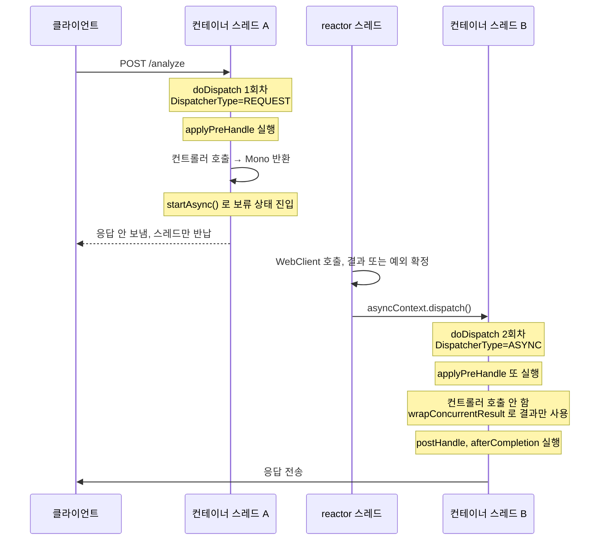

# DispatcherType과 서블릿 async 재디스패치 — Interceptor의 preHandle이 두 번 도는 이유

컨트롤러가 `Mono`를 반환하면 `DispatcherServlet.doDispatch()`가 **한 요청에 두 번** 실행된다.
그래서 `HandlerInterceptor.preHandle()`도 두 번 돈다.
나는 이걸 모르고 요청 ID를 인터셉터에서 발급하는 코드를 봤다가, 같은 요청의 로그 두 줄이 서로 다른 ID를 갖는 현상을 추적하게 됐다.

이 글은 세 질문에 답한다.

- `DispatcherType`은 무엇이고 왜 있는가
- `Mono`를 반환했을 뿐인데 왜 디스패치가 두 번 도는가
- 그 전제를 모르고 짠 코드는 어디서 깨지는가

> 요청 파이프라인에서 Filter, Interceptor, AOP를 어디에 둘지가 먼저 궁금하면 [Filter, Interceptor, AOP](./filter-interceptor-aop.md)를 먼저 읽으면 좋다. 이 글은 그중 Interceptor가 **몇 번 실행되는지**만 파고든다.

확인에 쓴 버전은 Spring Framework 6.1.8, Spring Boot 3.3, Jakarta Servlet 6.0이다.
아래 인용한 소스 줄번호는 모두 그 버전 기준이고, 실행 결과는 직접 돌려서 얻었다.

## DispatcherType은 요청이 서블릿에 들어온 경로를 말한다

서블릿 컨테이너는 하나의 요청을 서블릿에 **여러 번** 넘길 수 있다.
`DispatcherType`은 지금 이 진입이 그중 어떤 경로인지를 나타내는 enum이다.

| 값 | 언제 |
|---|---|
| `REQUEST` | 클라이언트가 보낸 최초 진입 |
| `FORWARD` | `RequestDispatcher.forward()`로 다른 서블릿에 넘길 때 |
| `INCLUDE` | `RequestDispatcher.include()`로 다른 서블릿 출력을 끼워 넣을 때 |
| `ERROR` | 에러 페이지 매핑으로 넘어갈 때 |
| `ASYNC` | `AsyncContext.dispatch()`로 비동기 처리 결과를 들고 다시 들어올 때 |

여기서 중요한 건 **다시 들어올 때도 같은 `HttpServletRequest` 객체를 쓴다**는 점이다.
`forward`한 서블릿에서 `request.getAttribute()`로 앞 서블릿이 심은 값을 읽을 수 있는 것과 같은 이유다.

`DispatcherType`이 왜 enum으로까지 노출돼 있냐면, **필터 매핑 단위가 이것**이기 때문이다.
`web.xml`의 `<dispatcher>`나 `FilterRegistrationBean.setDispatcherTypes()`로 "이 필터는 어느 경로의 진입에서 돌 것인가"를 지정한다.
Spring Boot의 기본값은 이렇게 정해진다.

```java
// AbstractFilterRegistrationBean.determineDispatcherTypes() — Spring Boot 3.3.0
if (this.dispatcherTypes == null) {
    if (... && filter instanceof OncePerRequestFilter) {
        return EnumSet.allOf(DispatcherType.class);
    }
    else {
        return EnumSet.of(DispatcherType.REQUEST);
    }
}
```

`Filter`를 직접 구현하면 `REQUEST`에만 등록되고, `OncePerRequestFilter`를 상속하면 전 경로에 등록된다.
다만 후자도 실제로는 async 진입에서 본문을 건너뛴다.

```java
// OncePerRequestFilter.doFilter() 안
if (isAsyncDispatch(request) && shouldNotFilterAsyncDispatch()) { ... }

// 그리고 기본값은
protected boolean shouldNotFilterAsyncDispatch() {
    return true;
}
```

즉 **필터는 기본 설정에서 async 재진입 때 안 돈다.** 경로가 다르다.
이게 뒤에 나올 대비의 절반이다.

## 동기 요청은 service()가 한 번 돈다

먼저 평범한 요청을 보자.

톰캣이 스레드를 하나 잡아 `service()`를 호출하고, `DispatcherServlet.doDispatch()`가 핸들러를 찾고 인터셉터를 돌리고 컨트롤러를 부른다.
반환값으로 응답을 쓰고 스레드를 반납한다.
요청 하나에 `service()` 한 번, `doDispatch()` 한 번이다.

`DispatcherType`은 `REQUEST` 하나만 등장하고 끝난다.

## Mono를 반환하면 흐름이 갈린다

컨트롤러가 `Mono`를 반환하는 순간 사정이 달라진다.
반환 시점에는 아직 결과가 없다. 모델 서버 응답을 기다려야 한다면 몇 초 뒤에 나온다.

Spring MVC는 이런 반환값을 **결과를 나중에 주겠다는 약속**으로 받아들인다.
`Callable`, `DeferredResult`, `CompletableFuture`, 그리고 `Mono`와 `Flux`가 모두 여기에 해당한다.
`Mono`는 내부에서 `DeferredResult`로 감싸진다.

이때 Spring은 `request.startAsync()`를 호출한다. 그러면 두 가지가 벌어진다.

- `service()`가 **응답을 닫지 않은 채** 그냥 리턴한다. 소켓은 열려 있고 요청은 보류 상태로 남는다.
- 톰캣 스레드는 풀로 돌아가 다른 요청을 받는다.

그리고 나중에 결과가 확정되면 Spring이 컨테이너에게 요청을 되돌려 준다.

```java
// WebAsyncManager:393
this.asyncWebRequest.dispatch();

// StandardServletAsyncWebRequest:169
this.asyncContext.dispatch();
```

`AsyncContext.dispatch()`가 하는 일이 이 글의 핵심이다.
이건 "결과를 알려 줄게"가 아니다.

> `dispatch()`는 이 요청을 서블릿 파이프라인에 **처음부터 다시 태워 달라**는 요청이다.

컨테이너는 스레드를 새로 잡아 `service()`를 다시 호출한다. 이번 진입의 `DispatcherType`이 `ASYNC`다.
그래서 `doDispatch()`도 다시 돈다.

`forward`와 같은 계열로 이해하면 쉽다.
`forward`하면 같은 request 객체로 서블릿이 한 번 더 실행되는데, async 재디스패치도 똑같이 같은 request 객체로 다시 실행된다.
구분은 `DispatcherType` 값뿐이다.

## doDispatch는 DispatcherType을 보지 않는다

여기까지가 "왜 다시 들어오는가"다. 그럼 다시 들어왔을 때 인터셉터가 왜 또 도는가.
`doDispatch()` 코드를 보면 답이 바로 나온다.

```java
// DispatcherServlet.java:1049 부터, 요지만 발췌
protected void doDispatch(HttpServletRequest request, HttpServletResponse response) throws Exception {
    WebAsyncManager asyncManager = WebAsyncUtils.getAsyncManager(request);
    ...
    mappedHandler = getHandler(processedRequest);          // 1065
    HandlerAdapter ha = getHandlerAdapter(mappedHandler.getHandler());

    if (!mappedHandler.applyPreHandle(processedRequest, response)) {   // 1084
        return;
    }

    mv = ha.handle(processedRequest, response, mappedHandler.getHandler());

    if (asyncManager.isConcurrentHandlingStarted()) {      // 1091
        return;
    }

    applyDefaultViewName(processedRequest, mv);
    mappedHandler.applyPostHandle(processedRequest, response, mv);
    ...
}
```

읽을 점이 셋이다.

- **`DispatcherType`을 확인하는 분기가 없다.** `doDispatch()`는 자기가 몇 번째 진입인지 모른다. 호출되면 처음부터 다 한다.
- 그래서 1084줄의 `applyPreHandle()`이 **무조건 다시 실행된다.** 등록된 인터셉터를 전부 순회해 `preHandle()`을 부르는 게 이 메서드가 하는 일이다.
- 1091줄에서 async가 시작됐으면 `return`한다. 그래서 첫 진입에서는 `applyPostHandle()`이 실행되지 않는다.

`postHandle`과 `afterCompletion`은 첫 진입에서 실행되지 않고 대신 다른 콜백으로 대체된다.

```java
// doDispatch 의 finally, DispatcherServlet.java:1116
if (asyncManager.isConcurrentHandlingStarted()) {
    // Instead of postHandle and afterCompletion
    if (mappedHandler != null) {
        mappedHandler.applyAfterConcurrentHandlingStarted(processedRequest, response);
    }
}
```

여기서 불리는 건 `AsyncHandlerInterceptor.afterConcurrentHandlingStarted()`다.
`HandlerInterceptor`만 구현했다면 이 인터페이스가 없으니 아무 일도 일어나지 않는다.
결과적으로 **첫 진입에서는 `preHandle`만 돌고 끝난다.**

정리하면 한 요청에서 인터셉터 콜백은 이렇게 갈린다.

| 콜백 | 첫 진입 (`REQUEST`) | 재진입 (`ASYNC`) |
|---|---|---|
| `preHandle` | 실행 | **또 실행** |
| `postHandle` | 건너뜀 | 실행 |
| `afterCompletion` | 건너뜀 | 실행 |
| `afterConcurrentHandlingStarted` | 실행 (해당 인터페이스 구현 시) | 해당 없음 |

## 그런데 컨트롤러는 다시 불리지 않는다

`doDispatch()`가 통째로 다시 도는데 컨트롤러 메서드까지 두 번 불리면 큰일이다.
그건 막혀 있다. 막는 위치가 핸들러 어댑터 안이다.

```java
// RequestMappingHandlerAdapter.invokeHandlerMethod() — 913줄 부근
if (asyncManager.hasConcurrentResult()) {
    Object result = asyncManager.getConcurrentResult();
    ...
    asyncManager.clearConcurrentResult();
    invocableMethod = invocableMethod.wrapConcurrentResult(result);
}

invocableMethod.invokeAndHandle(webRequest, mavContainer);
```

재진입 시점에는 `WebAsyncManager`에 결과가 이미 들어 있다.
그러면 컨트롤러 메서드 대신 **그 결과를 감싼 가짜 핸들러**로 바꿔치기한다.
이후 `invokeAndHandle()`은 결과 변환과 응답 쓰기만 수행한다.

이 비대칭이 이 구조에서 가장 헷갈리는 지점이다.

- `doDispatch` — 두 번 돈다
- `applyPreHandle` — 두 번 돈다
- 컨트롤러 메서드 — 한 번만 돈다

## 직접 세어봤다

소스만 읽고 넘어가면 남지 않을 것 같아 카운터를 붙여봤다.
`MockMvc`로 `Mono`를 반환하는 컨트롤러를 호출하고, 인터셉터의 `preHandle`이 몇 번 불리는지와 그때의 `DispatcherType`을 찍었다.

```java
MockMvc mvc = MockMvcBuilders.standaloneSetup(new ProbeController())
                             .addInterceptors(probe)
                             .build();

MvcResult result = mvc.perform(get("/probe")).andReturn();
// 여기서 result.getRequest().isAsyncStarted() == true

mvc.perform(asyncDispatch(result)).andReturn();
```

`MockMvcRequestBuilders.asyncDispatch()`라는 API가 존재하는 것 자체가 이미 답이다.
테스트에서 두 번째 디스패치를 명시적으로 태워야 한다는 뜻이다.

출력은 이랬다.

```
=== 1차: 클라이언트 요청 ===
[preHandle] dispatcherType=REQUEST  새로 만든 UUID=ef9608be-f00d-44ef-b635-5d6c5de07bb6
[controller] 호출됨
asyncStarted = true

=== 2차: AsyncContext.dispatch() 로 다시 태움 ===
[preHandle] dispatcherType=ASYNC    새로 만든 UUID=747ae62a-a6c3-47aa-858f-60bd17ca40f9
[afterCompletion] dispatcherType=ASYNC

preHandle 총 호출 횟수 = 2
```

`preHandle`은 두 번, 컨트롤러는 한 번, `afterCompletion`은 `ASYNC`에서만 실행됐다.
앞에서 소스로 읽은 그대로다.

한 가지 한계는 밝혀 둔다. `MockMvc`는 두 디스패치를 같은 스레드에서 순차 실행한다.
그래서 이 실험이 보여주는 건 **디스패치가 두 번 돈다**는 사실까지다.
실제 톰캣에서는 재디스패치가 보통 다른 스레드에서 일어나는데, 그건 이 테스트로 증명되지 않는다.

## 전체 흐름



## spring-boot-starter-web과 webflux를 같이 넣으면 어느 쪽이 뜨나

여기서 한 가지를 짚어야 한다.
`Mono`를 반환한다고 WebFlux 애플리케이션이 되는 게 아니다.

두 스타터가 함께 있으면 **Spring Boot는 서블릿 스택으로 뜬다.**
WebFlux는 `WebClient`를 쓰려고 넣은 의존성일 뿐이고, 톰캣과 Spring MVC가 요청을 처리한다.

이걸 헷갈리면 문제를 완전히 다른 곳에서 찾게 된다.
나는 "WebFlux니까 reactor 컨텍스트 전파가 깨졌겠지"라고 짐작하다가 시간을 썼는데, 애초에 서블릿 스택이었다.

내가 쓰는 판별 기준은 이렇다.

- 예외 핸들러가 `HttpServletRequest`를 파라미터로 받는가 → 서블릿
- 설정 클래스가 `WebMvcConfigurer`인가 `WebFluxConfigurer`인가
- 인터셉터가 `HandlerInterceptor`인가 `WebFilter`인가
- `spring.mvc.async.request-timeout` 설정이 실제로 먹는가 → 서블릿 async를 쓰고 있다는 뜻

세 계층이 한 요청 안에 섞인다는 그림을 갖고 있어야 한다.

| 구간 | 무엇이 도나 | 스레드 |
|---|---|---|
| 요청 수신부터 컨트롤러 진입까지 | 서블릿, Spring MVC | 컨테이너 스레드 |
| 컨트롤러가 반환한 `Mono` 체인 | reactor | reactor 스레드 |
| 결과 확정 후 응답 작성 | 서블릿 재디스패치 | 컨테이너 스레드 (다시 잡음) |

## 이 전제를 모르고 짠 코드는 어디서 깨지나

`preHandle`이 두 번 돈다는 걸 모르면, 인터셉터에 넣은 코드가 조용히 두 번 실행된다.
깨지는 유형은 크게 셋이다.

- **부수효과가 두 번 일어난다** — 이력 저장, 카운터 증가, 외부 호출을 `preHandle`에 넣으면 중복 실행된다.
- **값이 두 번 만들어진다** — ID 발급, 타임스탬프 기록처럼 매 호출이 새 값을 만드는 코드가 첫 값을 덮어쓴다.
- **인증이 두 번 검사된다** — 대개 무해하지만, 토큰 사용 횟수를 세거나 일회용 nonce를 소비하는 방식이면 두 번째 검사에서 실패한다.

그래서 Spring MVC에서 async를 쓰는 프로젝트의 인터셉터에는 이 방어가 관용적으로 들어간다.

```java
@Override
public boolean preHandle(HttpServletRequest request, HttpServletResponse response, Object handler) {
    if (DispatcherType.REQUEST != request.getDispatcherType()) {
        return true;
    }
    // 최초 진입에서만 할 일
    return true;
}
```

## 실제로 밟은 사례 — 요청 ID가 갈라졌다

내가 이걸 파게 된 계기는 운영 로그였다.
이미지 분석 요청을 모델 서버로 넘기는 API 서버에서, **같은 요청이 남긴 에러 로그 두 줄이 서로 다른 요청 ID를 갖고 있었다.**

로그가 두 줄인 이유는 찍는 지점이 두 군데였기 때문이다.

- 외부 호출 공통 sender — 다운스트림 응답이 에러 상태면 응답 자체를 남긴다
- 전역 예외 핸들러 — 그 실패가 예외로 올라오면 다시 남긴다

앞의 것은 reactor 스레드에서, 뒤의 것은 재디스패치된 컨테이너 스레드에서 찍힌다.
그런데 요청 ID를 발급하는 코드가 인터셉터의 `preHandle`에 이렇게 들어 있었다.

```java
String requestId = sanitizeRequestId(request.getHeader("X-Request-Id"));
MDC.put(REQUEST_ID, requestId != null ? requestId : UUID.randomUUID().toString());
```

헤더가 없으면 `UUID.randomUUID()`로 채운다. 그리고 이 코드는 `DispatcherType`을 보지 않는다.
재디스패치에서 `preHandle`이 다시 돌면서 **새 UUID를 만들어 MDC에 덮어쓴다.**

`DispatcherType`을 보지 않는 건 실수가 아니었다.
2023년 커밋 메시지에 의도가 남아 있었다. `afterCompletion`에서 감사 로그를 전송하는데, 그 호출이 재디스패치 스레드에서 일어나므로 그 스레드의 MDC도 채워져 있어야 했다.
같은 저장소의 다른 인터셉터 8개는 모두 `DispatcherType.REQUEST` 가드를 갖고 있었고, 이 하나만 의도적으로 빼 둔 상태였다.

문제는 **다시 채운다를 새로 만든다로 구현한 것**이었다. 원래 값을 이어받아야 했다.

여기서 인과를 한 번 잘못 짚었던 것도 적어 둔다.
나는 처음에 "스레드가 바뀌어 MDC가 비었고 그래서 새로 만들어졌다"고 생각했다.
그런데 `MockMvc`는 단일 스레드로 도는데도 UUID가 두 개 나왔다. 위 실험 출력이 그것이다.
`MDC.put()`이 기존 값 유무를 보지 않고 덮어쓰기 때문에, **스레드가 같아도 갈라진다.**
스레드 전환은 재실행이 필요해진 이유이지 갈라짐의 원인이 아니었다.

### 운영에서 드러난 대가

한 주 에러 로그를 분류하다 이 현상을 만났다. 로그 387건 중 288건이 같은 실패를 두 번 찍은 것이었고, 실제 사건은 243건이었다.

요청 ID로 이을 수 없으니 보정을 우회로 해야 했다.
두 로그 집합을 pod와 분 단위로 묶어 개수를 비교했고, 48개 버킷이 전부 일치해서 겨우 1:1 짝임을 확정했다.
`requestId` 한 필드로 `GROUP BY` 하면 끝날 일이었다.

더 아픈 건 추적이 끊기는 쪽이다.
공통 sender는 첫 번째 ID를 `X-Request-Id` 헤더로 모델 서버에 넘기고 있었다.
모델 서버 로그에는 첫 번째 ID가 남는데 우리 에러 로그에는 두 번째 ID가 남는다.
고객 문의를 받고 에러 로그에서 출발하면 모델 서버 로그로 넘어갈 방법이 없다.

### 고친 방향

두 디스패치가 공유하는 것은 `HttpServletRequest` 객체다. 여기에 담으면 스레드가 갈려도 이어진다.

```java
private String resolveRequestId(HttpServletRequest request) {

    if (request.getAttribute(REQUEST_ID_ATTRIBUTE) instanceof String cached) {
        return cached;
    }

    String requestId = sanitizeRequestId(request.getHeader("X-Request-Id"));

    if (requestId == null) {
        requestId = UUID.randomUUID().toString();
    }

    request.setAttribute(REQUEST_ID_ATTRIBUTE, requestId);

    return requestId;
}
```

`DispatcherType` 가드를 넣는 방식은 쓰지 않았다.
그러면 재디스패치 스레드의 MDC가 비어 감사 로그의 요청 ID가 `null`이 되고, 2023년에 내린 결정을 되돌리는 셈이 된다.
가드가 아니라 **값을 기억하는 것**이 맞는 해법이었다.

attribute 키를 MDC 키와 분리한 것도 의도가 있다.
`"requestId"`는 흔한 이름이라 다른 라이브러리가 같은 이름의 attribute를 쓸 여지가 있어서, 클래스명을 접두어로 붙였다.

## 가져갈 판단 기준

내가 이 일에서 남긴 체크리스트는 셋이다.

- **인터셉터에 코드를 넣을 때 "이게 두 번 실행돼도 괜찮은가"를 먼저 묻는다.** 컨트롤러가 `Mono`나 `DeferredResult`를 반환하는 프로젝트라면 두 번 실행이 기본이다.
- **디스패치를 넘겨야 할 값은 `ThreadLocal`이 아니라 request attribute에 둔다.** 스레드는 갈리지만 request 객체는 같다. 반대로 스레드 안에서만 유효한 값은 MDC에 둔다.
- **`DispatcherType` 가드를 붙이기 전에 "재실행이 왜 필요했는가"를 확인한다.** 가드가 다른 기능의 전제를 깨뜨릴 수 있다. 이번 경우 가드는 감사 로그를 깨뜨렸고, 필요한 건 값의 멱등성이었다.

## 언제 이 구조를 피하는 편이 나은가

Spring MVC에 `Mono`를 얹는 구성 자체가 나쁜 건 아니다. 외부 호출이 오래 걸릴 때 컨테이너 스레드를 붙잡지 않는 이점이 실재한다.
다만 다음 상황이면 다시 생각해볼 만하다.

- **가상 스레드를 이미 켰다면** 이점이 크게 줄어든다. 컨테이너 스레드가 싸지므로 블로킹으로 기다려도 손해가 작다. 대신 이중 디스패치라는 복잡도는 그대로 남는다. 가상 스레드 자체는 [Virtual Thread와 Project Loom](../virtual-thread.md)에 정리해 뒀다.
- **인터셉터에 부수효과가 많은 레거시라면** 이중 실행 전제를 모든 인터셉터에 다시 검토해야 한다. 하나만 놓쳐도 조용히 두 번 실행된다.
- **처음부터 리액티브로 갈 수 있다면** 진짜 WebFlux로 가는 편이 낫다. 서블릿 async 재디스패치라는 층이 아예 없어진다.

반대로 이 구성을 유지할 이유도 분명하다. 서블릿 생태계의 필터, 인터셉터, `HttpServletRequest` 기반 도구를 그대로 쓸 수 있다.

## 지금 보면

이 문제의 본질은 코드가 틀린 게 아니라 **전제가 문서화되지 않은 것**이었다.
"`preHandle`은 한 요청에 한 번 돈다"는 암묵적 전제 위에서 짠 코드였고, 그 전제는 `Mono`를 반환하기 시작한 순간 깨졌다.
그런데 깨진 시점에 아무 신호도 나지 않았다.

기존 테스트도 이 전제를 검증하지 않았다.
요청 ID 관련 테스트가 헤더 채택, UUID 대체, 문자열 정리, MDC 정리까지 덮고 있었는데 **디스패치를 두 번 태우는 경우가 없었다.**
단위 테스트가 실행 횟수 전제를 검증하지 않으면, 프레임워크가 몇 번 부르는지는 테스트 밖의 일이 된다.

로그를 남기는 코드는 스스로 깨져도 조용하다는 것도 배운 점이다.
요청 ID가 갈라져도 응답은 정상이고 알람도 안 울린다.
운영 로그를 사람이 직접 분류하다 발견했다. 관측 수단 자체를 관측하는 장치는 따로 두지 않았다는 게 회고 지점이다.

## 관련 문서

- [Filter, Interceptor, AOP](./filter-interceptor-aop.md) — 횡단 관심사를 어느 계층에 둘지 결정하는 기준
- [MDC](../MDC.md) — MDC의 스레드 지역성과 분산 추적 구조
- [Virtual Thread와 Project Loom](../virtual-thread.md) — 가상 스레드가 async 모델의 이점을 어떻게 바꾸는가

## 참고 자료

- [Jakarta Servlet 6.0 Specification — Asynchronous Processing](https://jakarta.ee/specifications/servlet/6.0/jakarta-servlet-spec-6.0#asynchronous-processing)
- [Jakarta Servlet API — AsyncContext.dispatch()](https://jakarta.ee/specifications/platform/9/apidocs/jakarta/servlet/asynccontext#dispatch())
- [Spring Framework Reference — Asynchronous Requests](https://docs.spring.io/spring-framework/reference/web/webmvc/mvc-ann-async.html)
- [Spring Framework Reference — Handler Interceptors](https://docs.spring.io/spring-framework/reference/web/webmvc/mvc-servlet/handlermapping-interceptor.html)
- Spring Framework 6.1.8 소스 — `DispatcherServlet`, `HandlerExecutionChain`, `RequestMappingHandlerAdapter`, `WebAsyncManager`, `OncePerRequestFilter`
