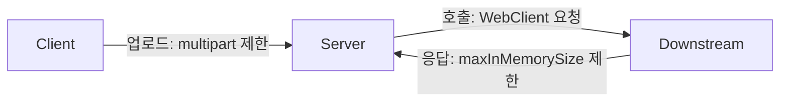

# WebClient가 큰 응답을 받으면 왜 죽는가 — maxInMemorySize와 DataBufferLimitException

> [API Gateway를 걷어낸 자리 채우기](../../devops/k8s/api-gateway-removal-rewrite-and-https.md)에서 겪은 요청 크기 병목 4개 중 하나를 여기서 따로 깊게 다룬다. 그 글의 맥락(20MB 이미지 처리) 없이 WebClient 버퍼 설정 자체가 궁금해서 왔어도 이 글만으로 읽힌다.

Spring WebFlux의 `WebClient`는 응답을 스트림으로 처리하는 리액티브 클라이언트인데도, 내부적으로는 응답 바디를 한 번에 메모리에 올려야 하는 순간이 있다. 그 한도를 넘기면 조용히 실패하는 게 아니라 `DataBufferLimitException`을 던지는데, 이 예외 메시지만 보고는 "버퍼가 왜?"라는 생각이 먼저 든다. 이 글은 그 왜를 정리한 기록이다.

## WebClient가 리액티브인데 왜 메모리 한도가 있나

`WebClient`는 응답 바디를 `Flux<DataBuffer>`로 받는다. 청크 단위로 흘려보내기만 하면 되는 것 같지만, 실제로 애플리케이션 코드가 원하는 건 대부분 완성된 객체다 — `Mono<MyDto>`로 JSON을 역직렬화하거나, `Mono<byte[]>`로 바디 전체를 받거나. 이 변환을 하려면 청크들을 다시 하나로 모아야 하고, 그 순간 리액티브 스트림이 아니라 평범한 메모리 버퍼가 된다.

Spring은 이 "다시 모으는" 과정에서 무한정 쌓이는 걸 막기 위해 `maxInMemorySize`라는 상한을 둔다. 기본값은 256KB로, 대부분의 JSON API 응답에는 넉넉하지만 파일이나 이미지를 다루는 순간 바로 부족해진다.

```java
@Bean
public WebClient webClient() {
    ExchangeStrategies strategies = ExchangeStrategies.builder()
            .codecs(configurer -> configurer.defaultCodecs()
                    .maxInMemorySize(1024 * 1024 * 30))  // 30MB
            .build();

    return WebClient.builder()
            .exchangeStrategies(strategies)
            .build();
}
```

`ExchangeStrategies`가 인코더/디코더 설정을 묶는 단위이고, `defaultCodecs().maxInMemorySize(...)`가 그 안에서 버퍼 상한을 정하는 지점이다. 이 값을 넘는 응답이 들어오면 `DataBufferLimitException: Exceeded limit on max bytes to buffer`가 발생한다.

## 어디서 이 한도가 걸리는지 — 나를 헷갈리게 한 지점

이 설정을 처음 마주쳤을 때 헷갈렸던 지점이 하나 있다. 요청 크기 제한과 응답 버퍼 제한은 완전히 별개의 설정인데, 증상만 보면 둘 다 "큰 파일에서 실패한다"로 똑같이 보인다는 점이다.

- 서버가 **받는** 요청 크기 — Spring MVC/WebFlux의 `multipart.max-file-size` 같은 설정. 클라이언트가 서버로 파일을 업로드할 때 걸린다.
- 서버가 **다른 서버를 호출한 응답**을 받는 크기 — `WebClient`의 `maxInMemorySize`. 서버 자신이 클라이언트가 되어 다른 API를 부를 때 걸린다.

두 설정을 하나로 착각하고 요청 쪽만 올리면, 서버가 외부 API를 호출해서 큰 응답을 돌려받는 지점에서 여전히 실패한다. 요청 하나가 애플리케이션 경계를 몇 번 넘는지 세어보고, 경계마다 이 두 종류의 제한이 각각 걸려 있는지 확인하는 습관이 붙은 계기였다.



## 이 한도를 올릴 때 같이 봐야 하는 것

`maxInMemorySize`만 올리고 끝내면 안 되는 이유가 있다. 이 값은 딱 **한 연결이 응답을 모으는 데 쓰는 상한**일 뿐이고, 실제 프로세스 메모리 사용량은 동시에 처리 중인 요청 수만큼 곱해진다는 걸 기억해야 한다.

예를 들어 30MB로 올려두고 요청이 동시에 5개 들어오면, 이론상 버퍼만으로 150MB까지 늘어날 수 있다. 여기에 JSON 역직렬화·이미지 디코딩 같은 추가 처리 메모리까지 겹치면 실제 사용량은 원본 크기의 몇 배가 된다. 컨테이너 환경에서 이 값을 올릴 때는 컨테이너 메모리 limit도 함께 계산해야 하는 이유가 여기 있다 — 버퍼 상한 하나만 넉넉하게 잡아 놓고 컨테이너 limit은 그대로 두면, 동시 요청이 몰리는 순간 OOMKilled로 이어진다.

> 이 계산을 실제로 컨테이너 메모리 limit·k8s 노드 사양과 함께 어떻게 맞췄는지는 [API Gateway를 걷어낸 자리 채우기](../../devops/k8s/api-gateway-removal-rewrite-and-https.md)의 요청 크기 병목 부분에 있다.

## 판단 기준

WebClient로 큰 응답(파일, 이미지, 대용량 JSON)을 받을 일이 있다면 아래를 순서대로 확인하는 게 좋다.

- 이 호출이 실제로 최대 얼마나 큰 응답을 받을 수 있는지 먼저 상한을 정한다. "일단 넉넉하게"보다 실제 최대치 + 여유분으로 정하는 게 뒤에서 메모리 계산이 쉬워진다.
- `maxInMemorySize`를 그 상한에 맞춰 올린다.
- 동시 요청 수 × 버퍼 상한을 곱해서 이론상 최대 메모리를 계산해본다.
- 컨테이너/파드 메모리 limit이 그 계산값보다 여유 있는지 확인한다.
- 스트리밍으로 처리할 수 있는 케이스라면 `Mono<byte[]>`/DTO 변환 대신 `Flux<DataBuffer>`를 그대로 넘기는 방법도 검토한다. 이 경우 애초에 메모리에 다 모으지 않아도 되므로 `maxInMemorySize` 제약을 피할 수 있다.

## 참고

- Spring Framework 공식 문서 — [Web Reactive: Codecs](https://docs.spring.io/spring-framework/reference/web/webflux/reactive-spring.html#webflux-codecs)
