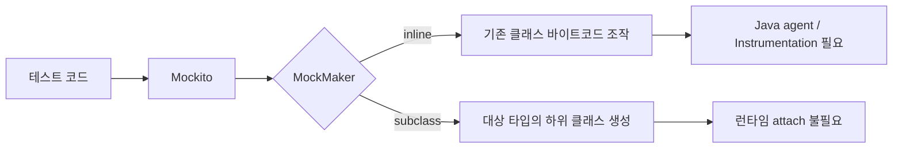
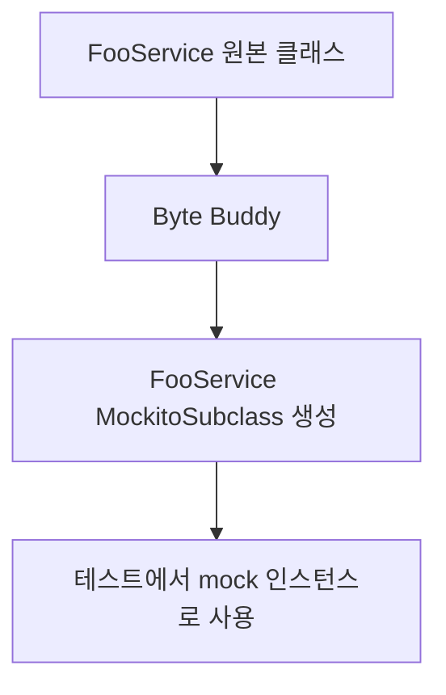
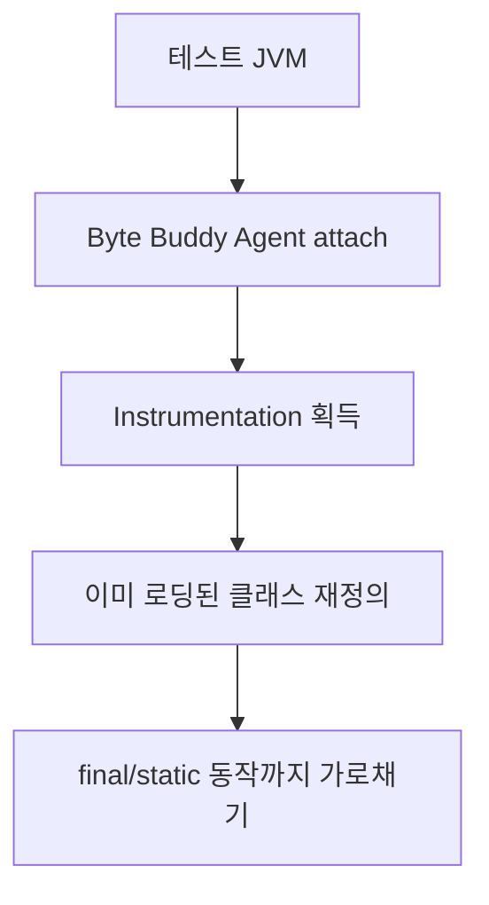
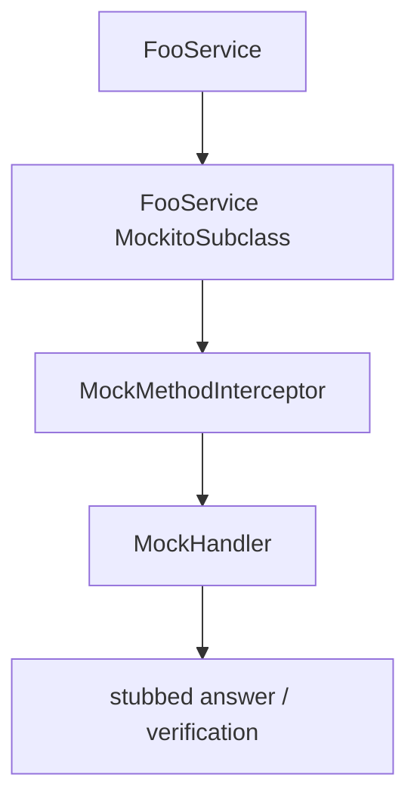

# Java 21 테스트에서 Mockito `mock-maker-subclass`로 JVM attach를 피하기

Spring Boot 3 + Java 21 프로젝트에서 테스트가 갑자기 Mockito 초기화 단계에서 깨졌다. 처음에는 내가 방금 건드린 테스트가 문제라고 생각했는데, 실제 원인은 테스트 코드가 아니라 Mockito의 mock 생성 방식이었다. 이 글은 `mock-maker-subclass`가 무슨 역할을 하는지, 왜 `-javaagent`보다 CI에서 다루기 쉬웠는지 정리한 기록이다.

문제 상황은 단순했다. 새로 추가한 테스트만 돌리면 통과하는데, 전체 `mvn verify`를 돌리면 여러 테스트가 Mockito `MockMaker` 초기화에서 실패했다. 실패 지점은 비즈니스 로직이 아니라 Mockito가 mock 객체를 만들기 전에 사용하는 Byte Buddy agent attach 경로였다.

## 먼저 결론

이번 문제의 핵심은 Mockito 기능 부족이 아니라 **필요 이상으로 강한 mock maker를 쓰고 있었다**는 점이었다.

- `mock-maker-inline`은 final class, final method, static mock까지 다룰 수 있지만 Java agent attach가 필요하다.
- `mock-maker-subclass`는 하위 클래스를 만들어 mock을 만들기 때문에 final/sealed/static mock에는 약하지만, agent attach가 필요 없다.
- 이번 테스트 suite는 final/static mock이 필요 없었으므로 subclass 방식이 더 좁고 안정적인 해결이었다.

테스트 인프라 문제를 볼 때는 "무엇을 더 켤까"보다 "현재 테스트가 실제로 필요로 하는 mock 능력이 무엇인가"를 먼저 확인하는 편이 낫다.

## MockMaker는 mock을 어떻게 만들지 결정하는 플러그인이다

Mockito에서 `MockMaker`는 말 그대로 mock 객체를 만드는 엔진이다. 같은 `Mockito.mock(Foo.class)` 호출이라도 어떤 MockMaker를 쓰느냐에 따라 방식과 제약이 달라진다.



Mockito 5 기준으로 자주 만나는 선택지는 두 가지다. 둘 다 Byte Buddy와 관련이 있지만, 같은 의미는 아니다.

| MockMaker | 방식 | 장점 | 제약 |
|---|---|---|---|
| `mock-maker-inline` | Byte Buddy Agent + Java Instrumentation API로 기존 클래스를 재정의 | final class, final method, static mock 같은 강한 기능 가능 | 런타임 agent attach 또는 명시적 `-javaagent`가 필요 |
| `mock-maker-subclass` | Byte Buddy로 하위 클래스를 새로 만들어 mock 생성 | JVM attach가 필요 없어 CI와 샌드박스에서 안정적 | final/sealed class, final method, static mock에는 부적합 |

내가 만난 문제는 inline 방식의 장점이 필요하지 않은 테스트에서 inline 방식의 비용만 치르고 있던 상황이었다.

## Byte Buddy와 Byte Buddy Agent는 다르다

처음에는 "Mockito가 Byte Buddy를 쓰니까 어차피 agent가 필요한 것 아닌가?"라고 생각하기 쉽다. 여기서 구분해야 할 게 있다.

Byte Buddy는 런타임에 클래스를 만들어내거나 바이트코드를 조작하는 라이브러리다. `mock-maker-subclass`도 Byte Buddy를 쓴다. 다만 이 경우에는 기존 클래스를 건드리지 않고 `FooService`를 상속한 새 클래스를 만든다.



반면 Byte Buddy Agent는 이미 로딩된 클래스를 JVM Instrumentation API로 다시 정의하는 쪽에 가깝다. `mock-maker-inline`이 final method나 static method까지 다룰 수 있는 이유가 여기에 있다. 기존 클래스의 메서드 바이트코드 자체를 바꾸는 방향이므로 JVM에 agent가 붙어야 한다.



그래서 이번 선택은 "Byte Buddy를 안 쓰자"가 아니었다. **Byte Buddy는 그대로 쓰되, Byte Buddy Agent attach 경로를 피하자**에 가까웠다.

## 왜 Java 21 환경에서 더 잘 보였나

inline mock maker는 final class나 static method까지 mock할 수 있게 해준다. 대신 JVM에 Java agent를 붙여야 한다. Mockito는 가능하면 런타임에 Byte Buddy agent를 attach하려고 시도한다. 로컬 개발 머신에서는 이것이 별문제 없이 넘어가기도 하지만, 다음 조건이 겹치면 실패한다.

- JDK/JRE 구성이나 보안 정책 때문에 self-attach가 제한되는 경우
- CI 컨테이너나 샌드박스가 attach 관련 권한을 제한하는 경우
- Java 21 이후 동적 agent loading 경고와 정책 변화가 더 눈에 띄는 경우
- Maven Surefire가 띄운 테스트 JVM에 필요한 agent 옵션이 명시되지 않은 경우

정확히 말하면 Java 21이 모든 Mockito inline 테스트를 막는다는 뜻은 아니다. inline mock maker는 여전히 유효하다. 다만 테스트 JVM이 agent attach를 허용해야 하고, 그 전제가 로컬·CI·샌드박스마다 달라질 수 있다. 이번 실패는 그 전제가 흔들린 사례에 가까웠다.

처음에는 Surefire `argLine`에 `-javaagent`를 넣는 방법을 떠올렸다.

```xml
<argLine>
  -javaagent:${settings.localRepository}/net/bytebuddy/byte-buddy-agent/.../byte-buddy-agent-....jar
</argLine>
```

이 방식은 실제로 로컬에서는 동작했다. 하지만 CI 관점에서는 마음에 걸렸다. `${settings.localRepository}` 경로가 항상 같은지, 해당 artifact가 테스트 시작 전에 반드시 내려받혀 있는지, Maven mirror나 cache 정책이 바뀌어도 안정적인지까지 같이 책임져야 한다. 테스트 안정화를 위해 테스트 JVM 옵션과 로컬 저장소 경로를 더 강하게 결합하는 셈이다.

## 이번 경우에는 subclass가 더 좁은 해결이었다

내가 확인한 테스트들은 static mock이나 final class mock을 쓰지 않았다. 대부분 일반 서비스, 어댑터, DTO 주변의 mock/stub이었다. 그렇다면 inline mock maker가 제공하는 강한 기능이 필요하지 않았다.

이때 다음 파일 하나로 Mockito의 mock maker를 바꿀 수 있다.

```text
src/test/resources/mockito-extensions/org.mockito.plugins.MockMaker
```

내용은 한 줄이다.

```text
mock-maker-subclass
```

이 파일은 테스트 classpath에 올라가고, Mockito는 시작 시점에 이 extension file을 읽어 MockMaker를 선택한다. `mock-maker-subclass`는 대상 타입을 상속한 하위 클래스를 만들고, 그 하위 클래스에 호출을 가로채는 interceptor를 붙인다. 새 클래스를 만들어 쓰는 방식이라 기존 클래스를 재정의하기 위한 runtime attach가 필요 없다.



대신 이 선택은 기능을 줄인다. final class는 상속할 수 없고, final method는 override할 수 없다. static method도 인스턴스 하위 클래스로 가로챌 수 없다. sealed class도 허용된 하위 타입 목록이 고정되어 있으므로 Mockito가 임의로 만든 subclass를 끼워 넣을 수 없다. 그래서 이 설정은 "Mockito 기능을 더 세게 켜는 설정"이 아니라, 오히려 **필요한 기능만 남겨 테스트 JVM을 단순하게 만드는 설정**에 가깝다.

## final 타입은 왜 subclass로 mock할 수 없나

`mock-maker-subclass`는 이름 그대로 하위 클래스를 만든다. 다음 코드가 있다고 하자.

```java
final class TokenVerifier {

    boolean verify(String token) {
        return token != null && token.startsWith("Bearer ");
    }
}
```

subclass 방식의 Mockito가 하고 싶은 일은 개념적으로 이런 클래스 생성이다.

```java
class TokenVerifierMockitoMock extends TokenVerifier {

    @Override
    boolean verify(String token) {
        return mockHandler.handle("verify", token);
    }
}
```

하지만 Java에서 `final class`는 상속할 수 없다. 컴파일러가 막는 제약이고, 런타임에 몰래 하위 클래스를 만들어도 JVM 검증 단계에서 받아들일 수 없다. 그래서 subclass mock maker는 final class를 mock할 수 없다. Mockito source에서도 subclass mock maker는 primitive, final, sealed 타입을 mock 불가능한 타입으로 분류한다.

final method도 같은 이유다.

```java
class TokenVerifier {

    final boolean verify(String token) {
        return token != null && token.startsWith("Bearer ");
    }
}
```

이 경우 클래스 자체는 상속 가능하지만 `verify`는 override할 수 없다. subclass mock은 메서드를 override해서 호출을 가로채야 하는데, final method는 그 진입점이 막혀 있다. 그래서 final method를 stub하거나 verify해야 하는 테스트라면 subclass 방식은 맞지 않는다.

inline mock maker는 이 제약을 다른 방식으로 우회한다. 상속해서 override하는 대신 기존 클래스 바이트코드를 재정의한다. 그래서 final class와 final method mock이 가능해진다. 대신 앞에서 말한 agent attach 비용을 치른다.

## sealed 타입은 final과 비슷하지만 이유가 조금 다르다

Java 17부터 정식으로 들어온 sealed type도 subclass 방식과 잘 맞지 않는다. sealed class/interface는 하위 타입을 `permits` 목록으로 제한한다.

```java
sealed interface PaymentResult permits Approved, Rejected {
}

final class Approved implements PaymentResult {
}

final class Rejected implements PaymentResult {
}
```

여기서 Mockito가 임의로 `PaymentResultMockitoMock` 같은 구현체를 만들고 싶어도, `PaymentResult`의 `permits` 목록에 그 타입이 없다. sealed의 핵심은 "이 타입 계층은 여기 적힌 하위 타입으로 닫혀 있다"는 계약이다. 테스트 프레임워크가 런타임에 새 하위 타입을 끼워 넣는 순간 그 계약을 깨게 된다.

이런 타입은 보통 mock보다 실제 하위 타입 인스턴스를 쓰는 편이 낫다.

```java
PaymentResult result = new Approved();
```

sealed 계층은 상태 공간을 좁히기 위해 도입하는 경우가 많다. 그 좁힌 상태 공간을 mock으로 다시 열어버리면 테스트가 실제 도메인 모델보다 더 넓은 세계를 검증하게 된다. 그래서 sealed 타입을 자주 mock해야 한다면 mock maker를 바꾸기 전에 테스트 설계를 먼저 의심해볼 만하다.

## static mock은 왜 subclass로 해결되지 않나

static method는 인스턴스 dispatch를 타지 않는다. subclass mock maker는 mock 인스턴스를 만들고, 그 인스턴스 메서드 호출을 interceptor로 넘긴다. 그런데 static 호출은 애초에 인스턴스를 거치지 않는다.

```java
class TokenClock {

    static long now() {
        return System.currentTimeMillis();
    }
}
```

`TokenClock.now()` 호출을 바꾸려면 하위 클래스 인스턴스를 만드는 것으로는 부족하다. 이미 정해진 클래스의 static method 호출 자체를 바꿔야 한다. 이 영역은 inline mock maker가 Instrumentation API를 써서 처리하는 쪽이다.

다만 static mock이 필요하다는 건 설계 신호이기도 하다. 시간, 랜덤, 외부 환경 값은 가능하면 인터페이스나 `Clock` 같은 주입 가능한 객체로 빼는 편이 테스트가 단순해진다.

## 언제 쓰고 언제 피할까

내가 잡은 기준은 이렇다.

`mock-maker-subclass`를 써도 되는 경우:

- 테스트 대상과 협력자가 대부분 interface 또는 non-final class다.
- static mock, construction mock을 쓰지 않는다.
- final method를 stub하거나 verify하지 않는다.
- CI나 샌드박스에서 Mockito inline agent attach가 불안정하다.
- 테스트 인프라를 JVM 옵션보다 classpath resource로 고정하고 싶다.

피해야 하는 경우:

- Kotlin처럼 class/method가 기본 final인 코드가 많다.
- final class를 직접 mock해야 한다.
- `mockStatic`, `mockConstruction`이 테스트 전략의 일부다.
- 레거시 코드 때문에 static method를 당장 걷어내기 어렵다.

즉 선택지는 "inline이 더 최신이고 subclass가 낡았다"가 아니다. 테스트가 요구하는 mock 능력과 실행 환경 제약이 무엇인지에 따라 고르는 문제다.

## 이 작업에서 같이 배운 것

처음에는 전체 테스트 실패를 새로 작성한 테스트의 문제로 의심했다. 그런데 단일 테스트는 통과했고, 전체 suite에서 Mockito 초기화가 흔들렸다. 이럴 때는 실패한 테스트 클래스보다 더 앞단, 즉 테스트 프레임워크 bootstrap 단계부터 봐야 한다.

내가 쓴 확인 순서는 이랬다.

- 새 테스트 단독 실행으로 기능 회귀 여부 확인
- 전체 `mvn verify`로 suite 실패 재현
- 실패 stack trace에서 비즈니스 코드가 아니라 `MockMaker` 초기화가 root인지 확인
- `-javaagent` 방식으로 원인 가설 검증
- CI 경로 결합을 줄이기 위해 `mock-maker-subclass`로 대체
- static/final mock 사용 여부를 검색해 기능 축소가 안전한지 확인

이 순서가 중요했다. 바로 `mock-maker-subclass`를 넣었다면 "왜 이 설정이 안전한가"를 설명하기 어려웠을 것이다. 반대로 `-javaagent`가 통과한다는 사실을 먼저 확인했기 때문에, 문제의 축이 테스트 로직이 아니라 inline agent attach라는 점을 분리할 수 있었다.

## 결론

Mockito의 inline mock maker는 강력하다. final class, final method, static mock이 필요한 테스트에서는 거의 필수다. 하지만 그런 기능을 쓰지 않는 프로젝트라면 그 강력함이 CI 불안정성으로 돌아올 수 있다.

이번에는 `mock-maker-subclass`가 더 나은 선택이었다. 테스트가 요구하는 mock 능력은 유지하면서, Java agent attach라는 실행 환경 의존성을 제거했기 때문이다. 테스트 인프라를 고칠 때는 "무엇을 더 켤까"보다 "지금 테스트가 실제로 필요로 하는 능력이 무엇인가"를 먼저 묻는 편이 더 안전하다.

## 같이 보면 좋은 글

- [시니어 Java 백엔드를 위한 테스트 전략](../../testing/testing-strategies.md)
- [Spring AOP 프록시와 ByteBuddy](../spring/spring-aop-proxies-deep-dive.md)
