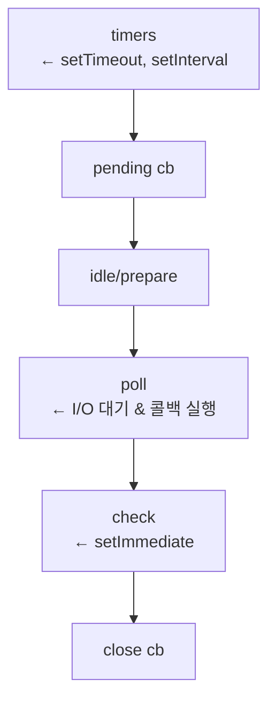

# `setImmediate()`

- `setTimeout(fn, delay)`
  - 최소 delay(ms)가 지난 뒤, fn을 실행하도록 Timers 큐에 등록
- `setInterval(fn, interval)`
  - interval(ms)마다 반복 실행되도록 Timers 큐에 등록
- `setImmediate(fn)`
  - 현재 이벤트 루프 사이클이 끝난 직후, Check 큐에서 실행

핵심:

- `setTimeout` / `setInterval` -> 시간 기준
- `setImmediate` -> 이벤트 루프 단계 기준

## Node.js 이벤트 루프 구조



## setTimeout / setInterval의 동작 원리

- **setTimeout**
  - ```js
    setTimeout(fn, 0);
    ```
  - "즉시 실행" 아님
  - 의미:
    - **0ms 이상 지난 후**
    - timers 단계에서 실행 가능 상태가 되면 실행
  - poll 단계가 길어지면 **더 늦게 실행될 수 있음**
- **setInterval**
  - ```js
    setInterval(fn, 1000);
    ```
  - timers 단계에서
  - 이전 실행이 끝난 시점 기준이 아니라
  - **interval이 지났는지 여부**로 실행 여부 판단
  - 주의:
    - 콜백 실행 시간이 길면
    - 호출 간격은 **밀릴 수 있음**
    - **겹쳐서 실행되지는 않음** (싱글 스레드)

## setImmediate의 동작 원리

```js
setImmediate(fn);
```

- poll 단계가 끝난 뒤
- check 단계에서 실행
- 시간 개념 X

### 왜 존재하나?

> "I/O 콜백 이후에, 다음 timers 전에 실행하고 싶다"

즉

- `setTimeout(0)`보다, **I/O 콜백 이후 실행이 더 보장됨**

## 예시

### I/O 콜백 내부

```js
require('fs').readFile(__filename, () => {
  setTimeout(() => console.log('timeout'), 0);
  setImmediate(() => console.log('immediate'));
});
```

결과는 **항상**

```text
immediate
timeout
```

이유:

- readFile 콜백 -> poll 단계
- poll 끝 -> check -> setImmediate
- 다음 루프 -> timers -> setTimeout

### 메인 모듈 — 여기서는 "항상"이 아니다

같은 코드를 I/O 콜백 밖, 즉 메인 모듈에 두면 순서가 보장되지 않는다.

```js
setTimeout(() => console.log('timeout'), 0);
setImmediate(() => console.log('immediate'));
```

Node.js v24.15.0에서 200회 실행한 결과다.

| 출력 순서 | 횟수 |
| --- | ---: |
| `immediate` -> `timeout` | 190 |
| `timeout` -> `immediate` | 10 |

즉 **대부분 immediate가 먼저지만 5%는 뒤집힌다.**
한두 번 돌려보고 "항상 이 순서"라고 결론 내리기 쉬운 지점이다.

왜 갈리는가.

- `setTimeout(fn, 0)`은 내부적으로 1ms로 보정된다
- 프로세스가 첫 이벤트 루프에 진입하기까지 걸린 시간이 그 1ms를 넘겼는지에 따라
  timers 단계에서 바로 실행될 수도, 다음 루프로 밀릴 수도 있다
- 이 시간은 프로세스 시작 비용에 좌우되므로 실행마다 달라진다

**정리하면 이렇다.**

| 등록 위치 | 순서 |
| --- | --- |
| I/O 콜백 안 | `setImmediate`가 항상 먼저 (poll 다음이 check라서) |
| 메인 모듈 | 보장 없음 — 실측 190:10 |

순서에 의존하는 코드를 짜야 한다면 메인 모듈이 아니라 I/O 콜백 안에서 등록해야 한다.

출처: [Node.js — Event Loop, Timers, and process.nextTick()](https://nodejs.org/learn/asynchronous-work/event-loop-timers-and-nexttick)

## setInterval과 이벤트 루프 관계

- 매 이벤트 루프의 **timers 단계**에서 검사
- interval이 지났으면 실행
- 실행이 밀리면 다음 실행도 밀림
- 누적 실행 X

- 그래서 정확한 주기 작업에는
  - setTimeout 재귀 패턴이 더 안전한 경우도 많음

## 언제 무엇을 쓰는가? (실무 기준)

### setTimeout

- 재시도
- debounce
- 일정 시간 지연

### setInterval

- polling
- heartbeat
- 단순 주기 작업

### setImmediate

- I/O 이후 후처리
- 이벤트 루프 양보
- CPU-heavy 작업을 쪼갤 때

## setImmediate vs Promise 실행 순서

핵심 규칙

> Promise (`then`, `finally`)는 setImmediate보다 항상 먼저 실행된다

이유:

- Promise -> Microtask Queue
- setImmediate -> Check phase (Macrotask)

실행 우선순위 요약

```text
현재 콜스택
↓
Microtask Queue
  - Promise.then
  - Promise.finally
  - queueMicrotask
↓
(Event loop phase 이동)
↓
Check phase
  - setImmediate
```

> Microtask는 이벤트 루프 phase를 건너뛰고 즉시 실행
