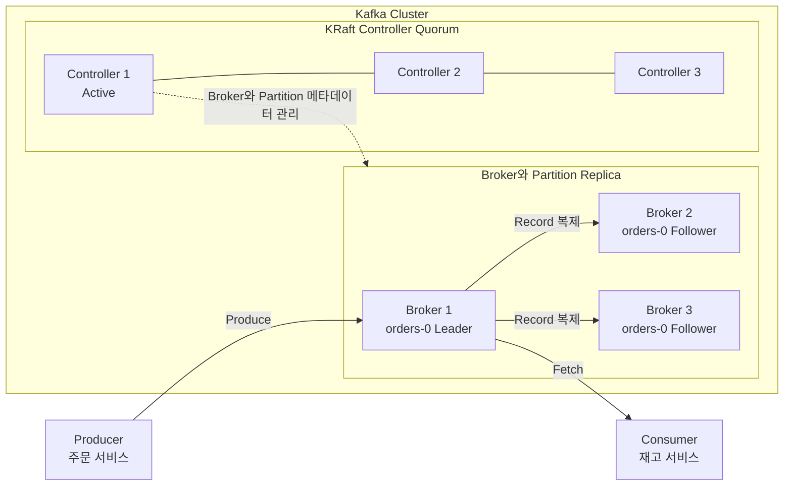
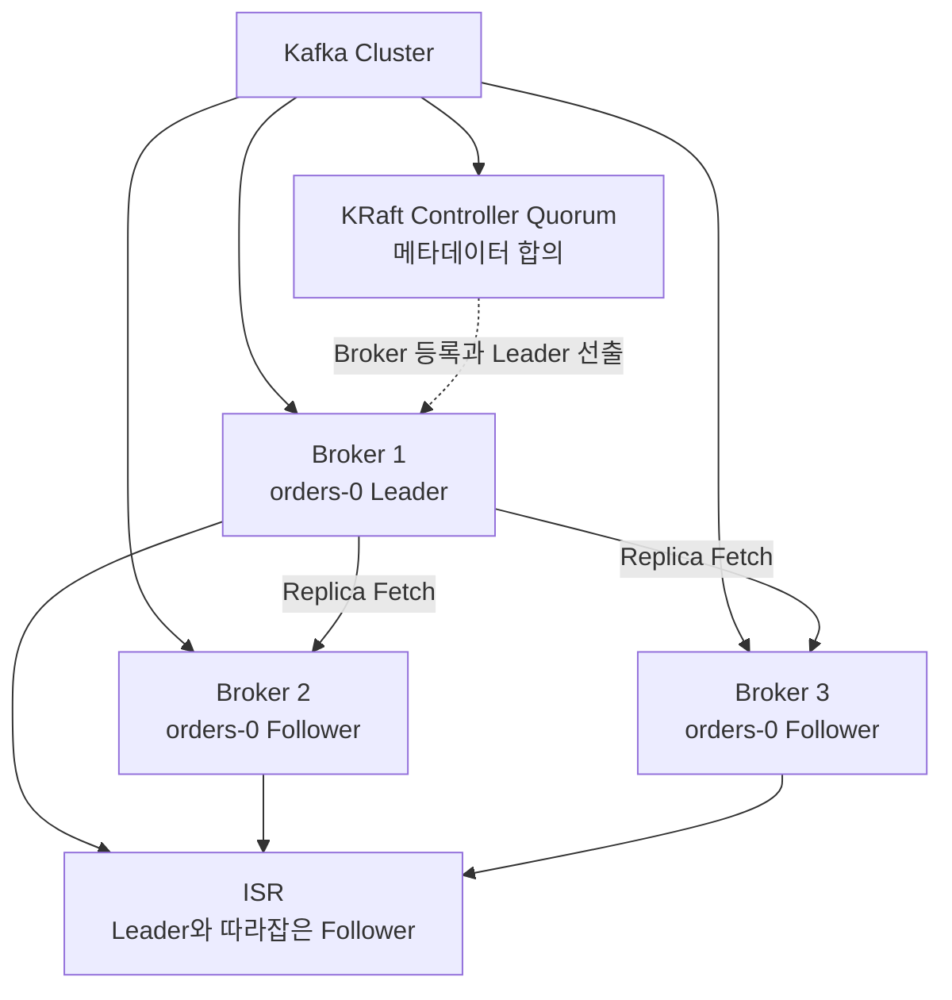

# Kafka 클러스터 아키텍처: Broker, KRaft Controller와 복제

이 글은 Apache Kafka 4.3을 기준으로 Broker, KRaft Controller, Partition Replica와 장애 복구 구조를 정리한다.
[Kafka 기본 개념: Topic, Partition, Offset과 Segment](./basic.md)를 먼저 읽으면 데이터 구조와 Cluster 구성요소의 관계를 이해하기 쉽다.

---

## 브로커와 KRaft 컨트롤러

앞에서 살펴본 것처럼 Broker는 Kafka Cluster를 구성하는 **서버 노드**다.
Broker는 Producer와 Consumer의 데이터 요청을 처리하고 Partition의 데이터를 저장한다.

KRaft Controller는 record를 직접 전달하는 서버가 아니라
Broker와 Partition을 관리하는 **Cluster 제어 역할**이다.
여러 Controller는 Quorum을 구성하고 메타데이터 로그를 함께 유지한다.

| 구성요소 | 담당하는 일 | Producer와 Consumer의 연결 |
| --- | --- | --- |
| Broker | Record 저장, Produce와 Fetch 요청 처리, Partition 복제 | 직접 연결함 |
| KRaft Controller | Broker 등록, Partition 배치, Leader 선출과 Cluster 메타데이터 관리 | 데이터 처리를 위해 직접 연결하지 않음 |

다음 그림은 Controller와 Broker 역할을 분리한 Kafka Cluster의 예다.

주문 서비스는 `orders-0`의 Leader Replica를 가진 Broker 1에 record를 보낸다.
Broker 1은 record를 Follower Replica가 있는 Broker 2와 Broker 3에 복제한다.
Consumer도 기본적으로 Leader Replica가 있는 Broker에서 record를 읽는다.

Active Controller는 Broker의 상태와 Partition Replica 배치를 관리하고,
Leader Broker에 장애가 발생하면 ISR에 남은 Follower 중 새 Leader를 정한다.
Controller는 주문 record의 Produce와 Fetch 경로에는 들어가지 않는다.

Kafka 4.x에서는 KRaft 컨트롤러가 브로커 등록, 토픽과 파티션 배치, 리더 변경 같은 클러스터 메타데이터를 관리한다.
운영 환경에서는 컨트롤러를 보통 홀수로 구성해 과반수 합의를 유지한다.
브로커와 컨트롤러는 한 프로세스에 함께 둘 수도 있지만,
규모가 큰 운영 클러스터에서는 역할을 분리할 수 있다.

브로커 수와 컨트롤러 수는 같은 기준으로 결정하지 않는다.
브로커 수는 데이터 용량, 처리량과 파티션 복제본 배치가 정하고,
컨트롤러 수는 메타데이터 quorum의 장애 허용 범위가 정한다.

## 복제 구성: Leader, Follower와 ISR

여기서부터는 브로커 장애가 발생해도 데이터를 계속 사용할 수 있게 만드는 복제 구조를 살펴본다.
세부 설정이 낯설다면 파티션마다 Leader와 Follower 복제본이 있다는 구조를 먼저 이해해도 충분하다.

**파티션은 가용성을 위해 여러 복제본(replica)을 가진다.**

### Replication Factor

토픽을 만들 때 정하는 옵션 중 하나가 `replication.factor`다. 값이 3이면 그 토픽의 모든 파티션은 클러스터 안에 **3개의 복제본**을 갖는다는 뜻이다. 이 3개는 가능한 한 서로 다른 브로커에 배치된다 (한 브로커에 같은 파티션의 두 복제본이 들어가면 그 브로커가 죽었을 때 가용성이 깨지므로).

> 즉 replication factor는 리더 1개와 팔로워 N-1개의 합이다. 이 값이 총 복제본 수다.

### Leader vs Follower

같은 파티션의 N개 복제본 중 정확히 하나가 **리더**(leader)가 된다. 나머지는 **팔로워**(follower)다. 둘의 역할은 분명히 다르다.

- **리더**: partition write와 복제 순서를 관리한다. Producer는 leader에 record를 보낸다.
- **팔로워**: leader에서 record를 가져와 같은 offset에 추가한다. 기본 consumer fetch는 leader를 사용하지만 rack-aware replica selector를 구성하면 가까운 follower에서 읽을 수도 있다.

각 partition에는 leader가 하나지만 topic의 partition leader를 여러 broker에 분산하면 write traffic도 분산된다.

### ISR (In-Sync Replicas)

리더와 팔로워가 있어도 모든 팔로워가 항상 리더와 같은 위치까지 따라잡는 것은 아니다.
팔로워는 GC, 디스크 I/O와 네트워크 지연 때문에 일시적으로 뒤처질 수 있다.

Kafka는 이 상황을 다루기 위해 **ISR**(In-Sync Replicas)이라는 개념을 둔다.

> ISR = 현재 리더의 로그를 충분히 따라잡고 있는 복제본들의 집합. 리더 자기 자신도 ISR의 멤버다.

"충분히 따라잡고 있다"의 기준에는 `replica.lag.time.max.ms`가 사용된다.
팔로워가 이 시간보다 오래 리더의 log end offset을 따라잡지 못하면 ISR에서 제거될 수 있다.
단순히 fetch 요청만 보냈다고 ISR이 유지되는 것은 아니다.

이 값이 가지는 트레이드오프가 운영에서 가장 자주 부딪히는 지점이다.

- **너무 짧게 잡으면**: 일시적인 GC, 디스크와 네트워크 지연에도 팔로워가 ISR에서 자주 빠질 수 있다.
- **너무 길게 잡으면**: 느린 팔로워를 기다리는 시간이 길어져 `acks=all` 쓰기의 지연이나 실패 감지가 늦어질 수 있다.

기본값을 그대로 사용할지 여부는 복제 지연, 쓰기 지연과 장애 감지 목표를 함께 측정해 결정한다.

### 커밋된 메시지 (Committed Message)

ISR이 왜 중요한지는 high watermark에서 드러난다.
Kafka는 ISR 복제 상태를 바탕으로 복제가 완료된 범위를 계산하고,
일반 consumer fetch는 high watermark를 넘어 아직 복제가 완료되지 않은 레코드를 반환하지 않는다.

여기서 복제 관점의 commit과 Kafka transaction의 commit은 다른 개념이다.
`isolation.level=read_committed`인 consumer는 high watermark 범위 안에서도 완료되지 않았거나 중단된 transaction의 레코드를 제외한다.

### 리더 장애 시 무슨 일이 일어나는가

리더 브로커가 죽으면 컨트롤러는 **ISR에 남아 있는 복제본 중 하나**를 새 리더로 선출한다. 핵심은 "ISR에 남아 있는"이라는 조건이다. ISR에서 빠진 팔로워는 데이터가 뒤처져 있을 수 있으므로 정상 모드에서는 후보가 되지 않는다.

이 정책에 따라오는 트레이드오프가 두 가지 있다.

1. **ISR이 모두 중단되면 파티션을 사용할 수 없을 수 있다.** ISR 복구를 기다리면 데이터 보존을 우선할 수 있다. `unclean.leader.election.enable=true`로 ISR 밖의 복제본을 리더 후보로 허용하면 가용성을 높일 수 있지만 데이터가 유실될 수 있다.
2. **`acks=all`과 `min.insync.replicas`는 ISR 정의 위에서 동작한다.** 프로듀서가 `acks=all`로 발행하면 리더는 ISR의 모든 멤버가 메시지를 적용한 뒤에야 응답한다. `min.insync.replicas`는 쓰기를 허용할 최소 ISR 수다. 둘을 함께 설정해야 의미가 있다. 자세한 옵션 조합은 [Kafka 실전 설계](./kafka-design.md)에서 다룬다.

## 한 장 정리

이 그림이 머리에 잡히면 Broker 수, Controller 수, `replication.factor`, ISR과 Leader 장애 복구를 같은 구조 안에서 볼 수 있다.

## 다음 읽을거리

- [Kafka를 로그로 이해하기: 복제, 재처리, 상태와 데이터 통합](./log-as-unifying-abstraction.md)
- [Kafka 실전 설계: 파티션 전략, 컨슈머 그룹, 전달 보장, 재시도, 순서 보장 트레이드오프](./kafka-design.md)

---

## 참고 자료

- [Apache Kafka 4.3 — Design](https://kafka.apache.org/43/design/design/)
- [Apache Kafka 4.3 — KRaft](https://kafka.apache.org/43/operations/kraft/)
