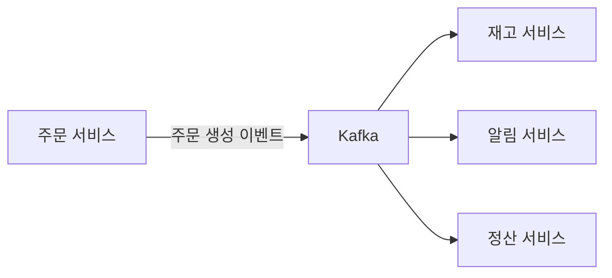
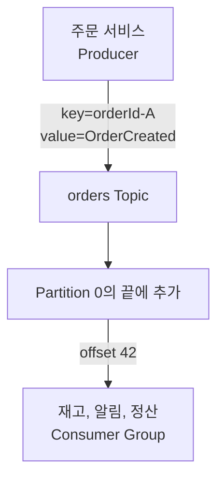
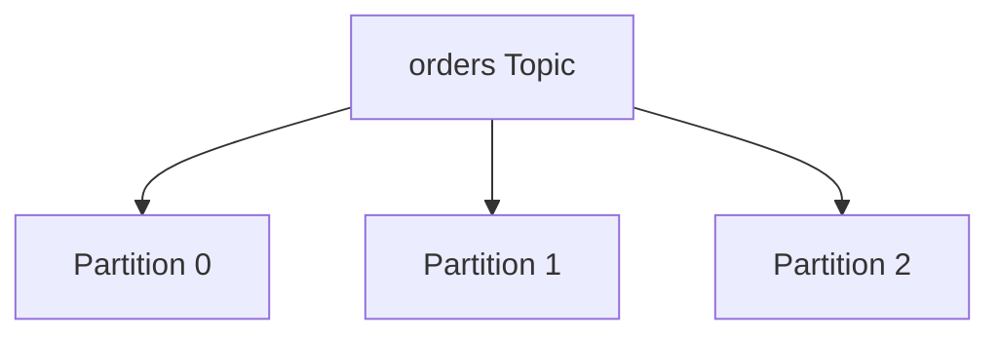
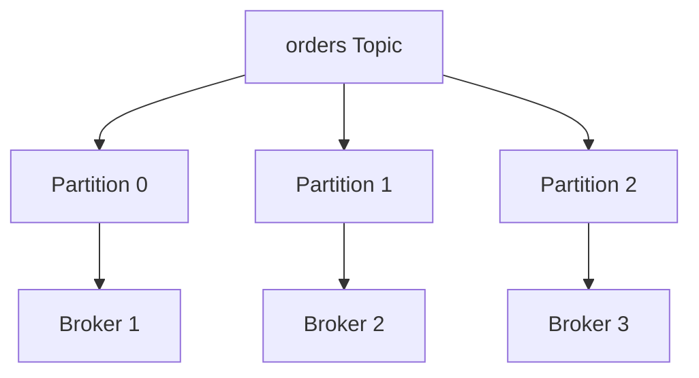
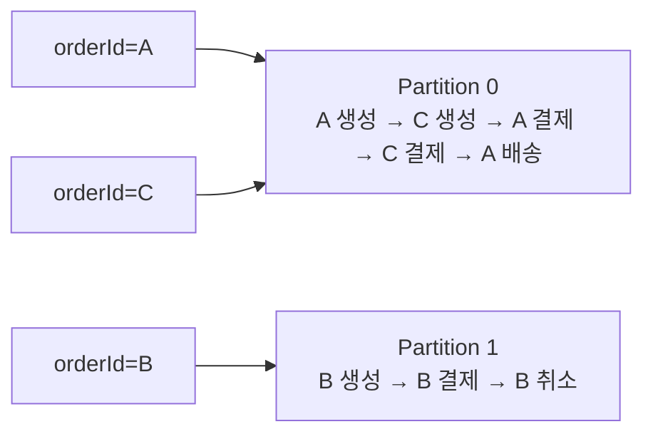
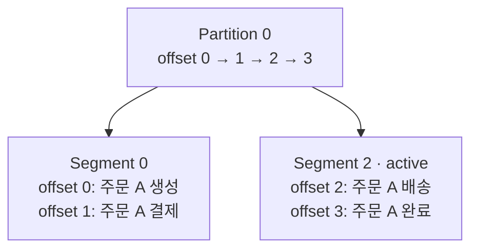

# Kafka 기본 개념: Topic, Partition, Offset과 Segment

이 글은 Apache Kafka 4.3을 기준으로 Topic, Partition, Offset과 Segment를 입문 수준에서 정리한다.

---

## Kafka는 무엇을 해결하는가

Kafka는 한 서비스가 만든 이벤트를 받아 보관하고,
여러 서비스가 필요할 때 각자의 속도로 읽을 수 있게 해주는 **분산 이벤트 스트리밍 플랫폼**이다.

예를 들어 주문 서비스가 `주문 생성` 이벤트를 Kafka에 한 번 기록하면
재고, 알림과 정산 서비스가 같은 이벤트를 각각 읽을 수 있다.
알림 서비스가 잠시 중단되더라도 이벤트가 바로 사라지지 않으므로,
서비스가 다시 실행된 뒤 마지막으로 처리한 위치부터 이어서 읽을 수 있다.

이벤트를 전달하기 위해 주문 서비스가 각 서비스를 직접 호출하거나,
모든 서비스의 처리 속도와 장애 상황을 함께 관리하지 않아도 된다.
이벤트를 만드는 **Producer**(발행자)와 이벤트를 읽는 **Consumer**(구독자) 사이에서
Kafka가 이벤트를 보관하고 전달하기 때문이다.

Kafka를 운영할 때는 보통 여러 서버를 하나의 **Cluster**로 묶는다.
Cluster 안에서 데이터를 저장하고 요청을 처리하는 Kafka 서버를 **Broker**라고 부른다.
처음에는 Broker를 "Kafka가 실제로 실행되는 서버" 정도로 이해하면 된다.

### 주문 이벤트 한 건을 따라간다

주문 A가 생성됐을 때 데이터가 이동하는 흐름부터 살펴보자.

이 과정에서 Topic은 주문 이벤트를 분류하는 이름이고,
Partition은 record가 순서대로 쌓이는 로그다.
Offset은 Partition 안에서 주문 이벤트의 위치를 나타낸다.
Partition은 디스크에서 여러 Segment 파일로 나뉘어 저장된다.

Consumer가 offset 42의 record를 처리한 뒤 다음에 읽을 위치인 43을 commit하면,
재시작하더라도 offset 43부터 처리를 이어갈 수 있다.
이 글은 이 흐름에 등장한 용어를 앞에서부터 하나씩 설명한다.

Kafka 문서에서는 일어난 일을 나타내는 데이터를 event, message 또는 record라고 부른다.
이 글에서는 Kafka에 저장된 데이터 한 건을 record라고 부른다.

기술적으로 다시 정의하면 다음과 같다.

> 파티션 단위로 분산된 **append-only 커밋 로그**를 여러 브로커에 복제해두고, Producer와 Consumer가 같은 로그를 다른 속도로 읽고 쓸 수 있게 해주는 분산 시스템.

이 한 줄에 등장하는 단어들이 곧 Kafka의 기본 개념이다. 하나씩 풀어 본다.

## 토픽 (Topic)

토픽은 record를 종류별로 묶는 **논리적 이름**이다.
주문 이벤트는 `orders`, 결제 이벤트는 `payments`처럼 이름을 붙일 수 있다.
Producer와 Consumer는 이 이름을 사용해 데이터를 쓰고 읽는다.

토픽은 RDBMS의 테이블과 비슷하게 데이터를 구분하지만,
실제로 record를 저장하는 하나의 파일이나 저장 공간을 뜻하지는 않는다.
입문 단계에서는 Topic을 "주문 이벤트를 넣는 큰 상자"처럼 생각하기 쉽지만,
정확히는 같은 종류의 이벤트를 모으는 이름에 가깝다.
하나의 Topic은 한 개 이상의 Partition으로 구성되고,
record는 그중 하나의 Partition에 저장된다.

Kafka Topic은 다음 두 가지 성질을 갖는다.

1. **다중 구독자**(multi-subscriber): 한 토픽을 여러 컨슈머 그룹이 각자의 속도로 동시에 구독할 수 있다. RDBMS의 큐 테이블처럼 한 번 읽고 지우는 모델이 아니다.
2. **append-only**: 메시지는 끝에만 추가되고, 한 번 쓰인 메시지는 수정되지 않는다. "지운다"는 개념도 사실은 보존 정책(retention)에 따라 오래된 세그먼트를 통째로 버리는 것이다.

즉, Topic은 데이터를 찾기 위한 논리적 분류이고 실제 저장과 순서 보장의 단위는 Partition이다.

## 파티션 (Partition)

파티션은 한 토픽을 분할한 **하나의 append-only 로그**다.
Topic이 3개 Partition으로 구성되어 있다면,
Topic으로 발행된 record는 Producer의 파티셔닝 규칙에 따라 3개 로그 중 하나에 들어간다.

Topic의 Partition들은 앞에서 본 Broker들에 나눠 배치할 수 있다.

이 그림은 Partition의 분산 배치만 보여주기 위해 복제본을 생략했다.
뒤에서 살펴볼 복제 구성에서는 같은 Partition의 복제본이 여러 Broker에 저장된다.

파티션을 둔 이유는 두 가지다.

- **수평 확장**: Topic의 데이터를 여러 Broker에 나눠 저장하고 동시에 처리하면 처리량이 단일 디스크나 서버의 한계를 넘어설 수 있다.
- **병렬 소비**: 한 컨슈머 그룹 안에서 컨슈머 인스턴스가 파티션을 나눠 가져가면 그만큼 병렬로 읽을 수 있다.

여기서 입문자가 가장 자주 헷갈리는 사실 하나가 결정된다.

> **순서 보장은 토픽 단위가 아니라 파티션 단위로만 일어난다.**

토픽은 같은 종류의 이벤트를 묶는 개념적인 이름이고,
파티션은 레코드가 실제로 순서대로 추가되는 독립된 로그다.
여러 파티션은 서로 다른 브로커에서 동시에 기록될 수 있으므로,
Kafka는 파티션 사이의 전체 순서를 정의하지 않는다.

주문 처리에서는 보통 모든 주문 사이의 순서보다 한 주문 안에서 발생한 상태 변화의 순서가 중요하다.
Producer가 `orderId`를 메시지 키로 사용하면 같은 주문의 이벤트가 같은 파티션에 들어간다.

서로 다른 주문 키가 반드시 서로 다른 Partition에 배치되는 것은 아니다.
서로 다른 키도 파티셔닝 결과에 따라 같은 Partition에 들어갈 수 있다.
중요한 점은 같은 키를 계속 같은 Partition에 보내는 것이다.

| 주문 키 | 들어간 Partition | 보장되는 순서 |
| --- | --- | --- |
| `orderId=A` | Partition 0 | A 생성, A 결제, A 배송 |
| `orderId=B` | Partition 1 | B 생성, B 결제, B 취소 |
| `orderId=C` | Partition 0 | C 생성, C 결제 |

이 구조에서는 주문 A와 주문 B를 같은 Consumer Group 안의 서로 다른 Consumer instance가 병렬로 처리하면서도,
주문 A에 속한 이벤트는 같은 파티션에서 기록된 순서대로 읽을 수 있다.
Topic은 같은 종류의 이벤트를 묶고,
메시지 키는 어떤 이벤트끼리 순서를 공유해야 하는지를 정한다.

Topic 전체의 순서가 반드시 필요하다면 파티션을 하나만 사용해야 한다.
그러면 모든 레코드가 하나의 로그에 기록되어 전체 순서를 정할 수 있지만,
여러 파티션을 나눠 저장하고 소비하는 병렬 처리 능력은 얻을 수 없다.

파티션 키를 정할 때는 순서뿐 아니라 데이터 쏠림과 파티션 수 변경도 함께 고려해야 한다.
자세한 기준은 [Kafka 실전 설계의 파티션 키 전략](./kafka-design.md#파티션-키-전략)에서 다룬다.

## 오프셋 (Offset)

오프셋은 **한 파티션 안에서 record의 위치를 가리키는 정수**다.
Kafka가 record를 파티션 끝에 추가할 때 0부터 증가하는 offset을 부여한다.

| Offset | Record |
| ---: | --- |
| 0 | 주문 A 생성 |
| 1 | 주문 A 결제 |
| 2 | 주문 A 배송 |
| 3 | 주문 A 완료 |

Offset은 Partition 내부에서만 의미가 있다.
Partition 0의 offset 2와 Partition 1의 offset 2는 서로 다른 record다.

Kafka가 다른 메시지 큐와 가장 다른 점이 여기서 드러난다.

> **레코드는 소비 여부와 무관하게 보존되고, consumer가 자신의 읽기 위치를 정한다.**

전통적인 작업 큐는 처리 확인에 따라 메시지를 제거할 수 있다.
Kafka는 consumer가 읽었다는 이유로 record를 제거하지 않고 retention policy에 따라 보존한다.
Consumer group은 어디까지 처리했는지를 offset으로 기록하고,
group coordinator는 이 offset을 `__consumer_offsets`라는 internal topic에 commit한다.
그래서 같은 topic을 consumer group A와 B가 각자 다른 속도로 읽을 수 있고,
consumer가 재시작하면 committed offset부터 이어서 읽을 수 있다.

Committed offset은 마지막으로 처리한 record의 번호가 아니라 **다음에 읽을 offset**이다.
예를 들어 Consumer가 offset 0과 1을 처리한 뒤 2를 commit하면,
재시작한 Consumer는 offset 2부터 읽는다.

| Offset | Record | Consumer 상태 |
| ---: | --- | --- |
| 0 | 주문 A 생성 | 처리 완료 |
| 1 | 주문 A 결제 | 처리 완료 |
| **2** | **주문 A 배송** | **다음에 읽을 위치** |
| 3 | 주문 A 완료 | 아직 읽지 않음 |

같은 Partition을 읽더라도 Consumer Group마다 committed offset은 따로 관리된다.

| Consumer Group | Committed offset | 다음에 읽을 Record |
| --- | ---: | --- |
| 재고 | 3 | 주문 A 완료 |
| 알림 | 1 | 주문 A 결제 |

같은 Partition을 읽지만 각 Consumer Group은 자신의 처리 위치에서 계속 읽는다.

오프셋 커밋 전략(자동 커밋 vs 수동 커밋, 처리 전 커밋 vs 처리 후 커밋)은 메시지 전달 보장과 직결된다. 이건 [Kafka 실전 설계 — 오프셋 커밋 전략](./kafka-design.md#오프셋-커밋-전략)에서 자세히 다룬다.

## 세그먼트 (Segment)

Partition은 논리적으로 하나의 연속된 로그지만 디스크에서는 하나의 거대한 파일로 저장되지 않는다.
Kafka는 Partition을 **Segment**라고 부르는 여러 파일로 나눠 저장한다.

위 그림의 Segment 크기는 구조를 설명하기 위해 단순화했다.
예시의 Segment 2는 offset 2부터 시작하는 파일이라는 뜻이다.

새 record는 active segment의 끝에 추가된다.
설정한 크기나 시간이 기준에 도달하면 Kafka가 다음 Segment를 만들고,
새 Segment가 active segment가 된다.

Consumer는 Segment 파일을 직접 선택하지 않는다.
Consumer는 offset을 기준으로 record를 요청하고,
Broker가 해당 offset이 들어 있는 Segment를 찾아 반환한다.

Segment로 나누면 **삭제와 인덱싱이 단순해진다.**
Retention 정책에 따라 오래된 record를 제거할 때는 record를 하나씩 삭제하지 않고,
보존 기간이 지난 Segment 파일을 단위로 제거할 수 있다.

Offset을 기준으로 Segment 범위를 찾는 index도 Segment마다 관리할 수 있다.
이 저장 구조는 Kafka가 record를 임의 수정하지 않고 로그 끝에 추가하는 방식과 맞물린다.

## 다음 읽을거리

- [Kafka 클러스터 아키텍처: Broker, KRaft Controller와 복제](./architecture.md)
- [Kafka를 로그로 이해하기](./log-as-unifying-abstraction.md) — 복제, 재처리, 상태와 데이터 통합을 연결하는 원리
- [Kafka 실전 설계 — 파티션 / 컨슈머 그룹 / 재시도 / 순서 보장](./kafka-design.md)
- [분산 트랜잭션과 Outbox 패턴](../architecture/distributed-systems/distributed-transaction-outbox-pattern.md) — Kafka 발행 원자성 보장

---

## 참고 자료

- [Apache Kafka 4.3 — Introduction](https://kafka.apache.org/43/getting-started/introduction/)
- [Apache Kafka 4.3 — Design](https://kafka.apache.org/43/design/design/)
