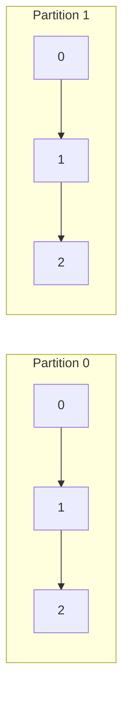
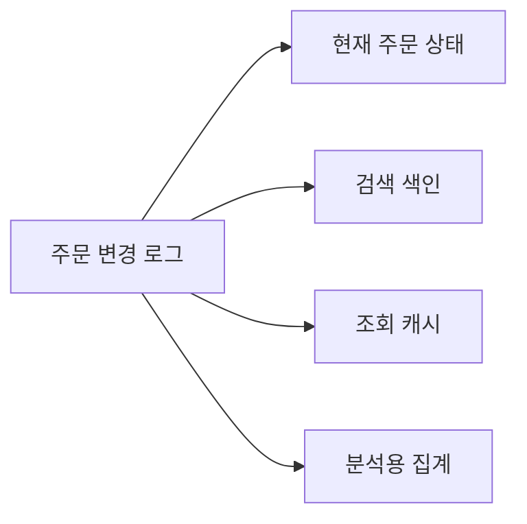
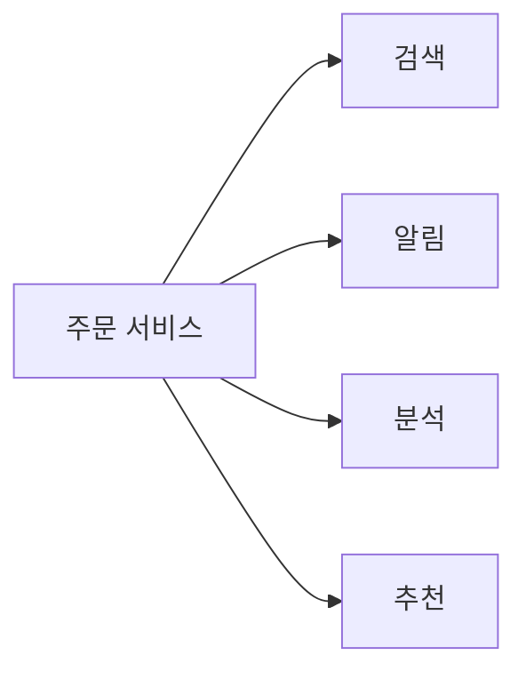
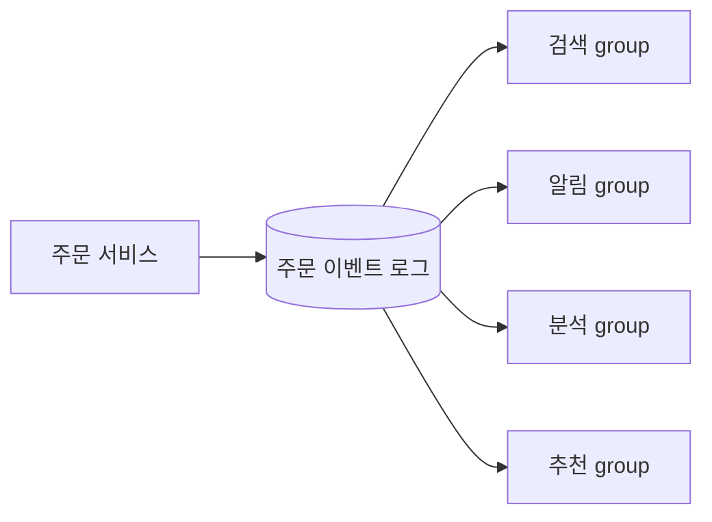
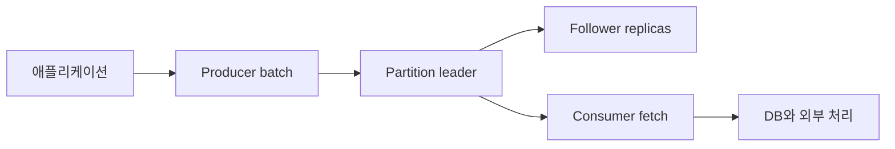

# Kafka를 로그로 이해하기: 복제, 재처리, 상태와 데이터 통합

Kafka를 단순한 메시지 큐로 보면 프로듀서와 컨슈머 사용법은 이해할 수 있지만,
파티션, 오프셋, 복제, 보존 정책과 재처리가 왜 현재 모습으로 설계됐는지는 연결되지 않는다.
Kafka의 중심에는 **변경 사실을 순서대로 보존하고 여러 시스템이 각자의 속도로 재생하는 로그**가 있다.
이 관점으로 보면 Kafka가 메시지를 읽은 뒤에도 지우지 않는 이유와 같은 데이터를 검색, 통계와 알림 시스템이 함께 구독할 수 있는 이유가 하나의 원리로 이어진다.

이 글은 Jay Kreps가 2013년에 쓴 [The Log](https://www.linkedin.com/blog/engineering/distributed-systems/log-what-every-software-engineer-should-know-about-real-time-datas-unifying)를 출발점으로 삼는다.
제품 동작은 2026년 6월에 공개된 Apache Kafka 4.3.1과 4.3 문서를 기준으로 다시 확인했다.
원문의 사례와 수치는 당시 LinkedIn 환경의 기록이며,
이 글에서는 지금도 유효한 로그의 원리와 현재 Kafka에서 확인할 수 있는 구현을 구분한다.

## 로그는 변경 사실의 순서다

여기서 로그는 애플리케이션이 남기는 오류 문장이 아니다.
프로그램이 읽을 수 있는 레코드를 뒤에만 추가하는 **append-only sequence**다.

```text
offset       40              41              42
record   OrderCreated -> PaymentApproved -> OrderShipped
time      더 오래됨                              더 최근임
```

로그에는 세 가지 중요한 성질이 있다.

1. 새 레코드는 기존 레코드를 수정하지 않고 끝에 추가된다.
2. 각 레코드는 로그 안에서 변하지 않는 위치를 받는다.
3. 왼쪽 레코드가 오른쪽 레코드보다 먼저 일어났다는 순서를 제공한다.

세 번째 성질 때문에 로그 위치는 물리 시계와 다른 **논리 시간**으로 사용할 수 있다.
서버 A의 시각이 서버 B보다 200ms 빠른지 몰라도,
같은 Kafka 파티션에서 오프셋 41이 42보다 먼저 기록됐다는 사실은 분명하다.

다만 Kafka에서 이 순서는 **파티션 안에서만** 성립한다.
토픽에 파티션이 네 개라면 서로 독립적인 로그가 네 개 있는 셈이다.
파티션 0의 오프셋 42와 파티션 1의 오프셋 42 사이에는 선후 관계가 없다.
Kafka 레코드의 timestamp도 이벤트가 발생한 시각이나 브로커에 도착한 시각을 나타내는 값이지,
여러 파티션을 하나로 정렬해 주는 전역 순번은 아니다.



이 제한은 성능을 얻기 위한 의도적인 선택이다.
모든 쓰기에 전역 순서를 부여하려면 파티션 사이에 조정이 필요하지만,
독립된 파티션은 여러 브로커에서 동시에 추가하고 읽을 수 있다.
따라서 파티션 키는 단순한 분산 옵션이 아니라 **어떤 변경 사이에 순서가 필요한지 정하는 업무 설계**다.

## 같은 로그를 재생하면 같은 상태를 만들 수 있다

로그가 분산 시스템의 공통 원리가 되는 이유는 상태 머신 복제에서 드러난다.
같은 초기 상태에서 시작한 결정적 프로그램 두 개가 같은 입력을 같은 순서로 처리하면 같은 최종 상태에 도달한다.

```text
초기 잔액 10,000원

로그 A: +5,000 -> ×2 = 30,000원
로그 B: ×2 -> +5,000 = 25,000원
```

입력 값이 같아도 순서가 달라지면 상태가 달라진다.
복제본이 같아지려면 변경 내용뿐 아니라 적용 순서에도 합의해야 한다.
로그는 이 순서를 기록하고,
각 복제본은 자신이 어느 위치까지 적용했는지를 오프셋과 같은 값으로 표현할 수 있다.

Java 백엔드에 빗대면 로그는 모든 인스턴스가 순서대로 실행할 command 목록이고,
각 인스턴스의 로컬 저장소는 그 command들을 적용해 만든 결과다.
새 인스턴스는 저장된 상태를 복사받고 이후 로그만 이어서 적용하거나,
보존된 전체 로그를 처음부터 재생해 상태를 복원할 수 있다.

이 원리는 Kafka 안에서도 두 층에 나타난다.

- 데이터 토픽의 각 파티션은 리더와 팔로워에 복제된다.
  팔로워는 리더의 로그를 가져와 같은 오프셋에 저장하고,
  리더 장애 시 조건을 충족한 복제본이 새 리더가 될 수 있다.
- Kafka 4.x의 KRaft 컨트롤러는 클러스터 메타데이터를 별도의 복제 로그로 관리한다.
  컨트롤러 quorum은 Raft 기반 합의로 메타데이터 변경 순서를 정한다.

두 층을 같은 것으로 오해하면 안 된다.
**일반 토픽의 모든 레코드를 KRaft quorum이 합의하는 것은 아니다.**
KRaft는 브로커, 토픽과 파티션 같은 클러스터 메타데이터를 관리하고,
데이터 파티션은 파티션 리더와 ISR 복제 규칙으로 내구성과 가용성을 제공한다.

## 데이터베이스도 로그에서 상태를 만든다

RDBMS는 테이블만 저장하는 것처럼 보이지만 내부에서는 WAL, redo log나 binlog 같은 로그를 사용한다.
데이터 페이지와 인덱스를 모두 한 번에 안전하게 바꾸기 어렵기 때문에,
먼저 복구 가능한 변경 기록을 남기고 여러 자료구조에 반영한다.
장애가 발생하면 로그를 다시 적용해 커밋된 변경을 복원한다.

이 구조를 추상화하면 다음 두 요소로 나뉜다.

| 요소 | 역할 | 예시 |
| --- | --- | --- |
| 변경 로그 | 무엇이 어떤 순서로 바뀌었는지 보존한다 | WAL, CDC 스트림, Kafka 토픽 |
| 구체화된 상태 | 현재 질문에 빠르게 답하도록 가공한다 | B-tree, 캐시, 검색 색인, 집계 테이블 |

테이블과 인덱스는 서로 다른 데이터처럼 보이지만,
같은 변경 이력을 각 질의 목적에 맞춰 접은 **projection**으로 볼 수 있다.
예를 들어 주문 변경 로그 하나에서 현재 주문 테이블, 고객별 주문 통계와 검색 색인을 각각 만들 수 있다.



이 설명이 곧바로 "Kafka를 데이터베이스 대신 쓰자"는 결론을 뜻하지는 않는다.
Kafka는 키 범위 검색, 임의 조건 질의와 관계형 제약을 제공하는 범용 질의 저장소가 아니다.
로그는 변경 이력을 전달하고 재생하는 데 강하고,
RDBMS와 검색 엔진은 현재 상태를 목적에 맞게 조회하는 데 강하다.
두 역할을 구분하면 여러 저장소를 함께 쓰는 이유가 분명해진다.

## Kafka는 소비자의 위치만 기억하면 된다

일반적인 작업 큐에서는 브로커가 메시지를 어느 소비자에게 전달했고 확인 응답을 받았는지 추적한다.
Kafka의 기본 consumer group 모델에서는 레코드를 보존하고,
소비자가 파티션별로 다음에 읽을 위치를 관리한다.

```text
Partition 0: 0 1 2 3 4 5 6 7 8 9
                        ^
                        group A의 다음 위치

Partition 0: 0 1 2 3 4 5 6 7 8 9
                ^
                group B의 다음 위치
```

소비 상태는 파티션마다 정수 하나로 작다.
Kafka는 consumer group의 커밋 오프셋을 compacted internal topic인 `__consumer_offsets`에 저장한다.
소비자가 재시작하면 마지막 커밋 위치에서 이어 읽고,
필요하면 `seek()`로 과거 위치를 다시 읽을 수 있다.

이 모델에서 세 가지 기능이 나온다.

- 여러 consumer group이 같은 레코드를 서로 다른 속도로 읽는다.
- 장애나 배포로 멈춘 소비자는 보존 기간 안에 돌아와 밀린 레코드를 처리한다.
- 코드 오류를 수정한 뒤 오프셋을 되돌려 파생 데이터를 다시 계산한다.

오프셋은 처리 완료 자체가 아니라 **소비자가 처리 완료로 선언한 위치**다.
DB 반영 전에 오프셋을 커밋하면 장애 시 레코드가 처리되지 않을 수 있고,
DB 반영 후 오프셋 커밋에 실패하면 같은 레코드를 다시 처리할 수 있다.
자세한 트랜잭션 경계는 [Spring Kafka 컨슈머 오프셋 커밋과 트랜잭션 정렬](./spring-kafka-listener-offset-commit-transaction.md)에서 다룬다.

## 보존된 로그가 생산자와 소비자를 분리한다

Kafka의 비동기성은 네트워크 호출을 메시지 전송으로 바꾸는 데서 끝나지 않는다.
레코드를 일정 기간 보존하기 때문에 생산 시점과 소비 시점도 분리한다.

주문 서비스가 검색, 알림, 추천과 분석 시스템을 직접 호출한다고 가정한다.



이 구조에서는 목적지가 늘어날 때마다 주문 서비스가 새 연동을 알아야 한다.
한 목적지의 장애와 응답 지연도 주문 요청 경로에 영향을 줄 수 있다.

로그를 가운데 두면 주문 서비스는 주문이 발생했다는 사실을 한 번 기록한다.
각 목적지는 자기 consumer group과 처리 속도를 가진다.



이 구조가 제공하는 분리는 다음과 같다.

| 분리 대상 | 로그가 제공하는 방식 |
| --- | --- |
| 실행 시간 | 생산자는 소비자의 완료를 기다리지 않는다 |
| 처리 속도 | 각 consumer group이 자기 속도로 오프셋을 전진시킨다 |
| 장애 | 소비자가 멈춰도 보존 기간 안에서 다시 따라잡을 수 있다 |
| 목적지 추가 | 새 consumer group이 기존 로그를 처음부터 읽을 수 있다 |
| 저장 기술 | 소비자는 원본 서비스의 DB 구조 대신 이벤트 계약에 의존한다 |

이때 Kafka가 장애를 제거하는 것은 아니다.
동기 호출의 지연이 consumer lag와 파생 상태의 지연으로 바뀐다.
알림 시스템은 최신인데 검색 색인은 10분 늦을 수도 있다.
따라서 각 소비자가 어느 오프셋까지 적용했는지와 이벤트 발생 후 얼마나 지났는지를 함께 측정해야 한다.

## 스트림과 테이블은 같은 이력의 두 모습이다

로그는 변경의 흐름이고,
테이블은 그 로그를 특정 시점까지 적용한 현재 상태다.
이 관계를 코드로 단순화하면 `fold`와 비슷하다.

```java
OrderState state = events.stream()
    .reduce(OrderState.empty(), OrderState::apply);
```

반대 방향도 가능하다.
테이블의 insert, update와 delete를 CDC로 읽으면 다시 변경 스트림을 만들 수 있다.

```text
변경 로그 --적용--> 현재 상태
현재 상태 --CDC---> 변경 로그
```

Kafka Streams의 state store도 같은 원리를 사용한다.
스트림 처리 중 필요한 로컬 상태를 저장하고,
그 변경을 changelog topic에 남긴다.
task가 다른 인스턴스에서 재시작되면 changelog를 재생해 state store를 복원한 다음 처리를 이어간다.

이 모델은 상태 있는 스트림 처리를 "서버 메모리에 Map을 하나 둔다"와 다르게 만든다.
로컬 상태는 빠른 질의를 담당하고,
changelog는 장애 후 같은 상태를 다시 만드는 근거가 된다.
복구 시간은 changelog 크기, 로컬 상태 크기와 standby replica 구성에 영향을 받는다.

## Log compaction은 최신 상태를 복원할 재료를 남긴다

시간 기반 retention만 사용하면 오래된 세그먼트가 통째로 삭제된다.
오랜 기간 중단된 소비자가 처음부터 상태를 복원해야 하는데 필요한 레코드가 이미 삭제됐을 수 있다.
반대로 모든 변경을 영구 보존하면 저장 공간과 재생 시간이 계속 늘어난다.

**Log compaction**(로그 압축)은 같은 키의 여러 레코드 중 최신 값을 남기는 보존 방식이다.

```text
압축 전
10: order-1=CREATED
11: order-2=CREATED
12: order-1=PAID
13: order-1=SHIPPED

압축 후의 논리적 결과
11: order-2=CREATED
13: order-1=SHIPPED
```

압축 후에도 남은 레코드의 오프셋은 바뀌지 않는다.
삭제된 오프셋에는 빈 구간이 생길 수 있다.
값이 `null`인 tombstone record는 해당 키의 삭제를 나타내며,
설정된 기간이 지나면 tombstone 자체도 정리될 수 있다.

Log compaction에 관해 자주 생기는 오해가 있다.

- 압축은 레코드가 쓰일 때 동기적으로 실행되지 않는다.
  background cleaner가 세그먼트를 정리하므로 최신 값 이전의 레코드도 일정 시간 남아 있다.
- 따라잡고 있는 소비자는 압축 전에 같은 키의 중간 변경을 모두 볼 수 있다.
  따라서 compaction을 중복 전송 제거 수단으로 사용하면 안 된다.
- compaction은 각 키의 최신 상태를 복원할 수 있게 하지만 모든 과거 상태를 보존하지는 않는다.
  완전한 감사 이력이 필요하면 별도 보존 정책이 필요하다.
- 키가 없으면 어떤 레코드가 같은 개체의 새 버전인지 판단할 수 없다.
  compacted topic에서는 안정적인 키가 데이터 모델의 일부다.

시간 기반 삭제와 compaction은 함께 설정할 수도 있다.
어떤 조합이 맞는지는 "모든 사건을 얼마 동안 다시 봐야 하는가"와
"최신 상태를 언제까지 복원할 수 있어야 하는가"를 나눠 결정해야 한다.

## 로그가 높은 처리량을 내는 구조

append-only라는 제약은 기능을 줄이는 대신 저장 경로를 단순하게 만든다.
임의 위치의 레코드를 계속 수정하는 대신 활성 세그먼트 끝에 순차적으로 추가하고,
오래된 데이터는 세그먼트 단위로 정리할 수 있다.

Kafka는 이 구조에 여러 최적화를 겹친다.

1. 프로듀서는 여러 레코드를 record batch로 묶어 요청 수를 줄이고 batch 단위로 압축한다.
2. 브로커는 같은 batch 형식을 디스크 저장, 복제와 소비자 전송 경로에서 활용한다.
3. 운영체제 page cache를 활용해 자주 읽는 데이터의 별도 애플리케이션 캐시 복사를 줄인다.
4. 가능한 전송 경로에서는 `sendfile` 기반 zero-copy를 사용해 사용자 공간의 불필요한 복사를 줄인다.
5. 파티션을 여러 브로커에 분산해 읽기와 쓰기를 병렬화한다.

따라서 Kafka 성능은 "디스크에 쓰니 느리다"는 직관만으로 판단할 수 없다.
순차 IO, batching과 page cache가 작은 임의 쓰기보다 높은 처리량을 낼 수 있다.
반면 작은 메시지를 즉시 한 건씩 전송하도록 설정하면 batching 효과가 줄어들고,
큰 batch를 오래 기다리면 처리량은 좋아져도 **Latency**(지연)가 늘 수 있다.

### 처리량은 가장 느린 구간이 정한다

대용량 데이터 처리에서는 broker 수나 partition 수 하나만으로 처리량을 설명할 수 없다.
레코드는 producer accumulator, network, partition leader, follower replica와 consumer fetch를 차례로 지난다.



각 구간은 다른 이유로 한계에 도달한다.

| 구간 | 처리량을 제한하는 값 | 함께 확인할 항목 |
| --- | --- | --- |
| Producer | serialization, compression, batch 크기, 전송 대기 | record 크기, `batch.size`, `linger.ms`, `compression.type` |
| Broker network | 요청 수와 전송 byte | request rate, network processor 사용률, request queue time |
| Broker storage | append와 page cache, segment flush | disk throughput, IO 대기, log directory 사용량 |
| Replication | follower fetch와 ISR 유지 | replication byte rate, replica lag, under-replicated partition |
| Consumer fetch | fetch batch와 partition 할당 | fetch rate, bytes consumed, partition별 lag |
| Consumer 처리 | 역직렬화, DB와 외부 API | 건별 처리 시간, 오류율, `max.poll.interval.ms` |

예를 들어 broker의 network와 disk에 여유가 있는데 consumer lag가 증가한다면 partition부터 늘리는 판단은 이르다.
DB connection pool이 가득 찼거나 한 record의 처리 시간이 늘었을 수 있다.
반대로 consumer는 빠른데 producer의 record batch가 거의 채워지지 않는다면,
partition을 늘릴수록 작은 요청이 더 분산되어 compression 비율과 batch 효율이 낮아질 수 있다.

### 건수와 byte를 함께 측정한다

초당 record 수만 비교하면 메시지 크기 변화가 보이지 않는다.
평균 500B인 이벤트 10만 건과 평균 50KB인 이벤트 10만 건은 network, disk와 consumer 메모리에 주는 부담이 전혀 다르다.

용량을 계획할 때는 최소한 다음 값을 함께 측정한다.

- 초당 record 수와 초당 byte
- 평균뿐 아니라 p95와 최대 record 크기
- compression 전후 batch 크기와 compression 비율
- partition별 유입량과 key별 분포
- replication factor를 반영한 broker 사이 전송량과 저장량
- consumer의 처리율과 가장 오래된 미처리 이벤트의 나이

보존에 필요한 원시 저장량은 다음처럼 거칠게 시작할 수 있다.

```text
하루 원시 데이터 = 초당 byte × 86,400
복제 포함 저장량 = 하루 원시 데이터 × 보존 일수 × replication factor
```

실제 디스크 계획에는 compression, segment와 index 비용,
재할당 중 임시 공간과 안전 여유를 반영해야 한다.
계산값은 구매 수량을 바로 정하는 답이 아니라 실제 record로 부하 시험할 시작점이다.

### 처리량, 지연과 내구성은 함께 움직인다

설정 하나를 바꾸면 여러 결과가 달라진다.

| 선택 | 기대 효과 | 함께 생기는 비용 |
| --- | --- | --- |
| `linger.ms` 증가 | batch가 더 잘 모여 요청 수와 byte당 비용 감소 | 유입량이 적을 때 전송 대기 증가 |
| compression 사용 | network와 disk byte 감소 | producer와 consumer CPU 사용 증가 |
| partition 증가 | 병렬 produce와 consume 상한 증가 | metadata, file, replication과 rebalance 비용 증가 |
| `acks=all`과 높은 최소 ISR | 승인된 record의 복제 내구성 증가 | 느린 replica가 write latency와 가용성에 영향 |
| 큰 consumer fetch | 요청당 처리 효율 증가 | 메모리 사용과 한 번에 처리할 작업량 증가 |

따라서 대용량 처리 설정은 최대 처리량 숫자 하나로 고르지 않는다.
목표 throughput, p99 latency, 허용 가능한 데이터 유실 범위와 장애 복구 시간을 먼저 정하고,
같은 record 크기와 key 분포로 각 조건을 함께 측정한다.

## Kafka가 자동으로 해결하지 않는 문제

로그는 강력한 공통 기반이지만 데이터 시스템 전체를 대신하지 않는다.
다음 경계는 애플리케이션과 운영 설계로 해결해야 한다.

### 전역 순서

Kafka는 파티션 사이의 전체 순서를 제공하지 않는다.
전체 이벤트를 한 파티션에 넣으면 순서는 얻지만 처리량과 장애 영향 범위가 한 파티션에 제한된다.
대부분은 `orderId`, `accountId`처럼 실제 상태 전이에 필요한 최소 단위를 키로 고른다.

### 스키마와 의미

Kafka는 byte 배열을 안정적으로 운반할 뿐,
필드의 의미와 호환성을 자동으로 보장하지 않는다.
생산자와 소비자는 스키마 버전, 필드 추가와 삭제 규칙, 알 수 없는 enum 처리와 개인정보 삭제 정책에 합의해야 한다.
원문의 표현처럼 로그는 데이터 흐름의 기반이고 스키마와 호환성은 그 위에 남는 별도 문제다.

### DB와 Kafka의 이중 쓰기

DB commit과 Kafka publish를 순서대로 호출하면 중간 장애에서 둘 중 하나만 성공할 수 있다.
Kafka를 도입했다는 사실만으로 원자성이 생기지 않는다.
DB 변경을 기준으로 삼는다면 [분산 트랜잭션과 Outbox 패턴](../architecture/distributed-systems/distributed-transaction-outbox-pattern.md)처럼 같은 DB 트랜잭션에 outbox record를 남기고 별도 발행자가 전달하는 방법을 검토한다.

### 외부 부수 효과

오프셋을 되돌리면 이메일, 결제 요청과 외부 API 호출도 다시 실행될 수 있다.
재처리 가능한 로그를 만들려면 소비자도 멱등해야 한다.
업무 이벤트 ID에 고유 제약을 두거나,
이미 처리한 이벤트를 같은 DB 트랜잭션에서 기록하는 방법이 필요하다.

### 잘못된 이벤트와 계약 변경

append-only 로그에서는 잘못 발행한 레코드를 제자리에서 수정하지 않는다.
보정 이벤트를 추가하거나 파생 데이터를 올바른 코드로 다시 계산한다.
하지만 과거 이벤트를 새 코드가 읽지 못하면 재생이 실패하므로,
장기 보존 기간만큼 오래된 스키마와 처리 규칙도 함께 관리해야 한다.

### 무제한 재생 비용

재생 가능하다는 말은 재생이 항상 싸다는 뜻이 아니다.
하루치 로그 처리에 20분이 걸리는 소비자가 30일치를 복원하면 단순 계산만으로도 많은 시간이 든다.
실제 복구 목표에 맞춰 retention, compaction, snapshot, state store와 standby replica를 함께 설계해야 한다.

## 로그 중심 설계의 판단 순서

Kafka 토픽을 만들기 전에 다음 질문에 답하면 설정값보다 먼저 데이터 흐름의 경계를 정할 수 있다.

1. **기록할 사실**: 업무에서 다시 재생할 가치가 있는 변경은 무엇인가.
2. **기준 데이터**: DB와 Kafka 중 어떤 저장소가 원본이며 다른 쪽을 어떻게 복구할 것인가.
3. **순서 범위**: 어떤 개체의 변경끼리 순서를 지켜야 하며 그 파티션 키의 분포는 고른가.
4. **소비 위치**: 처리 완료와 오프셋 커밋의 순서를 어떻게 맞출 것인가.
5. **복구 기간**: 소비자가 최대로 얼마나 중단될 수 있고 어느 시점부터 재생해야 하는가.
6. **재처리 안전성**: 중복 처리와 외부 부수 효과를 어떻게 흡수할 것인가.
7. **계약 수명**: 보존된 가장 오래된 이벤트를 현재 코드가 읽을 수 있는가.
8. **지연 측정**: record lag와 이벤트 발생 후 경과 시간을 함께 관측하는가.

이 질문에 답하지 않은 채 파티션 수와 `acks`부터 정하면,
Kafka는 빠른 전송 통로가 될 수는 있어도 신뢰할 수 있는 데이터 흐름의 근거가 되기는 어렵다.

## 정리

Kafka의 개념은 로그 한 가지에서 이어진다.

- append-only 기록은 변경 사실과 순서를 보존한다.
- 파티션은 순서의 경계를 나누는 동시에 병렬 처리 단위가 된다.
- 복제본은 같은 로그를 같은 순서로 적용해 장애 후에도 이어서 처리한다.
- 소비자는 오프셋만 관리하므로 여러 group이 같은 이력을 독립적으로 읽고 재생할 수 있다.
- 현재 상태와 검색 색인 및 집계는 같은 로그에서 만든 서로 다른 projection이 될 수 있다.
- compaction과 changelog는 최신 상태를 복원할 재료를 제한된 크기로 유지한다.

따라서 Kafka를 이해하는 핵심 질문은 "메시지를 어떻게 보내는가"보다
**"어떤 사실을 어떤 순서로 얼마나 오래 보존하고, 누가 그 이력에서 어떤 상태를 다시 만들 것인가"**에 가깝다.
이 질문이 정해진 뒤에야 파티션 키, 보존 정책, 오프셋 커밋과 전달 보장 설정이 같은 설계 안에서 의미를 가진다.

## 관련 글

- [Kafka 기본 개념: 토픽, 파티션, 오프셋과 복제](./basic.md)
- [Kafka 실전 설계: 파티션 전략, 컨슈머 그룹, 전달 보장, 재시도, 순서 보장 트레이드오프](./kafka-design.md)
- [Kafka 파티션·리밸런스·컨슈머 지연 운영](./kafka-operations-deepen.md)
- [Spring Kafka 컨슈머 오프셋 커밋과 트랜잭션 정렬: AckMode, manual ack, 멱등 처리](./spring-kafka-listener-offset-commit-transaction.md)
- [분산 트랜잭션과 Outbox 패턴](../architecture/distributed-systems/distributed-transaction-outbox-pattern.md)
- [이벤트 소싱과 CQRS](../architecture/distributed-systems/event-sourcing-cqrs.md)

## 참고 자료

- [Jay Kreps, The Log](https://www.linkedin.com/blog/engineering/distributed-systems/log-what-every-software-engineer-should-know-about-real-time-datas-unifying)
- [Apache Kafka 4.3 Documentation](https://kafka.apache.org/43/)
- [Apache Kafka Design](https://kafka.apache.org/43/design/design/)
- [Apache Kafka Log Implementation](https://kafka.apache.org/43/implementation/log/)
- [Apache Kafka Distribution](https://kafka.apache.org/43/implementation/distribution/)
- [Kafka Streams Architecture](https://kafka.apache.org/43/streams/architecture/)
- [Apache Kafka 4.3.1 Release Announcement](https://kafka.apache.org/blog/2026/06/25/apache-kafka-4.3.1-release-announcement/)
