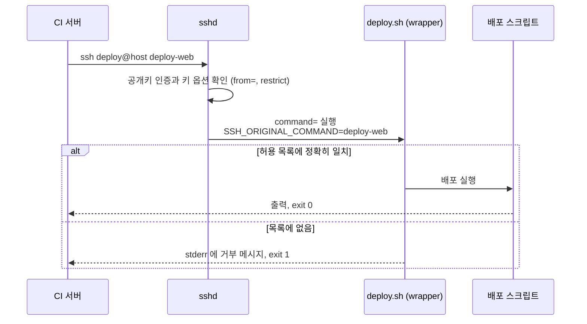

# SSH forced command 로 배포 키가 실행할 수 있는 명령 제한하기

배포 서버의 `authorized_keys` 에서 배포용 공개키 한 줄 앞에 `restrict,command="/opt/deploy/deploy.sh"` 를 붙이면, 그 키로는 지정한 스크립트 하나만 실행할 수 있다.
클라이언트가 보낸 명령은 실행되지 않고 `SSH_ORIGINAL_COMMAND` 환경 변수로만 전달된다.
스크립트가 그 값을 허용 목록과 정확히 비교해 배포 이름 몇 개만 받으면, 키가 유출되어도 공격자가 할 수 있는 일은 그 배포를 다시 실행하는 것으로 줄어든다.
`command=` 만 쓰면 포트 포워딩이 그대로 열리므로 `restrict` 를 반드시 함께 쓴다.

이 글은 OpenSSH 9.6p1(Ubuntu 24.04 패키지)의 man 페이지를 기준으로 쓴다.
man 페이지에 적힌 내용은 **출처의 사실**로, macOS 의 OpenSSH 10.3p1 로 띄운 로컬 sshd 에서 확인한 내용은 **직접 확인한 결과**로, 그 밖의 판단은 **추론**으로 구분한다.

## 배포 키가 열어 주는 범위

Jenkins 같은 CI 서버가 배포 서버에 SSH 로 접속해 배포 명령을 보내는 구성은 흔하다.
CI 서버에는 배포 계정의 개인키가 들어 있고, 배포 서버의 `~deploy/.ssh/authorized_keys` 에는 그 공개키가 있다.

아무 옵션 없이 공개키만 등록하면 이 키는 `deploy` 계정의 셸 전체를 연다.
CI 서버가 침해되거나 Jenkins Credentials 가 유출되면 공격자는 다음을 할 수 있다.

- `deploy` 계정 권한으로 임의의 명령을 실행한다.
- `ssh -L` 로 배포 서버를 거쳐 내부망의 다른 포트에 접근한다.
- `scp` 나 `sftp` 로 파일을 읽고 쓴다.
- PTY 를 받아 대화형 셸로 머문다.

CI 서버가 배포 서버에 실제로 요청하는 것은 "`deploy-web` 을 배포하라" 같은 이름 하나다.
줄여야 하는 것은 키가 여는 권한과 실제로 필요한 요청 사이의 차이다.
키 자체를 지킬 수 없다고 가정하고, 키가 할 수 있는 일을 배포에 필요한 만큼으로 줄인다.

## forced command 의 동작

`authorized_keys` 의 각 줄은 `옵션 키종류 공개키 주석` 형태이고, 옵션 자리에 `command="..."` 를 둘 수 있다.
이 옵션을 **forced command**(강제 명령)라고 부른다.

```text
restrict,command="/opt/deploy/deploy.sh" ssh-ed25519 AAAAC3Nza... deploy-web@ci.example.com
```

출처의 사실은 다음과 같다.

- 이 키로 인증하면 `command=` 에 적은 명령이 실행되고, 사용자가 보낸 명령은 무시된다.
- 클라이언트가 원래 보낸 명령은 `SSH_ORIGINAL_COMMAND` 환경 변수에 들어온다.
- 이 옵션은 셸 로그인, 명령 실행, subsystem 요청(`sftp` 등)에 모두 적용된다.
- 클라이언트가 PTY 를 요청하면 PTY 에서, 아니면 tty 없이 실행된다.
- man 페이지는 "원격 백업만 허용하는 키" 를 쓰임새의 예로 든다.

클라이언트가 `ssh deploy@host deploy-web` 을 보내면 sshd 는 `deploy-web` 을 실행하지 않는다.
`/opt/deploy/deploy.sh` 를 실행하고, 그 스크립트가 `SSH_ORIGINAL_COMMAND=deploy-web` 을 읽고 무엇을 할지 정한다.



forced command 는 무엇을 실행할지를 서버가 정하게 만든다.
클라이언트가 보내는 문자열은 명령이 아니라 **입력 데이터**가 된다.

## restrict 를 함께 써야 하는 이유

man 페이지는 `command=` 설명 안에서 다음을 분명히 적는다.
명시적으로 막지 않으면 클라이언트는 TCP 포워딩과 X11 포워딩을 요청할 수 있고, 막는 방법의 예로 `restrict` 를 든다.

직접 확인한 결과도 같았다.

| 설정 | `ssh -L 22300:127.0.0.1:22299 host` 후 22300 포트에 연결 | `ssh -tt host status` |
| --- | --- | --- |
| `command=` 만 | 포워딩이 열려 서버 SSH 배너 `SSH-2.0-OpenSSH_…` 가 돌아왔다 | PTY 가 할당됐다 |
| `restrict,command=` | 연결되지 않았다. sshd 로그에 `refused local port forward` | `PTY allocation request failed on channel 0` |

`command=` 만 둔 키는 명령 실행을 막았어도 배포 서버를 내부망으로 들어가는 **터널**로 쓸 수 있게 남겨 둔다.
배포 스크립트가 아무리 엄격해도 포워딩 요청은 스크립트를 거치지 않는다.
이것이 forced command 를 쓸 때 가장 자주 빠뜨리는 설정이다.

`restrict` 는 아래 항목을 한 번에 끈다.
앞으로 OpenSSH 에 추가되는 제한도 이 묶음에 포함되므로, `no-*` 옵션을 하나씩 나열하는 것보다 새 버전에서 안전하다.

| 끄는 기능 | 다시 켜는 옵션 |
| --- | --- |
| 포트 포워딩 (`-L`, `-R`, `-D`) | `port-forwarding` |
| agent 포워딩 | `agent-forwarding` |
| X11 포워딩 | `X11-forwarding` |
| PTY 할당 | `pty` |
| `~/.ssh/rc` 실행 | `user-rc` |

man 페이지의 예시도 이 두 가지를 함께 쓴다.

```text
restrict,command="dump /home" ssh-rsa ...
restrict,pty,command="nethack" ssh-rsa ...
```

두 번째 줄은 모든 것을 끈 뒤 게임 실행에 필요한 PTY 만 다시 켠 예다.
배포 키는 PTY 가 필요 없으므로 `restrict` 만 둔다.

## 함께 쓰는 키 옵션

옵션은 쉼표로 구분하고, 큰따옴표 안이 아니면 공백을 쓸 수 없다.
옵션 키워드는 대소문자를 구분하지 않는다.

| 옵션 | 동작 | 배포 키에서 쓰는 경우 |
| --- | --- | --- |
| `from="pattern-list"` | 공개키 인증에 더해 접속한 호스트의 이름이나 IP 가 목록에 있어야 한다. CIDR 을 쓸 수 있다 | CI 서버의 출발 IP 가 고정일 때. 키가 유출되어도 다른 곳에서는 로그인하지 못한다 |
| `no-pty` 등 `no-*` | 기능을 하나씩 끈다 | `restrict` 를 지원하지 않는 오래된 sshd 에서만 쓴다 |
| `permitopen="host:port"` | `-L` 포워딩의 목적지를 제한한다 | 포워딩이 꼭 필요한 키에서 목적지를 하나로 묶을 때. 배포 키에는 쓰지 않는다 |
| `permitlisten="[host:]port"` | `-R` 포워딩의 리스너를 제한한다 | 위와 같다 |
| `expiry-time="timespec"` | 지정 시각 이후 이 키를 받지 않는다. `YYYYMMDD[Z]` 또는 `YYYYMMDDHHMM[SS][Z]` | 임시 배포 권한이나 키 교체 주기를 강제할 때 |
| `environment="NAME=value"` | 환경 변수를 설정한다. 기본은 비활성이고 `PermitUserEnvironment` 로 켠다 | 거의 쓰지 않는다. 스크립트 안에서 값을 정하는 편이 추적하기 쉽다 |

`from=` 은 직접 확인했다.
`from="10.0.0.0/8",restrict,command=…` 인 키로 127.0.0.1 에서 접속하자 클라이언트는 `Permission denied (publickey)` 를 받았고, sshd 로그에는 `Refused by key options at …/authorized_keys:1` 이 남았다.

## 허용 목록 wrapper 작성법

forced command 가 가리키는 스크립트를 이 글에서는 **wrapper** 라고 부른다.
wrapper 는 `SSH_ORIGINAL_COMMAND` 를 명령으로 실행하지 않고, 허용된 이름 중 하나와 정확히 같은지만 비교한다.

```bash
#!/usr/bin/env bash
set -euo pipefail

main() {
  case "${SSH_ORIGINAL_COMMAND:-}" in
    deploy-web)
      exec /opt/deploy/bin/deploy-web.sh
      ;;
    status)
      exec /opt/deploy/bin/status.sh
      ;;
    *)
      echo "거부: 허용되지 않은 요청 '${SSH_ORIGINAL_COMMAND:-}'" >&2
      exit 1
      ;;
  esac
}

main "$@"; exit
```

지켜야 할 규칙은 다음과 같다.

- **정확히 일치하는 값만 받는다.** `case` 패턴에 `deploy-*` 같은 와일드카드를 쓰지 않는다.
- **셸로 다시 해석하지 않는다.** `eval "$SSH_ORIGINAL_COMMAND"`, `bash -c "$SSH_ORIGINAL_COMMAND"`, 따옴표 없는 `$SSH_ORIGINAL_COMMAND` 를 쓰면 허용 목록이 의미를 잃는다.
- **추가 인자를 받지 않는다.** 인자가 필요하면 `deploy-web` 과 `deploy-api` 처럼 이름을 늘린다. 인자를 꼭 받아야 한다면 정규식으로 형식을 검사한 뒤 배열로 넘긴다.
- **빈 요청을 거부한다.** 명령 없이 `ssh host` 로 접속하면 `SSH_ORIGINAL_COMMAND` 가 비어 있다. 이때 셸을 띄우지 않고 거부한다.
- **거부할 때는 0 이 아닌 종료 코드와 stderr 메시지를 남긴다.** CI 파이프라인이 실패로 인식하고 로그에서 원인을 볼 수 있다.
- 마지막 줄을 `main "$@"; exit` 로 두는 이유는 뒤의 「실패 사례와 유의할 점」에서 설명한다.

같은 구조의 스크립트로 직접 확인한 결과다.

| 클라이언트 요청 | 결과 |
| --- | --- |
| `ssh host deploy-blog` | 허용 목록에 있어 실행됐고 exit 0 |
| `ssh host whoami` | 스크립트가 거부했고 exit 1 |
| `ssh host 'deploy-blog; touch pwned'` | 문자열 전체가 `SSH_ORIGINAL_COMMAND` 로 들어와 거부됐다. 파일은 생기지 않았다 |
| `ssh host 'deploy-blog extra'` | 정확히 일치하지 않아 거부됐다 |
| `ssh host` (명령 없음) | `SSH_ORIGINAL_COMMAND` 가 비어 거부됐다 |

세 번째 줄이 중요하다.
세미콜론이 셸 문법으로 해석되지 않고 문자열 그대로 비교되었기 때문에 거부됐다.
wrapper 가 이 값을 `eval` 에 넘겼다면 `touch pwned` 가 실행됐을 것이다.

## 파일 전송도 막힌다

forced command 는 subsystem 요청에도 적용되므로 `scp` 와 `sftp` 도 wrapper 를 거친다.
직접 확인한 결과는 다음과 같다.

| 요청 | 결과 |
| --- | --- |
| `scp` (기본값인 SFTP 프로토콜) | `sftp-server` 대신 wrapper 가 실행되어 `Connection closed` 로 끝났고 복사되지 않았다. sshd 로그에는 subsystem 요청도 `forced-command (key-option)` 세션으로 시작했다고 남았다 |
| `scp -O` (옛 scp 프로토콜) | `SSH_ORIGINAL_COMMAND` 에 `scp -t <경로>` 가 들어와 wrapper 가 거부했다 |

배포 키로 파일 전송까지 막히는 것은 의도한 동작이다.
배포 산출물을 올려야 한다면 다음 중 하나를 고른다.

- 배포 서버가 산출물 저장소나 컨테이너 레지스트리에서 직접 가져오게 하고, SSH 로는 "가져와서 배포하라" 는 이름만 보낸다.
- 전송 전용 키를 따로 두고, 그 키의 forced command 로 rsync 배포판에 포함된 `rrsync` 를 쓴다.

`rrsync` 는 SSH 로그인을 지정한 디렉터리 안의 rsync 전송만으로 제한하는 스크립트다.
rsync 3.5.1 의 man 페이지는 `command="rrsync DIR"`, `command="rrsync -ro DIR"` 같은 사용 예를 든다.
`-ro` 는 읽기만, `-wo` 는 쓰기만 허용하고 `-no-del` 은 삭제를 막는다.
이 경우에도 `restrict` 를 함께 붙인다.

## ForceCommand 와의 차이

`sshd_config` 에는 같은 일을 서버 설정 단위로 하는 `ForceCommand` 가 있다.
출처의 사실은 다음과 같다.

- 클라이언트가 보낸 명령과 `~/.ssh/rc` 를 무시하고 지정한 명령을 실행한다.
- 명령은 사용자의 login shell 에 `-c` 로 넘겨 실행한다.
- 셸 로그인, 명령 실행, subsystem 요청에 적용되고, 원래 명령은 `SSH_ORIGINAL_COMMAND` 에 들어온다.
- `Match` 블록 안에서 가장 유용하다.
- `internal-sftp` 를 지정하면 `ChrootDirectory` 와 함께 쓰는 in-process SFTP 서버가 된다.
- `authorized_keys` 의 `command=` 와 둘 다 있으면 `ForceCommand` 가 우선한다.

| 항목 | `authorized_keys` 의 `command=` | `sshd_config` 의 `ForceCommand` |
| --- | --- | --- |
| 적용 단위 | 공개키 한 줄 | `Match` 로 고른 사용자, 그룹, 접속 주소 |
| 설정 위치 | 대상 계정의 홈 디렉터리 | 시스템 설정 파일. root 권한이 필요하다 |
| 우선순위 | 낮다 | 둘 다 있으면 이쪽이 덮어쓴다 |
| 적합한 쓰임 | 한 계정에 용도별 키를 여러 개 두는 배포 키 | SFTP 전용 계정, 특정 그룹 전체의 접근 제한 |

한 `deploy` 계정에 CI 서버용 배포 키와 운영자용 상태 조회 키를 따로 두고 각각 다른 wrapper 를 붙이려면 `command=` 가 맞다.
`ForceCommand` 는 계정 단위로 적용되므로 키마다 다르게 걸 수 없다.

## Jenkins 에서 쓰는 모양

Jenkins 쪽에는 배포 계정의 개인키를 **SSH Username with private key** 종류의 Credentials 로 등록한다.
파이프라인은 배포 이름 하나만 보낸다.

```groovy
withCredentials([sshUserPrivateKey(credentialsId: 'deploy-key', keyFileVariable: 'KEY')]) {
    sh 'ssh -i "$KEY" -o BatchMode=yes deploy@deploy.example.com deploy-web'
}
```

`BatchMode=yes` 는 비밀번호나 호스트 키 확인 프롬프트를 띄우지 않고 실패하게 만든다.
CI 에서 대기 상태로 멈추는 것을 막는다.
처음 접속할 호스트 키는 `known_hosts` 에 미리 등록해 둔다.

무엇을 배포할지, 어떤 순서로 할지는 배포 서버의 허용 목록과 배포 스크립트가 정한다.
파이프라인에 셸 명령을 길게 적어 원격으로 보내는 방식은 forced command 와 맞지 않는다.

같은 목적의 다른 구성과 비교하면 다음과 같다.
열리는 권한은 추론이다.

| 구성 | CI 서버가 침해되면 열리는 권한 | 비용 |
| --- | --- | --- |
| Jenkins 컨테이너에 `docker.sock` 마운트 | Docker 데몬 전체. 호스트 루트 디렉터리를 마운트한 컨테이너를 띄울 수 있으므로 사실상 호스트 root 다 | 설정이 가장 쉽다 |
| 배포 서버에 Jenkins agent 상주 | agent 프로세스가 실행되는 계정의 권한 전체. controller 가 임의의 작업을 보낼 수 있다 | agent 프로세스와 Java 런타임을 운영해야 한다 |
| forced command 배포 키 | 허용 목록에 있는 배포 작업 | wrapper 와 배포 스크립트를 서버에 두고 관리해야 한다 |

판단 기준은 **CI 서버가 침해됐을 때 배포 서버에서 무엇이 가능한가**다.
배포가 몇 개의 정해진 작업으로 표현된다면 forced command 가 가장 작은 권한으로 목적을 이룬다.
빌드 단계마다 배포 서버에서 임의의 명령을 돌려야 한다면 agent 가 필요하고, 그때는 agent 계정의 권한을 따로 줄여야 한다.

## 실패 사례와 유의할 점

### restrict 를 빠뜨린다

`command=` 만 두면 명령은 막혀도 포트 포워딩이 열린다.
앞의 대조 결과처럼 배포 서버가 내부망으로 들어가는 터널이 된다.
배포 키 줄은 항상 `restrict,` 로 시작한다.

### wrapper 가 요청을 셸로 넘긴다

`eval "$SSH_ORIGINAL_COMMAND"` 나 `sh -c "$SSH_ORIGINAL_COMMAND"` 가 들어간 wrapper 는 forced command 가 없는 것과 같다.
"허용된 명령으로 시작하는지" 를 검사하는 방식도 같은 문제가 있다.
`deploy-web; rm -rf ~` 는 `deploy-web` 으로 시작한다.

### 실행 중인 wrapper 를 제자리에서 덮어쓴다

wrapper 나 배포 스크립트를 `git pull` 등으로 갱신하는 구성에서 생긴다.
bash 는 스크립트를 한 번에 읽지 않고 실행하면서 조금씩 읽는다.

직접 확인한 결과는 다음과 같다.

- 실행 중인 bash 스크립트를 `>` 로 같은 파일(같은 inode)에 다시 쓰면, 실행 중이던 프로세스가 바뀐 내용을 이어 읽다가 `unexpected EOF` 나 `syntax error` 로 끝났다.
- 본문을 `main() { … }` 로 감싸고 마지막 줄에서 `main "$@"; exit` 로 부르면, 같은 방식으로 덮어써도 처음 읽은 코드대로 끝까지 실행됐다. bash 는 함수 정의를 끝까지 읽은 뒤 호출하기 때문이다.
- 같은 줄의 `exit` 는 함수가 끝난 뒤 파일의 나머지를 더 읽지 않게 한다. 이 부분은 추론이다.

새 파일을 만든 뒤 `mv` 로 교체(rename)하면 실행 중인 프로세스는 옛 inode 를 계속 읽으므로 이 문제가 생기지 않는다.
이 부분은 추론이다.
두 방법을 함께 쓰는 것이 안전하다.

### 컨테이너에서 나가는 연결의 출발 IP

Jenkins 가 Docker 컨테이너로 돌고 배포 서버가 같은 호스트에 있으면, 배포 서버의 sshd 가 보는 출발 IP 는 호스트의 공인 IP 가 아니라 Docker 브리지 대역(예: `172.17.0.0/16`)의 주소일 수 있다.
`from=` 에 호스트 IP 만 적으면 정상 배포가 `Refused by key options` 로 거부된다.
실제 출발 IP 는 sshd 로그의 `from <ip>` 로 확인한 뒤 적는다.

### command 경로가 저장소 안의 파일이다

`command="/opt/deploy/repo/deploy.sh"` 처럼 git checkout 안의 파일을 가리키면, 그 저장소에 push 할 수 있는 사람이 wrapper 의 내용을 바꿀 수 있다.
배포 서버가 저장소를 갱신하는 순간 허용 목록이 바뀐다.
즉 저장소의 쓰기 권한이 곧 배포 서버의 실행 권한이 된다.
wrapper 는 저장소 밖에 두고 `deploy` 계정이 쓸 수 없는 소유자와 권한으로 설치한다.

### 키의 용도가 드러나지 않는다

`authorized_keys` 에 줄이 늘면 어느 키가 무엇인지 알기 어렵다.
주석 자리에 `deploy-web@ci.example.com` 처럼 용도와 사용처를 적는다.
키를 교체하거나 폐기할 때 지울 줄을 바로 찾을 수 있다.

## 검증 방법

설정을 바꾼 뒤 허용된 요청과 거부돼야 할 요청을 모두 직접 보낸다.

```bash
# 성공, exit 0
ssh -F /dev/null -o IdentitiesOnly=yes -i deploy_key \
  deploy@deploy.example.com deploy-web

# 거부, exit 1
ssh -F /dev/null -o IdentitiesOnly=yes -i deploy_key \
  deploy@deploy.example.com whoami

# 명령 없이 접속해도 거부
ssh -F /dev/null -o IdentitiesOnly=yes -i deploy_key \
  deploy@deploy.example.com

# PTY allocation request failed
ssh -F /dev/null -o IdentitiesOnly=yes -i deploy_key -tt \
  deploy@deploy.example.com status

# 다른 터미널에서 nc 127.0.0.1 22300 이 연결되지 않아야 한다
ssh -F /dev/null -o IdentitiesOnly=yes -i deploy_key -N \
  -L 22300:127.0.0.1:22 deploy@deploy.example.com

# 복사되지 않아야 한다
scp -F /dev/null -o IdentitiesOnly=yes -i deploy_key \
  ./a.txt deploy@deploy.example.com:/tmp/
```

검증할 때는 `-i` 로 지정한 키만 쓰도록 `-o IdentitiesOnly=yes` 를 반드시 붙인다.
이 옵션이 없으면 ssh-agent 에 올라간 키나 `~/.ssh/config` 에 적힌 다른 키로 인증될 수 있다.
그러면 거부돼야 할 `whoami` 가 셸이 열린 다른 키로 성공하거나, 반대로 `restrict` 가 없는 키로 포워딩이 열려 설정이 틀렸다고 오해하게 된다.
`-F /dev/null` 은 `~/.ssh/config` 를 읽지 않게 해서 `Host` 별칭에 걸린 `IdentityFile` 이나 `User` 의 영향을 없앤다.

sshd 로그(Ubuntu 는 `journalctl -u ssh`)에서 다음 문자열을 확인한다.

| 로그 문자열 | 뜻 |
| --- | --- |
| `Starting session: forced-command (key-option) '<경로>' for <user> from <ip>` | 이 세션이 forced command 로 시작했다. 매 세션 남으므로 감사 기록으로 쓴다 |
| `refused local port forward` | `restrict` 가 `-L` 포워딩을 막았다 |
| `Refused by key options at <파일>:<줄>` | `from=` 등 키 옵션 조건을 만족하지 못해 인증이 거부됐다 |

첫 번째 줄이 보이지 않으면 forced command 가 적용되지 않은 것이다.
키 줄의 옵션 문법이나 대상 계정의 `authorized_keys` 경로를 다시 확인한다.

## 참고

- [sshd(8) AUTHORIZED_KEYS FILE FORMAT](https://man.openbsd.org/sshd#AUTHORIZED_KEYS_FILE_FORMAT)
- [sshd_config(5) ForceCommand](https://man.openbsd.org/sshd_config#ForceCommand)
- [rrsync(1)](https://download.samba.org/pub/rsync/rrsync.1)
