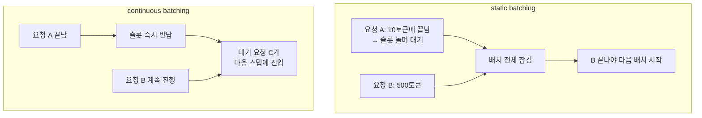

# 배칭과 GPU 활용률 — batch 1이 GPU를 놀리는 이유부터 continuous batching까지

> [GPU로 LLM을 서빙한다는 것](./gpu-llm-serving-basics.md)을 먼저 읽으면 이 글이 훨씬 쉽다. 거기서 유도한 "decode는 memory-bandwidth bound"라는 결론을 전제로 깔고 시작한다.

앞 글에서 이런 수치를 봤다. Llama 70B를 H100에서 요청 하나씩(batch 1) 디코딩하면, 텐서코어 활용률이 약 **0.34%**다. 989 TFLOP/s짜리 연산 유닛의 99.7%가 놀면서, 매 토큰마다 140GB짜리 가중치가 HBM에서 다 실려오기만을 기다린다. 병목은 연산이 아니라 메모리 대역폭이었다.

이 글의 질문은 하나다. **그 노는 99.7%를 어떻게 되살릴 것인가.** 답의 큰 줄기가 배칭이고, 실전에서 쓰이는 형태가 continuous batching이다. 그런데 단순히 요청을 모으는 것만으로는 안 되고, 거기서 head-of-line blocking이라는 백엔드 개발자에게 익숙한 문제가 튀어나온다.

## 배칭의 원리: 고정비를 여러 요청이 나눠 갖는다

왜 요청을 묶으면 노는 코어가 채워질까. 앞 글의 연산 강도(arithmetic intensity, FLOP/byte) 공식으로 그대로 설명된다.

- **batch 1 디코딩**: 가중치 140GB를 읽어 벡터 하나에 곱한다. 행렬 × 벡터(GEMV) 연산이고, 연산 강도는 1 FLOP/byte다.
- **batch N 디코딩**: *같은* 가중치 140GB를 한 번 읽어 **N개 벡터에 동시에** 곱한다. 행렬 × 행렬(GEMM)이 되고, 읽는 데이터는 그대로인데 연산량이 N배가 된다. 연산 강도가 약 N배로 오른다.

핵심은 **가중치를 읽는 비용이 고정비**라는 것이다. batch 1이든 N이든 매 스텝 140GB를 읽는 건 똑같다. 그렇다면 그 한 번의 읽기에 최대한 많은 요청의 계산을 얹어야 대역폭이 아깝지 않다. 백엔드에서 DB 쓰기를 묶어 네트워크 왕복 비용을 분할상환하는 것과 정확히 같은 발상이다. 요청 하나당 왕복(가중치 읽기)이 비싸면, 여러 건을 한 왕복에 태운다.

여기서 이 도메인 특유의 반직관적인 구간이 하나 생긴다. 어차피 대역폭이 놀고 있었기 때문에, 배치를 키워 throughput을 올려도 **토큰당 지연은 거의 늘지 않는다.** 보통 백엔드에서는 처리량을 짜내면 지연이 따라 오르는데, 여기서는 한동안 처리량이 거의 공짜로 오른다. 놀던 코어를 채우는 것뿐이니까.

물론 무한정은 아니다. 이론상 배치를 수백 규모까지 키우면 연산 강도가 ridge point(H100 기준 295 FLOP/byte)에 닿아 compute-bound로 넘어가고, 그때부터는 배치를 더 키워도 처리량 이득이 사라진다. 다만 실제로는 그 전에 **KV cache 메모리가 배치 크기를 먼저 제한하는** 경우가 많다. 이건 뒤에서 다시 나온다.

## 단순 배칭(static batching)이 부딪히는 벽: head-of-line blocking

가장 순진한 배칭은 이렇다. 요청 N개를 모아 한 배치로 묶어 시작하고, 그 배치가 끝나면 다음 N개를 받는다. 이걸 static batching이라 한다. 그런데 여기 LLM 특유의 함정이 있다.

**출력 길이가 요청마다 다르다.** 어떤 요청은 10토큰이면 끝나고, 어떤 요청은 500토큰을 쏟아낸다. 그리고 얼마나 길지는 미리 알 수 없다. static batching에서는 **배치 전체가 가장 긴 시퀀스가 끝날 때까지 잠긴다.** 10토큰에서 끝난 요청도 자기 GPU 슬롯을 500토큰짜리가 끝날 때까지 붙들고 있어야 한다. 그동안 그 슬롯은 의미 없는 빈 계산으로 패딩된다.

결과는 두 가지 손해다.

- **지연**: 짧은 요청이 긴 요청 뒤에 묶여 불필요하게 오래 걸린다. 전형적인 head-of-line blocking이다.
- **처리량**: 먼저 끝난 슬롯이 놀면서 배치 전체가 retire될 때까지 대기한다. 애써 채운 코어가 다시 빈다.

백엔드 비유로는 **고정 코호트 배치 처리**다. 한 배치의 모든 요청이 끝나야 다음 배치를 받는 worker pool을 상상하면 된다. 제일 느린 한 건이 pool 전체를 인질로 잡는다. 게다가 새로 도착한 요청은 현재 배치가 끝날 때까지 큐에서 기다려야 하므로, 첫 토큰까지의 지연(TTFT)도 나빠진다.

## 해결: iteration-level scheduling (continuous batching)

발상의 전환은 이것이다. 배치를 요청 단위가 아니라 **토큰 스텝 단위로 다시 짠다.**

continuous batching은 매 forward pass(토큰 하나를 생성하는 한 스텝)마다 배치 구성을 다시 평가한다. 어떤 시퀀스가 이번 스텝에서 끝나면 그 슬롯을 **즉시 반납**하고, 큐에서 기다리던 요청이 **다음 스텝에 곧바로 그 자리로 들어온다.** 이 방식을 iteration-level scheduling(반복 단위 스케줄링)이라 부른다.

여기서 앞서 내가 처음에 오해했던 지점을 짚고 간다. 이건 **짧은 요청끼리 미리 묶는 게 아니다.** 출력 길이를 미리 모르니 길이별 그룹핑은 애초에 불가능하다. 대신 **슬롯을 토큰 단위로 끊임없이 재활용**하는 것이 본질이다.

백엔드 비유로 돌아오면, worker가 자기 일을 끝내는 즉시 pool로 반환되어 다음 요청을 받는 구조다. 코호트가 전부 끝나기를 기다리지 않는다. static batching이 "배치가 다 끝나야 반환"이라면, continuous batching은 "건별로 끝나는 즉시 반환"이다.

이 개념은 Orca(OSDI 2022)가 도입했고, vLLM이 KV cache 메모리를 블록 단위로 관리하는 PagedAttention과 결합해 프로덕션 표준으로 만들었다.

## 수치: 얼마나 차이나나

Anyscale이 OPT-13B를 단일 A100 40GB에서 측정한 결과가 자주 인용된다.

- vLLM(continuous batching + 메모리 최적화): static batching 대비 최대 **23배** 처리량
- Hugging Face TGI, Ray Serve: 약 8배
- FasterTransformer: 약 4배

Orca 논문은 FasterTransformer 대비 최대 36.9배를 보고했다. 수치는 모델과 워크로드에 따라 달라지니 절대값보다 자릿수(단순 배칭 대비 한 자릿수에서 두 자릿수 배)로 읽는 게 맞다.

주목할 점은 **처리량만 오르는 게 아니라 p50 지연도 내려간다**는 것이다. 보통 둘은 상충하는데, 여기서는 대기 요청을 즉시 주입해 큐 대기 시간을 줄이기 때문에 둘 다 개선된다. head-of-line blocking을 없앤 직접적 효과다.

## 공짜는 아니다: 실패 모드와 트레이드오프

continuous batching이 만능은 아니다. 실전에서 부딪히는 지점들이 있다.

- **KV cache 메모리가 진짜 상한이다**: 배치를 키우면 각 요청의 KV cache가 동시에 VRAM에 상주한다. 그 합이 메모리를 넘으면 OOM이다. 그래서 배치 크기의 실질적 상한은 연산 능력이 아니라 메모리인 경우가 많다. 이 문제를 정면으로 푸는 게 PagedAttention이고, 별도 글에서 다룬다.
- **prefill-decode 간섭**: continuous batch에 무거운 prefill이 끼어들면 문제가 생긴다. prefill은 compute-bound라 한 스텝이 무겁다. 그 스텝이 도는 동안 같은 배치에서 진행 중이던 다른 요청들의 decode가 지연되어, 토큰 사이 지연(TPOT)이 튄다. **한 사용자의 긴 프롬프트가 다른 사용자들의 토큰 생성을 순간적으로 얼려버리는** 셈이다.
  - 완화책이 chunked prefill이다. 긴 prefill을 고정 크기 청크(예: 512토큰)로 쪼개 decode 스텝들과 번갈아 처리해, 한 스텝의 시간 상한을 둔다. 트레이드오프가 분명하다. 청크를 작게 할수록 진행 중인 요청들의 TPOT는 매끄러워지지만, 그 긴 프롬프트 자신의 TTFT는 올라가고 전체 처리량은 약간 깎인다.
- **저부하일 때의 지연**: 배치가 어느 정도 찰 때까지 기다리는 정책이면, 요청이 드문 시간대에는 오히려 대기가 지연을 만든다. 실무에서는 배치를 채우는 대기에 타임아웃을 둬 균형을 잡는다.

정리하면, 배치는 클수록 좋은 게 아니다. ridge point를 넘으면 처리량 이득이 사라지고, 그 전에 이미 메모리와 지연이 상한을 만든다. "어디까지 키울 것인가"가 서빙 튜닝의 핵심 손잡이 중 하나다.

## 마무리

배칭의 본질은 "가중치 읽기라는 고정비를 여러 요청이 나눠 갖기"이고, 단순 배칭의 head-of-line blocking을 토큰 단위 스케줄링으로 깬 것이 continuous batching이다. 백엔드에서 worker를 코호트로 묶느냐 건별로 반환하느냐의 차이와 같은 구조다.

여기서 TTFT와 TPOT, 처리량이 계속 함께 등장했다. 이 셋이 서로 어떻게 밀고 당기는지를 다음 글에서 정면으로 다룬다.

## 참고 링크

- [How continuous batching enables 23x throughput in LLM inference (Anyscale)](https://www.anyscale.com/blog/continuous-batching-llm-inference)
- [vLLM Explained: PagedAttention and Continuous Batching (RunPod)](https://www.runpod.io/articles/guides/vllm-pagedattention-continuous-batching)
- [Chunked Prefill: Why One Long Prompt Freezes Your LLM Server (dev.to)](https://dev.to/ji_ai/chunked-prefill-why-one-long-prompt-freezes-your-llm-server-30e0)
- [Optimization and Tuning (vLLM Docs)](https://docs.vllm.ai/en/v0.8.2/performance/optimization.html)
