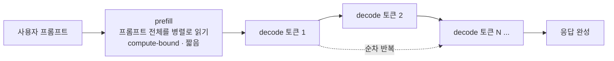

# GPU로 LLM을 서빙한다는 것 — 백엔드 개발자를 위한 추론 서빙의 원리

> [GPU·CUDA·MPS 기초 — 자바 백엔드 개발자가 처음 만나는 그림](../java-to-python-gpu-cuda-mps.md)을 먼저 읽으면 GPU 자체의 그림이 잡힌다. 이 글은 그 위에서 "LLM을 서빙하면 왜 어렵고, 그 어려움이 어디서 오는가"를 다룬다.

나는 AI 서비스 백엔드를 하지만, GPU 위에서 LLM이 실제로 어떻게 도는지는 오래 블랙박스였다. 모델 팀이 만든 걸 API로 감싸 안정적으로 굴리는 역할에 가까웠고, 그 안은 어렴풋하게만 알았다. 이 글은 그 블랙박스를 백엔드 개발자의 언어로 열어본 기록이다.

결론부터 말하면, **LLM 서빙의 거의 모든 어려움은 "디코딩 단계가 memory-bandwidth bound(메모리 대역폭 병목)"라는 사실 하나에서 파생된다.** 배칭도, KV cache도, PagedAttention도, 비용 최적화도 전부 이 한 문장을 다루는 장치다. 이 글에서 그 문장을 수치까지 유도해두면, 뒤에 이어질 글들이 왜 그 문제를 푸는지 자연스럽게 읽힌다.

익숙한 백엔드 직감 하나를 미리 꺼내두자. "CPU는 안 바쁜데 처리량이 안 나온다? 그럼 IO나 메모리를 의심하라." GPU LLM 서빙이 정확히 이 상황이다. 값비싼 연산 유닛이 놀고 있는데 느리다. 다른 점은 병목 자원이 디스크나 네트워크가 아니라 **GPU 안의 메모리 대역폭**이라는 것뿐이다.

## 서빙은 학습과 다른 시스템 문제다

먼저 경계를 긋자. 학습과 서빙은 자원 프로파일이 다르다.

- **학습**(training): 모델을 *만드는* 과정. 지연 제약이 없고 처리량만 중요한 대형 배치 잡이다. 야간 ETL 파이프라인에 가깝다.
- **서빙**(serving, inference): *이미 만들어진* 모델로 요청에 답을 생성해 돌려주는 것. 온라인이고, 지연 SLA가 있고, 여러 사용자를 동시에 받는다. 우리가 운영하는 API 티어와 같은 성격이다.

우리가 마주하는 문제는 후자다. "요청이 몰릴 때 SLA를 지키면서 얼마나 싸게 답을 내줄 것인가." 그래서 서빙은 학습과 별개의 시스템 문제로 다뤄야 한다.

## 한 요청의 생애주기: prefill과 decode

LLM의 가장 중요한 특성 하나. **답을 한 번에 못 만든다.** 토큰(단어 조각)을 하나씩, 앞에서 만든 결과를 다시 입력에 넣어 다음 토큰을 만든다. 이 방식을 autoregressive(자기회귀)라 부른다. 답이 200토큰이면 모델을 200번 통과시킨다는 뜻이다.

이 때문에 한 요청은 성격이 전혀 다른 두 단계로 갈린다.

- **prefill**(프리필): 입력 프롬프트 *전체*를 한 번에 읽어 내부 상태를 만드는 단계. 입력이 통째로 있으니 토큰들을 **병렬로** 처리한다.
- **decode**(디코드): 답을 한 토큰씩 생성하는 단계. 앞 토큰이 있어야 다음을 만드니 **순차적**이다. 토큰마다 모델을 한 번씩 통과한다.

백엔드 비유로는, 한 요청 안에 **처리량 최적화 구간**(prefill)과 **지연 민감 스트리밍 구간**(decode)이 공존하는 셈이다. 벌크로 밀어 넣는 구간과 한 건씩 흘려보내는 구간을 한 시스템이 동시에 감당해야 한다.



이 두 단계는 뒤에서 보듯 **부하 걸리는 자원 자체가 다르다.** prefill은 연산이 병목이고, decode는 메모리 대역폭이 병목이다. 서빙 최적화가 단계마다 갈리는 이유가 여기 있다.

## 핵심: decode는 왜 느린가 — roofline으로 보는 memory-bandwidth bound

여기가 이 글의 심장이다. 왜 그 비싼 GPU가 놀면서도 느린지를 수치로 유도한다.

GPU에는 병목이 될 수 있는 자원이 둘 있다.

- **연산 능력**: 초당 부동소수점 연산 수. H100(FP16)은 약 989 TFLOP/s.
- **메모리 대역폭**: 가중치가 있는 HBM에서 연산 유닛으로 데이터를 나르는 속도. H100은 약 3.35 TB/s.

어떤 작업이 둘 중 무엇에 걸리는지는 **연산 강도**(arithmetic intensity, 데이터 1바이트를 읽어 몇 번 연산하는가, FLOP/byte)로 결정된다. 이 둘의 비율로 정해지는 분기점을 ridge point라 하고, H100은 **295 FLOP/byte**다.

- 연산 강도가 295보다 크면 → 데이터는 충분히 왔고 계산할 게 많다 → **compute-bound**(연산 병목).
- 295보다 작으면 → 계산은 금방 끝나고 데이터가 안 온다 → **memory-bound**(대역폭 병목).

이제 decode 한 토큰을 계산해보자. Llama 70B를 FP16으로 서빙한다고 하자.

```
decode 한 토큰 (Llama 70B, FP16):
  읽는 데이터 = 70B 파라미터 × 2 byte = 140 GB   (매 토큰마다 가중치 전체를 HBM에서 읽음)
  연산량      = 2 × 70B          = 140 GFLOP  (파라미터당 곱셈-덧셈 1회)
  연산 강도   = 140 GFLOP / 140 GB = 1 FLOP/byte

  H100 ridge point = 295 FLOP/byte
  → 텐서코어 활용률 ≈ 1 / 295 ≈ 0.34%   (연산 유닛의 99.7%가 놀고 있음)
```

디코딩은 연산 강도가 **1 FLOP/byte**다. ridge point 295에 한참 못 미친다. 즉 매 토큰마다 140GB짜리 가중치를 통째로 읽어 와서, 벡터 하나에 곱하고, 토큰 하나 뱉고 끝이다. 연산은 거의 없고 데이터 읽기가 전부다. 그 결과 989 TFLOP/s짜리 텐서코어의 **99.7%가 놀면서 HBM이 데이터를 다 나를 때까지 기다린다.**

이게 "CPU 안 쓰는데 왜 안 빠르지"의 GPU 버전이다. 병목은 FLOP이 아니라 HBM 대역폭이고, 토큰 생성 속도는 사실상 **가중치 크기 ÷ 메모리 대역폭**으로 정해진다. 70B FP16이면 140GB ÷ 3.35TB/s ≈ 42ms, 즉 이론상 토큰 하나에 40ms대가 하한이다.

대조를 위해 prefill을 보자. 512토큰 프롬프트를 같은 70B에 넣으면 가중치를 한 번 읽어 512토큰 몫을 한꺼번에 계산한다. 연산 강도가 약 455 FLOP/byte로 올라가 ridge point를 넘고, 그래서 **compute-bound**가 된다. 같은 모델, 같은 GPU인데 단계에 따라 병목 자원이 뒤집힌다.

**여기서 나오는 첫 번째 함의**: 요청을 하나씩(batch size 1) 처리하면 그 비싼 GPU의 99.7%가 논다. 놀리는 코어를 채우려면 여러 요청의 가중치 읽기를 공유해야 한다. 이게 다음 글의 주제인 배칭이다. 연산 강도 공식에서 배치 크기를 키우면 "읽는 데이터(가중치)"는 그대로인데 "연산량"이 배치 배로 늘어 연산 강도가 올라가는 것이 그 원리다.

## decode가 그나마 굴러가게 하는 것: KV cache

decode가 순차라는 사실에는 숨은 함정이 하나 더 있다. 다음 토큰을 만들 때 모델은 **앞의 모든 토큰을 다시 참조**한다(attention). 순진하게 구현하면 매 스텝마다 지금까지의 토큰 전체를 재계산하므로, 답 하나 만드는 데 드는 계산이 토큰 길이의 제곱(O(n²))으로 커진다.

**KV cache**는 이 재계산을 없애는 memoization이다. 각 토큰을 처리할 때 나온 Key와 Value 텐서를 저장해두고, 다음 스텝에서 다시 쓴다. 그러면 매 스텝은 새 토큰 하나만 처리하면 되어 계산이 선형(O(n))으로 떨어진다. 백엔드에서 반복 계산 결과를 캐싱해 응답을 줄이는 것과 똑같은 발상이다.

문제는 언제나처럼 **캐시가 메모리를 먹는다는 것**이다. 크기는 이렇게 정해진다.

```
KV cache 크기 = 2 × layers × kv_heads × head_dim × seq_len × batch × bytes
              (2 = Key와 Value 둘 다 저장)

Llama-2 7B (layers 32, kv_heads 32, head_dim 128), FP16, 요청 1개, 2048 토큰:
  2 × 32 × 32 × 128 × 2048 × 1 × 2 byte = 1,073,741,824 byte = 1 GiB

Llama-3.1 70B (layers 80, kv_heads 8, head_dim 128), FP16, 요청 1개, 128K 토큰:
  2 × 80 × 8 × 128 × 131072 × 1 × 2 byte ≈ 42.9 GB
```

요청 하나가 컨텍스트를 길게 쓰면 KV cache만으로 수십 GB를 잡아먹는다. 그래서 **동시에 받을 수 있는 요청 수의 상한이 연산이 아니라 "KV cache가 들어갈 VRAM"으로 결정되는** 상황이 자주 벌어진다. 동시성을 늘리려다 OOM으로 죽는 지점이 여기다.

이 지점이 vLLM의 PagedAttention이 푸는 문제다. KV cache를 운영체제의 페이징처럼 고정 크기 블록으로 쪼개 메모리 단편화를 줄이고, 같은 VRAM으로 더 많은 동시 요청을 받는다. 자세한 건 별도 글에서 다룬다.

한 가지 균형추. KV cache가 항상 이득인 건 아니다. 아주 짧은 단발성 요청이라면 캐시로 아끼는 재계산량이 작아 이득이 크지 않다. 그래도 대부분의 생성 서빙에서는 기본으로 켠다. 트레이드오프는 "속도를 얻고 메모리를 내준다"이고, 실무의 고민은 대개 그 메모리를 어떻게 아끼느냐로 향한다.

## 그래서 서빙 시스템이 실제로 푸는 문제들

여기까지가 토대다. 이 위에서 실전 서빙이 부딪히는 문제를 지도로 펼치면, 뒤 글들이 각각 하나씩 답하는 구조가 된다.

- batch 1로는 GPU가 99.7% 논다. 여러 요청을 어떻게 묶어 대역폭을 나눠 쓸 것인가. → [배칭과 GPU 활용률](./continuous-batching-gpu-utilization.md)
- 첫 토큰까지의 지연(TTFT)과 토큰 사이 지연(TPOT), 그리고 전체 처리량은 서로 상충한다. → **latency와 throughput**
- KV cache가 VRAM을 먹어 동시성 상한을 정한다. 이 메모리를 어떻게 관리하는가. → **KV cache와 PagedAttention**
- 트래픽은 출렁이는데 GPU는 비싸고 모델 로딩은 수십 초 걸린다. 몇 장을 띄워둘 것인가. → **autoscaling과 cold start**
- 위 모든 게 결국 GPU 시간, 곧 돈이다. 같은 품질을 더 싸게. → **비용 최적화**

## 마무리

백엔드에서 오래 굴린 직감 하나가 여기서도 그대로 통한다. 값비싼 연산 유닛이 노는데 느리면, 병목은 연산이 아니라 그 유닛에 데이터를 나르는 경로다. GPU LLM 서빙에서 그 경로는 HBM 대역폭이고, decode는 근본적으로 memory-bandwidth bound다. 배칭, KV cache, PagedAttention은 이름은 달라도 전부 그 대역폭을 아끼거나 여러 요청이 나눠 쓰게 만드는 장치다.

다음 글에서는 이 중 첫 번째, GPU가 왜 놀고 배칭이 그것을 어떻게 되살리는지를 연산 강도 관점에서 파본다.

## 참고 링크

- [A guide to LLM inference and performance (Baseten)](https://www.baseten.co/blog/llm-transformer-inference-guide/)
- [Roofline Analysis of Dot Product on an H100 (Sai Sasank)](https://www.saisasank.com/roofline-analysis-of-dot-product-on-an-h100/)
- [GPU Inference: H100 vs A100 vs L4 (Inference Engineering)](https://inferenceengineering.tech/learn/gpu-inference/)
- [KV Cache Memory Calculation for LLMs (Lyceum Technology)](https://lyceum.technology/magazine/kv-cache-memory-calculation-llm/)
- [vLLM Explained: PagedAttention and Continuous Batching (RunPod)](https://www.runpod.io/articles/guides/vllm-pagedattention-continuous-batching)
