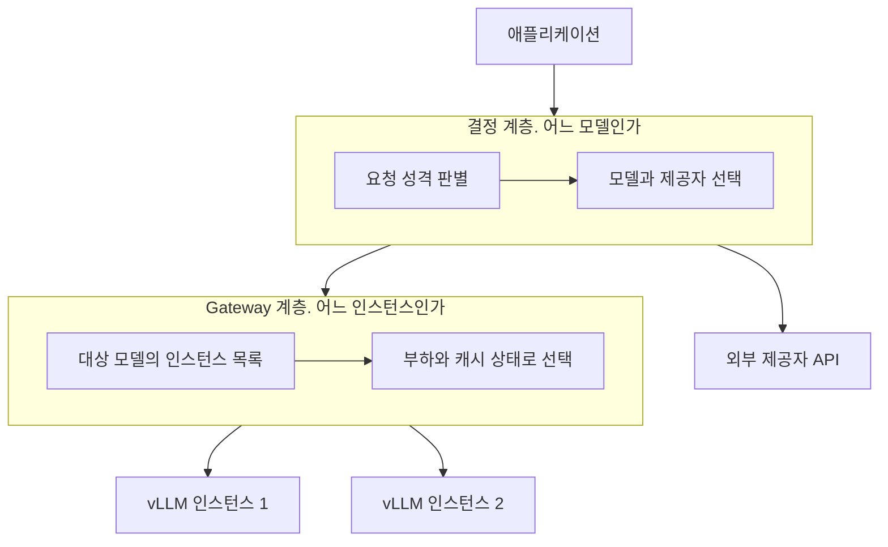

# Model Router 란 무엇인가

> [GPU로 LLM을 서빙한다는 것](../llm-serving/gpu-llm-serving-basics.md)이 모델 한 대를 어떻게 굴리는지를 다뤘다면, 이 글은 그 위 계층을 다룬다.
> 모델이 여러 개가 되고 제공자가 섞이는 순간 생기는 문제다.
> 아래 서빙 계층 자체의 비교는 [Triton vs BentoML vs Ray Serve](../serving-frameworks/triton-vs-bentoml-vs-ray.md)가 다룬다.

애플리케이션에서 LLM 을 처음 붙일 때는 SDK 하나를 호출하면 끝난다.
그런데 모델이 둘 이상 되고, 어떤 요청은 싼 모델로 충분하고 어떤 요청은 비싼 모델이 필요하고, 제공자 한 곳이 죽었을 때 다른 곳으로 넘겨야 하는 상황이 오면 그 판단을 어디에 둘지가 문제가 된다.
애플리케이션 코드마다 `if` 로 흩어 놓으면 팀이 늘어날 때마다 같은 판단이 복제된다.

**Model Router 는 그 판단을 한 지점으로 모은 계층이다.**
모든 모델 호출이 그 지점을 지나고, 거기서 어느 모델로 보낼지가 결정된다.

한 문장 결론부터 적는다.
Model Router 라는 한 단어가 실제로는 성격이 다른 두 계층을 가리키고 있고, 그 둘을 구분하지 않으면 도구 선택이 어긋난다.

## 백엔드의 API Gateway 와 같은 자리

자바 백엔드를 해봤다면 이 구조는 이미 익숙하다.
인증, rate limit, 경로 변환, 감사 로그를 서비스마다 구현하지 않고 API Gateway 한 곳에 모으는 것과 같은 발상이다.
Model Router 가 모으는 것은 아래와 같다.

| 관심사 | 애플리케이션마다 두면 | 라우터에 모으면 |
| --- | --- | --- |
| 모델 선택 | 팀마다 다른 기준으로 고른다 | 한 정책을 모든 호출에 적용한다 |
| 인증 정보 | 제공자 API 키가 여러 저장소에 흩어진다 | 라우터만 키를 갖는다 |
| 비용 귀속 | 어느 팀이 얼마 썼는지 합산할 곳이 없다 | 호출 단위로 팀에 붙인다 |
| fallback | 제공자 장애마다 각자 구현한다 | 실패 시 다음 대상으로 넘긴다 |
| 감사 로그 | 형식이 서비스마다 다르다 | 정해진 형태로 한 곳에 쌓인다 |

Uber 가 공개한 GenAI Gateway 가 이 형태를 그대로 보여준다.
Go 로 만든 단일 지점을 두고 외부 제공자와 자체 호스팅 모델을 하나의 인터페이스로 제공한다.
인터페이스는 OpenAI API 를 그대로 따랐다.
규모는 공개 시점 기준으로 약 30개 팀, 월 1,600만 쿼리, 피크 25 QPS 이고 LLM 활용 사례는 60개가 넘는다.

애플리케이션 입장에서 얻는 것이 하나 더 있다.
호출하는 쪽은 계속 하나의 인터페이스만 알면 되고, 모델을 갈아치우는 일이 라우터 설정 변경으로 끝난다.

## 두 계층을 구분한다

여기가 이 시리즈에서 가장 먼저 못박아야 할 지점이다.
"라우팅" 이라는 한 단어가 서로 다른 두 판단을 덮고 있다.

두 계층이 보는 정보와 판단 주기가 다르다.

| 축 | 결정 계층 | Gateway 계층 |
| --- | --- | --- |
| 정하는 것 | 어느 모델, 어느 제공자로 보낼지 | 고른 모델의 어느 인스턴스로 보낼지 |
| 보는 정보 | 요청 본문, 요청 성격, 모델별 단가와 품질 | 인스턴스별 대기 요청 수, KV cache 채움 비율, 응답 지연 |
| 바뀌는 속도 | 정책 단위. 사람이 바꾼다 | 요청 단위. 초 단위로 상태가 변한다 |
| 실패 대응 | 다른 모델로 fallback | 같은 모델의 다른 인스턴스로 재시도 |
| 대표 도구 | Azure Foundry `model router`, LiteLLM proxy | vLLM production stack, llm-d |

**아래 계층은 자체 호스팅 모델이 있을 때만 존재한다.**
외부 제공자 API 만 쓰면 인스턴스가 몇 대인지는 제공자 쪽 사정이라 내가 고를 대상이 아니다.
자체 호스팅 vLLM 을 여러 대 띄우는 순간부터 아래 계층이 내 몫이 된다.

이 구분이 도구 선택으로 바로 이어진다.
LiteLLM proxy 의 `routing_strategy` 는 `simple-shuffle`(기본), `least-busy`, `usage-based-routing`, `latency-based-routing` 네 가지인데, **넷 중 캐시 상태를 보는 것이 없다.**
캐시를 보는 판단은 vLLM production stack 과 llm-d 가 아래 계층에서 따로 제공한다.
위 계층 도구에 아래 계층 기대를 걸면 없는 기능을 찾게 된다.

## 관리형 라우터가 하는 것

직접 만들기 전에 관리형 상품이 어디까지 해주는지를 봐야 한다.
Azure AI Foundry 의 `model router` 가 대표적이다.
특징은 라우터 자신이 학습된 언어 모델이라는 점이다. 규칙표가 아니라 모델이 요청을 보고 판단한다.

판정 기준을 품질 예산으로 표현한 것이 이 상품의 핵심이다.
사용자가 모드를 고르면 그 예산 안에서 가장 싼 모델을 고른다.

| 모드 | 판정 |
| --- | --- |
| Balanced (기본) | 그 요청의 최고 품질 모델 대비 1에서 2% 품질 범위에서 가장 싼 모델 |
| Cost | 같은 방식으로 5에서 6% 범위까지 |
| Quality | 비용을 무시하고 최고 품질 모델 |

"비용을 얼마나 줄여준다" 가 아니라 "품질을 얼마나 포기할지" 를 사용자가 고르게 한 구조다.
비용 절감 폭은 요청 분포에 따라 달라지므로 상품이 약속할 수 없다.

## 관리형 라우터가 못 하는 것

제약이 분명하게 문서화돼 있고, 이 제약이 자체 구축 판단의 근거가 된다.

- **유효 컨텍스트 한도가 라우팅 대상 중 가장 작은 모델의 한도로 내려앉는다.** 어느 모델로 갈지 미리 알 수 없으니 가장 좁은 쪽에 맞춰야 한다. 긴 문서를 넣는 용도에서 이것이 먼저 걸린다.
- **라우팅 판단은 텍스트만 본다.** 이미지 입력을 받기는 하지만 판단 근거로는 쓰지 않고, 오디오는 받지 않는다.
- **라우팅 대상은 Azure 안의 모델이다.** 자체 호스팅 모델을 대상 목록에 넣을 수 없다.

반대로 통제 장치는 갖춰져 있다.
라우팅 대상 목록을 고정할 수 있고, 새 모델은 명시적으로 넣지 않으면 편입되지 않는다.
fallback 대상도 그 목록이 겸하므로 승인하지 않은 모델로 넘어가지 않는다.
요청별로 시도한 모델 순서와 fallback 발생 여부를 조회하는 별도 API 도 있다.

결정 추적이 가능한지는 라우터를 운영할 때 반드시 확인할 항목이다.
사용자가 "답이 이상하다" 고 할 때 어느 모델이 응답했는지 모르면 원인을 좁힐 수 없다.

## 자체 구축으로 넘어가는 조건

관리형으로 충분한 경우가 많다. 아래 조건이 하나라도 걸리면 자체 구축을 검토하게 된다.

**자체 호스팅 모델을 라우팅 대상에 넣어야 한다.**
가장 흔하고 가장 결정적인 조건이다.
사내 데이터로 학습한 모델, 외부로 보낼 수 없는 요청을 처리하는 모델, 제공자 API 가 없는 오픈소스 모델이 대상에 들어가야 하면 관리형 라우터의 대상 목록에 올릴 방법이 없다.
이 조건이 걸리는 순간 위 계층과 아래 계층을 모두 내가 갖게 된다.

**인스턴스 선택을 캐시 상태로 해야 한다.**
자체 호스팅 vLLM 을 여러 대 띄웠다면, 어느 인스턴스로 보내는지가 응답 속도를 바꾼다.
같은 앞부분을 가진 요청이 이미 그 앞부분을 계산해 둔 인스턴스로 가면 prefill 을 다시 하지 않는다.
일반 로드 밸런서는 이 상태를 모르고 요청을 흩어 보내므로 prefix cache 적중이 떨어진다.

여기서 두 방식이 갈린다. 시리즈 4번에서 자세히 다룬다.

| 방식 | 판단 |
| --- | --- |
| prefix aware | 같은 앞부분이면 항상 같은 인스턴스로 보낸다. 그 캐시가 이미 밀려났어도 |
| KV cache aware | 실제 적중률이 가장 높은 인스턴스로 보낸다 |

판단 근거는 vLLM 이 `/metrics` 로 노출하는 지표다.
OpenAI 호환 API 와 같은 포트를 쓰고 기본값은 8000 이며, 지표 이름의 접두사는 `vllm:` 이다.

| 지표 | 종류 | 뜻 |
| --- | --- | --- |
| `vllm:num_requests_waiting` | gauge | 처리를 기다리는 요청 수 |
| `vllm:kv_cache_usage_perc` | gauge | 사용 중인 KV cache 블록 비율. 0 에서 1 |
| `vllm:prefix_cache_queries` | counter | prefix cache 조회 수 |
| `vllm:prefix_cache_hits` | counter | prefix cache 적중 수 |

적중률 지표는 따로 없어서 `prefix_cache_hits` 를 `prefix_cache_queries` 로 나눠 직접 구한다.

**제공자 캐시 회계를 정책에 넣어야 한다.**
외부 제공자의 prompt caching 은 값이 셋이다.
cache write 는 기본 입력 단가에 25% 프리미엄이 붙고, cache read 는 기본 입력 단가의 10% 수준이다.
Claude Haiku 4.5 를 예로 들면 100만 토큰당 cache read $0.10 대 기본 입력 $1.00 이다.
유효 시간은 제공자마다 다르다.

**같은 앞부분에 적중이 2회 이상 나면 손익이 넘어간다.**
한 번 쓰고 버리는 앞부분에 캐시를 붙이면 25% 프리미엄만 내고 끝난다.
그래서 "가장 싼 모델로 보내기" 가 실제로 가장 싼 선택이 아닐 수 있다.
캐시가 붙어 있는 비싼 모델이 더 싸게 끝나는 구간이 있다.

**요청을 외부로 보내기 전에 처리해야 할 것이 있다.**
Uber 는 GenAI Gateway 에 PII redactor 를 두고 개인정보를 익명 자리표시자로 바꾼 뒤 외부로 보낸다.
이름은 `ANONYMIZED_NAME_0`, `ANONYMIZED_NAME_1` 처럼 순서대로 치환하고 응답을 돌려줄 때 원래 값으로 복원한다.
Uber 는 이 처리가 지연을 늘리고 결과 품질도 함께 해친다고 밝혔다.
같은 단어가 위치에 따라 다른 번호로 치환돼 모델 성능이 떨어질 수 있다는 것이다.
공개 글은 문제를 밝히는 데까지만 가고 해결책은 제시하지 않았다.

이 사례가 라우터 설계의 성격을 잘 보여준다.
비용, 지연, 품질, 보안 넷을 함께 맞춘다는 말은 넷이 서로 충돌한다는 뜻이다.

## 같은 문제를 회사마다 다른 층에서 푼다

공개된 사례를 계층 경계로 늘어놓으면 선택지가 하나가 아니라는 것이 보인다.

| 사례 | 서빙 계층 | 라우팅 계층 |
| --- | --- | --- |
| 토스증권 | vLLM, Triton, KServe | 공개 글에 라우팅 계층 언급이 없다 |
| Netflix | Triton, vLLM | 기존 JVM 서빙 계층 위에 얹었다 |
| Uber | Uber 자체 호스팅 stack | Go 기반 GenAI Gateway 를 따로 만들었다 |
| KT | 공개 글에 언급이 없다 | LiteLLM 을 도입하고 라우팅 정책만 직접 만들었다 |

읽을 지점은 셋이다.

- **서빙 계층을 표준화한 조직이 그 위층을 아직 만들지 않은 상태가 있다.** 토스증권 공개 글은 vLLM 과 Triton 과 KServe 선택까지 다루고 라우팅 계층은 다루지 않는다.
- **라우팅 계층을 새로 만들지 않는 선택도 있다.** Netflix 는 추천 시스템의 라우팅과 A/B 테스트를 이미 담당하던 JVM 서빙 계층에 LLM 호출을 붙였다.
- **오픈소스를 쓰고 정책만 직접 만드는 절충이 있다.** KT 는 인증과 로깅과 모니터링을 LiteLLM 에 맡기고, 요청을 Task 와 Domain 과 Level 과 Capability 네 축으로 분류하는 정책을 그 위에 얹었다.

각 사례의 판정 기준과 배경은 시리즈 8번에서 따로 다룬다.

## 정리

- Model Router 는 모델 호출이 지나는 한 지점이고, 백엔드의 API Gateway 가 인증과 rate limit 을 모으는 것과 같은 자리에 있다.
- 한 단어가 두 계층을 덮고 있다. 어느 모델을 고르는 계층과, 고른 모델의 어느 인스턴스로 보내는 계층이다.
- 아래 계층은 자체 호스팅 모델이 있을 때만 생긴다. 외부 제공자 API 만 쓰면 위 계층만 있다.
- 관리형 라우터는 품질 예산으로 모델을 고르고, 대상은 그 클라우드 안의 모델로 한정되며 유효 컨텍스트 한도가 대상 중 가장 작은 모델에 맞춰진다.
- 자체 호스팅 모델을 대상에 넣어야 하거나 캐시 상태로 인스턴스를 골라야 하면 자체 구축으로 넘어간다.

## 다음 편

다음 글에서는 결정 계층이 실제로 무엇을 보고 모델을 고르는지를 다룬다.
규칙, 임베딩 유사도, 분류 모델, 계단식 네 가지 기준이 있고 각각 라우팅 판단 자체에 지연을 얹는다.
"싼 모델로 보내 비용을 줄인다" 는 말이 그 판단 비용을 계산에 넣으면 어떻게 달라지는지가 그 글의 주제다.

## 참고 링크

- [Azure AI Foundry model router](https://learn.microsoft.com/en-us/azure/ai-foundry/openai/concepts/model-router)
- [LiteLLM Router](https://docs.litellm.ai/docs/routing)
- [LiteLLM proxy 설정 값](https://docs.litellm.ai/docs/proxy/config_settings)
- [vLLM Metrics 설계](https://docs.vllm.ai/en/stable/design/metrics/)
- [vLLM production-stack KV Cache Aware Routing](https://docs.vllm.ai/projects/production-stack/en/vllm-stack-0.1.7/use_cases/kv-cache-aware-routing.html)
- [llm-d Precise Prefix Cache Aware Routing](https://llm-d.ai/docs/guide/Installation/precise-prefix-cache-aware)
- [prompt caching 가격 구조](https://tokencost.app/blog/prompt-caching-pricing-2026)
- [TrueFoundry. KV cache routing](https://www.truefoundry.com/blog/kv-cache-routing-why-standard-load-balancers-break-prefix-caching-and-how-to-fix-it)
