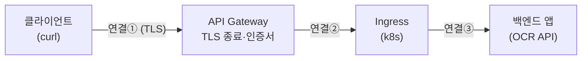
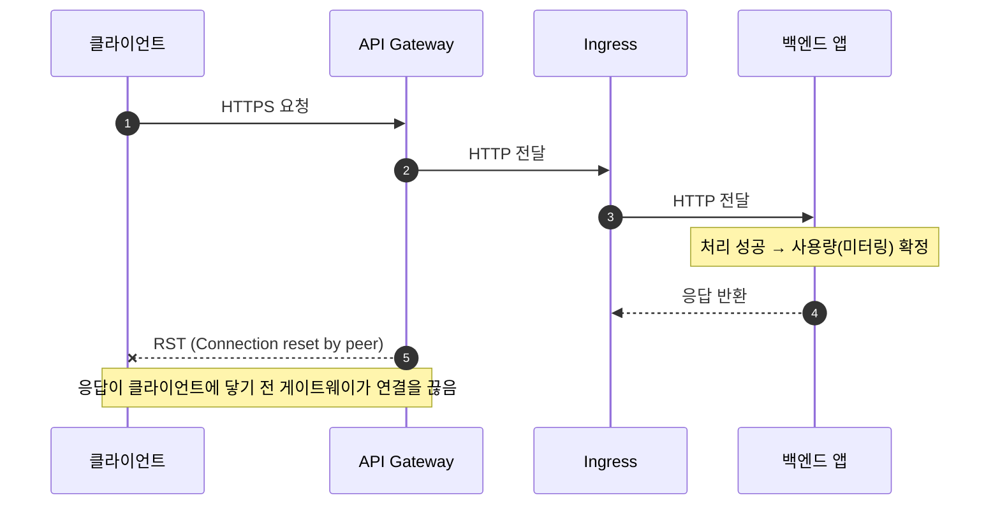

# Connection reset by peer는 누가 보낸 걸까 — 리버스 프록시 홉마다 TCP 연결은 따로 논다

한 OCR API 서비스를 운영하다가 모니터링 알림을 받았다. 클라이언트(curl)에서는 호출이 실패했는데, 서버 쪽에서는 정상 처리되고 사용량(미터링)까지 집계된 건이었다. 클라이언트가 본 에러는 `curl exit 56 / OpenSSL SSL_read: Connection reset by peer (errno 104)`.

그래서 답해야 했던 질문은 하나였다. **이 연결을 끊은 건 클라이언트일까, 서버일까?**

이걸 추적하면서 다시 확인한 사실은, 많은 사람이 무심코 넘기는 지점이었다. 리버스 프록시는 연결을 "통과"시키지 않는다. 홉마다 완전히 별개의 TCP 연결이다. 이 한 가지를 제대로 알면 `Connection reset by peer` 한 줄이 "어느 박스가 끊었는지"를 거의 단정해준다.

## 증상 — 클라이언트는 실패, 서버는 성공

상황을 정리하면 이랬다.

- 클라이언트: `curl exit 56`, `SSL_read: Connection reset by peer (errno 104)` 로 응답을 못 받음
- 서버: 같은 시각 요청을 정상 수신, 모델 추론도 약 980ms에 성공, 사용량 집계까지 완료
- 서버 로그에는 그 요청에 대한 에러가 없음

클라이언트는 "실패"라는데 서버는 "성공"이라고 한다. 둘 다 거짓말을 하는 게 아니다. 둘은 서로 다른 연결을 보고 있었을 뿐이다.

## curl exit 56과 errno 104가 정확히 무슨 뜻인가

두 신호를 분해하면 방향이 보인다.

- **curl exit 56**은 `CURLE_RECV_ERROR`다. 데이터를 **받는(read) 도중** 실패했다는 뜻이다. 즉 클라이언트는 요청을 다 보내고 **응답을 기다리며 읽던 상태**였다.
- **errno 104**는 `ECONNRESET`이다. 소켓이 **TCP RST 패킷을 수신**했다는 뜻이다. "by peer"는 상대편이 RST를 보냈다는 의미다.

여기서 이미 한 가지가 갈린다. 클라이언트가 스스로 끊었다면 자기 read에서 "reset by peer"가 날 리 없다. 그냥 자기가 닫을 뿐이다. 클라이언트가 타임아웃으로 포기했다면 curl은 `exit 28 (operation timeout)`을 낸다. exit 56 + ECONNRESET이 아니다.

> 클라이언트는 RST를 **받은** 쪽이다. 끊은 주체가 아니다. 응답을 기다리다 연결이 강제로 끊긴 피해자다.

## RST와 FIN은 다르다 — 강제 중단 vs 정상 종료

"서버가 정상 응답을 했다"는 말과 이 에러는 사실 양립하기 어렵다. TCP에서 연결을 닫는 방법이 두 가지인데, 둘의 의미가 완전히 다르기 때문이다.

- **FIN**: 정상 종료. "할 말 다 했으니 닫는다." 클라이언트는 이걸 깨끗한 EOF로 받는다. 정상 응답을 다 받은 뒤의 종료가 이쪽이다.
- **RST**: 강제 중단. "이 연결 지금 즉시 버린다." 타임아웃이나 중간 장비의 강제 종료에서 전형적으로 나온다.

클라이언트가 받은 건 EOF가 아니라 RST였다. 그러니 최소한 **응답이 클라이언트까지 정상적으로 전달되지는 않았다**는 것만은 확실하다. 서버 내부에서 처리가 끝났다는 사실과는 별개다.

## 리버스 프록시는 연결을 통과시키지 않는다

핵심은 여기다. 흔히 클라이언트부터 백엔드까지 하나의 파이프가 쭉 이어진다고 생각하지만, L7 리버스 프록시(API Gateway, ingress 등)는 들어온 연결을 **자기 선에서 종료**(terminate)하고, 뒤로는 **완전히 새로운 TCP 연결**을 맺는다.

그래서 실제로는 하나의 연결이 아니라 여러 개의 독립된 연결 구간이 존재한다.

각 구간은 자기만의 소켓, 자기만의 SYN/FIN/RST, 자기만의 타임아웃을 가진 **서로 다른 TCP 연결**이다. 클라이언트는 오직 첫 프록시(API Gateway)하고만 연결을 맺고 있고, 그 뒤의 ingress나 백엔드 앱과는 **소켓 자체가 없다**. 주소도 모르고 연결도 없다.

## 그래서 RST는 한 구간 안에서만 작동한다

RST는 TCP 패킷이고, 그게 오가는 한 연결 구간 안에서만 의미가 있다. 이걸 시간 순으로 보면 이번 사건이 한눈에 들어온다.

정리하면 이렇다.

- 백엔드 앱이 끊으면 연결③에 RST를 보낸다. 받는 쪽은 ingress다.
- ingress가 끊으면 연결②에 RST를 보낸다. 받는 쪽은 게이트웨이다.
- **클라이언트에게 직접 RST를 보낼 수 있는 건 연결①의 상대, 즉 API Gateway뿐이다.**

뒤쪽 박스가 연결을 끊어도 클라이언트 소켓에 직접 RST를 꽂는 건 물리적으로 불가능하다. 소켓이 없으니까. 뒤쪽의 끊김은 거기서 끝나고, 게이트웨이가 그 상황을 받아 **클라이언트에게 무엇을 돌려줄지 새로 결정**한다. 보통은 `502 Bad Gateway`나 `504 Gateway Timeout` 같은 HTTP 응답으로 변환하거나, 자기 판단으로 클라이언트 연결에 RST를 보낸다.

## TLS 종료점이 "클라이언트의 peer"를 정한다

`Connection reset by peer`에서 peer가 누구인지는 TLS가 어디서 끝나는지로 정해진다. 클라이언트의 HTTPS 연결은 그 호스트네임의 인증서를 쥐고 있는 쪽에서 종료된다. 그게 API Gateway라면, 클라이언트의 TLS peer는 게이트웨이다.

이번 건에서 백엔드가 받은 요청 헤더를 보면 `x-forwarded-proto: http`, `x-scheme: http`처럼 내부 구간이 평문 HTTP였다. 앞단에서 TLS를 종료하고 안쪽은 HTTP로 전달하는 전형적인 구성이다. 즉 클라이언트가 받은 RST는 **TLS를 종료한 API Gateway가 보낸 것**으로 좁혀진다. 뒤쪽 박스는 클라이언트의 TLS peer가 아니므로 후보에서 빠진다.

## 그럼 누가 끊었나 — 확정과 미확정을 나눠야 한다

여기서 두 질문을 분리하는 게 중요하다.

| 질문 | 답 |
|---|---|
| 클라이언트에 RST를 보낸 주체 | **API Gateway** (TLS peer라 구조적으로 확정) |
| 클라이언트가 먼저 끊었나 | 아니다 (RST를 받은 쪽, recv 에러) |
| 백엔드 앱이 클라이언트를 직접 끊었나 | 불가능 (별개 연결, 소켓 없음) |
| **왜** 게이트웨이가 끊었나 | 미확정 — 게이트웨이 access log 필요 |

"왜"를 확정하려면 게이트웨이의 요청 단위 access log가 필요하다. 거기서 두 가지를 보면 갈린다.

- HTTP status가 `504`(upstream timeout) → 게이트웨이가 느린 백엔드를 타임아웃으로 끊은 것
- `499`(client closed) → 클라이언트가 먼저 닫은 것

이번엔 그 로그가 보존되지 않아 "왜"는 게이트웨이 담당에 문의하는 것으로 정리했다. 하지만 "누가 끊었나(=게이트웨이가 보냈다)"는 위 구조만으로 이미 단정할 수 있었다. 추적이 막힌 지점과 단정할 수 있는 지점을 섞지 않는 게 중요하다.

> 로그가 없어도 토폴로지와 TCP 의미만으로 "끊은 손"은 특정된다. "왜 끊었는지"와 "누가 끊었는지"는 다른 질문이고, 필요한 증거도 다르다.

## 만약 게이트웨이가 L4 passthrough였다면

여기엔 전제가 하나 있다. 게이트웨이가 **L7에서 TLS를 종료**한다는 것. 만약 게이트웨이가 L7 종료가 아니라 [L4](./L4-and-VIP.md) passthrough(TCP/TLS를 그대로 흘려보냄)였다면 이야기가 달라진다. L4는 패킷 헤더만 보고 전달하므로, 뒤쪽에서 발생한 RST가 클라이언트까지 전파될 수도 있다. 그 경우 "끊은 손"은 게이트웨이로 좁혀지지 않는다.

그래서 추적의 첫 단추는 **클라이언트의 TLS가 어디서 끝나는가**를 먼저 확정하는 것이다. 인증서가 어느 박스에 있는지가 곧 추적의 출발점이다.

## 더 큰 교훈 — 부수효과는 응답 전달과 분리될 수 있다

이 사건이 단순한 네트워크 잡음이 아니었던 이유는, 그 와중에 **미터링(사용량 집계)이 확정**됐다는 점이다.

미터링은 "모델 추론 성공" 시점에 서버 내부에서 확정된다. 그 뒤 응답이 클라이언트에 전달되는지와는 무관하다. 그래서 응답이 전송 도중 RST로 끊겨도, 서버는 이미 처리에 성공했고 사용량을 더한 상태다.

이건 분산 시스템에서 흔히 밟는 함정이다. **서버가 본 성공**과 **클라이언트가 본 성공**이 갈릴 수 있고, 부수효과(과금, 사용량, 외부 호출)가 클라이언트의 응답 수신을 기다리지 않고 먼저 커밋되면, "클라이언트는 실패했는데 과금은 됐다" 같은 상태가 만들어진다. 응답 전달까지 성공해야 부수효과를 확정할지, 아니면 처리 성공만으로 확정하고 전달 실패는 별도로 보정할지는 설계에서 명시적으로 정해야 한다. 그냥 두면 이번처럼 둘이 조용히 어긋난다.

## 그럼 이 과금은 보상해야 하나

당연히 "전달 실패면 환불해야지" 싶고, 그래서 처음 떠올린 건 게이트웨이 실패 직후 **보상 트랜잭션**을 발행하는 그림이었다. 그런데 이건 대부분 안 쓰고, 못 쓴다. 이유는 **지식이 컴포넌트별로 쪼개져 있기 때문**이다.

- 미터링을 커밋한 주체는 **백엔드 앱**이다. 그런데 앱은 자기 관점에서 성공했고, 전달이 실패했다는 사실을 모른다.
- 전달 실패를 아는 주체는 **게이트웨이**다. 그런데 게이트웨이는 그 요청에 미터링이라는 부수효과가 있었다는 걸 모른다.

"부수효과를 안다"와 "전달 실패를 안다"를 동시에 쥔 컴포넌트가 없다. 게다가 끊김은 앱 바깥 전송 계층에서 일어났고, API Gateway는 보통 실패한 요청마다 과금 시스템을 콜백해주는 훅을 제공하지 않는다. 그래서 게이트웨이에 보상을 물리는 설계는 현실적으로 성립하기 어렵다.

실무에서는 보통 이렇게 푼다.

- **과금 정책을 먼저 정한다.** "추론이 실제로 돌았으면 과금"인지 "전달 성공까지 돼야 과금"인지는 코드 트릭이 아니라 비즈니스 결정이다. 전자라면 이번 건은 정당한 과금이고 보상이 불필요하다. 후자라면 전달 실패분은 정의상 환불 대상이 된다.
- **사후 정산**(reconciliation)으로 보정한다. 네트워크 경계를 넘는 exactly-once는 사실상 불가능하므로, 과금은 보통 at-least-once로 일단 집계하고 나중에 맞춘다. 미터링 레코드와 전달 결과를 request-id로 대조해 "성공+과금됐는데 전달 실패한 요청"을 배치로 뽑아 크레딧/환불한다. 실시간 보상이 아니라 결과적 정합성으로 간다.
- **멱등키**로 이중 과금을 막는다. 클라이언트가 같은 idempotency key로 재시도하면 서버가 중복 집계를 거른다. 이번 고아 과금과는 다른 축이지만 같이 챙겨야 한다.

여기서 걸리는 게 사후 정산의 전제다. 미터링 기록과 전달 결과를 묶어서 대조하려면 게이트웨이의 요청 단위 로그(`504`인지 `499`인지)가 있어야 하는데, 그게 없으면 **보상을 하려 해도 무엇을 보상할지 목록조차 못 만든다.** 앞 섹션에서 본 관측성 공백이 정확히 여기서 발목을 잡는다.

> 보상은 "어떻게 되돌리나"보다 "되돌릴 대상을 어떻게 식별하나"가 먼저다. 식별이 안 되면 보상 로직은 짤 수가 없다.

마지막으로 우선순위. 이 RST는 포화로 응답이 느려져 게이트웨이 타임아웃이 터진, 빈도 낮은 엣지 케이스다. 이럴 때 실시간 보상 트랜잭션을 정교하게 짜는 비용은 절감액보다 크고, 보상 자체의 실패라는 새 실패 모드까지 늘린다. 그래서 보통은 **원인 제거**(포화·타임아웃부터 줄여 발생 빈도를 떨어뜨림)와 **관측 가능하게 만들어 사후 정산**하는 쪽이 먼저고, 남는 소량은 고객 지원 크레딧으로 흡수한다. 정교한 실시간 보상은 대개 과한 해법이다.

## 정리하며

`Connection reset by peer` 한 줄에서 출발해 여기까지 왔다. 다음에 비슷한 걸 만나면 나는 이 순서로 본다.

1. curl/에러 코드로 클라이언트가 **받은** 건지 **보낸** 건지부터 가른다 (RST 수신 vs 자발적 종료)
2. 클라이언트의 TLS가 어디서 끝나는지 확인한다 (= peer = 끊은 후보)
3. 프록시 홉을 별개 연결로 그려놓고, RST가 닿을 수 있는 구간을 좁힌다
4. "누가 끊었나"(구조로 확정)와 "왜 끊었나"(로그 필요)를 분리한다
5. 그 사이에 커밋된 부수효과(과금·외부 호출)가 있는지 따로 점검한다
6. 부수효과가 있다면 되돌릴 방법보다 **되돌릴 대상을 식별할 수 있는지**(request-id로 대조 가능한지)를 먼저 확인한다

연결이 끊긴 자리를 찾는 것보다, 끊을 수 **있었던** 자리가 어디인지를 토폴로지로 좁히는 게 먼저였다.
