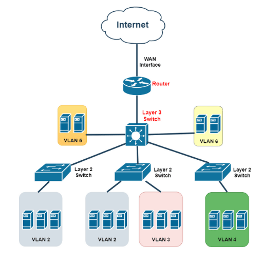

# L2(스위치)와 L3(라우터)의 역할 차이

## 핵심 결론

- **같은 Subnet -> L2 스위치만으로 통신 가능**
- **다른 Subnet -> 반드시 L3 라우터를 거처야 통신 가능**

왜 이렇게 되어있을까? <br/>
그 이유는 **MAC 주소와 IP 주소의 역할이 완전히 다르기 때문**이다

## L2(Layer 2, 데이터 링크 계층)의 역할 : "동네 내부 통신 담당"



- L2는 **MAC 주소 기반으로 동작**
- **같은 Subnet = 같은 동네**
- 예: `192.168.1.0/24` 서브넷에
  - ```text
    192.168.1.10 -> PC A
    192.168.1.20 -> PC B
    192.168.1.30 -> PC C
    ```
  - 이들은 "같은 네트워크"로 분류됨
  - 그래서 A가 B에게 패킷을 보낼 떄
    - ARP로 B의 MAC 주소를 묻고
    - MAC 주소를 알아내면
    - **스위치(L2)** 가 MAC 주소 테이블을 보고 바로 전달
  - 즉, **L2 수준에서 해결, 라우터(L3)가 필요 없음**

## L2의 결정적 한계 : 다른 Subnet은 MAC를 모른다

- 예를 들어 A가 다른 서브넷인 `192.168.2.10`에게 보내려고 한다면?
  - A는 ARP를 수행함
  - 하지만.. **그 네트워크에는 192.168.2.10이 없음**
  - 아무도 대답하지 않음
  - 스위치도 어디로 보내야 할지 모름
  - L2 통신 실패
  - 즉, L2는 "서브넷 바깥"으로는 절대 보낼 수 없음

## L3(Layer 3, 네트워크 계층)의 역할 : "동네 간 이동(길 안내) 담당"

- L3은 **IP 주소 기반으로 통신**한다
- 서브넷 간 통신을 하려면
  - 패킷을 라우터에 보냄
  - 라우터는 라우팅 테이블을 보고
  - 어떤 경로로 보낼지 결정
  - 다음 네트워크로 전달
- L3는 네트워크 간 길을 안내하는 역할이기 떄문에 **서브넷이 다르면 반드시 L3가 필요하다**
