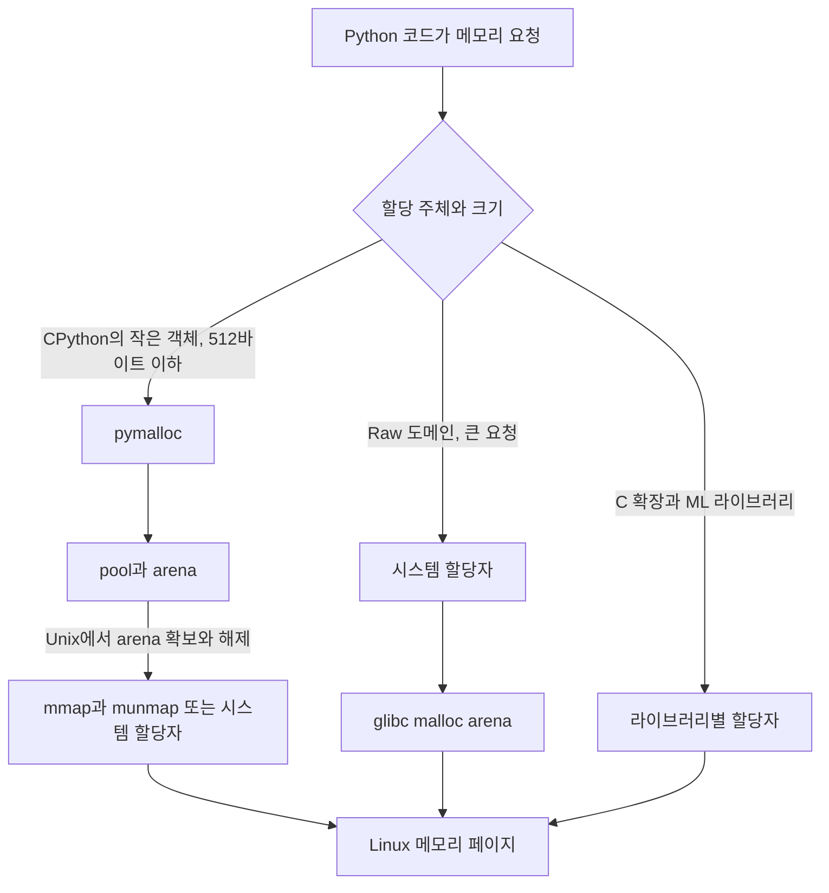

# Python 서버의 RSS가 줄지 않는 이유: CPython, gc.collect(), malloc_trim

Python 서버에서 큰 작업이 끝났는데도 RSS가 그대로라면 곧바로 메모리 누수라고 단정하기 어렵다. 살아 있는 객체가 남았을 수도 있고, CPython이나 네이티브 라이브러리가 해제된 메모리를 다시 쓰려고 보관할 수도 있다.

이 글은 **CPython 3.11, Linux, glibc** 환경을 기준으로 RSS가 줄지 않는 이유와 `gc.collect()`, `malloc_trim()`의 역할을 구분한다. 다른 Python 구현이나 다른 C 메모리 할당자를 사용하면 동작이 달라질 수 있다.

## Python과 CPython은 무엇이 다른가

Python은 언어의 문법과 동작을 정의한다. CPython은 그 정의를 C로 구현한 실행 환경이다. Java에 빗대면 Java 언어와 HotSpot JVM의 관계에 가깝다.

- **Python**: 문법과 언어 동작
- **CPython**: python.org에서 배포하는 대표 구현
- **PyPy, GraalPy, Jython**: 같은 Python 코드를 다른 방식으로 실행하는 구현

참조 횟수 계산, 순환 참조 수집, `pymalloc`은 Python 언어 자체가 아니라 CPython의 메모리 관리 방식이다. 따라서 “Python은 객체의 참조가 사라지면 바로 메모리를 반환한다”보다 “CPython은 주로 참조 횟수로 객체를 해제한다”가 정확하다.

내가 운영한 Document Parser는 소스에서 빌드한 CPython 3.11.7을 사용했다. 이 환경에서 관측한 결과를 PyPy나 다른 Python 구현에 그대로 적용할 수는 없다.

## RSS는 Python 힙 크기가 아니다

**RSS**(Resident Set Size, 실제 메모리 점유량)는 프로세스의 메모리 페이지 가운데 현재 RAM에 올라온 부분이다. Linux의 `/proc/<pid>/status`에서 `VmRSS`는 대략 다음 세 항목의 합으로 설명된다.

```text
VmRSS = RssAnon + RssFile + RssShmem
```

- `RssAnon`: 힙과 스택 같은 익명 메모리
- `RssFile`: 실행 파일과 공유 라이브러리 등 파일 기반 메모리
- `RssShmem`: 공유 메모리

따라서 RSS에는 Python 객체뿐 아니라 CPython 실행 환경, C 확장, 공유 라이브러리와 파일 매핑도 포함된다. 컨테이너 메모리 지표는 cgroup이 집계한 값이라 특정 프로세스의 RSS 합과도 정확히 같지 않을 수 있다.

## 객체를 지워도 RSS가 바로 줄지 않는 이유

CPython에서 객체와 메모리의 수명은 서로 다른 계층에서 관리된다.



이 흐름에서 중요한 점은 모든 객체가 `pymalloc → glibc → OS`를 순서대로 지나지 않는다는 것이다.

### CPython 객체 해제

CPython은 주로 참조 횟수를 사용한다. 마지막 참조가 사라지면 객체를 해제할 수 있다. `del value`는 이름과 객체의 연결 하나를 지울 뿐이며, 다른 참조가 남아 있으면 객체는 살아 있다.

순환 참조 수집기는 서로 참조해 참조 횟수만으로 해제할 수 없는 객체를 보완한다. `gc.collect()`는 이 수집을 즉시 요청한다. 전체 수집에서는 일부 내장형의 자유 목록도 비우지만, 해제된 모든 메모리를 운영체제에 돌려준다고 보장하지 않는다.

### pymalloc의 pool과 arena

CPython 3.11의 기본 `pymalloc`은 512바이트 이하 객체에 최적화되어 있다. 작은 블록을 pool로 묶고 pool을 다시 arena로 묶는다. 64비트 환경의 arena는 1MiB이며, 32비트 환경에서는 256KiB다.

어떤 arena에 살아 있는 블록이 하나라도 남아 있으면 arena 전체를 해제하기 어렵다. 많은 객체를 지웠는데도 RSS가 유지될 수 있는 이유다. 반대로 arena 전체가 비면 CPython은 Unix에서 사용한 메모리 매핑을 해제할 수 있다.

### glibc와 네이티브 라이브러리

CPython의 Raw 메모리 도메인, 큰 할당, 일부 C 확장은 시스템 할당자를 사용할 수 있다. glibc `malloc()`은 해제된 공간을 다음 요청에 재사용하려고 내부 arena에 보관한다. 비어 있는 페이지가 있어도 배치와 단편화 상태에 따라 운영체제에 바로 반환되지 않을 수 있다.

NumPy, 이미지 처리, 문서 변환과 ML 라이브러리는 각자 다른 네이티브 할당자를 사용할 수도 있다. GPU 메모리는 별도 영역이므로 glibc `malloc_trim()`의 대상이 아니다.

## gc.collect()가 해결하는 문제

`gc.collect()`는 다음 상황에 적합하다.

- 순환 참조 때문에 해제되지 않은 Python 객체가 의심될 때
- 큰 작업이 끝난 경계에서 순환 참조 수집 시점을 통제하고 싶을 때
- 수집 전후의 객체 수와 메모리를 비교하려 할 때

다음 상황은 `gc.collect()`만으로 해결되지 않는다.

- 아직 참조 중인 객체가 계속 늘어나는 실제 누수
- 비어 있지 않은 pymalloc arena
- glibc가 보관 중인 해제 영역
- C 확장이나 다른 메모리 할당자의 캐시와 누수
- GPU 메모리

`gc.collect()` 후 RSS가 그대로라는 사실만으로 glibc 단편화를 확정할 수도 없다. Python 객체 수, 네이티브 메모리와 프로세스 RSS를 나눠 확인해야 한다.

## malloc_trim()의 역할과 한계

`malloc_trim(pad)`는 glibc에 비어 있는 힙 메모리를 운영체제로 반환해 달라고 요청한다.

```c
#include <malloc.h>
int malloc_trim(size_t pad);
```

- 반환값 `1`: 실제로 메모리를 반환함
- 반환값 `0`: 반환한 메모리가 없음
- glibc 2.8 이후: 모든 arena에서 완전히 비어 있는 페이지도 검사
- `pad`: 주 힙의 꼭대기에 남겨둘 여유 크기이며, 스레드별 힙에는 적용되지 않음

`malloc_trim(0)`은 살아 있는 객체를 지우지 않는다. glibc가 관리하지 않는 메모리에도 영향을 주지 않는다. “Python 메모리 누수를 고치는 함수”가 아니라, 이미 해제된 glibc 메모리 가운데 반환 가능한 페이지를 운영체제에 돌려보내도록 요청하는 함수다.

호출 자체에도 비용이 든다. 요청마다 호출할지, 문서 한 건이나 배치 한 묶음이 끝난 뒤 호출할지는 처리량과 RSS를 함께 측정해 정해야 한다.

## Python에서 안전하게 호출하기

아래 예시는 Linux에서 C 라이브러리를 찾고 `malloc_trim` 기호가 있을 때만 사용한다. 반환값을 남기면 실제 반환 여부를 지표로 확인할 수 있다.

```python
import ctypes
import ctypes.util
import gc
import sys
from collections.abc import Callable


def load_malloc_trim() -> Callable[[int], int] | None:
    if sys.platform != "linux":
        return None

    libc_path = ctypes.util.find_library("c")
    if libc_path is None:
        return None

    libc = ctypes.CDLL(libc_path, use_errno=True)
    malloc_trim = getattr(libc, "malloc_trim", None)
    if malloc_trim is None:
        return None

    malloc_trim.argtypes = [ctypes.c_size_t]
    malloc_trim.restype = ctypes.c_int
    return malloc_trim


_malloc_trim = load_malloc_trim()


def release_unused_memory() -> bool | None:
    gc.collect()
    if _malloc_trim is None:
        return None
    return bool(_malloc_trim(0))
```

`None`은 현재 환경에서 지원하지 않음을 뜻하고, `False`는 호출했지만 반환한 페이지가 없음을 뜻한다. 둘을 구분해야 설정 오류와 정상적인 무회수 호출을 섞지 않는다.

## 효과를 어떻게 검증할까

RSS가 줄었다는 한 번의 화면만으로 효과를 판단하면 원인을 분리하기 어렵다. 다음 항목을 같은 부하와 같은 워커 설정에서 비교한다.

| 확인할 값 | 확인하려는 것 |
| --- | --- |
| 처리 전후 RSS | 한 작업이 남기는 실제 메모리 변화 |
| `malloc_trim()` 반환값 | glibc가 실제로 페이지를 반환했는지 |
| `gc.collect()`만 호출한 경우 | 순환 참조 수집의 영향 |
| `gc.collect()` 후 `malloc_trim()`한 경우 | glibc 반환 요청의 추가 효과 |
| 요청 지연과 처리량 | 메모리 회수 비용 |
| 워커당 처리 건수와 재시작 사유 | 장기 실행 안정성 |

가능하면 기능을 끈 비교군을 같은 기간에 운영한다. 비교군을 둘 수 없다면 도입 전후의 부하, 배포, 워커 재시작 정책이 같은지 확인한다. `max_tasks_per_child`를 함께 바꿨다면 프로세스 종료 효과와 `malloc_trim()` 효과를 분리할 수 없다.

누적 회수량도 해석에 주의한다. 같은 메모리 페이지가 할당과 반환을 반복하면 누적값은 실제 RAM보다 훨씬 커질 수 있다. 이 값은 동시에 절약한 메모리 크기가 아니라 메모리가 순환한 양에 가깝다.

## 워커 재활용과의 관계

워커 재활용은 일정 작업 수를 처리한 프로세스를 종료한다. 프로세스가 끝나면 운영체제가 그 프로세스의 메모리를 모두 회수하므로, 메모리 할당자 종류와 상관없이 상한을 만들 수 있다.

대신 모델과 캐시를 다시 준비하는 비용이 든다. `malloc_trim()`이 RSS 증가 속도를 낮춘다면 워커당 처리 건수를 늘릴 수 있지만, 둘 중 하나를 무조건 선택할 필요는 없다. 명시적 메모리 반환과 워커 재활용을 함께 두고 실제 부하에서 처리량과 메모리 상한을 조정하는 편이 안전하다.

## 실제 적용 기록

[Python 서버 RSS가 줄지 않을 때 malloc_trim을 적용한 과정](../task/ai-service-team/glibc-malloc-trim-python-leak.md)

Document Parser에서 `gc.collect()`만 호출하던 경로를 점검하고 glibc 반환 요청을 추가한 과정, 워커 재활용 기준을 높인 뒤 확인한 운영 결과와 검증 한계를 기록했다.

## 참고 자료

- [Python 3.11 데이터 모델: 객체와 참조 횟수](https://docs.python.org/3.11/reference/datamodel.html)
- [Python 3.11 gc: 순환 참조 수집기](https://docs.python.org/3.11/library/gc.html)
- [Python 3.11 C API: 메모리 관리](https://docs.python.org/3.11/c-api/memory.html)
- [CPython 개발자 안내서: CPython 빌드](https://devguide.python.org/getting-started/setup-building/)
- [Linux proc 문서: VmRSS 구성](https://docs.kernel.org/filesystems/proc.html)
- [malloc_trim(3): Linux manual page](https://man7.org/linux/man-pages/man3/malloc_trim.3.html)
- [GNU C Library: Memory Allocation](https://www.gnu.org/software/libc/manual/html_node/Memory-Allocation.html)
