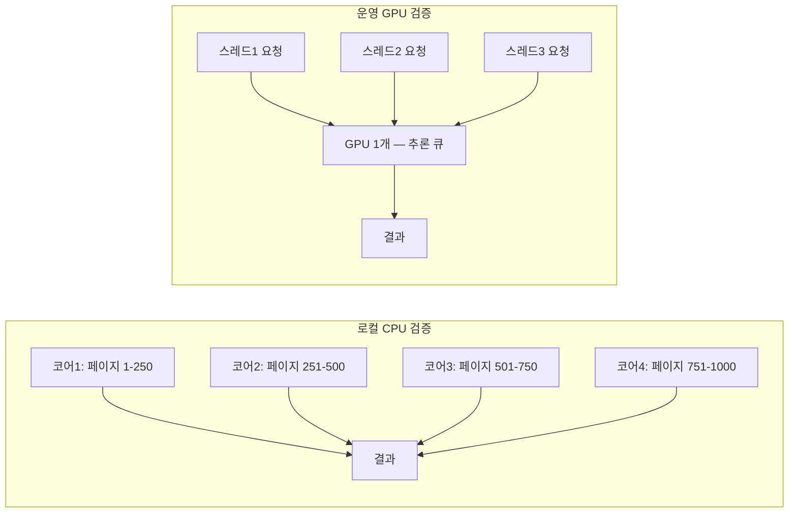

# 문서 파싱 서비스 성능 최적화 — OCR 병렬화부터 GPU 직렬 추론 실측까지

**진행 기간**: 2026.05 ~ 2026.07

문서 파싱 서비스([Playground 문서 파싱 파이프라인 — 기여 개요](./playground-document-parser.md)에서 전체 맥락을 다뤘다)의 처리 속도를 여섯 차례에 걸쳐 손봤다.
OCR 호출 구조를 병렬로 바꾸고, 안 쓰는 렌더링을 지우고, PPTX 이미지 처리 방식을 통째로 갈아엎었다.
그리고 마지막 최적화에서는 로컬 벤치에서 30% 빨라진 것을 운영 GPU에 그대로 올렸다가 오차 수준 개선(+1%)만 확인했다.
"병렬화하면 빨라진다"는 기대가 왜 깨졌는지, 그 이유를 실측으로 파고든 과정을 남긴다.

## 배경 — OCR이 처리 시간의 절반을 넘게 차지한다

문서 파싱은 docling 파이프라인(레이아웃 인식 → 표 인식 → OCR → markdown 변환) 순서로 돈다.
운영 인스턴스 로그를 분석해보니 이 중 OCR 단계가 전체 처리 시간의 55.4%를 차지했다.
성능을 개선하려면 다른 어떤 구간보다 OCR 호출 구조부터 봐야 한다는 뜻이었다.

## 다영역 문서 OCR 순차 호출을 병렬로

문서 한 장에 인식 영역(문단, 표 셀 등)이 여러 개면, 영역마다 OCR API를 하나씩 순차로 호출하고 있었다.
영역이 10개면 API 호출도 10번, 그것도 앞 호출이 끝나야 다음이 시작되는 구조였다.

- 영역별 호출을 `ThreadPoolExecutor`로 병렬 실행하도록 바꿨다
- 매 호출마다 새 커넥션을 맺지 않도록 `requests.Session`을 모듈 로드 시점에 한 번만 만들어 재사용했다

호출 횟수 자체는 그대로라 OCR 과금에는 영향이 없고, 다영역 문서의 처리 시간만 줄었다.
비용을 안 건드리고 응답 성능만 개선한 셈이라 반영 판단이 쉬웠다.

## 페이지·영역을 하나의 풀로 통합 — idle 84%를 찾아낸 과정

영역 단위로 풀을 만들어 병렬화했지만, 곧 이상한 점을 발견했다.
같은 운영 로그를 다시 분석해보니 페이지당 OCR 영역이 평균 0.65개였다.
`ThreadPoolExecutor`를 페이지마다 새로 만들어 영역 개수만큼 작업을 넣는 구조였는데, 풀 크기를 4로 잡아도 평균 0.65개만 채워지니 워커의 84%가 매번 비어 도는 셈이었다.

원인은 병렬화 단위를 잘못 잡은 것이었다.
영역이 아니라 **페이지·영역 조합**을 평탄화해서 하나의 풀에 넣어야 워커가 항상 찬다.

```python
# 페이지 그룹 안의 모든 (페이지 인덱스, 페이지, 영역) 을 한 번에 평탄화
tasks = [
    (page_idx, page, region)
    for page_idx, (page, regions) in enumerate(page_jobs)
    for region in regions
]

with ThreadPoolExecutor(max_workers=self.options.page_concurrency) as pool:
    futures = [pool.submit(self._call_ocr_api, t) for t in tasks]
    for future in as_completed(futures):
        ...
```

이 김에 두 가지를 더 고쳤다.

- **PNG 인코딩 중복 제거**: 기존엔 이미지 크기 검증(원본 바이트 기준)과 API 전송(PNG 인코딩) 단계가 따로 있어서, 인코딩이 두 번 일어났다. `png_bytes`를 한 번만 인코딩해 검증과 전송 양쪽에서 재사용하도록 정리했다
- **실패 지표 추가**: OCR 호출이 실패해도 원인(검증 실패인지, API 에러인지)을 구분할 방법이 없었다. `ocr_page_failures_total{provider, reason}` Counter를 붙여 실패 사유별로 집계되게 했다

이 구조 변경으로 병렬 풀이 항상 채워져 워커 활용률이 올라갔고, 인코딩 중복도 없어졌고, 실패 원인이 대시보드에서 바로 보이게 됐다.

> 풀 크기를 늘리는 것보다 먼저, 그 풀에 무엇을 담을지(병렬화 단위)를 잘못 잡지 않았는지부터 확인해야 한다는 걸 이 케이스에서 배웠다.

## 안 쓰는 이미지 렌더링 제거

docling 파이프라인은 `generate_picture_images` 옵션이 켜져 있으면 문서 안의 모든 이미지를 렌더링하고 base64로 인코딩해 결과 객체에 담는다.
그런데 markdown 변환기는 그 데이터를 참조하지 않았다.
렌더링도 인코딩도 결과물 어디에도 쓰이지 않는 계산이었다.

```python
pipeline_options.generate_picture_images = False  # markdown 생성기가 안 쓰는 데이터라 렌더링 자체를 끔
```

한 줄로 끝나는 변경이었지만, 이미지가 많은 PDF에서는 렌더링·인코딩 비용이 무시할 수 없는 수준이라 약 13% 속도 개선이 있었다.

## PPTX 이미지 OCR도 순차에서 병렬로

PPTX 안에 있는 이미지도 텍스트 인식이 필요하면 OCR을 거친다.
이것도 한 장씩 순차로 처리하고 있었다.

- 슬라이드 전체의 이미지를 모아 한 번에 병렬 호출하도록 바꿨다(기본 동시 4개, 환경변수로 조절 가능)
- 호출 전마다 인증 상태를 확인하던 요청을 없애고 연결을 재사용해 요청 수도 절반으로 줄였다
- 단, 일본어(PaddleOCR) 경로는 그대로 직렬로 뒀다 — 병렬화 이득보다 엔진 특성상 안전한 처리가 우선이라는 판단이었다

이미지가 많은 PPTX에서 OCR 구간 시간이 줄었고, markdown 결과물이 병렬화 전후로 동일한지 회귀 테스트로 확인했다.

## PPTX 이미지 처리 구조를 통째로 바꾼 사고

병렬화보다 먼저 손봐야 했던 문제가 있었다.
PPTX를 변환할 때 이미지를 일단 본문에 문자열(base64)로 넣었다가, 나중에 그 문자열을 다시 꺼내 처리하는 왕복 구조였다.

이미지 1,498장이 든 문서를 변환하다가 문제가 터졌다.
본문이 604배로 부풀고 변환 시간이 45배로 늘었다.
base64 문자열이 문서 트리 곳곳에 흩어져 있으니 순회할 때마다 그 큰 문자열을 복사하고 파싱하는 비용이 곱절로 쌓인 것이다.
게다가 이미지 중 WMF 포맷 하나가 디코드에 실패하면 그 시점에서 전체 이미지 추출이 통째로 멈추는 구조라, 이미지가 많은 문서일수록 실패 확률도 같이 올라갔다.

해결은 왕복을 없애는 것이었다.

- 이미지를 본문 문자열에 넣지 않고, PPTX 파일에서 직접 추출한다
- 추출한 이미지를 슬라이드에 등장하는 순서로 본문과 매칭한다
- 이미지 하나가 추출에 실패하면(WMF 디코드 실패 등) 그 이미지만 건너뛰고 나머지는 계속 처리한다 — 실패를 격리해 전체를 막지 않는다

```python
try:
    img.save(buf, format="PNG")
except ValueError:
    # PIL이 못 읽는 포맷(WMF 등) — SVG 추출 재시도, 그마저 실패하면
    # 자리는 남기고 이미지만 비움 (전체 순회는 계속)
    images.append((None, placeholder))
```

전후 변환 결과물이 바이트 단위로 동일한지 확인했고, 순서 매칭 로직은 단위 테스트 9건으로 커버했다.
대용량 PPTX에서 본문이 부풀고 느려지는 구조적 원인을 없앤 변경이라, 이번 최적화 중 실제 장애 방지 효과가 가장 큰 항목이었다.

## docling threaded pipeline — 기대와 실측이 갈린 지점

여기까지는 전부 "고쳤더니 빨라졌다"였다.
마지막 항목은 다르다.

docling에는 페이지를 나눠 병렬로 처리하는 threaded pipeline이 있다.
이걸 켜면 당연히 빨라질 거라 생각했는데, 코드를 다시 보다가 이상한 걸 발견했다.
pipeline 설정에 `pipeline_cls`라는 키로 threaded 실행 클래스를 넘겨야 하는데, 실제 코드는 다른 키 이름으로 값을 넘기고 있었다.
docling의 설정 객체가 모르는 키는 조용히 무시하는 구조라, 이 오타는 어떤 에러도 없이 그냥 씹혔다.
즉 이 서비스는 처음부터 threaded pipeline이 아니라 기본(단일 처리) pipeline으로 돌고 있었던 것이다.

```python
# 정정 전 — 잘못된 키라 조용히 무시되고 기본 pipeline_cls(단일 처리)로 동작
PdfFormatOption(ThreadedPdfPipelineOptions=ThreadedStandardPdfPipeline, ...)

# 정정 후
PdfFormatOption(pipeline_cls=ThreadedStandardPdfPipeline, ...)
```

정정하면서 docling 관련 4개 패키지를 2.101 버전으로 함께 올렸다(메모리 해제 로직 개선분 포함).
로컬(CPU 다중 코어)에서 A/B로 재보니 30% 단축이 나왔다.
여기까지만 보면 "숨어 있던 버그를 잡아서 성능이 크게 개선됐다"는 결론으로 끝낼 수 있었다.

그런데 별도로 준비한 T4 GPU 검증 인스턴스에 같은 전후 이미지를 올려 운영과 동일한 조건으로 다시 재봤더니, 1,000쪽 처리 기준 **+1%**밖에 차이가 안 났다.
사실상 오차 범위였다.

**왜 로컬과 운영에서 결과가 갈렸는가.** threaded pipeline이 나누는 건 페이지 단위 작업이지, GPU 연산 자체가 아니다.
운영 환경은 GPU가 1개다.
레이아웃 인식 모델과 표 인식 모델의 추론은 그 GPU 위에서 순서대로(직렬로) 처리된다.
페이지를 스레드로 아무리 나눠도, 실제 무거운 연산인 모델 추론이 한 GPU 안에서 줄을 서서 실행되는 이상 전체 처리 시간은 거의 그대로다.
로컬 CPU 환경은 코어가 여러 개라 스레드 분할이 그대로 처리 시간 단축으로 이어졌지만, 그건 운영 환경의 병목과 다른 자원(코어 대 GPU)을 나눈 결과였다.

**GPU 자원을 두고 왜 동시 추론이 안 되는지**는 [GPU로 LLM을 서빙한다는 것](../../mlops/llm-serving/gpu-llm-serving-basics.md)에서 다룬 것과 같은 원리다.
하나의 GPU에 여러 작업을 동시에 태워도, 실제 연산 유닛을 쓰는 시점은 결국 줄을 서게 된다.



그럼 이번 변경이 무의미했냐면 그건 아니다.
실질 가치는 병렬화가 아니라 **잘못된 인자를 바로잡은 것**과 **docling 2.101의 메모리 해제 개선**에 있었다.
1,000쪽 문서를 처리했을 때 메모리 사용량이 46% 줄었고 OOM은 0건이었다.
변환 품질 회귀도 없었다.
이 메모리 해제 개선이 실제 운영 메모리 문제에 어떻게 이어지는지는 [문서 파싱 서비스, 리소스가 새는 자리를 하나씩 틀어막은 기록](./docparser-memory-stability.md)에서 더 다룬다.

로컬 벤치마크의 30% 단축이라는 숫자만 보고 운영에도 같은 이득이 있을 거라 단정했다면, 성능 개선을 근거로 다른 우선순위 작업을 미루는 잘못된 판단으로 이어졌을 것이다.
검증 인스턴스에서 운영과 같은 조건으로 다시 재본 다음에야 진짜 이득이 어디 있는지 알 수 있었다.

## 지금 보면

이번 최적화들을 돌아보면 두 갈래로 나뉜다.
OCR 호출 구조, PPTX 이미지 처리처럼 **실제로 느슨했던 곳을 고친 항목**은 기대한 만큼 개선이 나왔다.
반면 docling threaded pipeline은 **병목이 어디 있는지 확인하지 않고 병렬화부터 기대한** 경우였다.
로컬 벤치는 어떤 자원(CPU 코어 대 GPU)을 나눠 쓰는지까지 같이 봐야 운영에 대한 근거로 쓸 수 있다는 걸 이번에 실측으로 확인했다.

idle 84%도 마찬가지다.
병렬 풀을 만들어 놨다고 끝이 아니라, 그 풀에 실제로 무엇이 얼마나 채워지는지를 운영 로그로 다시 재봐야 낭비가 보인다.
"병렬화했으니 빨라졌겠지"라는 가정 대신, 바꾸기 전후를 실측으로 비교하는 습관이 이번 작업들에서 가장 크게 남았다.
이 실측이 가능했던 건 [문서 파싱 서비스 관측성 체계 구축 — 초기화 순서 함정과 지표 단일화](./docparser-observability.md)에서 만든 관측 체계 덕분이었다 — 실측 없으면 개선 근거도 없다.
