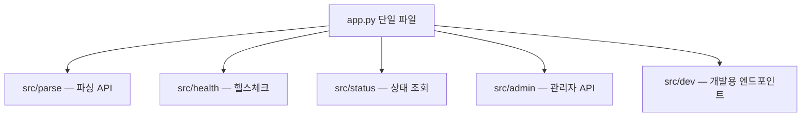
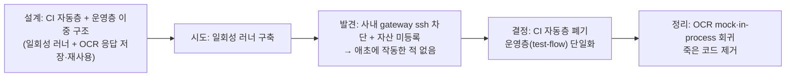

# 문서 파싱 서비스의 코드 구조 정리와 파싱 품질 운영 루프

**진행 기간**: 2026.05–2026.09 (진행 중)

모놀리식 파서 서비스를 도메인별로 쪼개고, 그 과정에서 파싱 결과가 안 깨졌는지 확인할 방법을 처음부터 다시 설계한 기록이다.

문서 파싱 서비스(Playground의 OCR 기반 문서→markdown 변환 API)는 PDF·이미지·오피스 문서를 마크다운으로 변환하는 FastAPI 서비스다.
이 기간 동안 이 서비스를 사실상 혼자 만졌다.
코드를 도메인별로 쪼개는 일과, 쪼갠 뒤에도 파싱 결과가 그대로인지 확인하는 일 두 가지를 했는데, 결국 더 오래 걸리고 더 많이 배운 쪽은 후자였다.
검증 인프라를 한 번 설계했다가 인프라 제약으로 통째로 버리고 다시 설계한 경험이 이 글의 핵심이다.

## 진입점부터 도메인별로 쪼갰다

원래 API 엔드포인트가 전부 `app.py` 한 파일에 몰려 있었다.
신규 기능을 추가할 때마다, 리뷰할 때마다, 테스트를 짤 때마다 이 한 파일 안에서 서로 다른 관심사가 충돌했다.
파싱 로직을 보다가 헬스체크 코드를 지나쳐야 하고, PR 하나가 관리자 API와 파싱 API를 동시에 건드리는 일이 흔했다.

파싱, 헬스체크, 상태 조회, 관리자, 개발용 다섯 개 도메인으로 나눠 `src/` 밑에 각각 라우터를 만들었다.

분리 자체보다 이행 과정이 까다로웠다.
백그라운드 스레드가 모듈 전역 변수를 직접 참조하는 코드가 있어서 `from app import xxx` 형태의 import를 `from src.core.state import xxx`로 바꿔야 했는데, 이 경로 하나가 어긋나면 런타임에만 터진다.
그래서 각 phase가 끝날 때마다 import가 정상인지 전수로 확인하고, `/health`가 200을 반환하는지, 그 도메인의 curl 호출이 실제로 동작하는지까지 확인한 뒤에만 다음 phase로 넘어갔다.
`app.py`와 `src/`가 공존하는 중간 상태를 여러 PR에 걸쳐 점진적으로 안정화하는 방식이었고, 분리 전후로 동작이 달라진 적은 없었다.

## 1939줄 파일 하나를 지웠다

라우터를 나누고 나서도 `document_parser.py`라는 파일 하나가 그대로 남아 있었다.
35개 함수가 한 파일에 몰려 1939줄이었다.
이 파일을 손대는 PR은 거의 항상 다른 사람이 작업 중인 부분과 겹쳤고, 리뷰어 입장에서도 이 함수가 다른 함수와 어떤 관계인지 파악하기 어려웠다.

한 번에 옮기지 않고 책임 단위로 7단계에 나눠 이동했다.

| phase | 내용 |
|---|---|
| 1 | `src/converters/factory.py` 신설 — 컨버터 팩토리 함수 4개 + 캐시 dict 3개 |
| 2 | `src/converters/warmup.py` 신설 — 워밍업 함수 5개 + 설정값 |
| 3 | `src/converters/timings.py` 신설 — 파이프라인 타이밍 로그 |
| 4 | `src/core/measurements.py` — GPU 측정·정리 함수 5개 |
| 5 | `src/core/worker_pool/init.py` — 워커 프로세스 초기화 |
| 6 | `src/ocr`, `src/parse`에 OCR·이미지·PDF 청크 관련 함수 13개 분산 |
| 7 | 남은 로더 함수를 `src/parse/loader.py`에 흡수 + `document_parser.py` 완전 삭제 |

마지막 7단계에서 파일을 지우고 나니 여기저기서 더는 쓰이지 않는 import가 38건 남았다.
이건 손으로 하나씩 찾지 않고 `ruff --select F401`로 일괄 정리했다.
리팩토링을 반복하다 보니 미사용 변수, `except:`로 다 잡아버리는 예외 처리 같은 문제가 리뷰에서만 걸러지던 것도 있어서, 이 김에 ruff의 unused import/variable(F)와 bare except(E722) 규칙까지 pre-commit·PR CI에 걸어 커밋 단계에서부터 자동 차단되게 했다.

## 리팩토링 뒤에 테스트가 없었다

책임을 나누는 작업을 하면서 계속 불안했던 이유는 단순했다.
이 프로젝트에 기존 단위 테스트가 7건뿐이었다.
함수를 이 파일에서 저 파일로 옮기면서 그 함수가 원래 하던 일을 그대로 하는지 확인할 안전망이 사실상 없었다.

그래서 리팩토링 도중에 테스트부터 두 계층으로 크게 얹었다.

- **Tier 1 — 순수 함수 84건**: 파일 헬퍼, PDF 청크 분할, 이미지 유틸, Excel 파서, OCR 변환 함수, 마크다운 생성기, 타이밍 로그처럼 입력과 출력만 있는 함수들
- **Tier 2 — mock 기반 44건**: 워커 풀, 컨버터 팩토리, 모니터링, 파싱 로더, OCR 호출, FastAPI lifespan처럼 외부 자원(GPU, 프로세스, 네트워크)에 의존하는 코드는 `monkeypatch`로 그 의존성만 갈아 끼워서 검증

기존 7건까지 합쳐 135건이 전부 통과하는 걸 확인한 뒤에야 다음 리팩토링 phase로 넘어갔다.
그 뒤로도 hwp 로더 교체, xlsx 스트리밍, 표 파서 3계층 분할 같은 리팩토링마다 테스트를 얹었고, 지금 `tests/unit`을 실행하면 241건이 돈다.

돌아보면 순서가 중요했다.
1939줄을 먼저 쪼개고 테스트를 나중에 붙였다면, 쪼개는 도중에 뭔가 깨져도 알아챌 방법이 없었을 것이다.
테스트를 먼저 깔고 리팩토링해야, 리팩토링 자체가 "테스트가 계속 통과하는 상태를 유지하며 코드를 옮기는 작업"으로 바뀐다.

## 회귀 검증과 품질 평가는 다른 질문이다

단위 테스트로 함수 단위 로직은 잡을 수 있어도, 이 서비스의 핵심 산출물인 "파싱된 문서 내용"이 맞는지는 다른 문제다.
여기서 두 축을 구분해야 한다는 걸 깨달았다.

- **회귀 검증**: 코드를 바꾸기 전과 후에 같은 문서를 넣었을 때 출력이 그대로인가
- **품질 평가**: 지금 출력이 정답에 얼마나 가까운가

전자는 "달라졌는가"만 보고, 후자는 "얼마나 정확한가"를 본다.
리팩토링처럼 동작이 그대로여야 하는 변경은 회귀 검증으로 충분하지만, OCR 모델을 바꾸거나 표 파서를 개선하는 변경은 회귀 검증만으로는 좋아졌는지 나빠졌는지 알 수 없다. 이전과 다르다는 것만 알 뿐이다.
이 차이를 구분하지 못하면 "출력이 바뀌었다"는 사실과 "출력이 나아졌다"는 판단을 섞어 버리게 된다.

품질 평가를 위해 문서 17건에 정답지(golden)를 만들었다.
핵심 문서 13건에서 시작해 일본어 문서(`ja_doc_001`), 병합 셀이 있는 복잡한 표(`ko_table_complex_001`), 영문 스캔본(`en_scan_001`), 수식이 포함된 영문 문서(`en_formula_001`)를 신규 4건 더 추가했다.
채점은 두 지표를 같이 본다.

- **문자열 유사도**(NED) — `difflib.SequenceMatcher.ratio()`로 정답지와 파싱 결과 전체 텍스트를 비교한 값. 1.0이면 동일, 0.0이면 완전히 다름
- **표 셀 정확도**(F1) — 표를 `(블록 인덱스, 행 인덱스, 열 인덱스, 셀 텍스트)` 튜플 집합으로 바꾼 뒤, 정답지와 파싱 결과 사이 일치하는 셀의 정밀도·재현율을 F1로 계산

830페이지짜리 국내 장문서 같은 표본은 golden 채점에는 넣지 않았다. 정답지를 사람이 만들기 비현실적인 분량이라, 이런 표본은 뒤에서 다룰 benchmark 전용 표본으로 따로 뒀다.
채점 로직 자체도 단위 테스트 15건으로 검증해 뒀다.

## 검증 자동화를 한 번 설계했다가 통째로 버렸다

가장 크게 삽질한 부분이 여기다.
처음에는 회귀 검증을 CI에서 자동으로 돌리려고 했다.
설계는 이랬다.

- **CI 자동층**: 외부 사내 OCR을 호출하는 대신, 미리 캡처해 둔 OCR 응답 값을 저장해 두고 그대로 재사용(mock)해서 PR마다 in-process로 파싱을 돌린다
- **운영층**: 실제 GPU 인스턴스에서 실제 OCR로 파싱한 결과를 태그별로 캡처해 누적 비교한다(지금의 test-flow)

문제는 CI 자동층이 일회성 자체 실행 러너(사내 GPU 인스턴스를 매번 발급하고 실행한 뒤 삭제하는 방식)를 전제로 설계됐다는 점이었다.
실제로 붙여보니 사내 게이트웨이가 ssh ProxyJump를 막아 새로 발급한 인스턴스에 접근할 경로가 없었고, 신규 인스턴스는 자산 인벤토리에 등록도 안 돼 있어 접근권한 신청 자체가 매번 막혔다.
그리고 이 설계가 의존하던 OCR 응답 저장소(`fixtures/ocr_responses`)와 CI 전용 기준점(`baselines/ci`)은 애초에 한 번도 만들어진 적이 없었다. 즉 이 회귀 테스트는 로컬에서도 CI에서도 처음부터 전부 건너뛰고 있었다.

결국 회귀 검증을 운영층 하나로 단일화했다.
미릴리스 변경은 별도로 빌드한 이미지를 검증용 GPU 인스턴스에 띄워 머지 전에 격리 검증했다.
`tests/regression`에는 태그별 스냅샷을 캡처하는 `capture_baseline.py`, 두 태그를 정확 비교하는 `compare_baseline.py`, NED·표 셀 F1을 계산하는 `metrics.py`처럼 그 인스턴스가 실제로 쓰는 코드만 남겼다.
미사용으로 남아 있던 OCR mock, in-process 회귀 코드는 이 정리에서 함께 제거했다.

돌아보면 이 시행착오 자체가 소득이었다.
처음 설계할 때는 "외부 서비스는 mock으로 격리한다"는 원칙만 보고 일회성 러너 쪽 인프라 제약은 고려하지 않았다.
mock으로 외부 의존성을 끊는 게 정석이라는 것과, 그 mock을 CI에서 실제로 돌릴 수 있는 실행 환경이 있는지는 완전히 다른 질문이었다.

## 정지해 둔 GPU 인스턴스 하나로 돌린다

운영층 검증은 지금 이렇게 동작한다.
검증용 T4 GPU 인스턴스를 하나 두고, 평소에는 정지(SHUTOFF)해 뒀다가 검증할 때만 시작(start)한다.
시작한 인스턴스에 검증 대상 이미지를 NCR에서 받아 컨테이너로 띄우고, 로컬에서 그 인스턴스의 API로 회귀·품질(golden)·benchmark·정성 평가까지 전부 돌린 뒤 다시 정지한다.

당초에는 이것도 매번 새 인스턴스를 발급했다 삭제하는 일회성 러너로 설계하려고 했다.
그런데 T4 GPU 인스턴스를 새로 발급할 때마다 서버 접근권한 신청 기안을 다시 올려야 한다는 게 걸림돌이었다. 검증 한 번 하자고 매번 기안 결재를 기다릴 수는 없었다.
그래서 인스턴스는 최초 1회만 발급해 접근권한을 확보해 두고, 이후로는 정지·시작만 반복해 재사용하는 쪽으로 방향을 바꿨다.
이미지만 그때그때 검증 대상으로 바꿔 띄우기 때문에 기안을 다시 올릴 일이 없다.

같은 인스턴스가 회귀 검증, golden 품질 채점, 벤치마크, 그리고 메모리 민감한 변경에 대한 동시 부하 테스트까지 전부 처리한다.
운영 트래픽을 받는 인스턴스는 여기서 전혀 건드리지 않는다. 격리된 인스턴스에서만 검증하고, 검증이 끝나면 정지해 비용을 아낀다.

## 만점이 실제 결함을 가리고 있었다

2026년 8월에는 정답지 24건을 원본 문서와 다시 대조했다.
초기 정답지 일부가 파서 출력을 그대로 승격한 상태라, 파서가 읽지 못한 구간도 정답으로 굳어 있었다.
그 상태에서는 결함이 있어도 점수가 1.0으로 나왔다.

같은 파싱 결과를 교정 전후 정답지로 다시 채점하자 수치가 이렇게 바뀌었다.

| 대상 | 재검수 전 | 재검수 후 |
| --- | ---: | ---: |
| 전체 평균 NED | 0.9912 | 0.9822 |
| 최저 NED | 0.8804 | 0.6826 |
| 영문 스캔본 NED | 0.9948 | 0.6826 |
| 한글 표 문서의 표 셀 F1 | 0.9853 | 0.9559 |

점수가 내려간 것은 품질이 나빠졌기 때문이 아니다.
그동안 정답지가 가리던 읽기 순서 붕괴, 하단 각주 누락, 참고문헌 절단, 작은 OCR 영역 오인식이 수치로 드러난 것이다.

작은 OCR 영역은 렌더 배율을 1배에서 3배로 올렸다.
한 목차 표에서 비어 있던 14행 중 3개 셀이 모두 채워졌고, 그 문서의 표 셀 F1은 0.8214에서 1.0으로 올랐다.
짧은 변을 무조건 400px 이상으로 키우는 방식은 이미지에 따라 8.1배까지 커지고 인식 이득은 없어 기각했다.
배율 3은 워커 4개가 영역 4개씩 동시에 처리해도 추가 메모리가 100MB 아래라는 계산까지 확인하고 적용했다.

## 성공 응답처럼 보이던 변환 실패를 드러냈다

품질 검증을 운영하다 보니 출력 내용뿐 아니라 API 계약에도 문제가 있었다.
두 변환기가 모두 실패해도 서비스가 HTTP 200과 빈 markdown을 돌려, 호출자는 정상적인 빈 문서와 변환 실패를 구분할 수 없었다.
실제로 하루 동안 문서 17건이 실패했는데도 로그에는 변환 완료로 남고, 색인 단계에서는 내용 없음으로 분류됐다.

흡수한 변환 실패를 응답의 `status="error"`와 `reason`으로 드러내고, 실패 원인별 HTTP 상태코드를 정리했다.
같은 실패를 여러 계층에서 중복 기록하지 않도록 전파 경로도 함께 정리했다.
이제 호출자는 재시도할 실패와 입력을 고쳐야 할 실패를 구분할 수 있고, 운영 분류에서도 빈 문서와 파싱 실패를 따로 집계할 수 있다.

## 검증 표본도 실제 지원 형식과 맞추고 있다

2026년 9월 1일 기준으로 지원하지만 회귀 표본이 없던 `jpg`, `webp`, `csv`, `doc`, `ppt`, `txt` 형식을 표본 목록에 추가하고 있다.
이 과정에서 CSV 제목에 업로드 임시 파일명이 노출되는 결함도 발견해 함께 고쳤다.
이 변경은 아직 검토 브랜치에 있으므로 운영 반영 결과로 세지 않는다.

품질 평가의 범위는 이제 다음 순서로 관리한다.

1. 지원 형식과 표본 목록이 일치하는지 검사한다.
2. 배포 이미지를 회귀 기준점으로 캡처한다.
3. 같은 캡처를 사람이 검수한 정답지로 다시 채점한다.
4. 점수가 내려간 문서는 원본과 대조해 파서 결함과 정답지 결함을 나눈다.
5. 고친 파일은 다음 주 오류 분류에서 다시 나타나는지 확인한다.

## 지금 보면

이 두 달의 작업을 관통하는 하나의 배움은, 검증 인프라를 설계할 때 "무엇을 검증할 것인가"만큼 "이 검증을 실제로 어떤 환경에서 돌릴 수 있는가"를 먼저 확인해야 한다는 것이다.
일회성 러너를 전제로 CI 자동층을 설계했을 때는 전체 설계가 그럴듯해 보였지만, 사내 네트워크 정책과 자산 관리 프로세스라는 전제를 검증하지 않고 그 위에 몇 주치 설계를 쌓았다.
반대로 test-flow는 처음부터 "이 회사에서 실제로 실행 가능한 절차인가"를 먼저 확인하고 그 제약 위에서 최소한의 자동화(nssh 비대화형 실행, 인스턴스 재사용)를 얹었다.

**회귀**(전후 동일한가)와 **품질**(정답 대비 얼마나 정확한가)을 하나의 지표로 뭉뚱그리지 않고 처음부터 다른 축으로 분리해 둔 것도 지금 보면 잘한 선택이다.
표 파서를 바꾸는 변경은 회귀 검증만 통과해서는 의미가 없고, 반대로 리팩토링은 품질 점수가 조금이라도 흔들리면 그 자체가 버그다.
두 질문에 하나의 답만 준비했다면 둘 중 하나는 계속 잘못된 판단을 내렸을 것이다.

여기에 정답지 검수라는 세 번째 축이 더 필요했다.
평가 코드가 맞고 테스트가 통과해도 정답지가 틀리면 점수는 자신 있게 거짓말한다.
정답지는 한 번 만드는 산출물이 아니라, 실제 원본과 계속 대조하며 품질을 유지해야 하는 운영 자산이었다.

OCR이 파싱 파이프라인에서 어떤 위치를 차지하는지는 [OCR 동작 원리](../../python/ocr-pipeline-basics.md)에 따로 정리해 뒀다.
