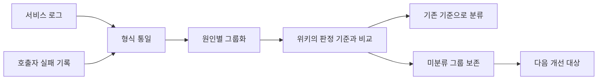

# 운영 지표와 주간 오류 분류 루프

**진행 기간**: 2026.05–현재

Document Parser를 넘겨받았을 때는 워커별 메모리와 변환 단계별 처리 시간을 확인할 지표가 없었다.
OCR 서비스도 HTTP 200 응답 안에 담긴 비즈니스 오류를 따로 집계하지 않았다.
두 서비스 모두 문제가 생긴 뒤 여러 로그를 모아 원인을 추정하는 데 시간이 들었다.

먼저 운영 상태를 확인할 지표와 요청 추적 정보를 만들었다.
그다음 매주 오류를 같은 원인끼리 묶고, 기존 기준으로 설명하지 못한 그룹을 다음 개선 대상으로 남기는 절차를 정리했다.

## 관측 정보 구축

서비스마다 먼저 답해야 할 질문이 달랐다.

| 서비스 | 확인할 질문 | 추가한 정보 |
| --- | --- | --- |
| Document Parser | 어느 워커의 RSS가 늘었는가, 어느 변환 단계가 오래 걸리는가 | 워커별 메모리와 재시작 횟수, 단계별 처리 시간 |
| OCR | HTTP 200 응답 중 실제 실패가 몇 건인가 | 오류 코드와 오류 범주별 Counter |
| 공통 | 한 요청이 어느 구간에서 실패했는가 | 서비스 사이에 이어지는 `requestId` |

Document Parser에는 워커별 메모리, 요청과 변환 시간, 실패 건수 메트릭을 추가했다.
여러 프로세스가 기록한 값을 하나의 `/metrics`에서 제공하고 Prometheus와 Grafana로 확인하도록 구성했다.

OCR 서비스에서는 공통 예외 처리기가 반환하는 비즈니스 오류 코드를 Counter로 기록했다.
발생 속도와 최근 한 시간의 건수를 분리해, 현재 증가하는 오류와 누적된 오류를 구분했다.

메트릭은 증가한 구간을 찾는 데 적합하지만 개별 요청의 원인은 설명하지 못한다.
로그에는 같은 `requestId`를 넣어 API 진입점, 애플리케이션과 모델 서버의 기록을 연결했다.

세부 구현과 검증은 다음 문서에 나누어 기록했다.

- [Python 서버 RSS가 줄지 않을 때 malloc_trim을 적용한 과정](./glibc-malloc-trim-python-leak.md)
- [HTTP 200 응답 안의 OCR 오류를 운영 지표로 만들기](./ocr-business-error-monitoring.md)
- [OCR 오토스케일 전환의 connection 에러를 양쪽에서 막기](./ocr-scale-connection-resilience.md)

## 두 수집 경로의 결합

Document Parser 내부 로그만 조회하면 응답을 만들기 전에 연결이 끊긴 요청을 찾을 수 없었다.
이 실패는 호출자의 색인 실패 목록에만 남았다.
따라서 서비스 로그와 호출자 기록을 함께 수집했다.

두 기록은 필드와 오류 표현이 달랐다.
먼저 요청 시각, 요청 ID, 오류 코드와 예외 원인을 같은 형식으로 바꾼 뒤 그룹화했다.
OCR 서비스는 로그 한 곳에서 수집하지만, 오류 코드와 요청 경로 및 최초 예외를 함께 봐야 같은 원인을 구분할 수 있었다.

## 로그 발생 건수와 최종 실패 건수의 분리

재시도로 회복된 요청도 첫 시도에서는 ERROR 로그를 남길 수 있다.
이 로그를 그대로 세면 최종 실패 건수보다 큰 값이 나온다.

오류 지표는 조사할 시간대와 오류 코드를 고르는 데 사용했다.
최종 성공 여부와 재시도 결과는 요청 단위 로그에서 다시 확인했다.
로그 레벨도 집계 입력으로 사용하므로, 회복 가능한 중간 실패와 최종 실패를 같은 수준으로 기록하지 않도록 정리했다.

## 자동 집계에서 발견한 네 가지 오류

자동화가 끝까지 실행됐다는 사실만으로 집계 결과가 맞다고 판단할 수 없었다.
실제 주간 기록과 원본 응답을 대조하면서 다음 문제를 찾았다.

| 문제 | 결과 | 보완 방법 |
| --- | --- | --- |
| 주 단위 전수 조회의 종료 조건이 맞지 않음 | 조회가 중간에 끝났지만 부분 집계가 정상 결과처럼 남음 | 시간 구간을 나누어 조회하고 마지막 페이지까지 확인 |
| 자동 요약이 최신 100건만 출력 | 앞쪽 날짜의 오류가 보고서에서 빠짐 | 일별 분포와 전체 건수를 원본 응답에서 다시 계산 |
| 검증 인스턴스 로그가 함께 수집됨 | 운영에 없는 오류가 운영 분포에 포함됨 | 운영 인스턴스 조건을 명시하고 제외 건수를 별도 확인 |
| 와일드카드 제외 조건을 문자열로 전달 | 필터가 적용되지 않았지만 조회는 성공함 | 반대 방향의 포함 조건으로 다시 세어 두 결과를 대조 |

2026년 8월 한 주의 자동 요약에는 사흘 동안의 100건만 보였지만 원본에는 이레 동안 190건이 있었다.
다른 조회에서는 전체 12,138건 중 검증 인스턴스 기록 671건이 포함돼 있었다.
이 대조를 거친 뒤부터는 전체 건수, 날짜 범위와 제외 건수를 결과와 함께 확인했다.

## 판정 기준 관리

처음에는 오류 코드별 판정 기준이 자동화 설정과 사람이 읽는 운영 문서에 각각 있었다.
두 사본 중 하나만 바뀌면 같은 오류를 다음 주에 다른 원인으로 분류할 수 있었다.

판정 기준은 팀 위키 한 곳에서 관리하고 자동 분류도 실행할 때 같은 내용을 읽도록 바꿨다.
네트워크 조회에 의존한다는 비용은 생겼지만, 사람과 자동화가 서로 다른 기준을 쓰는 문제를 줄였다.
위키의 필수 항목이 빠지면 분류를 중단하도록 형식 검사도 함께 필요하다는 과제가 남았다.

## 미분류 그룹의 활용

기존 기준에 맞지 않는 오류를 기타 항목에 합치지 않고 별도 그룹으로 남겼다.
이 그룹을 확인하면서 다음 문제를 찾았다.

- 비동기 재디스패치 때 요청 ID가 새로 만들어지는 문제
- 계층마다 업로드 크기 제한이 달라 안내 값과 실제 동작이 다른 문제
- 이미지 읽기 실패가 서버 오류로 분류되는 문제

오류 건수만 집계하면 증가와 감소는 알 수 있다.
기존 기준으로 설명하지 못한 요청을 남겨야 다음에 고칠 대상을 찾을 수 있었다.

## 내가 한 일

- Document Parser와 OCR 서비스에 필요한 메트릭과 Grafana 화면을 구성했다.
- 요청 ID를 프로세스와 서비스 사이에 전달해 한 요청의 로그를 연결했다.
- 서비스 로그와 호출자 실패 기록을 결합해 주간 오류를 원인별로 분류했다.
- 원본 응답 대조와 반대 조건 조회로 집계 누락과 필터 오류를 확인했다.
- 오류 판정 기준을 팀 위키에서 함께 사용하도록 정리했다.

## 배운 것

메트릭, 로그와 호출자 기록은 서로 다른 질문에 답한다.
메트릭은 증가한 오류를 찾고, 로그는 개별 요청의 원인을 설명하며, 호출자 기록은 서비스가 응답하지 못한 실패를 보완한다.

자동 집계는 실패할 때 멈추는 경우보다 일부 데이터만 정상 결과처럼 반환하는 경우를 더 주의해야 했다.
전체 건수와 날짜 범위, 제외 조건을 다른 조회로 대조해야 집계 결과를 운영 판단에 사용할 수 있었다.

## 관련 문서

- [Python 서버 RSS가 줄지 않을 때 malloc_trim을 적용한 과정](./glibc-malloc-trim-python-leak.md)
- [HTTP 200 응답 안의 OCR 오류를 운영 지표로 만들기](./ocr-business-error-monitoring.md)
- [OCR 오토스케일 전환의 connection 에러를 양쪽에서 막기](./ocr-scale-connection-resilience.md)
- [ThreadLocal 에서 contextvars 로 — Python 의 요청 컨텍스트 전파](../../python/java-to-python-threadlocal-contextvar.md)
- [로그에 traceId 남기기 — MDC 부터 OpenTelemetry 까지](../../java/MDC.md)
