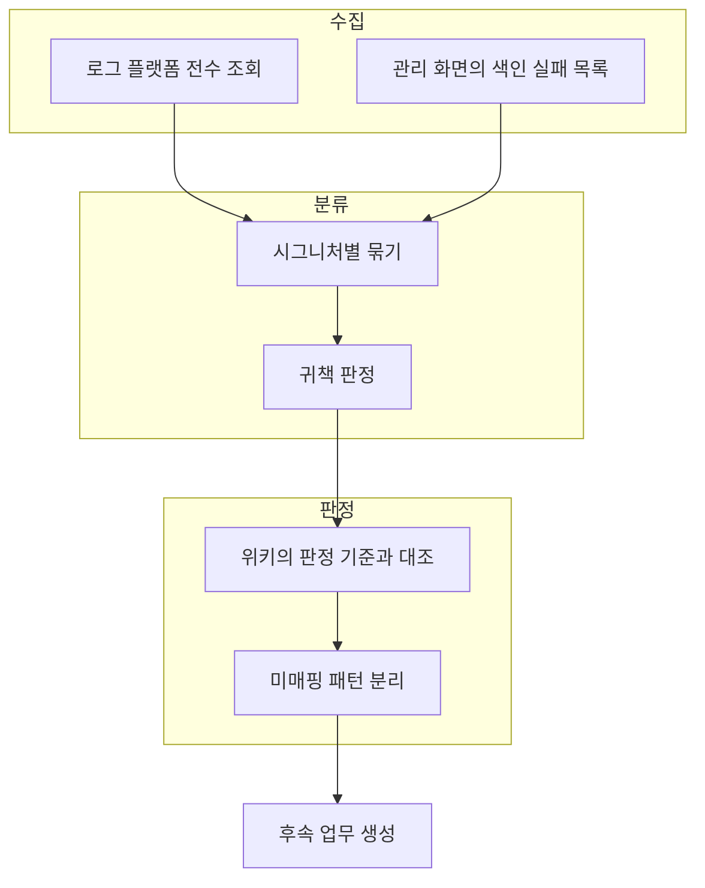

# 지표와 로그를 붙이자 AI 와 같이 볼 화면이 생겼다

**진행 기간**: 2026.05–2026.09 (진행 중)

문서 파싱 서비스를 넘겨받았을 때 나는 Python 을 써 본 적이 없었다.
Java 백엔드만 했고, docling 이라는 문서 변환 라이브러리도 그때 처음 들었다.
코드도 내가 쓴 것이 아니었다.

그런 상태에서 "메모리가 새는 것 같은데 봐 줘" 라고 AI 에게 물으면 어떻게 되는지 먼저 말하고 싶다.
코드만 읽고 추측을 낸다.
그럴듯한 후보 다섯 개가 나오고, 그중 어느 것이 맞는지 내가 판별할 수 없다.
Python 을 모르니까.

그래서 내가 처음 한 일은 고치는 것이 아니라 보이게 만드는 것이었다.
지표를 붙이고, 로그를 구조화하고, 요청마다 ID 를 달았다.
그러고 나니 질문이 이렇게 바뀌었다.

> 이 워커가 32분 동안 2.05GB 에서 2.73GB 로 올라갔다. 이 값을 설명할 수 있는 후보를 대라.

같은 AI 인데 답이 달라졌다.
추측 대신 그 숫자를 설명하는 가설이 나왔고, 나는 그 가설을 다시 지표로 검증할 수 있었다.

**지표를 붙이는 일은 내가 보려고 한 것이 아니라 AI 와 같이 볼 화면을 만드는 일이었다.**
이 글은 그 화면을 만든 과정과, 그 화면이 생기고 나서 운영 오류를 매주 분류하는 루프가 어떻게 돌기 시작했는지에 대한 기록이다.

같은 일을 OCR 서비스에서도 했다.
두 서비스는 스택도 팀 내 위치도 다른데 결국 같은 구조에 도달했다.
그 공통점이 이 글에서 가장 재사용 가능한 부분이라고 생각한다.

---

## 고친 것이 나에게 돌아오지 않았다

넘겨받은 시점의 상황을 한 문장으로 쓰면, 코드는 고칠 수 있는데 그 뒤가 없었다.

한 바퀴가 돌려면 다섯 지점이 필요하다.


이 중 A 만 있었다.

- 변경한 것이 되는지 검증할 수단이 없었다.
- 좋아졌는지 판정할 기준이 없었다.
- 운영에서 메모리가 어떻게 변하는지 볼 수 없었다.
- 어떤 오류가 몇 건 나는지 모아 둔 곳이 없어서 다음에 무엇을 고칠지 고를 수 없었다.

그래서 고친 것이 어땠는지가 나에게 돌아오지 않았다.
D 와 E 가 비어 있으면 루프가 아니라 직선이다.

나는 D 부터 만들기로 했다.
무엇이 벌어지는지 보이지 않으면 나머지를 판단할 근거가 없어서다.

---

## 없던 지표는 둘이었다

아무것도 없던 것은 아니다.
호스트의 CPU 와 RAM 지표를 보는 대시보드는 있었다.

없던 것이 둘이다.

| 없던 것 | 왜 필요한가 |
| --- | --- |
| Python 이 쓰는 메모리 | 호스트가 80% 라는 것은 알아도 어느 워커에서 어떻게 올라갔는지 알 수 없다 |
| 실패 건수 | 서버가 재시작하는 동안 들어온 요청은 전부 거부되는데 그것이 몇 건인지 세는 것이 없었다 |

그래서 대시보드를 먼저 만들었다.
워커별 메모리, 거부된 요청 건수, 파싱 실패 건수가 여기서 나온다.
지금은 패널이 31개다.

붙이자마자 보인 것이 두 그래프다.

- 워커 메모리가 상시 12에서 14GB 인데 22에서 24GB 로 튀는 것이 반복됐다.
- 워커 재시작 횟수가 2026년 5월 22일에 시간당 3,400회까지 올라갔다.

두 그래프를 나란히 놓으니 구조가 보였다.
문서를 처리하면 메모리가 차오르고, 처리가 끝나도 회수되지 않는다.
그러면 되돌릴 방법이 하나뿐이다. 프로세스를 죽이는 것이다.

실제로 그렇게 되어 있었다.
워커가 문서 세 건을 처리하면 강제로 죽고 새로 떴다.

여기서 내가 던진 질문이 "왜 세 건마다 죽이는가" 였다.
받은 답은 `gc.collect()` 가 Python 객체만 풀고 그 아래 C 영역의 빈 공간은 glibc 가 들고 있어 OS 에 반환되지 않는다는 것이었다.
그러니까 워커를 죽이는 것이 유일한 회수 수단이었다.
3 이라는 값은 누가 잘못 정한 것이 아니라 그것 말고 방법이 없어서 3이었다.

대안으로 나온 것이 `malloc_trim` 이다.
적용한 뒤 워커를 죽이는 주기를 3건에서 20건, 다시 100건까지 올릴 수 있었다.

여기서 짚고 싶은 것은 `malloc_trim` 자체가 아니다.
**적용해도 되는지, 적용하고 나서 좋아졌는지를 판정한 수단이 앞에서 붙인 워커 메모리 패널이었다는 것이다.**
지표가 없었으면 이 제안을 받고도 넣을 수 없었다.

> 메모리 계층과 `gc.collect()` 의 한계는 [Python 서버의 RSS 가 안 줄어드는 이유](./glibc-malloc-trim-python-leak.md)에 따로 정리했다.
> 대시보드를 만들며 밟은 초기화 순서 함정은 [문서 파싱 서비스의 관측성 체계](./docparser-observability.md)에 있다.

---

## 로그는 세 번 막혔다

메모리가 안정되고 나서 다음으로 걸린 것이 로그다.
막힌 것과 한 것을 나란히 적으면 이렇다.

| 막힌 것 | 한 것 |
| --- | --- |
| 운영 인스턴스 8대에 하나씩 접속해서 로그를 봐야 했다 | 로그를 사내 로그 플랫폼인 Log & Crash 로 적재해 한곳에서 본다 |
| 문서 하나를 처리하는 여러 단계가 로그에 남지 않았다 | 페이지 전처리, OCR, 레이아웃 감지, 표 분석의 단계별 처리 시간을 남긴다 |
| 한 인스턴스가 여러 요청을 동시에 받아 로그가 섞였다 | 요청마다 `requestId` 를 부여하고 파싱하는 별도 프로세스의 로그에도 같은 값이 붙게 한다 |

세 번째가 핵심이다.
로그가 섞여 쌓이면 건수는 셀 수 있어도 하나의 요청을 따라갈 수 없다.
따라갈 수 없으면 AI 에게 줄 수 있는 것이 "이런 오류가 났다" 뿐이고, 그것은 앞에서 말한 추측 단계로 되돌아가는 것이다.

`requestId` 를 붙이고 나서 로그 한 줄이 이렇게 바뀌었다.

```json
{
  "requestId": "9c165200-a07d-4cfc-a986-a9f3ed3905dc",
  "body": "변환 완료: 컨테이너기술.pdf (53156ms, 52p, 17499B)",
  "durationMs": "53156",
  "pageCount": "52",
  "status": "200",
  "host": "naia-docparser-ca902"
}
```

52쪽 PDF 하나가 53초 걸렸다는 것을 알 수 있고, 8대 중 어디서 처리했는지도 보인다.
같은 12시간 구간에 이런 완료 로그가 2,214건 있었다.

이것을 AI 와 같이 분석해서 나온 값이 하나 있다.
**225쪽 PDF 처리 시간의 58.6% 가 표 분석 단계였다.**

그때 나는 파싱 속도를 최적화하고 있었는데 효과가 없었다.
엉뚱한 단계를 붙잡고 있었던 것이다.

이 숫자는 로그가 없으면 나올 수 없다.
그리고 로그만 있고 `requestId` 가 없으면 어느 요청의 어느 단계인지 묶을 수 없어서 역시 나올 수 없다.

> Java 의 MDC 를 Python 의 `contextvars` 로 옮기는 방법은 [ThreadLocal 에서 contextvar 로](../../python/java-to-python-threadlocal-contextvar.md)에 정리했다.
> 같은 문제를 OCR 서비스의 Java 쪽에서 어떻게 풀었는지는 [OCR 오토스케일 전환의 connection 에러](./ocr-scale-connection-resilience.md)의 요청 추적 절에 있다.

---

## 그래서 매주 분류할 것이 생겼다

여기까지 오면 루프의 D 가 채워진다.
그다음이 E, 다음에 무엇을 고칠지 고르는 단계다.

이 단계를 두 서비스에서 각각 만들었다.
문서 파싱 쪽은 `error-triage`, OCR 쪽은 `ocr-weekly-error-triage` 라는 스킬로 굳혔다.
AI 에게 "이번 주 에러 봐 줘" 라고 말하면 아래 절차가 그대로 돌아간다.



두 서비스가 서로 모른 채 같은 구조에 도달했다.
차이는 축의 개수뿐이다.

| | 문서 파싱 | OCR |
| --- | --- | --- |
| 수집 축 | 로그 플랫폼과 관리 화면의 색인 실패 목록 둘 | 로그 플랫폼 하나 |
| 묶는 키 | 예외 시그니처 | `errorCode` 와 `requestUri` 와 근본 원인 셋 |
| 판정 기준 위치 | 스킬 안 | 사내 위키 |
| 결과물 | HTML 리포트 | 주간 감사 업무의 댓글 |

### 왜 두 축으로 나눠야 했나

문서 파싱 쪽에서 로그 하나만 봐서는 안 되는 이유가 있었다.

로그 플랫폼에는 서비스 내부에서 던진 예외가 남는다.
그런데 **응답을 아예 못 돌려준 실패는 여기 안 남는다.**
연결이 끊겼거나 503 이 난 경우가 그렇다.
이것은 호출자인 색인 배치 쪽 기록에만 남는다.

그래서 관리 화면의 색인 실패 목록을 두 번째 축으로 넣었다.
로그인 API 로 토큰을 받아 직접 호출하도록 만들어서, 사람이 화면을 클릭하지 않아도 수집된다.

### 로그 건수를 실패 건수로 쓰면 틀린다

이것이 분류를 자동화하면서 가장 늦게 깨달은 것이다.

재시도로 회복된 요청도 첫 시도에서 ERROR 로그를 남긴다.
그 로그를 그대로 세면 실패 건수가 실제보다 커진다.
그리고 그 부풀려진 숫자가 다음 개선 순서를 정하는 근거가 된다.

OCR 쪽에서는 이것을 로그 레벨 자체의 문제로 봤다.
회복된 실패를 ERROR 로 남기면 사람이 읽는 색깔이 잘못된 것이 아니라 **집계 파이프라인의 입력이 오염된다.**
로그 레벨은 사람에게 보내는 신호가 아니라 기계가 세는 값이다.

### 실측으로만 알 수 있던 함정 넷

절차를 글로 적어 두는 것과, 그 절차가 실제로 도는 것은 다르다.
아래 넷은 전부 조용히 틀린 값을 내던 것들이라 결과만 보고는 알 수 없었다.

- **전수 조회가 중간에 멈췄다.**
  주 단위 조회에서 총 건수 필드가 대개 확인 불가로 온다.
  검색 API 가 6시간 범위를 전제로 만들어져서 그렇다.
  이 값을 종료 조건으로 쓰고 있어서 전수 조회가 끊겼고, 끊긴 줄 모른 채 부분 집계를 쓰고 있었다.

- **봇이 준 요약은 잘려 있었다.**
  자동 리포트가 최신순 100건만 인쇄하므로 앞쪽 날짜가 통째로 빠진다.
  2026년 8월 24일 주간에는 봇 본문이 사흘치 100건만 보여줬는데 실제로는 이레에 걸친 190건이었다.
  일별 분포는 반드시 원본 응답으로 다시 계산해야 한다.

- **검증 인스턴스 로그가 운영 분포를 오염시켰다.**
  검증용으로 띄우는 일회성 인스턴스는 운영이 아닌데 같은 로그 플랫폼에 쌓인다.
  7일 12,138건 중 671건이 그것이었고, 특정 키 미설정 오류 30건은 전부 거기서 나온 것이었다.
  제외 필터를 넣어야 한다.

- **그 제외 필터가 조용히 죽었다.**
  와일드카드를 따옴표 안에 넣으면 리터럴로 처리돼 필터가 무시된다.
  그런데 **검색은 성공하고 건수만 달라져서** 결과만 보고는 알 수 없다.
  그래서 반대 방향의 포함 필터로 한 번 더 세서 두 값이 같은지 확인하는 단계를 넣었다.

넷 다 공통점이 있다.
실패했다고 알려주지 않고 그럴듯한 숫자를 돌려준다.
자동화를 만들 때 진짜 위험은 멈추는 것이 아니라 조용히 틀리는 것이었다.

### 판정 기준을 스킬에서 위키로 옮겼다

처음에는 "이 오류 코드는 이 원인" 이라는 판정 기준을 스킬 파일 안에 적어 뒀다.
그런데 이것이 두 군데로 갈라졌다.
사람이 보는 운영 문서에 하나, 스킬에 하나였다.
한쪽만 고치면 다음 주 분류가 옛 기준으로 돌아간다.

그래서 판정 기준을 사내 위키 한 곳으로 옮기고, 스킬은 그 위키를 읽어 오도록 바꿨다.

이 결정에는 대가가 있다.
분류를 돌릴 때마다 위키를 조회해야 하니 스킬이 네트워크에 의존하게 된다.
대신 기준이 갈라지지 않는다.
운영 지식은 사람과 에이전트가 같이 읽는 것이라, 사본을 두는 쪽의 비용이 더 컸다.

---

## 자동화가 스스로 일감을 물어 왔다

분류가 매주 돌기 시작하고 나서 예상하지 못한 일이 생겼다.
**분류 자동화가 찾아낸 것이 그다음 개선 과제가 됐다.**

앞에서 말한 것처럼 처음에는 다음에 무엇을 고칠지 고를 근거가 없었다.
이제는 순서가 반대가 됐다.

- 서블릿 비동기 재디스패치마다 요청 ID 가 새로 생성되던 것
- 업로드 크기 한도가 계층마다 달라 안내한 값과 실제 동작이 어긋나던 것
- 이미지 읽기 실패가 서버 귀책으로 분류되던 것

셋 다 내가 찾으려고 찾은 것이 아니다.
주간 분류에서 미매핑 그룹으로 남은 것을 파고들다 나왔다.

여기서 얻은 감각이 하나 있다.
운영 오류를 세는 것과 다음에 무엇을 고칠지 아는 것은 다른 일이다.
세는 것은 대시보드가 해 준다.
**그런데 "이 그룹은 아직 아무 판정에도 안 붙는다" 를 남겨 두는 절차가 있어야 그다음이 나온다.**
미매핑 그룹을 지우지 않고 남기는 것이 이 루프의 핵심이었다.

---

## 이 일을 어떻게 나눠 했나

문서 파싱 쪽은 사실상 내가 혼자 만졌다.
그래서 협업이라고 할 만한 것은 오히려 OCR 쪽에 있었다.

주간 에러 리포트는 원래 감사 봇이 매주 자동으로 등록하고 있었다.
그것을 사람이 읽고 넘어가는 상태였고, 나는 거기에 분류 결과를 댓글로 붙이는 자리를 만들었다.
읽는 사람이 정해져 있으니 형식을 내 마음대로 정할 수 없었다.
그래서 제목과 태그 규칙은 팀 문서를 단일 소스로 두고 스킬이 그것을 따르게 했다.

판정 기준을 위키로 옮긴 것도 같은 이유다.
내가 만든 절차인데 나만 읽는 것이 아니었다.

모르는 것을 그대로 물은 것도 적어 두고 싶다.
"RSS 가 뭐야" 로 시작한 질문이 있었다.
답을 받고 바로 코드에 넣지 않고, 왜 그 호출이 필요한지 근거를 먼저 달라고 했다.
그리고 그 답을 그 자리에서 흘리지 않고 [글로 만들어](./glibc-malloc-trim-python-leak.md) 남겼다.

고칠 때는 동작하는 데까지만 알아도 넘어간다.
그 뒤에 왜 그런지를 알아야 다음에 같은 것을 만났을 때 판단할 수 있다.

---

## 지금 보면

관측을 먼저 붙인 순서는 지금도 맞았다고 생각한다.
다만 그때 내가 이것을 "AI 와 같이 볼 화면" 이라고 정리하고 시작한 것은 아니다.
일단 보이게 만들고 나서, 질문의 질이 달라지는 것을 겪고 나서 알았다.

아쉬운 것은 두 서비스의 분류 절차를 따로 만든 것이다.
축의 개수와 묶는 키만 다르고 나머지 구조는 같았는데, 두 번째를 만들 때 첫 번째를 참고하지 않았다.
공통 부분을 먼저 떼어 놓았으면 실측 함정 넷 중 몇 개는 두 번 밟지 않았을 것이다.

그리고 판정 기준을 위키로 옮긴 뒤에 검증을 붙이지 않았다.
지금은 위키 형식이 깨지면 분류가 조용히 틀린 결과를 낸다.
앞에서 "진짜 위험은 조용히 틀리는 것" 이라고 써 놓고 같은 구멍을 남긴 셈이다.
다음에 손댈 때 위키를 읽은 직후 형식을 검사하는 단계를 넣으려고 한다.

---

## 함께 읽기

- [Python 서버의 RSS 가 안 줄어드는 이유](./glibc-malloc-trim-python-leak.md)
- [문서 파싱 서비스의 관측성 체계](./docparser-observability.md)
- [OCR 오토스케일 전환의 connection 에러를 양쪽에서 막기](./ocr-scale-connection-resilience.md)
- [ThreadLocal 에서 contextvar 로](../../python/java-to-python-threadlocal-contextvar.md)
- [로그에 traceId 남기기](../../java/MDC.md)
