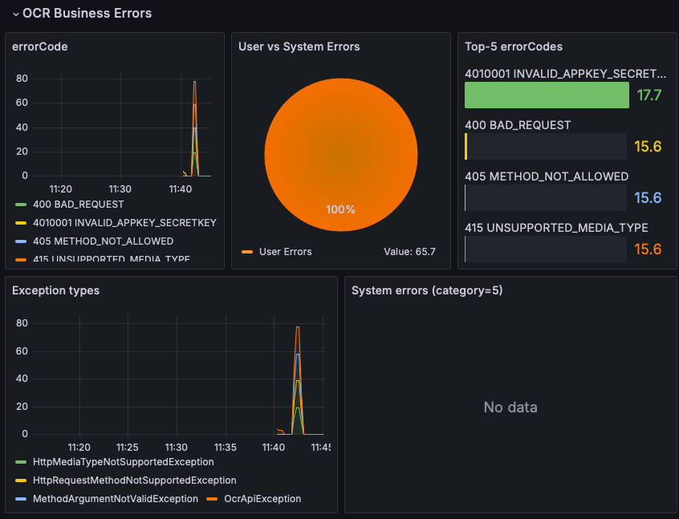

# HTTP 200 응답 안의 OCR 오류를 운영 지표로 만들기

**진행 기간**: 2026.04–현재

OCR API는 처리 결과를 공통 응답 본문에 담고 HTTP 상태 코드는 대부분 200으로 반환했다.
Spring Boot의 기본 HTTP 메트릭만 보면 성공과 실패가 모두 `status="200"`으로 집계돼, 어떤 오류가 늘었는지 알 수 없었다.

2026년 4월에 응답 본문의 오류 코드를 Micrometer Counter로 기록하고 Grafana 대시보드를 만들었다.
그 뒤에는 지표로 오류 증가를 찾고, 로그를 `errorCode`, 요청 경로와 원인별로 묶어 매주 개선 대상을 고르는 흐름으로 확장했다.

## HTTP 메트릭이 보여주지 못한 실패

응답 형태는 다음과 같았다.

```json
HTTP/1.1 200 OK
Content-Type: application/json

{
  "header": {
    "isSuccessful": false,
    "resultCode": 4001001,
    "resultMessage": "요청을 처리하지 못했습니다."
  }
}
```

이 구조에서는 `http_server_requests_seconds_count{status="200"}`만으로 비즈니스 성공 여부를 가를 수 없다.
HTTP 요청은 정상적으로 처리됐지만 OCR API의 결과는 실패일 수 있기 때문이다.

응답 규약을 바로 바꾸면 기존 클라이언트와의 호환성 문제가 생겼다.
그래서 공통 예외 처리기가 오류 코드를 확정하는 시점에 별도 Counter를 증가시키는 방법을 선택했다.

## 오류를 세는 위치와 라벨

오류 Counter는 모든 예외가 모이는 `@RestControllerAdvice`에서 기록했다.
각 예외 처리 메서드에 메트릭 코드를 반복하지 않고, 최종 `ResultCode`와 예외를 받는 공통 메서드로 모았다.

라벨은 다음 네 개로 제한했다.

| 라벨 | 쓰임 |
| --- | --- |
| `code` | 클라이언트가 받는 오류 코드 |
| `name` | 대시보드에서 숫자 코드의 의미를 바로 읽기 위한 이름 |
| `category` | 사용자 입력 오류와 서버 오류처럼 큰 범주를 나누는 값 |
| `exception` | 같은 오류 코드가 어느 예외 경로에서 만들어졌는지 확인하는 값 |

`requestId`, 사용자 식별자와 원본 URI는 라벨에 넣지 않았다.
값의 종류가 요청마다 늘어나면 시계열 수와 저장 비용이 함께 증가하기 때문이다.
개별 요청을 찾는 값은 로그에 두고, 메트릭에는 값의 상한을 계산할 수 있는 라벨만 남겼다.

처음에는 `code`만 기록했다.
대시보드를 실제로 사용해 보니 숫자만으로는 오류 의미를 알 수 없어 코드 표를 따로 열어야 했다.
`code`와 일대일로 대응하는 `name`을 추가한 뒤 범례를 `{{code}} {{name}}`으로 바꿨다.

`code`와 `name`의 조합 수는 `code`만 있을 때와 같으므로 새 시계열을 늘리지 않는다.
운영자가 코드를 해석하는 시간만 줄일 수 있었다.

## 대시보드 쿼리를 세 번 바꾼 이유

Counter를 만들고 끝난 일이 아니었다.
Grafana에서 방금 발생한 오류와 지금도 계속되는 오류를 구분하는 쿼리를 정해야 했다.

| 시도 | 쿼리 형태 | 확인한 문제 |
| --- | --- | --- |
| 고정 구간 변화율 | `rate(...[5m])` | 새 시계열은 구간 안에 표본이 충분히 쌓이기 전까지 보이지 않았다. |
| 누적값 | `sum(counter)` | 바로 확인할 수 있지만 오류 발생이 멈춰도 값이 남아 현재 상태로 오해하기 쉬웠다. |
| 구간 증가량 | `increase(...[$__rate_interval])` | 시간 범위와 scrape 간격에 맞춘 추세를 볼 수 있었다. |

최종 대시보드는 목적에 따라 쿼리를 나눴다.
아래 쿼리는 구조만 보이도록 메트릭 이름과 환경 라벨을 일반화했다.

```promql
# 시간에 따른 오류 발생량
sum by (code, name) (
  increase(api_business_error_total[$__rate_interval])
)

# 최근 1시간 오류 분포
topk(5,
  sum by (code, name) (
    increase(api_business_error_total[1h])
  )
)
```

`$__rate_interval`은 Grafana가 패널 해상도와 Prometheus scrape 간격을 이용해 계산하는 범위다.
Grafana 데이터 소스의 scrape 간격이 실제 Prometheus 설정과 다르면 범위가 너무 짧아져 빈 구간이 생길 수 있다.

`rate()`와 `increase()`는 범위 안의 여러 표본으로 증가량을 계산한다.
오류가 처음 한 번 발생한 직후에는 결과가 바로 나오지 않을 수 있다.
구현을 즉시 확인할 때는 Counter 원본과 단위 테스트를 보고, 운영 추세는 두 번째 scrape 이후의 구간 쿼리로 확인했다.



대시보드에는 다음 패널을 배치했다.

- 오류 코드별 시계열
- 사용자 오류와 서버 오류의 분포
- 최근 구간의 상위 오류 코드
- 예외 종류별 시계열
- 서버 오류만 분리한 시계열

## 검증 방법

Counter 동작은 Micrometer의 `SimpleMeterRegistry`를 주입한 단위 테스트로 확인했다.
예외 처리기를 호출한 뒤 예상한 `code`, `name`, `category`와 `exception` 라벨의 Counter가 한 번 증가하는지 검증했다.

대시보드는 다음 순서로 확인했다.

1. 검증 환경에서 의도한 오류 코드를 발생시킨다.
2. Prometheus 원본 Counter가 증가했는지 확인한다.
3. 두 번 이상의 scrape가 끝난 뒤 구간 쿼리 결과를 확인한다.
4. 오류 발생을 멈추고 구간이 지난 뒤 시계열이 0으로 돌아오는지 확인한다.
5. Pod를 재시작해도 Counter reset을 `rate()`와 `increase()`가 보정하는지 확인한다.

이 순서로 애플리케이션 계측, Prometheus 수집과 Grafana 표현을 나눠 확인했다.
패널에 값이 없을 때 어느 구간이 문제인지 바로 구분할 수 있었다.

## 지표에서 주간 오류 분류로

대시보드는 오류가 늘었다는 사실을 보여주지만 원인을 결정하지는 못한다.
개별 요청의 원인과 재시도 결과는 로그에서 확인해야 했다.

그래서 OCR 운영은 다음 두 층으로 나눴다.

| 층 | 답하는 질문 | 데이터 |
| --- | --- | --- |
| 지표 | 어떤 오류가 언제 얼마나 늘었는가 | 오류 코드 Counter와 Grafana |
| 로그 분류 | 같은 오류가 왜 발생했고 누가 고쳐야 하는가 | `errorCode`, 요청 경로와 근본 원인 |

주간 오류 분류에서는 로그를 전수 조회해 같은 원인끼리 묶고, 기존 판정 기준에 없는 그룹을 다음 개선 대상으로 남긴다.
판정 기준은 자동화 코드 안에 복사하지 않고 팀이 함께 관리하는 문서에서 읽도록 바꿨다.

재시도로 회복된 요청도 첫 실패에서 ERROR 로그를 남긴다는 문제도 확인했다.
ERROR 로그 수를 최종 실패 수로 사용하면 실제 사용자 영향보다 크게 집계된다.
이후에는 최종 응답과 재시도 결과를 함께 보고, 회복된 실패가 운영 오류 집계에 섞이지 않도록 로그 의미와 분류 규칙을 조정했다.

주간 분류 자동화와 그 과정에서 확인한 수집 오류는 [운영 관측과 에러 분류 루프](./observability-to-error-triage-loop.md)에 따로 정리했다.

## 내 기여와 협업

공통 예외 처리기의 오류 Counter와 라벨을 설계하고 단위 테스트를 추가했다.
Prometheus 쿼리를 목적별로 나누고 Grafana 패널 다섯 개를 구성했다.

대시보드를 만든 뒤에는 기존의 주간 오류 업무에 원인별 분류 결과를 남기는 자동화를 연결했다.
오류 코드 판정 기준은 팀 문서를 사용했고, 분류 결과는 기존 업무 댓글 형식에 맞춰 다른 구성원이 같은 기준으로 읽을 수 있게 했다.

## 회고

HTTP 상태 코드는 전송 결과이고 응답 본문의 성공 여부는 서비스 규약이다.
둘을 하나의 성공 지표로 취급하면 모든 응답을 200으로 반환하는 API에서 사용자 실패를 놓친다.

메트릭과 로그의 역할도 달랐다.
메트릭은 증가한 오류를 빠르게 찾는 데 적합했고, 로그는 원인과 최종 결과를 분류하는 데 필요했다.
처음에는 Counter 하나로 운영 오류를 설명하려 했지만, 현재는 지표로 범위를 좁히고 로그로 원인을 정하는 흐름을 사용한다.

대시보드 쿼리는 보기 좋은 그래프보다 질문을 먼저 정해야 했다.
누적값은 구현 확인에는 유용하지만 현재 발생량을 보여주지 못한다.
구간 증가량은 운영 추세에 맞지만 첫 표본 직후에는 보이지 않는다.
두 사용처를 한 패널로 해결하려던 것이 초기 시행착오의 원인이었다.

## 배운 개념 링크

- [Observability 입문](../../architecture/observability-basics.md)
- [Kubernetes의 Spring Boot 메트릭 수집](../../devops/observability/prometheus-k8s-remote-write.md)
- [운영 관측과 에러 분류 루프](./observability-to-error-triage-loop.md)
- [Prometheus `rate()`와 `increase()`](https://prometheus.io/docs/prometheus/latest/querying/functions/)
- [Grafana `$__rate_interval`](https://grafana.com/docs/grafana/latest/datasources/prometheus/template-variables/#use-__rate_interval)
