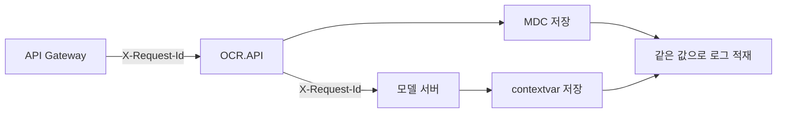

# OCR 오토스케일 전환의 connection 에러를 양쪽에서 막기

**진행 기간**: 2026.04–현재

---

## 첫 대응은 종료 중 503부터 시작했다

2026년 4월에는 배포와 scale-in 때 503이 30초에서 60초 동안 묶여 발생했다.
Envoy가 다음 오류를 반환했고, 배포 시각과 오류가 발생한 시각이 일치했다.

```text
upstream connect error or disconnect/reset before headers.
reset reason: connection failure,
transport failure reason: delayed connect error: 111
```

요청 경로는 `클라이언트 → Envoy(:5000) → gRPC(:50051)`였다.
오류 111은 Envoy가 살아 있지만 gRPC 포트에는 연결하지 못했다는 뜻이었다.

종료 전 preStop은 Envoy의 `drain_listeners`를 호출한 뒤 기다렸지만, gRPC 서버에는 SIGTERM 처리기가 없었다.
supervisord의 대기 시간도 기본값 10초였다.
SIGTERM을 받은 gRPC가 먼저 종료되면 Envoy는 남아 있는 동안 닫힌 50051 포트로 요청을 보내 503을 반환했다.

1차 대응에서는 gRPC가 처리 중인 요청을 기다리도록 graceful shutdown을 추가하고 12초를 배정했다.
배포 직후 503은 줄었지만, 밀집 문서의 처리 시간이 약 19초여서 12초만으로는 진행 중인 요청을 끝까지 보호하지 못했다.
이 한계와 scale-out의 별도 원인을 확인한 뒤 기동과 종료를 함께 다시 점검했다.

## 남은 연결 오류를 두 갈래로 나눴다

1차 대응 뒤에도 주간 오류 기록에는 연결 실패가 남았다.

이번엔 증상이 두 갈래였고, **원인도 방향도 서로 달랐다.**

| 전환 | 에러 | 무슨 일인가 |
| --- | --- | --- |
| scale-**out** | 503 (errno 111) | 새 pod 의 envoy(5000)가 gRPC(50051) 모델 로딩이 끝나기 전에 트래픽을 받음 |
| scale-**in** | `PrematureClose` | 종료되는 pod 가 진행 중이던 추론을 끊음 |

scale-out 은 **아직 준비 안 된 곳으로 보낸 것**이고, scale-in 은 **하던 일을 끊은 것**이다.
한쪽만 고쳐서는 리포트가 안 줄어드는 이유였다.

그리고 문제는 모델 서버에만 있지 않았다. 호출자인 OCR.API 쪽에도 있었다.

---

## 모델 서버의 기동과 종료에 순서를 만들었다

### grace 12초는 서비스타임보다 짧았다

1차 대응에서 gRPC `server.stop(grace=12)` 를 넣었는데, 밀집 문서의 서비스타임이 약 19초다.
**진행 중이던 추론을 유예 시간이 먼저 끊고 있었다.**

- gRPC `grace` 12초 → **24초**
- supervisord `stopwaitsecs` 17초 또는 기본 10초 → **27초**

처음에는 유예를 30초 이상으로 늘리려 했다.
하지만 운영 플랫폼의 종료 유예는 **30초 고정**이고 preStop 시간도 그 안에서 함께 차감된다.
코드 값 하나를 늘리는 문제가 아니라 30초 안에서 각 단계의 예산을 다시 나누는 문제였다.

### SIGTERM 이 python 에 닿지 않고 있었다

`stopwaitsecs` 를 늘려도 핸들러가 안 돌면 소용이 없다.
supervisord 가 실행하는 명령이 `bash -c "... && python ..."` 이라, 중간 bash 프로세스가 남으면 SIGTERM 이 거기서 멈추고 `handle_sigterm` 이 실행되지 않는다.

```ini
# 중간 프로세스 없이 python 이 PID 를 그대로 받도록
command=... exec python server_grpc_general_OCR.py
```

`exec` 한 단어가 없으면 앞의 grace 설정이 전부 무의미해진다.

다만 bash 는 실행할 마지막 명령이면 `exec` 없이도 자기를 대체하는 최적화를 한다.
그 조건이 이 컨테이너에서 실제로 어떻게 걸려 있었는지는 따로 재보지 않았다.
확실한 것은 `exec` 을 명시하면 그 조건에 기대지 않아도 된다는 것이다.
개념과 판정 방법은 [종료 신호는 어디서 멈추는가](../../devops/termination-signal-process-layers.md) 에 따로 정리했다.

### General 모델은 envoy wrapper 로 기동 보류와 종료 진단을 맡겼다

supervisord의 priority는 시작 순서와 종료 순서를 함께 정하지만, 앞 프로그램이 준비될 때까지 다음 프로그램의 기동을 기다리지는 않는다.
그래서 General 모델에서는 envoy를 wrapper 스크립트가 소유하게 했다.

- **기동 보류**: gRPC ready 신호(`/tmp/start_success`) 전까지 5000 bind 를 미룬다
- **종료 진단**: SIGTERM 을 trap 해 `drain_listeners`를 호출하고, envoy admin의 `quitquitquit`으로 정상 종료 흔적을 남긴다

기동 보류가 scale-out의 503을 막는다.
scale-in의 `PrematureClose`는 supervisord의 priority를 뒤집어 gRPC를 먼저 내리고 envoy를 마지막에 내리는 순서로 막는다.

처음에는 supervisord가 앞 프로그램의 종료를 끝까지 기다리는지 확신하지 못했다.
그래서 supervisor 4.3.0 소스를 확인했고, 큰 priority 그룹을 완전히 멈춘 뒤 다음 그룹으로 넘어가는 것을 확인했다.
wrapper의 종료 대기는 gRPC가 신호 파일을 지우지 못한 실패 경로를 받는 보조 안전장치로 남겼다.

이 wrapper 는 우선 General 모델에 적용했다.
다른 세 모델은 supervisord 가 큰 priority 그룹부터 순서대로 종료한다는 소스 동작을 확인한 뒤, gRPC 를 먼저 내리고 envoy 를 마지막에 내리는 방식으로 정리했다.
네 저장소가 같은 30초 예산을 쓰되, 기존 컨테이너 구조의 차이까지 억지로 하나로 맞추지는 않았다.

gRPC health service 와 envoy active health check 도 검토했다.
gRPC 는 죽으면 in-place 재시작 없이 pod 가 교체되므로 파일 신호로 충분했고, proto 와 envoy 설정을 늘릴 만한 이득이 없었다.

### 기동 보류를 풀었는데 여전히 붙지 않던 구간

wrapper 를 넣고도 scale-out 직후 짧은 실패가 남았다.
envoy 바이너리를 **런타임에 받고 있었다.** 기동 보류가 풀린 뒤 다운로드가 끝나야 5000 을 bind 하니, 그 사이가 그대로 구멍이었다.

빌드 시점에 미리 받아두는 것으로 해결했다.

### 30초 예산은 이렇게 나눴다

종료가 시작된 시각을 `t=0`으로 두면 확정한 예산은 다음과 같다.

| 구간 | 최대 소요 | 끝나는 시각 |
| --- | ---: | ---: |
| 같은 컨테이너의 envoy admin 호출 | 2초 | `t=2` |
| listener 전환 대기 | 1초 | `t=3` |
| gRPC 처리 중 요청 대기 | 24초 | `t=27` |
| envoy 종료 | 약 1초 | `t=28` |
| 남는 여유 | 2초 | `t=30` |

남는 2초에는 Python 인터프리터 종료와 CUDA 문맥 정리가 들어가야 한다.
아직 이 구간을 운영 환경에서 따로 재지 않았으므로 0초로 간주하지 않았다.
24초를 넘는 추론은 여전히 절단될 수 있다는 한계도 남는다.

---

## 호출자는 커넥션을 버리고 다시 보내는 기준이 필요했다

모델 서버가 아무리 곱게 내려가도, 호출자가 사라진 pod 를 계속 가리키면 실패는 계속된다.

### `maxIdleTime` 만으로는 회수되지 않는다

커넥션 풀에 `maxIdleTime(3초)` 은 있었다. 그런데 **바쁘게 재사용되는 커넥션은 idle 상태가 되질 않는다.**
scale-in 으로 종료된 pod 를 가리키는 커넥션이 stale 인 채 계속 돌면서 `PrematureClose` 를 만들었다.

생성 후 60초 상한(`maxLifeTime`)을 둬서, 종료된 pod 의 커넥션이 강제로 재수립되게 했다.

### connect timeout 이 없어 netty 기본값 30초가 걸려 있었다

도달 불가한 다운스트림이 하나 생기면 요청 하나가 **30초 동안 커넥션을 점유**한다.
모든 다운스트림이 단일 커넥션 풀을 공유하므로, 무관한 API 까지 같이 느려진다.

2초로 정한 근거는 셋이다.

- 실측 connect 시간이 다운스트림 전부 **6~118ms** 라 여유가 충분하다
- Linux SYN 재전송이 `t=0, 1s, 3s` 시점이라 **2초와 3초의 재전송 내성이 2회로 같다.** 3초는 자원만 더 붙잡고 얻는 게 없다
- `connect 2s + responseTimeout 58s = 60s` 로 `spring.mvc.async.request-timeout(60s)` 예산과 맞는다

적용 후 도달 불가 주소 호출이 30초가 아니라 **2.1초**에 실패한다.

### 503 은 재시도해도 안전하지만 `ReadTimeout` 은 아니다

재시도 판단에서 갈리는 지점이 여기다.

| 실패 | 요청이 모델에 닿았나 | 재시도 |
| --- | --- | --- |
| envoy 503 upstream connect error | **닿지 못함** | 안전 |
| `PrematureClose` | 연결이 끊김 | 안전 |
| `ReadTimeout` | **닿은 뒤 실패** | 위험: 중복 처리 |

기존엔 `PrematureClose` 만 재시도하고 있어서, scale-out 전환 중의 503 이 그대로 사용자에게 나갔다.
503 을 재시도 대상에 넣고, 대기도 `fixedDelay(3, 100ms)` 에서 `backoff(3, 200ms, maxBackoff 2초)` 로 늘렸다.
pod 재기동은 초 단위라 100ms 고정으로는 전환 창을 못 덮는다.

여기서 **잠재 결함이 하나 같이 드러났다.** `fixedDelay` 는 재시도가 소진되면 원본 예외를 `RetryExhaustedException` 으로 감싼다. 그 바람에 `INTERNAL_API_FAIL(5000001)` 로 가야 할 에러가 일반 `FAIL` 로 잘못 매핑되고 있었다. `onRetryExhaustedThrow` 로 원본 예외를 그대로 전파하게 하면서 함께 해소됐다.

---

## 그런데 어느 요청이 실패한 건지 찾을 수가 없었다

여기까지가 연결 실패 자체에 대한 대응이다. 별개로 오래 걸린 문제가 하나 더 있었다.

에러를 분석할 때 **API Gateway 로그, OCR.API 로그, 모델 서버 로그를 묶을 공통 키가 없었다.**
`requestId` 는 있었지만 OCR.API 가 자체 생성한 UUID라, API Gateway 요청이나 모델 로그와 이어지지 않았다.
한 요청이 어디서 끊겼는지 추적하다 매번 멈췄다.

### API Gateway가 이미 주고 있던 값을 쓰기로 했다

API Gateway 가 발급하는 `X-Request-Id` 를 요청 전 구간의 추적 키로 채택했다.



- OCR.API: 인터셉터가 헤더를 MDC `requestId` 로 저장(sanitize, 없으면 UUID fallback)하고 로그 패턴·모델 호출 헤더로 전파
- 모델 서버: gRPC 진입점에서 `contextvar` 에 저장하고 `logging.Filter` 가 모든 로그 레코드에 자동 주입

모델 서버 쪽에서 **로그마다 `extra={'requestId': ...}` 를 명시 전달하던 방식을 제거한 것**이 컸다.
새 로그를 추가할 때 전달을 잊으면 그 줄만 추적에서 빠지는데, 진입점에서 한 번 저장하고 자동 주입하면 그 누락이 원천 차단된다.

### OpenTelemetry 를 쓰지 않은 이유

표준을 따르자면 W3C Trace Context(`traceparent`)가 맞다. 검토했지만 채택하지 않았다.

- API Gateway가 `traceparent` 를 보내지 않아 별도 propagator 를 붙여야 한다
- trace 백엔드가 없다. 목적이 **로그 상관관계**이지 시각적 span 추적이 아니다

목적에 비해 도입 비용이 컸다. 나중에 span 단위 추적이 필요해지면 그때 다시 볼 문제로 남겼다.

### MDC 가 ThreadLocal 이라 겪은 것들

`requestId` 를 MDC 에 얹고 나서 세 번 밟았다. 셋 다 원인이 같다. **MDC 는 스레드에 묶여 있다.**

- **서블릿 async 재디스패치**: 비동기 처리 후 다시 디스패치될 때 MDC 가 비어 있어 `requestId` 를 재사용하도록 고쳤다
- **감사 로그 뒤 복원 누락**: 중간에 MDC 를 바꿔 쓰고 되돌리지 않아 이후 로그에서 `requestId` 가 사라졌다
- **헬퍼에서 `MDC.clear()`**: 중간 헬퍼가 전체를 지워 뒤따르는 로그가 통째로 추적에서 빠졌다

세 번째가 가장 찾기 어려웠다. 로그가 **비는 게 아니라 그냥 값이 없는 채로 정상 출력**되기 때문이다.
회귀 테스트로 채택·전파·sanitize·누수 방지를 묶어 고정했다.

> MDC 자체에 대한 정리는 [로그에 traceId 남기기](../../java/MDC.md) 참고

---

## 노드 교체에서는 PodDisruptionBudget 이 다른 축을 막았다

2026년 8월 클러스터 버전을 올리면서 GPU 노드 그룹의 파드가 함께 내려갔고, 문서 분석 요청이 실제로 중단됐다.
모델 이미지가 약 15GB라 새 노드에서 내려받는 데만 6분 8초가 걸렸지만, 핵심 원인은 긴 기동 시간이 아니었다.
같은 서비스의 파드를 동시에 내려도 된다고 쿠버네티스에 알려 둔 상태가 문제였다.

모든 OCR 애플리케이션에 `maxUnavailable: 1`인 PodDisruptionBudget을 넣었다.
파드가 하나뿐인 검증 환경에서는 노드 교체를 막지 않고, HPA로 파드가 늘어나는 운영 환경에서는 한 번에 하나만 내려가게 하려는 선택이었다.
`minAvailable: 1`은 파드가 하나인 환경에서 노드 교체를 끝없이 막을 수 있어 쓰지 않았다.

이후 세 환경의 클러스터를 한 단계씩 올렸다.
운영 환경에서는 컨트롤 플레인과 세 노드 그룹을 순서대로 교체하는 동안 각 서비스가 최소 한 개의 파드를 유지했고, 문서 분석 중단 없이 지원 종료 기한 안에 업그레이드를 끝냈다.

PDB 계산식과 단일 파드에서의 교착 조건은 [파드가 1개면 minAvailable 이 노드 교체를 막는다](../../devops/k8s/pod-disruption-budget.md)에 따로 정리했다.

## 현재 상태

- 호출자 쪽 재시도, 커넥션 수명 상한, 오류 코드 매핑은 2026년 8월 11일 운영에 반영했다.
- PodDisruptionBudget과 세 환경의 클러스터 업그레이드는 2026년 8월 31일 완료했다.
- 네 모델 저장소의 30초 종료 예산 재배분은 구현 브랜치까지 만들었다. 2026년 9월 1일 기준으로 검증 환경 배포와 실제 종료 시간 확인이 남아 있다.

---

## 배운 것

**증상이 같아도 원인이 같지 않다.** 배포·스케일인의 503 을 한 번 잡았다고 연결 실패가 끝나지 않았다. scale-out 은 "준비 전에 받았다", scale-in 은 "하던 걸 끊었다" 로 방향이 반대였다.

**서버만 고치면 절반이다.** 모델 서버가 곱게 내려가도 호출자 풀에 남은 커넥션이 사라진 pod 를 가리키면 실패는 계속된다. 종료 쪽과 호출 쪽을 같이 봐야 리포트가 줄었다.

**타임아웃 값은 감이 아니라 예산으로 정한다.** connect 2초는 실측 분포(6~118ms), 커널 재전송 시점(0·1·3초), 상위 타임아웃 예산(60초)을 맞춰 나온 값이다. 모델 종료도 같은 방식으로 고정된 30초를 preStop, gRPC, envoy, 런타임 정리에 나눴다.

**재시도의 안전 여부는 "요청이 상대에 닿았는가" 로 갈린다.** 503 은 닿지 못한 실패라 재시도해도 되고, `ReadTimeout` 은 닿은 뒤 실패라 재시도하면 중복 처리가 된다. 같은 실패로 보여도 이 질문 하나로 나뉜다.

**추적 키는 이미 있는 것을 쓰는 게 낫다.** API Gateway가 발급하던 값을 그대로 채택하니 별도 표준을 도입하지 않고도 요청 진입점부터 모델까지 로그를 연결할 수 있었다.

**파드가 어떻게 내려가는가와 몇 개까지 내려가도 되는가는 다른 문제다.** graceful shutdown은 한 파드의 요청을 지키고, PodDisruptionBudget은 여러 파드가 함께 내려가는 것을 막는다. 둘 중 하나만으로는 노드 교체를 무중단으로 만들 수 없었다.

---

## 사용 기술

- Java 21, Spring Boot 3.x, WebClient (Reactor Netty)
- Python, gRPC, Envoy, supervisord
- NHN Cloud Container Service (NCS)
