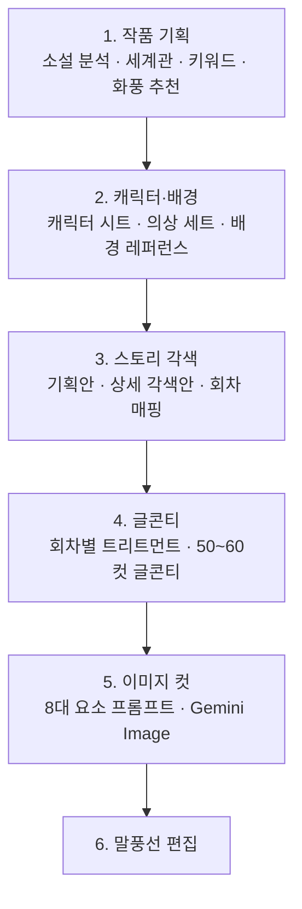

# AI 웹툰 제작 도구 MVP: 6단계 생성 파이프라인

**진행 기간**: 2026.04.06 ~ 2026.04.30

웹소설 원작을 입력하면 운영자가 세계관과 캐릭터를 검토하고 웹툰 컷 이미지까지 생성할 수 있는 내부 MVP를 만들었다.

계획, 구현, 검토 단계를 파일로 남기는 하네스를 사용했다. 하네스 설계는 [하네스 엔지니어링](../../AI/harness-engineering-practice.md)에 따로 정리했다.

---

## 구현 범위

웹소설 .txt 파일을 넣으면 60컷짜리 웹툰 이미지가 나오는 웹 도구다. 파이프라인은 6단계.



운영자가 단계별로 결과를 확인하고, 인라인으로 수정하고, 재생성한다. 앞 단계를 수정하면 이후 단계의 확정이 연쇄적으로 해제된다. 브라우저를 닫아도 작업 상태는 보존된다.

AI 엔진은 Gemini 계열로 통일했다. 하나의 SDK(`@google/genai`)로 텍스트/이미지/Structured Output을 모두 처리할 수 있다는 게 의사결정에 크게 작용했다. MVP에서 멀티 벤더를 동시에 붙일 이유가 없었다.

---

## 기술 스택

전체 흐름을 하나의 코드베이스에서 구현하고 타입 오류를 줄이기 위해 Next.js 16, React 19, Prisma 7, Zod 4, Tailwind v4, `@google/genai`를 사용했다.

운영 범위가 제한된 내부 MVP라 새 기능의 이점이 마이그레이션 위험보다 크다고 판단했다. Server Actions, Zod 4의 `z.toJSONSchema()`, Tailwind v4의 `@theme inline`과 `@source inline`을 활용해 별도 변환 코드를 줄였다.

---

## Gemini 모델 선택: 재생성까지 포함한 비용 비교

처음엔 flash를 기본으로 썼다. pro의 1/4 비용이고 빨랐다. 며칠 써 보니 방향을 바꿨다.

**운영자가 결과물을 보고 "다시 해야겠다"라고 느끼면 총 비용이 오히려 증가한다.**

저가 모델에서 품질 문제로 재생성이 반복되면 총호출 비용이 늘었다. 운영자 검토 결과 pro 모델의 재생성 빈도가 더 낮아 **pro를 기본으로 사용하고 429 응답이 오면 flash, lite 순서로 전환**했다.

이 전략을 쓰면서 두 가지를 추가로 했다.

- **전역 Rate Limit Tracking.** 어떤 모델이 429를 받으면 그 모델을 일정 시간 "skip 대상"으로 표시하는 메모리 Map을 뒀다. 다른 요청들이 같은 모델을 반복 호출하지 않도록 했다.
- **30초 재시도 로직 제거.** TPM은 1분 단위로 풀리는데 30초 대기는 너무 짧아 또 실패한다. 429가 나면 즉시 다음 fallback으로 넘기는 게 빠르고 안정적이었다.

모델 비용은 호출 단가만이 아니라 운영자가 다시 생성한 횟수까지 포함해 비교해야 했다. 재시도 상태는 요청마다 따로 관리하지 않고 프로세스 안에서 공유했다.

---

## 통합 분석: API 경계 ≠ 논리 경계

Step1 소설 분석은 원래 5개 영역(작품 프로필, 스토리 구조, 관계도, 세계관, 장소)을 별도 호출로 처리했다. 관심사가 분리되어 보였지만, 63만자 소설을 4회 호출하면 분당 약 160만 토큰: flash TPM 한도(200만)에 거의 닿는다. 캐시 미스나 재시도가 섞이면 바로 429다.

5개 영역을 하나의 Structured Output으로 합친 결과 토큰 사용량은 75% 줄었고 처리 시간은 26.8초에서 13.1초로 줄었다. 각 영역은 Zod 스키마의 필드로 구분해 논리적 경계를 유지했다. 이 사례에서는 API 호출 경계와 데이터의 논리적 경계를 분리한 것이 효과적이었다.

---

## 60컷 일괄 생성: SSE vs Promise.allSettled

처음엔 서버 SSE로 60개 순회 생성, 진행률 스트리밍이었다. 부분 실패가 문제였다. rate limit 환경에서 60개 중 20~30개가 실패하면, 실패한 컷만 골라 재시도하는 상태 기계가 너무 복잡해졌다.

클라이언트에서 `Promise.allSettled`로 컷별 요청을 관리하도록 구조를 바꿨다.

- 60개가 각각 독립된 요청이니 실패는 per-Promise로 추적된다
- `AbortController`로 전체 취소
- 실패한 컷은 같은 엔드포인트를 다시 호출하면 끝. 별도 재시도 경로 불필요

DB에는 `lastGenerationStatus`, `lastGenerationError`, `lastGeneratedAt`을 컷별로 저장해 UI에 "이 컷은 safety filter에 걸렸다" 같은 구체적 메시지를 띄울 수 있게 했다.

글콘티처럼 하나의 긴 생성은 SSE를 유지하고, 컷 이미지처럼 서로 독립된 생성은 `Promise.allSettled`로 분리했다. 생성 단위와 실패 처리 방식에 따라 통신 구조를 달리했다.

---

## 프롬프트 환각 차단: Grounding 재주입과 Project Cache

Step4 글콘티에서 가장 골치 아팠던 건 환각이었다. 트리트먼트에 없는 사건이 컷에 등장하거나, 등록된 캐릭터 외 이름이 새로 나오거나, 다음 회차에 들어갈 사건이 미리 들어오거나. 운영자가 일일이 지웠다.

처음엔 프롬프트에 `DO NOT invent` 같은 anti-pattern을 추가했다. 효과가 미미했다. 며칠 디버깅 끝에 진짜 원인을 찾았다.

**Continuation 호출이 tail 5컷만 보고 다음 컷을 만들고 있었다.**

50~60컷짜리 글콘티를 한 번의 LLM 호출로 만들기엔 너무 길어서, 1차 호출로 N컷을 받고 그 뒤를 continuation 호출로 이어 받는 구조였다. continuation에는 마지막 5컷만 컨텍스트로 넘겼다. 토큰 절약 목적이었다. 그 결과 LLM 입장에서는 "트리트먼트 grounding이 완전히 사라진 상태"에서 다음 컷을 만들고 있었다. 환각이 안 나오는 게 이상한 구조였다.

두 가지를 바로잡았다.

1. **Grounding 블록을 프롬프트 앞부분에 둔다.** "원작과 트리트먼트 범위에서만 가져올 것", "허용되는 창의는 카메라·구도·조명·페이싱 같은 연출뿐"이라는 제약을 명시했다.
2. **Continuation에도 Grounding/Treatment 블록을 매번 재주입한다.** 토큰을 더 쓰는 비용은 받아들였다. 환각으로 운영자가 컷을 일일이 수정하는 비용이 토큰값보다 훨씬 컸다.

반복 입력 비용은 **원작 소설을 Project 단위 Gemini Context Cache로 묶어 모든 단계에서 공유**하는 방식으로 줄였다. Analysis, Content-review, Treatment, Conti, Continuation 다섯 단계가 같은 `novelText`를 사용하므로, 캐시 유효 시간 안에는 원문 전체를 매번 다시 전송하지 않았다.

이 김에 conti 프롬프트 모듈을 3-layer로 쪼갰다 (`types/`, `templates/`, `blocks/`, `build-*.ts`). 1차/continuation 양쪽이 같은 `buildGroundingBlock()`을 호출하게 만들어, 두 호출의 grounding이 절대 어긋나지 않는다는 걸 코드 레벨에서 보장했다. 같은 구조를 character-sheet 프롬프트에도 적용했다.

환각을 줄이는 데는 금지 문구를 늘리는 것보다 각 호출에 필요한 근거 문맥을 빠뜨리지 않는 것이 중요했다. 허용할 연출 범위도 함께 적어 서사 제약과 창작 범위를 분리했다. 자동 판정은 허용 범위를 정확히 규칙화하기 어려워 오탐과 누락 위험이 있었으므로, MVP에서는 운영자 검토 항목으로 남겼다.

한 가지 미해결 과제: Pro가 429로 Flash/Lite로 fallback하면 grounding 준수력이 약해진다. 같은 프롬프트인데도 모델 capability 차이로 환각이 다시 등장한다. 서비스 연속성을 우선해 fallback은 유지했다.

---

## 캐릭터 외형 고정: 텍스트가 아니라 이미지 레퍼런스로

Step2 캐릭터 시트는 한 캐릭터의 여러 의상(외출복, 잠옷, 전투복...)을 시트로 관리한다. 옷만 갈아입혀도 얼굴/머리/체형이 드리프트하는 게 문제였다. 같은 캐릭터인데 시트마다 얼굴이 미묘하게 달라지면, 후속 컷 생성에서 매번 다른 사람으로 보였다.

처음엔 텍스트 anti-drift로 막아보려고 했다. `[FIXED ANCHOR: DO NOT change] 얼굴 생김새: 기본 시트와 동일` 같은 식. 효과 없었다. **Gemini Image는 이미지 모델인데 텍스트로 "이전에 만든 시트와 동일하게"를 강제하는 건 근본적으로 한계가 있다. 모델은 그 "이전 시트"를 본 적이 없다.**

텍스트 지시 대신 이미지 레퍼런스를 사용하는 방식으로 바꿨다.

- **스키마에서 "기본 시트" 개념을 만든다.** `CharacterSheet.isDefault`를 추가해 `(characterId, typeId)`마다 isDefault=true 시트가 정확히 1개 보장되게 했다. label="기본" 같은 관행은 다국어/이름 변경에 취약하고 자동화의 안정적 판별 기준이 못 된다.
- **비기본 시트 생성 시 기본 시트의 선택 이미지를 서버가 자동으로 레퍼런스 첫 번째에 prepend한다.** 운영자가 매번 기본 시트 이미지를 찾아 선택하지 않아도 된다.
- **mode 분기.** `default` 모드는 레퍼런스 미주입(외형 자유 변형), `outfit` 모드는 reference-bind 블록이 들어가 "첫 레퍼런스의 얼굴/머리/체형을 유지하고 의상만 변경"을 강제한다.
- **사전 체크.** 기본 시트 이미지가 없으면 서버가 400 `BASE_SHEET_REQUIRED`를 반환하고, 프론트는 모달로 기본 시트 카드로 스크롤 유도한다. 기본 시트 자동 생성은 안 한다: 외형 확인이 필요한 단계라 자동 생성하면 운영자를 혼란시킨다.

이미지 일관성은 텍스트만으로 지시하기보다 기준 이미지를 함께 제공할 때 더 안정적이었다.

---

## 타입 시스템: Zod 단일 소스, 레이어별 분리

### Zod 단일 소스

처음엔 Gemini Structured Output용 스키마와 Zod 검증 스키마를 따로 유지했다. 한쪽만 고치면 "API는 통과했는데 Zod parse에서 터지는" 버그가 났다.

Zod 4의 `z.toJSONSchema()`로 단일 소스로 합쳤다. Zod 스키마 → JSON Schema 자동 변환 → Gemini `responseJsonSchema`로 사용 → 응답은 다시 Zod parse로 런타임 검증. 같은 개념을 두 번 적지 않게 됐다.

Structured Output도 응답 파싱을 단순하게 만들었다. `responseMimeType: "application/json"`과 `responseJsonSchema`를 사용해 마크다운 코드 블록이나 잘못된 쉼표 때문에 JSON 파싱이 실패하는 경우를 줄였다.

### 레이어별 타입 소스

Zod 단일 소스를 일관되게 적용하려고 Repository까지 `Partial<XxxFields>`로 통일하려 했다. 며칠 써 보니 어색한 매핑이 자꾸 생겼다.

특히 두 지점에서 부딪혔다.
- **Json 컬럼의 명시적 NULL.** Prisma는 `null`(필드 업데이트 안 함)과 `Prisma.DbNull`(NULL로 비우기)을 구분한다. Zod 추론 타입의 `null | undefined`로는 표현이 안 돼서 Repository 안에서 매번 수동 변환을 했다.
- **관계 처리.** `connect`/`create`/`disconnect` 같은 Prisma 고유 semantic을 외부 도메인 타입으로 흉내 내는 건 추상화 누수였다.

레이어마다 목적에 맞는 타입 소스를 사용하도록 정리했다.

| 레이어 | 타입 소스 |
|---|---|
| Action 파라미터 | Zod `XxxFields`, TS 유틸(`Partial`/`Pick`): 외부 경계 도메인 검증, AI 응답/UI 폼과 타입 공유 |
| Repository 파라미터 | `Prisma.XxxCreateInput` / `Prisma.XxxUpdateInput`: DB 연산 semantic, 관계 처리 네이티브 |
| 경계 | `actions/mappers/xxx-mapper.ts`의 작은 변환 함수 |

Action에서는 Prisma가 안 보이고, Repository에서는 Zod가 안 보인다. 양 레이어가 깨끗해졌다.

Zod 스키마는 입력 경계의 구조도 강제했다. 예를 들어 `Character`에서 외형 필드를 빼고 `CharacterType`에만 두면 Action에서 잘못된 필드를 수정하려는 시도를 타입 검사로 막을 수 있다. 반면 ORM 연산은 Prisma 타입으로 표현하고, 두 타입 사이에는 작은 mapper를 뒀다.

---

## 한글 입력 문제: onBlur 저장과 IME

글콘티 화면은 운영자가 60컷을 인라인 편집하는 거대한 폼이다. 초기 버전은 `onChange`로 매 입력마다 서버 액션을 호출했는데, 한글 IME에서 조합 중인 글자가 깨졌다. "안녕"의 "ㅇ-ㅏ-ㄴ" 입력 도중 서버 응답이 돌아오면 Server Component 리렌더로 미완성 글자가 덮어써진다.

로컬 draft state와 `onBlur` 저장으로 바꿨다. 입력 중에는 로컬 state만 갱신하고, 포커스를 잃을 때 서버에 저장한다. 같은 문제가 반복되지 않도록 프로젝트 지침에 편집 컴포넌트 규칙으로 남겼다.

Dialog가 다시 열릴 때 초기값이 갱신되지 않는 문제는 `key={cut.id}`로 리마운트해 해결했다. React `useState`의 초기값은 첫 렌더에서만 설정되므로, 다른 컷을 열 때 컴포넌트 인스턴스도 바뀌어야 했다.

Server Action을 입력 이벤트에 직접 연결하면 IME 조합과 서버 응답 시점이 충돌할 수 있다. 입력 상태와 저장 시점을 분리해 이 경계를 명확히 했다.

---

## 아키텍처 레이어: Server Action은 AI를 모르고, AI는 DB를 모른다

다음과 같이 경계를 정했다.

| 레이어 | 담당 | 금지 |
|---|---|---|
| `actions/` | `"use server"`, 검증, repository 호출, `revalidatePath` | 직접 Prisma, AI 호출 |
| `lib/db/` | Prisma 쿼리, 트랜잭션 | 비즈니스 로직, `revalidatePath` |
| `lib/ai/client/` | Gemini SDK 래퍼, 모델 상수 | DB 접근 |
| `lib/ai/generators/` | AI 호출, 결과 파싱 | DB 접근, `revalidatePath` |
| `api/generate/` | SSE, AI 파이프라인 오케스트레이션 | 직접 DB 쓰기 |

이미지 생성처럼 AI+DB가 둘 다 필요한 흐름은 API Route가 오케스트레이션한다. 이 경계 덕에 AI 리팩터링이 DB를 건드릴 일이 없었고 반대도 마찬가지였다.

또 하나: **모델명 문자열 리터럴 금지.** `MODELS.llm.pro` 같은 상수만 허용. 오타가 컴파일 시간에 잡힌다.

---

## 디자인 시스템, Container/Presenter: 디자이너와 충돌 해소

UX 디자이너가 Claude Code로 시각 변경을 PR에 반영하는 과정에서 두 가지 문제가 드러났다.

- **같은 파일을 동시에 건드린다.** `StepConti.tsx` 같은 503줄 god component에 상태 / 데이터 / 레이아웃 / 이벤트가 다 섞여 있었다. 디자이너가 카드 spacing을 바꾸려면 이 파일, 내가 컷 재정렬 로직을 바꾸려면 이 파일. PR 두 개가 동시에 올라오면 매번 충돌.
- **인라인 magic spacing이 너무 많았다.** `flex flex-col gap-4`가 28곳에 흩어져 있어, "카드 사이 간격을 줄여달라"는 요구에 일일이 grep해서 바꿨다.

두 단계로 나눠 해결했다.

**1. Semantic CSS 토큰과 공통 컴포넌트.** Tailwind v4 `@theme inline`으로 `--color-card-surface` 같은 semantic 토큰을 정의하면 `bg-card-surface` 클래스가 생성된다. 카드 색은 `globals.css` 한 곳에서 바꿀 수 있다. "동일 구조가 세 곳 이상 반복될 때"를 추출 기준으로 삼아 `components/common/`에 공통 컴포넌트를 모았다.

**2. Container/Presenter와 Layout Primitives.** 상태와 화면이 섞인 큰 컴포넌트를 두 층으로 나눴다.

```
src/components/step4-conti/
├── containers/   # 상태 + 데이터 + 이벤트 wiring (로직)
├── components/   # JSX + 시각 (UI)
├── hooks/        # 상태 추출
└── adapters/     # 도메인별 차이 흡수
```

원칙은 두 줄.

> 디자인 변경은 globals.css, 시각 컴포넌트만 건드려서 가능해야 한다.
> 로직 변경은 상태·데이터 파일만 건드려서 가능해야 한다.

이 원칙을 `docs/collaboration.md`의 **파일 소유권 표**로 구체화했다. 디자이너는 `globals.css`, `components/common/layout/`, `components/**/components/`를 맡고, 백엔드는 `actions/`, `lib/`, `components/**/hooks/`, `components/**/containers/`를 맡았다. 수정 영역을 나눈 뒤 같은 파일에서 발생하는 충돌이 줄었다.

레이아웃 magic number는 layout primitive 5종(`Stack`, `Cluster`, `Grid`, `Sidebar`, `Frame`)으로 흡수했다. every-layout.dev 스타일이다. `<Stack gap="4">` 같은 식으로 의미를 부여하니 인라인 `flex flex-col gap-4`가 사라졌다.

Tailwind v4에서 한 가지 함정은 있었다. primitive가 `GAP_MAP[gap]` 같은 객체 조회로 클래스를 조립하다 보니, JIT 정적 분석이 일부 클래스를 못 잡아 빌드 후 누락이 났다. v4 공식 API인 `@source inline("gap-2 gap-4 ...")` 한 줄로 해결. 또 한 가지 룰: **동적 클래스는 객체 매핑만 허용, 템플릿 리터럴 금지.** `` `gap-${x}` ``는 JIT이 잡을 길이 없다.

추상적인 관심사 분리 원칙보다 디렉터리별 수정 책임을 적은 표가 실제 협업에서 더 직접적인 기준이 됐다.

---

## 하네스 개선: 즉석 구현에서 명세 기반 작업으로

개발을 진행하면서 하네스도 단계적으로 바뀌었다.

### 1단계: 한 세션에서 바로 구현

처음에는 한 세션에서 논의 → 즉석 구현 → 빌드 → 테스트를 모두 처리했다. 짧은 작업은 잘 됐지만 작업이 길어지면 컨텍스트 한도에 걸렸고, 잘못된 가정으로 시작한 구현을 되돌리거나 비슷한 결정을 반복하는 일이 생겼다.

가장 큰 문제는 **"무엇을 할지"를 충분히 잡지 못한 채 코드부터 쳤다는 것**이었다. 모호한 상태에서 시작하면 모델이 실행 중에 임의 결정을 한다. 그 결정이 틀리면 결과를 통째로 버린다.

### 2단계: `/planning`으로 명세 작성

설계 단계를 별도 워크플로우로 분리했다. 기능 구현 전에 8단계로 논의한다: 기술 가능성, 사용자 흐름, 데이터 모델, API 설계, 화면 동작, 엣지 케이스, 마이그레이션, 검증 방법. 모든 결정이 합의되어야 task 파일을 만든다.

설계 단계에서는 구현 전에 사용자 흐름, 데이터 모델, 경계 조건과 검증 방법을 정했다. 결정하지 못한 항목은 task 파일에 미결 상태로 명시해 실행 에이전트가 임의로 채우지 않도록 했다.

### 3단계: `/plan-and-build`로 단계 분할

planning 결과물은 `tasks/planNNN-*/index.json`, 여러 phase 파일로 떨어진다. phase 파일은 자기완결적이라 이전 대화 없이 독립 실행이 가능하다. `run-phases.py` 하네스가 `index.json`을 읽고 pending phase부터 순차 실행한다.

핵심 속성은 **재시작 가능성**이다. 세션이 끊겨도, executor가 중간에 실패해도, git에 task 파일이 있으니 어디서든 이어받을 수 있다. 1회성 휘발 세션이 아니라 task가 영속 상태가 됐다.

### 4단계: `/build-with-teams`로 계획과 문서 검토

`plan-and-build`에 두 검토 단계를 추가했다.

- **critic.** 계획을 실제 코드와 대조해 APPROVE/REVISE 판정을 내린다. "이 phase 파일이 현재 코드 상태에서 실행 가능한가? 가정이 맞는가?"를 체크. REVISE면 phase 파일을 고치고 다시 critic을 돌린다.
- **docs-verifier.** executor가 코드를 바꾼 뒤 ADR/data-schema 같은 문서가 정합성을 유지하는지 확인. 코드와 문서의 드리프트를 다음 세션이 시작되기 전에 잡는다.

계획 작성자와 검토자를 분리하자 실행 전에 잘못된 가정과 누락된 문서 변경을 찾을 수 있었다. planner, critic, executor, docs-verifier가 한 작업을 순서대로 처리했다.

### 5단계: `/integrate-ux`로 디자이너 목업 통합

디자이너가 Claude Code로 올린 컴포넌트 목업은 화면 요구를 충족했지만 데이터 흐름과 컴포넌트 구조는 프로젝트 규칙과 달랐다.

- 로컬 state로 데이터를 시뮬레이션 (Server Action 대신 useState, 하드코딩)
- 공통 컴포넌트를 모르고 인라인으로 새로 그린 카드/버튼
- 기존 디자인 시스템 토큰 대신 인라인 색상값
- Container/Presenter 분리 무시

반복되는 변환 절차를 스킬 파일로 정리했다.

`/integrate-ux`는 이런 일을 한다.
- 디자이너 PR을 rebase하고 동작 확인
- 로컬 state 목업을 실제 Server Action 호출로 치환
- 인라인 카드/버튼을 `components/common/`의 공통 컴포넌트로 교체
- 인라인 색상을 semantic 토큰으로 매핑
- god component를 Container/Presenter로 분리
- 변환 후 빌드, 시각 회귀 체크

스킬은 디자이너 목업을 실제 데이터 흐름과 공통 컴포넌트에 맞추는 반복 작업을 줄였다. 디자이너는 화면 동작을 제안하고, 나는 프로젝트 구조에 맞게 통합하는 책임을 맡았다.

### 정리

즉석 구현에서 시작해 명세 작성, 재시작 가능한 단계 실행, 독립 검토, 목업 통합 순서로 하네스를 보완했다. 작업 상태와 결정 근거를 파일에 남겨 세션이 끊겨도 이어갈 수 있었고, 반복되는 통합 절차는 스킬로 재사용했다.

상세한 구조와 진화 과정은 [하네스 엔지니어링 실전편](../../AI/harness-engineering-practice.md)에 정리해뒀다.

---

## 구현 전에 문서 갱신

코드를 고치기 전에 ADR과 data-schema를 먼저 업데이트한다. task가 실패해도 결정은 docs에 보존된다. AI 에이전트는 새 세션에서 `CLAUDE.md`, `docs/adr.md` 같은 문서를 컨텍스트로 읽는다. 이 문서가 현실을 반영해야 에이전트가 올바른 전제로 시작한다.

ADR이 한 파일에 계속 쌓이면서 1,581줄까지 늘어난 적이 있다. 필요한 결정을 찾기 어려워져 중복 설명과 종료된 내용을 정리했고 약 700줄로 줄였다. 에이전트가 이 문서를 입력으로 사용하므로 최신 결정과 현재 구조만 남기는 것이 중요했다.

---

## 배운 것

**하네스는 반복 작업과 재시작 비용을 줄였다.** 구현, 계획 검토, 문서 정합성 확인을 단계로 나누고 작업 상태를 파일에 남겼다. 나는 기능 범위와 트레이드오프를 결정하고 각 단계의 결과를 확인했다.

**명세에 미결 사항을 드러내야 했다.** 사용자 흐름, 데이터 경계와 검증 방법을 먼저 적고 결정하지 못한 항목은 실행 전에 다시 다뤘다.

**계획 작성과 검토를 분리했다.** 별도 critic 단계가 현재 코드와 맞지 않는 가정과 빠진 검증을 실행 전에 찾았다.

**기술 선택은 제품 수명과 운영 범위에 맞췄다.** 이 내부 MVP에서는 Tailwind v4의 `@source inline`과 Zod 4의 `z.toJSONSchema()`가 별도 변환 코드를 줄이는 데 도움이 됐다.

**환각 대응은 프롬프트, 입력, 출력 검증을 함께 다뤄야 했다.** continuation에 grounding을 다시 넣고, 입력 범위를 좁히고, sourceQuote를 검사했다. 이미지 일관성에는 텍스트 지시 대신 이미지 레퍼런스를 사용했다.

**타입 소스는 레이어의 책임에 맞췄다.** 외부 입력은 Zod, ORM 연산은 Prisma 타입을 사용하고 경계에서 mapper로 변환했다.

**디자이너와는 파일 수정 책임을 나눴다.** Container/Presenter 구조와 `collaboration.md`의 소유권 표로 같은 파일을 동시에 수정하는 일을 줄였다. 목업을 실제 데이터 흐름에 맞추는 반복 작업은 `/integrate-ux`로 정리했다.

**문서는 다음 작업의 입력으로 사용됐다.** 종료된 결정과 중복 설명을 제거하고 현재 코드와 맞는 ADR만 남겨야 새 세션도 올바른 전제에서 시작할 수 있었다.

---

## 참고

- [하네스 엔지니어링](../../AI/harness-engineering-practice.md): 에이전트 작업 파이프라인의 구조와 변화
- [하네스 설계 원칙](../../AI/harness-engineering.md): 하네스 개념과 설계 기준
