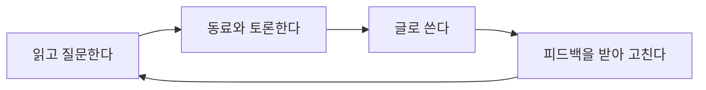

# 자기주도 학습: 질문에서 시작해 글로 검증하기

자기주도 학습은 외부 교육의 내용을 받아들이는 데서 그치지 않고, 자신의 질문과 필요에서 학습의 목표와 과정, 검증 방법을 직접 설계하는 능력이다.
생성형 AI가 초안과 요약을 즉시 만들어 주는 환경에서는 "무엇을 알고 무엇을 모르는지"를 스스로 구분하는 일이 더 중요해진다.

이 글은 서울대학교 채널의 영상 「공부를 잘하려면 가장 먼저 버려야 할 습관은? | 서울대 박주용 교수 | 샤로잡다 시즌2」(2026-07-09 게시)를 보고 정리한 것이다.
영상은 <https://www.youtube.com/watch?v=IXlRV2e2M2w> 에서 볼 수 있다.
영상 내용을 옮기지 않고 학습 방법으로 다시 정리했고, 한국어 자동자막을 바탕으로 해서 표현이 부정확할 수 있다.

## 핵심 원리

- 학습의 목표는 지식을 쌓는 데서 끝나지 않는다. 필요한 지식과 기술을 스스로 배워서 쓰는 능력이 목표다.
- 암기는 사고의 결과만 기억하는 제한된 활동이다. 이유와 맥락을 따지지 않고 결과만 외우면 빠르게 성과를 낼 수는 있어도 오래 활용하기 어렵다.
- 원리와 맥락을 설명하고 적용할 수 있어야 지식이 오래 남고 다른 문제로 전이된다.
- 이해했는지는 "들어봤다"가 아니라, 아는 부분과 모르는 부분을 나눠서 설명할 수 있는지로 점검한다.

## 학습 루프

영상이 제시하는 공부의 순환은 읽기, 토론, 글쓰기다.
이를 네 단계로 풀어 쓰면 다음과 같다.

| 단계 | 하는 일 | 드러나는 것 |
| --- | --- | --- |
| 읽고 질문한다 | 질문이 생기지 않으면 핵심 주장과 근거가 보일 때까지 다시 읽는다. | 이해하지 못한 지점 |
| 동료와 토론한다 | 다른 해석과 반론을 주고받는다. | 지식의 연결과 빈틈 |
| 글로 쓴다 | 주장과 근거를 문장으로 만든다. | 생각의 불명확함 |
| 피드백을 받아 고친다 | 타인의 글과 자신의 초안을 평가한 뒤 수정한다. | 좋고 나쁨을 구별하는 기준 |

영상은 이 중 평가 능력을 특히 강조한다.
무엇을 알고 모르는지, 무엇이 좋은 글이고 나쁜 글인지 구별하는 정확도가 성장과 전문성을 좌우한다는 주장이다.

## AI 시대의 적용

생성형 AI는 빠른 정보 접근과 초안 생성에 도움이 된다.
하지만 산출물을 대신 만들어 제출하는 방식은 학습자의 현재 이해 수준과 다음에 발전할 지점을 가린다.
영상도 AI가 단기 이해를 돕더라도 장기 학습의 깊이를 자동으로 보장하지는 않는다고 말한다.

그래서 AI를 사용했더라도 다음 과정을 남기는 편이 학습에 유리하다.

- 출처와 근거를 직접 비교한다.
- 자신의 주장을 자기 말로 설명한다.
- 피드백을 받은 뒤 초안을 수정한다.

결과물만 받아 오지 말고, 기존 이해에서 생각이 어떻게 발전했는지를 비교할 수 있게 남기라는 뜻이다.
