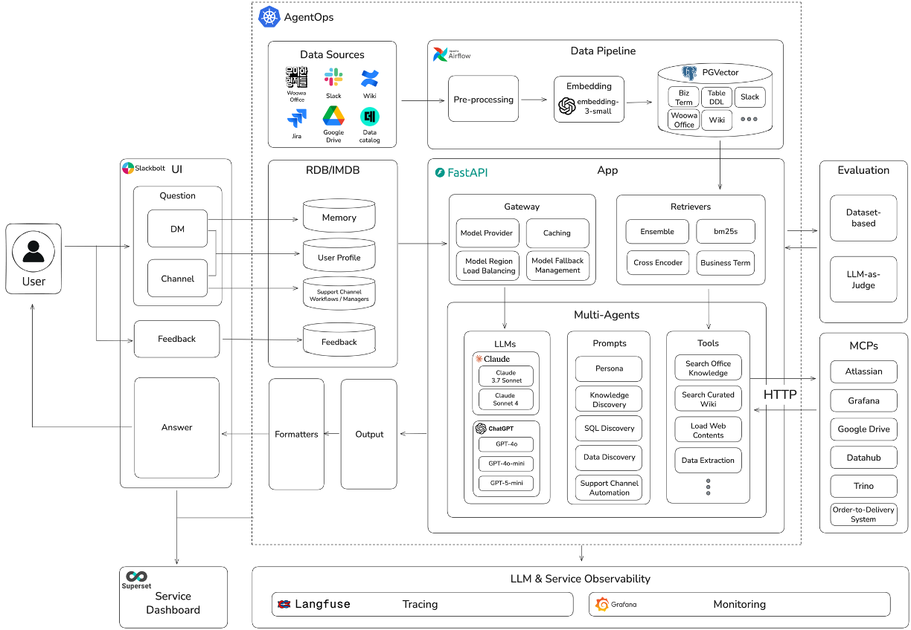

# AI 데이터 분석가 '물어보새', 그다음: 더 넓고 깊은 지식 공유하기

- [우아콘2025 - 유튜브 영상](https://www.youtube.com/watch?v=dLiJXVUF7bQ)
- [우아한기술블로그 - 1부. RAG와 Text-To-SQL 활용](https://techblog.woowahan.com/18144/)
- [우아한기술블로그 - 2부. Data Discovery](https://techblog.woowahan.com/18362/)
- [우아한기술블로그 - 3부. Agent로 더 넓고 깊은 지식 공유하기](https://techblog.woowahan.com/23273)

## 물어보새야, 넌 누구니?

- 우아한 형제들의 지식을 알려주는 서비스

- 로드맵은 다음과 같다
  - Data Discovery
  - Text to SQL
  - Knowledge Sharing
    - Knowledge Discovery
    - Support Channel Automation
  - Agentic Analytics

## 우리는 '왜' 구성원의 질문에서 시작했을까?

- 구성원의 질문과 기대

  - 고객 정보는 어떤 테이블을 봐야 해?
  - 비마트 상품별 주문 건수는?
  - 푸드 주문수 구해줄래?
  - MFO가 뭐야?
  - IT 보안 담당자는 누구야?
  - 휴가 신청 방법 알려줘 등등
  - 복잡한 질문들이 생겨나고 있었음

- 구성원 만족을 위한 5가지 핵심 요소
  - MFO가 뭐야?
    - 사내에서만 사용되는 용어를 배워야 했다
    - 확장 (Knowledge Expansion)
    - 다양한 지식 차원을 연결해 더 정확하고 넓은 지식을 바탕으로 답변을 제공해야함
  - 지금까지 내용 요약해 줘
    - **이전 대화 기억을** 통한 **연속성 있는 소통** 기대
    - 기억 (Memory)
      - 대화의 맥락과 사용자의 이전 경험을 이어준다
  - 한그릇 서비스 성과 분석해 줄래?
    - 복잡한 질문들이 다양한 형태로 유입
    - 사고 (Agentic Workflow)
      - 복잡한 문제를 단계별로 분석하고 적절한 도구를 선택해 해결
  - 문제 해결이 어려워요
    - 물어보새 사용 과정에서 답변에 대한 불만족 경험이 발생
    - 관찰 (Tracing)
      - 답변 과정을 투명하게 추적해 지속적인 서비스 개선을 실현
  - 장비 교체 프로세스가 궁금합니다
    - 다수의 구성원이 담당자 한 명에게 동일한 질문을 반복하는 상황 발생
    - 소통 (Channel)
      - 구성원의 질문과 답변이 이루어지는 모든 공간에서 함꼐합니다

## 우리는 '무엇으로' 구성원의 질문에 답했을까?

- 어디서, 누구에게 질문하고 있는가?

  - MFO 처럼 모르는 용어가 나왔을 때
    - 구성원 개인이 궁금한 내용
    - 프라이빗 공간에서 질문하기를 선호
    - 질문 대상 : 구성원 자신
    - 소통 채널 : Direct Message
    - 서비스 : Knowledge Discovery
    - 개인 맞춤 지식 탐색 지원 및 인사이트 발굴
  - 장비 교체 프로세스와 같은 질문은?
    - 담당자 호출이 필요한 내용
    - 공용 공간에서 질문하기를 선호
    - 질문 대상 : 팀 담당자
    - 소통 채널 : Channel Message
    - 서비스 : Support Channel Automation
    - 팀 내 반복 질문 자동화 및 협업 효율화

- Knowledge Discovery 활용 예시 : 사내 지식 검색

  - (예시) MFO가 뭐야?
    - 사내 용어에 대한 설명
    - 관련 핵심 정보까지 추가로 제공
    - Knowledge DB 내 참고한 문서 정보 제공
  - (예시) BAD팀 이번주 진행 상황 알려줘
    - 팀 내에서 진행 중인 다양한 정보에 대해 요약 답변
    - Wiki Page 및 Jira Ticket 정보
  - **사내에 흩어져 있는 다양한 문서를 참고해 답변**

- Support Channel Automation 활용 예시 : 팀 채널 문의

  - Support Channel 이란?
    - Slack에서 제공하는 Channel 기능을 활용해 구성원이 각 분야 담당자에게 질문할 수 있는 우아한형제들의 지원 채널
  - 동작 프로세스
    - 슬렉 워크 플로
    - 구성원 질문
    - 물어보새 답변
      - 담당자 호출 (물어보새 답변으로 해결되지 않았을 경우)
      - 담당자 답변
      - 문제 해결
  - (예시) 특정 가게의 메뉴 ID 정보 추출 방법 문의
    - 메뉴 ID 조회 쿼리 답변
    - 담당자 호출 버튼을 만들어, 해결되지 않을 경우 담당자에게 문의

- 서비스의 기반이 되는 멀티 에이전트 아키텍쳐

  - 확장
  - 기억
  - 사고
  - 관찰
  - 소통

- 물어보새의 아키텍처
  

## 우리는 '어떻게' 구성원의 질문에 답했을까?

- 흩어져 있는 정보들

  - Google Drive
    - 프로젝트 산출물
  - 우아한 오피트
    - 회사 정책 및 공지사항
  - Confluence Jira
    - 이슈 관리 및 진행 상황
  - Confluence Wiki
    - 개발 및 기획 문서
  - 데이터 카탈로그
    - 테이블 정보
  - Slack
    - 업무 관련 문의 글

- 흩어진 정보를 모으긴 했지만, **데이터 형식, 저장 구조, 문서에 담긴 맥락**까지 모든 게 달랐다

  - **이미지로 된 문서**를 어떻게 검색 가능하게 만들지?
  - **방금 갱신된 정보**는 어떻게 연결하지?
  - 중복된 문서들을 어떤 기준으로 처리해야 할까?
  - 불필요한 이미지는 어떤 기준으로 걸러내야 할까?
  - 여러 버전의 문서를 어떻게 처리하지?
  - 같은 내용인데 제목만 다른 문서들을 어떻게 연결하지?
  - 복잡한 대화를 어떻게 쉽게 재활용하지?
  - 와 같은 고민들이 점점 늘어났음

- 이미지로 된 문서를 지식으로 만든 과정

  - 교보문고 제휴 혜택에 대해 알려줄래?
    - 이미지로 된 게시글이라 정보를 찾을 수 없었음
    - 이미지를 검색 가능하게 하자!
    - 1. 이미지 선택
      - 핵심 정보가 담긴 이미지
    - 2. 이미지 리사이징
      - 필터 사용
    - 3. Image-to-Text
      - 멀티모달 LLM
    - 4. 검색 가능한 지식으로 만들어짐

- 실시간 정보를 지식으로 만든 과정
  > 질문 -> Route Supervisor (질문 분류) -> Knowledge DB (추출) -> 관련 문서 (결합)  
  > -> 프롬프트 (입력) -> LLM -> 답변
  - 실시간 연결을 확보하기 위해 MCP Server를 사용
  - Route Supervisor에서 실시간 정보가 필요하다고하면 -> Knowledge DB가 아닌 MCP Server를 통해 정보를 가져오도록 함

## 다음 여정: 함께 진화하는 협업 생태계로

- 중앙 집중형 운영에서 분산형 생태계로

  - 현재 : 데이터 수집부터 기능 개발까지 BADA팀이 모두 수행
  - 목표 :
    - 각 팀, 개인이 스스로 데이터 연결
    - 셀프서비스 기반 에이전트 키트 활용 개발
    - 간단한 설정만으로도 특정 목적을가진 Agent를 만들 수 있도록

- Agent Kit 기반 '장애 대응 Agent' PoC (w/중계플랫폼실)
  > 파트너사 문의 발생 -> Agent가 Grafana 활용 로그 확인 -> 물어보새가 파트너사에게 답변 -> 문제 해결하는 식으로 방법을 테스트 중
